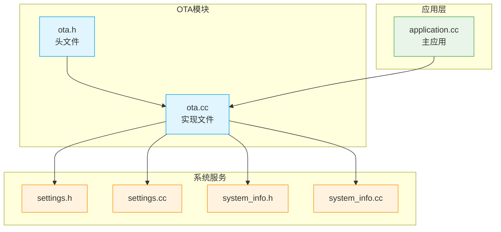
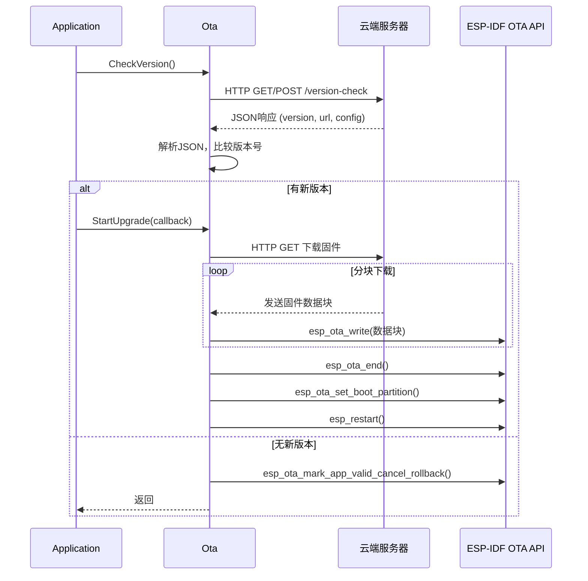
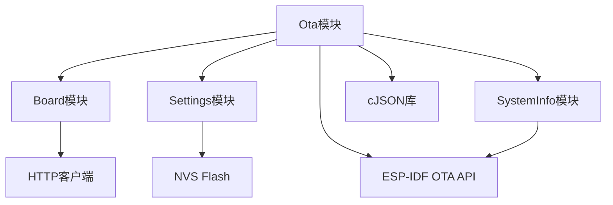

# OTA固件更新

<cite>
**本文档引用的文件**   
- [ota.h](file://main/ota.h)
- [ota.cc](file://main/ota.cc)
- [application.cc](file://main/application.cc)
- [settings.h](file://main/settings.h)
- [settings.cc](file://main/settings.cc)
- [system_info.h](file://main/system_info.h)
- [system_info.cc](file://main/system_info.cc)
- [boards/common/board.cc](file://main/boards/common/board.cc)
- [boards/common/system_reset.cc](file://main/boards/common/system_reset.cc)
</cite>

## 目录
1. [简介](#简介)
2. [项目结构](#项目结构)
3. [核心组件](#核心组件)
4. [架构概述](#架构概述)
5. [详细组件分析](#详细组件分析)
6. [依赖分析](#依赖分析)
7. [性能考虑](#性能考虑)
8. [故障排除指南](#故障排除指南)
9. [结论](#结论)

## 简介
本文档详细阐述了基于ESP32平台的OTA（空中下载）固件更新机制。该系统允许设备在不进行物理连接的情况下，通过网络接收并安装新的固件版本，从而实现远程维护和功能升级。文档将深入分析`ota.h`和`ota.cc`文件中的核心逻辑，涵盖从版本检查、固件下载、安全烧录到失败回滚的完整流程。同时，文档还将探讨与云端服务的通信方式、安全最佳实践以及应用程序如何集成和调用此服务。

## 项目结构
项目采用模块化设计，OTA功能主要集中在`main`目录下的`ota.h`和`ota.cc`文件中。`ota.h`定义了`Ota`类的公共接口，而`ota.cc`则实现了其具体逻辑。该功能与`application.cc`中的主应用逻辑紧密集成，并依赖于`settings.h`和`settings.cc`提供的持久化存储能力，以及`system_info.h`和`system_info.cc`提供的系统信息获取功能。



**图示来源**
- [ota.h](file://main/ota.h)
- [ota.cc](file://main/ota.cc)
- [application.cc](file://main/application.cc)
- [settings.h](file://main/settings.h)
- [settings.cc](file://main/settings.cc)
- [system_info.h](file://main/system_info.h)
- [system_info.cc](file://main/system_info.cc)

## 核心组件
OTA系统的核心是`Ota`类，它封装了所有与固件更新相关的功能。该类通过HTTP协议与云端服务器通信，检查新版本、下载固件，并利用ESP-IDF的OTA API安全地烧录到设备上。`Application`类负责协调整个更新流程，包括在更新前准备系统状态和在更新失败时进行恢复。

**组件来源**
- [ota.h](file://main/ota.h#L1-L54)
- [ota.cc](file://main/ota.cc#L1-L367)
- [application.cc](file://main/application.cc#L80-L279)

## 架构概述
整个OTA更新流程遵循一个清晰的序列：首先，设备启动后，`Application`模块会调用`Ota`实例的`CheckVersion`方法。该方法向预设的云端URL发起HTTP请求，获取包含新固件信息的JSON响应。如果检测到新版本，`Application`会启动升级流程，调用`Ota::StartUpgrade`方法。该方法会下载固件并使用ESP-IDF的API进行烧录。更新成功后，设备自动重启；若失败，则保留旧版本并尝试恢复。



**图示来源**
- [ota.h](file://main/ota.h#L1-L54)
- [ota.cc](file://main/ota.cc#L1-L367)
- [application.cc](file://main/application.cc#L80-L279)

## 详细组件分析

### OTA版本检查与云端通信
`Ota::CheckVersion`方法是整个更新流程的起点。它通过`Board::CreateHttp()`创建一个HTTP客户端，并向`check_version_url_`发起请求。请求头中包含了设备的MAC地址、UUID、当前固件版本等信息，以便服务器进行识别和验证。

服务器返回一个JSON对象，其结构可能包含`firmware`、`mqtt`、`websocket`、`server_time`和`activation`等字段。`Ota`类使用`cJSON`库解析此响应。首先，它会检查`activation`字段，如果存在，则说明设备尚未激活，此时会跳过固件检查。对于已激活的设备，它会提取`firmware`对象中的`version`和`url`，并与当前版本进行比较。

版本比较通过`IsNewVersionAvailable`方法实现，该方法将版本号（如"1.2.3"）拆分为整数数组，然后逐位比较，确保新版本号在数值上大于当前版本。

```cpp
bool Ota::IsNewVersionAvailable(const std::string& currentVersion, const std::string& newVersion) {
    std::vector<int> current = ParseVersion(currentVersion);
    std::vector<int> newer = ParseVersion(newVersion);
    
    for (size_t i = 0; i < std::min(current.size(), newer.size()); ++i) {
        if (newer[i] > current[i]) {
            return true;
        } else if (newer[i] < current[i]) {
            return false;
        }
    }
    return newer.size() > current.size();
}
```

此外，该方法还会处理服务器返回的其他配置，如MQTT和WebSocket的连接信息，并通过`Settings`类将它们持久化存储，实现配置的动态更新。

**组件来源**
- [ota.cc](file://main/ota.cc#L54-L194)

### 固件下载与安全烧录
当确认有新版本后，`Ota::Upgrade`方法被调用，开始下载和烧录过程。该过程严格遵循ESP-IDF的OTA流程：

1.  **准备**: 调用`esp_ota_get_next_update_partition`获取下一个可用于更新的分区。
2.  **开始**: 调用`esp_ota_begin`启动OTA会话，这会初始化分区并准备接收数据。
3.  **写入**: 通过HTTP流式下载固件，每接收到一个数据块，就调用`esp_ota_write`将其写入目标分区。在写入前，会检查固件头部，确保其格式正确，并验证新固件的版本号与预期一致，防止重复升级。
4.  **结束**: 下载完成后，调用`esp_ota_end`。这是最关键的一步，ESP-IDF会在此时对整个固件镜像进行完整性校验（如CRC或哈希校验）。如果校验失败（`ESP_ERR_OTA_VALIDATE_FAILED`），更新将被中止，设备将继续运行旧版本。
5.  **设置启动分区**: 如果`esp_ota_end`成功，调用`esp_ota_set_boot_partition`将新固件分区标记为下次启动的默认分区。
6.  **重启**: 最后，调用`esp_restart`重启设备，使新固件生效。

```cpp
esp_err_t err = esp_ota_end(update_handle);
if (err != ESP_OK) {
    if (err == ESP_ERR_OTA_VALIDATE_FAILED) {
        ESP_LOGE(TAG, "Image validation failed, image is corrupted");
    } else {
        ESP_LOGE(TAG, "Failed to end OTA: %s", esp_err_to_name(err));
    }
    return;
}

err = esp_ota_set_boot_partition(update_partition);
if (err != ESP_OK) {
    ESP_LOGE(TAG, "Failed to set boot partition: %s", esp_err_to_name(err));
    return;
}

ESP_LOGI(TAG, "Firmware upgrade successful, rebooting in 3 seconds...");
vTaskDelay(pdMS_TO_TICKS(3000));
esp_restart();
```

**组件来源**
- [ota.cc](file://main/ota.cc#L228-L326)

### 回滚机制与自动重启
ESP-IDF的OTA机制本身就内置了回滚功能。当设备从新固件启动后，新固件的初始状态为`ESP_OTA_IMG_PENDING_VERIFY`。此时，`Application`模块会调用`Ota::MarkCurrentVersionValid`方法。

该方法会查询当前运行分区的状态，如果状态为`ESP_OTA_IMG_PENDING_VERIFY`，则调用`esp_ota_mark_app_valid_cancel_rollback`。这表示新固件已成功启动，可以被标记为有效。此后，即使设备再次重启，也不会回滚到旧版本。

如果新固件在启动后未能及时调用此方法（例如，新固件存在严重bug导致无法正常运行），那么在下一次重启时，引导程序会检测到该分区仍处于待验证状态，从而自动回滚到之前的稳定版本，保证了系统的可靠性。

自动重启策略在`Ota::Upgrade`方法的末尾实现，通过`vTaskDelay`延迟3秒后调用`esp_restart`，给予用户一定的反馈时间。

**组件来源**
- [ota.cc](file://main/ota.cc#L191-L227)
- [application.cc](file://main/application.cc#L146-L152)

### 更新状态持久化存储
OTA相关的配置和状态通过`Settings`类进行持久化存储。`Settings`类封装了NVS（Non-Volatile Storage）Flash API，提供了一个简单的键值对存储接口。

例如，在`CheckVersion`方法中，当服务器返回新的MQTT配置时，代码会创建一个可读写的`Settings`实例（命名空间为"mqtt"），并将新配置写入NVS：
```cpp
Settings settings("mqtt", true); // true表示可读写
settings.SetString(item->string, item->valuestring);
```
这确保了即使设备重启，新的MQTT配置也能被保留。`Settings`类在析构时会自动提交更改，保证了数据的完整性。

**组件来源**
- [settings.h](file://main/settings.h#L1-L27)
- [settings.cc](file://main/settings.cc#L1-L88)

### 应用程序调用示例
`Application`模块通过一个循环来管理OTA检查流程。以下代码展示了其核心逻辑：

```cpp
void Application::CheckNewVersion() {
    while (true) {
        if (!ota_.CheckVersion()) {
            // 处理网络错误，重试
            continue;
        }

        if (ota_.HasNewVersion()) {
            // 通知用户并准备升级
            Schedule([this]() {
                SetDeviceState(kDeviceStateUpgrading);
                // 关闭可能干扰升级的组件
                wake_word_detect_.StopDetection();
                auto codec = board.GetAudioCodec();
                codec->EnableOutput(false);
                
                // 启动OTA升级，传入进度回调
                ota_.StartUpgrade([display](int progress, size_t speed) {
                    char buffer[64];
                    snprintf(buffer, sizeof(buffer), "%d%% %zuKB/s", progress, speed / 1024);
                    display->SetChatMessage("system", buffer);
                });

                // 如果执行到此处，说明升级失败
                display->SetStatus(Lang::Strings::UPGRADE_FAILED);
                Reboot(); // 重启设备
            });
            return;
        }

        // 无新版本，标记当前版本有效
        ota_.MarkCurrentVersionValid();
        break;
    }
}
```

**组件来源**
- [application.cc](file://main/application.cc#L80-L183)

### 常见更新失败场景与恢复策略
1.  **网络中断**: 在下载过程中发生网络中断。`http->Read()`会返回负值，`Upgrade`方法会捕获此错误，调用`esp_ota_abort`中止当前OTA会话，并返回。`Application`模块在`StartUpgrade`回调结束后会显示“升级失败”并重启设备。
2.  **校验失败**: 下载的固件文件损坏或被篡改。`esp_ota_end`会返回`ESP_ERR_OTA_VALIDATE_FAILED`，更新流程中止，设备继续运行旧版本。
3.  **版本号相同**: 云端返回的固件版本与当前版本一致。代码在检查固件头部时会发现版本号相同，直接中止升级，避免不必要的操作。
4.  **OTA分区获取失败**: 设备的分区表配置错误，导致无法找到可用的OTA分区。`esp_ota_get_next_update_partition`返回`NULL`，流程中止。

对于所有失败场景，系统都设计了恢复策略：保持旧版本运行，并通过重启尝试恢复。在极端情况下，用户可以调用`SystemReset::ResetToFactory`，该方法会擦除`otadata`分区，强制设备恢复出厂设置并从`factory`分区启动。

**组件来源**
- [ota.cc](file://main/ota.cc#L267-L326)
- [application.cc](file://main/application.cc#L118-L152)
- [boards/common/system_reset.cc](file://main/boards/common/system_reset.cc#L41-L71)

### 生产环境安全最佳实践
尽管当前代码已具备一定的安全性，但在生产环境中，应实施以下最佳实践：
1.  **使用TLS加密传输**: 当前代码通过HTTP下载固件，存在被中间人攻击的风险。应将`firmware_url`和`check_version_url`配置为HTTPS地址，确保传输过程的机密性和完整性。
2.  **固件签名认证**: ESP-IDF支持对固件进行签名和验证。应在编译时对固件进行签名，并在`esp_ota_begin`时启用签名验证（`ESP_OTA_WITH_SIGNATURE`），以确保固件来源的可信性，防止恶意固件被刷入。
3.  **安全的配置管理**: 云端下发的配置（如MQTT密码）应通过安全通道传输，并在设备端进行加密存储。

**组件来源**
- [ota.cc](file://main/ota.cc#L84) (示例中的HTTP URL)
- [ota.cc](file://main/ota.cc#L289) (使用OTA_WITH_SEQUENTIAL_WRITES)

## 依赖分析
OTA模块依赖于多个核心组件：
- **HTTP客户端**: 通过`Board`类的`CreateHttp`方法获取，用于与云端通信。
- **NVS存储**: 通过`Settings`类使用，用于持久化配置。
- **系统信息**: 通过`SystemInfo`类获取设备的MAC地址、芯片型号等信息，用于构建请求头。
- **ESP-IDF OTA API**: 直接调用`esp_ota_ops.h`中的函数进行安全烧录和分区管理。
- **JSON解析**: 使用`cJSON`库解析云端返回的JSON数据。



**图示来源**
- [ota.h](file://main/ota.h#L1-L54)
- [ota.cc](file://main/ota.cc#L1-L367)
- [settings.h](file://main/settings.h#L1-L27)
- [system_info.h](file://main/system_info.h#L1-L21)
- [boards/common/board.cc](file://main/boards/common/board.cc#L84-L121)

## 性能考虑
- **内存使用**: 固件下载使用512字节的缓冲区，内存占用较低。`cJSON`解析时会将整个响应体加载到内存中，因此应确保JSON响应体大小在设备可用内存范围内。
- **网络带宽**: 升级过程会占用网络带宽，`Application`模块在升级前会停止唤醒词检测等网络活动，以减少干扰。
- **升级时间**: 升级时间主要取决于固件大小和网络速度。代码中实现了进度和速度的实时计算与显示。

## 故障排除指南
- **问题**: 设备无法检查新版本。
  - **检查**: 确认网络连接正常，`check_version_url_`配置正确，且服务器返回的JSON格式无误。
- **问题**: 升级过程中断。
  - **检查**: 检查网络稳定性，确认固件服务器可访问。查看日志中`esp_ota_write`的错误码。
- **问题**: 升级后设备回滚。
  - **检查**: 新固件是否在启动后调用了`MarkCurrentVersionValid`。检查新固件是否存在导致无法正常运行的bug。
- **问题**: 设备无法激活。
  - **检查**: 确认云端返回了正确的`activation`信息，并且设备能正确显示和处理激活码。

**组件来源**
- [ota.cc](file://main/ota.cc#L54-L367)
- [application.cc](file://main/application.cc#L80-L279)

## 结论
本文档详细分析了基于ESP32的OTA固件更新系统。该系统设计合理，利用ESP-IDF的强大功能，实现了从云端通信、固件下载到安全烧录和自动回滚的完整闭环。`Ota`类提供了简洁的接口，`Application`模块负责流程控制，`Settings`类确保了配置的持久化。尽管当前实现已具备基本功能，但在生产环境中，强烈建议启用HTTPS和固件签名以增强安全性。该系统为设备的远程维护和持续迭代提供了坚实的基础。