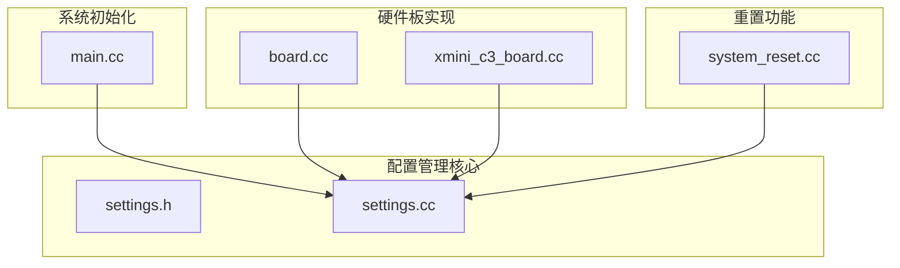
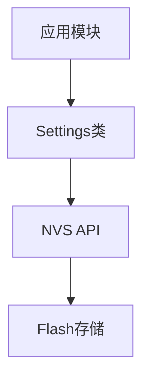
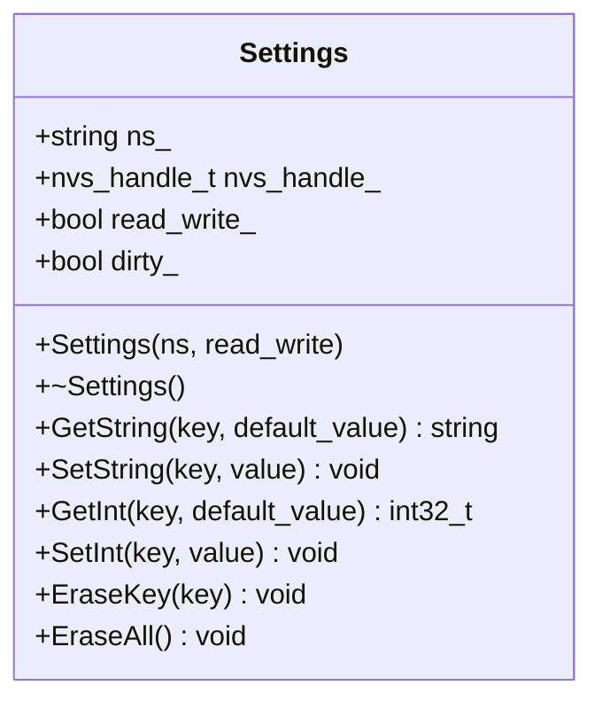
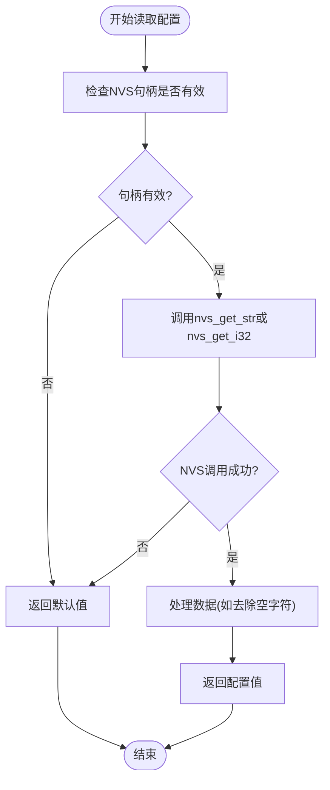
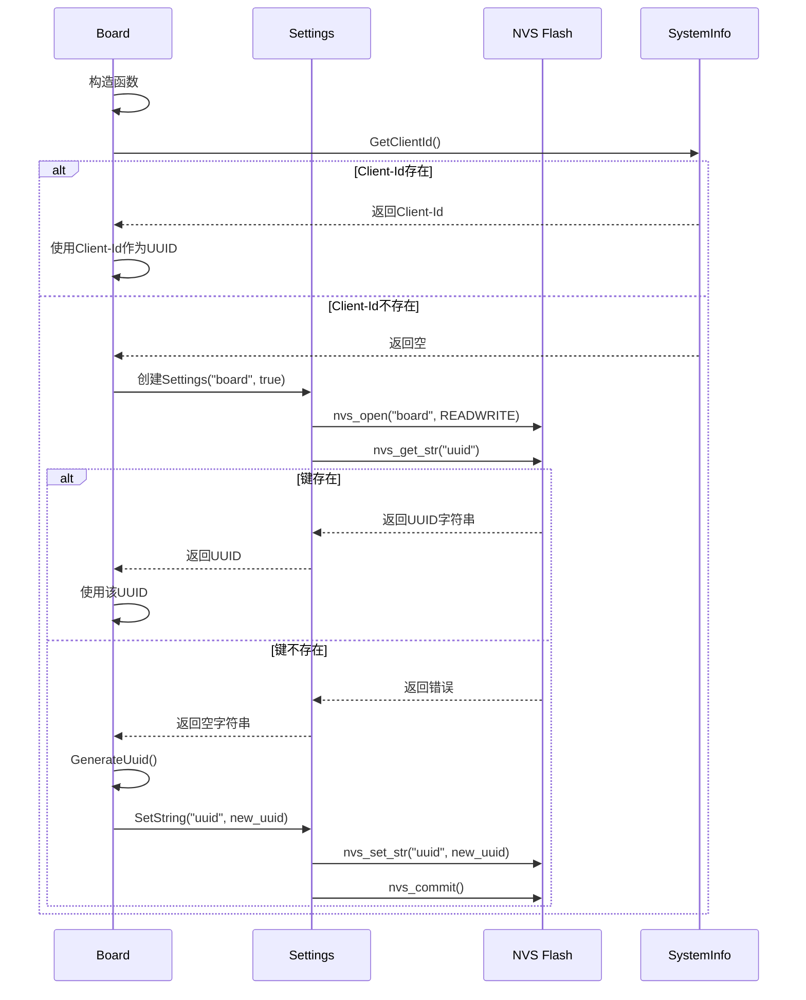
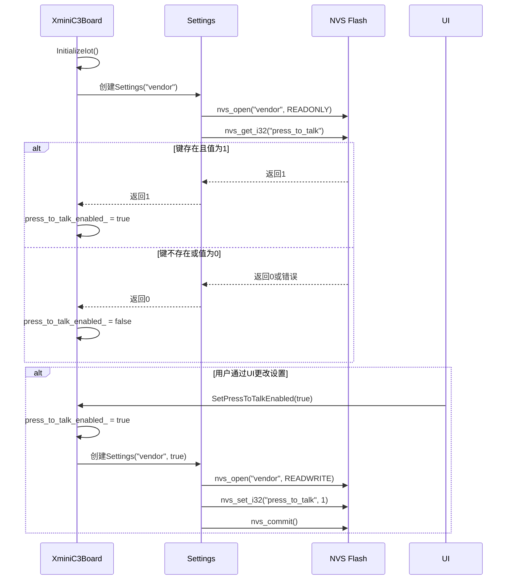
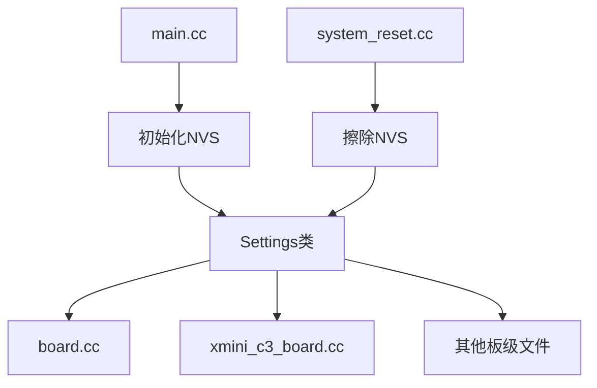

# 配置管理

<cite>
**本文档中引用的文件**   
- [settings.h](file://main/settings.h)
- [settings.cc](file://main/settings.cc)
- [main.cc](file://main/main.cc)
- [board.cc](file://main/boards/common/board.cc)
- [xmini_c3_board.cc](file://main/boards/xmini-c3/xmini_c3_board.cc)
- [system_reset.cc](file://main/boards/common/system_reset.cc)
- [wifi_board.cc](file://main/boards/common/wifi_board.cc)
</cite>

## 目录
1. [简介](#简介)
2. [项目结构](#项目结构)
3. [核心组件](#核心组件)
4. [架构概述](#架构概述)
5. [详细组件分析](#详细组件分析)
6. [依赖分析](#依赖分析)
7. [性能考虑](#性能考虑)
8. [故障排除指南](#故障排除指南)
9. [结论](#结论)

## 简介
本文档深入分析了基于ESP-IDF的NVS（非易失性存储）API实现的配置管理服务。该服务负责持久化存储设备的关键参数，如WiFi凭据、用户偏好设置和设备名称。文档详细阐述了配置项的数据结构设计、默认值初始化机制、恢复出厂设置流程，以及与其他系统模块（如网络、显示、语音）的集成方式。

## 项目结构
配置管理服务的核心实现位于`main`目录下的`settings.h`和`settings.cc`文件中。系统在启动时通过`main.cc`初始化NVS分区。不同的硬件板通过继承`Board`基类来使用配置服务，例如`xmini_c3_board.cc`中实现了用户偏好设置的读写。`system_reset.cc`模块负责处理恢复出厂设置等重置操作。

**图示来源**
- [settings.h](file://main/settings.h)
- [settings.cc](file://main/settings.cc)
- [main.cc](file://main/main.cc)
- [board.cc](file://main/boards/common/board.cc)
- [xmini_c3_board.cc](file://main/boards/xmini-c3/xmini_c3_board.cc)
- [system_reset.cc](file://main/boards/common/system_reset.cc)

**本节来源**
- [settings.h](file://main/settings.h)
- [settings.cc](file://main/settings.cc)
- [main.cc](file://main/main.cc)

## 核心组件
配置管理服务的核心是一个名为`Settings`的C++类，它封装了对ESP-IDF NVS API的调用。该类提供了读写字符串和整数类型配置项的接口，并通过命名空间（namespace）来组织不同类别的设置。

**本节来源**
- [settings.h](file://main/settings.h#L6-L23)
- [settings.cc](file://main/settings.cc#L7-L9)

## 架构概述
系统配置管理采用分层架构。最底层是ESP-IDF的NVS API，提供对Flash存储的原始访问。中间层是`Settings`类，它为上层应用提供了类型安全的、面向对象的接口。最上层是各个硬件板和应用模块，它们通过创建`Settings`实例来读写特定命名空间下的配置。

**图示来源**
- [settings.h](file://main/settings.h)
- [settings.cc](file://main/settings.cc)
- [main.cc](file://main/main.cc)

## 详细组件分析

### Settings类分析
`Settings`类是配置管理的核心，它通过构造函数中的`ns`参数来指定NVS命名空间，从而实现配置项的逻辑分组。

#### 类图

**图示来源**
- [settings.h](file://main/settings.h#L6-L23)
- [settings.cc](file://main/settings.cc#L7-L9)

#### 配置读写流程
当应用需要读取配置时，`Settings`类会调用NVS API从Flash中获取数据。如果键不存在或读取失败，则返回调用者提供的默认值。

**图示来源**
- [settings.cc](file://main/settings.cc#L27-L47)

**本节来源**
- [settings.h](file://main/settings.h#L6-L23)
- [settings.cc](file://main/settings.cc#L7-L47)

### 设备UUID管理分析
`Board`基类使用`Settings`服务来持久化存储设备的唯一标识符（UUID）。它首先尝试从系统信息中获取Client-Id，如果失败，则在`board`命名空间下读取或生成UUID。

#### 序列图

**图示来源**
- [board.cc](file://main/boards/common/board.cc#L10-L35)

**本节来源**
- [board.cc](file://main/boards/common/board.cc#L10-L35)

### 用户偏好设置分析
以`xmini-c3`开发板为例，其用户偏好设置（如“长按说话”模式）存储在`vendor`命名空间下。系统在初始化时读取该设置，并在用户更改时将其写回NVS。

#### 序列图

**图示来源**
- [xmini_c3_board.cc](file://main/boards/xmini-c3/xmini_c3_board.cc#L147-L185)

**本节来源**
- [xmini_c3_board.cc](file://main/boards/xmini-c3/xmini_c3_board.cc#L147-L185)

## 依赖分析
配置管理服务与多个系统模块紧密耦合。`main.cc`负责初始化NVS分区，是所有配置操作的前提。`board.cc`和各个具体的板级实现文件（如`xmini_c3_board.cc`）是`Settings`类的主要使用者。`system_reset.cc`模块在执行恢复出厂设置时，会直接调用NVS API擦除整个分区。

**图示来源**
- [main.cc](file://main/main.cc#L15-L25)
- [system_reset.cc](file://main/boards/common/system_reset.cc#L35-L40)
- [board.cc](file://main/boards/common/board.cc)
- [xmini_c3_board.cc](file://main/boards/xmini-c3/xmini_c3_board.cc)

**本节来源**
- [main.cc](file://main/main.cc#L15-L25)
- [system_reset.cc](file://main/boards/common/system_reset.cc#L35-L40)

## 性能考虑
`Settings`类在写入配置时使用了`dirty_`标志来跟踪修改状态，并在析构时才调用`nvs_commit`进行一次性的提交，这减少了对Flash的频繁写入，有助于延长存储寿命。然而，如果应用在写入配置后立即重启，未提交的更改将会丢失。对于需要立即持久化的关键配置，应考虑在`Set`操作后立即手动调用`nvs_commit`。

## 故障排除指南
- **配置无法保存**：检查`Settings`实例是否以`read_write=true`创建。如果以只读模式打开，`Set`操作将被忽略并记录警告日志。
- **NVS初始化失败**：在`main.cc`中，如果`nvs_flash_init`返回`ESP_ERR_NVS_NO_FREE_PAGES`或`ESP_ERR_NVS_NEW_VERSION_FOUND`，系统会自动擦除并重新初始化NVS分区。
- **恢复出厂设置无效**：确认`system_reset.cc`中的`ResetNvsFlash`函数被正确调用，该函数会擦除整个NVS分区并重新初始化。

**本节来源**
- [settings.cc](file://main/settings.cc#L15-L20)
- [main.cc](file://main/main.cc#L18-L25)
- [system_reset.cc](file://main/boards/common/system_reset.cc#L35-L40)

## 结论
该配置管理系统设计简洁高效，充分利用了ESP-IDF的NVS功能。通过`Settings`类的封装，上层应用可以方便地进行配置的读写操作。系统通过命名空间实现了配置的逻辑隔离，并通过在`main.cc`中统一初始化NVS，保证了配置服务的可用性。恢复出厂设置等功能也通过直接操作NVS分区来实现，逻辑清晰。整体架构合理，易于维护和扩展。