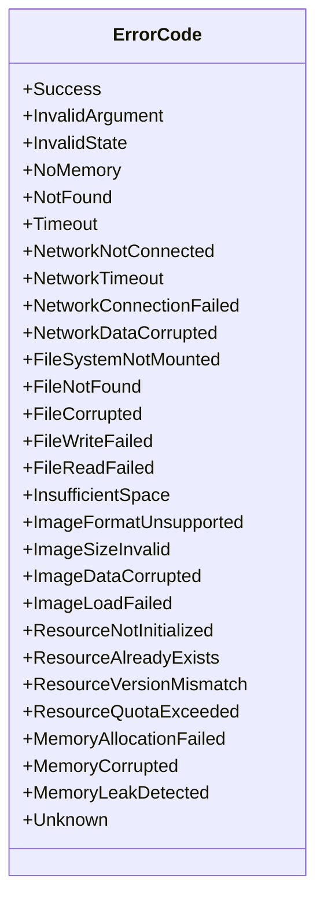
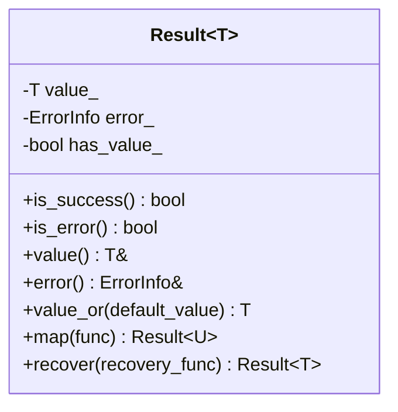

# 错误处理

<cite>
**本文档中引用的文件**  
- [error_handling.h](file://main/error/error_handling.h)
- [error_handling.cc](file://main/error/error_handling.cc)
- [ota.cc](file://main/ota.cc)
- [application.cc](file://main/application.cc)
</cite>

## 目录
1. [简介](#简介)
2. [错误码体系结构](#错误码体系结构)
3. [错误信息封装](#错误信息封装)
4. [错误传播机制](#错误传播机制)
5. [错误处理策略](#错误处理策略)
6. [核心模块错误处理示例](#核心模块错误处理示例)
7. [关键服务容错设计](#关键服务容错设计)
8. [开发者规范与最佳实践](#开发者规范与最佳实践)

## 简介
本文件全面阐述了基于ESP32平台的嵌入式系统中的错误处理机制。该机制围绕`error_handling.h`和`error_handling.cc`文件中的实现构建，旨在提供一个健壮、可扩展且内存高效的错误管理体系。系统采用类似Rust语言的`Result<T>`模板模式，结合预定义的错误码和轻量级错误信息结构，实现了从底层硬件操作到上层应用逻辑的统一错误处理范式。通过分析代码结构，本文档将详细解释错误码体系、错误信息封装、错误传播机制以及具体的处理策略，为开发者提供清晰的指导。

## 错误码体系结构
系统的错误码体系采用C++强类型枚举`enum class ErrorCode`实现，确保了类型安全和命名空间隔离。错误码被组织成多个逻辑类别，每个类别使用不同的数值范围以避免冲突。



**图示来源**  
- [error_handling.h](file://main/error/error_handling.h#L15-L59)

### 错误码分类
- **通用错误**：继承自ESP-IDF的错误码（如`ESP_ERR_INVALID_ARG`），用于最常见的错误场景。
- **网络相关错误**：范围为`0x1000`，涵盖网络连接、超时和数据损坏等。
- **文件系统错误**：范围为`0x2000`，处理文件读写、查找和存储空间等问题。
- **图片处理错误**：范围为`0x3000`，针对图片格式、尺寸和加载过程中的问题。
- **资源管理错误**：范围为`0x4000`，处理资源初始化、存在性和版本匹配。
- **内存相关错误**：范围为`0x5000`，标识内存分配失败和损坏。
- **未知错误**：`0x9999`，作为兜底错误码。

**本节来源**  
- [error_handling.h](file://main/error/error_handling.h#L15-L59)

## 错误信息封装
系统通过`ErrorInfo`结构体和`Result<T>`模板类对错误信息进行高效封装。

### ErrorInfo 结构体
`ErrorInfo`是一个轻量级结构，旨在最小化内存占用，特别适合资源受限的嵌入式环境。
```cpp
struct ErrorInfo {
    ErrorCode code;
    const char* message;        // 指向ROM中的字符串常量
    const char* context;        // 指向ROM中的字符串常量
    uint32_t context_data;      // 数值型上下文数据
};
```
该结构体通过使用指向ROM中字符串常量的指针，将内存占用从动态字符串的约100字节降低到约16字节，极大地优化了RAM使用。

### Result<T> 模板类
`Result<T>`是核心的错误处理容器，采用“成功或错误”的范式，替代了传统的返回码和异常机制。
```cpp
template<typename T>
class Result {
public:
    static Result success(T&& value);
    static Result error(const ErrorInfo& error);
    bool is_success() const;
    const T& value() const;
    const ErrorInfo& error() const;
    T value_or(const T& default_value) const;
    template<typename F> auto map(F&& func);
    template<typename F> Result recover(F&& recovery_func);
};
```
`Result<T>`提供了丰富的接口，如`value_or`用于提供默认值，`map`用于链式操作，`recover`用于错误恢复。



**图示来源**  
- [error_handling.h](file://main/error/error_handling.h#L121-L208)

**本节来源**  
- [error_handling.h](file://main/error/error_handling.h#L100-L115)
- [error_handling.h](file://main/error/error_handling.h#L121-L208)

## 错误传播机制
错误通过函数的返回值在不同模块间进行传播，避免了错误信息的丢失。

### 返回值传播
函数不直接返回原始数据，而是返回一个`Result<T>`对象。调用者必须检查`is_success()`来决定后续流程。
```cpp
// 示例：OTA检查版本
bool Ota::CheckVersion() {
    ...
    if (!http->Open(method, check_version_url_, post_data)) {
        ESP_LOGE(TAG, "Failed to open HTTP connection");
        delete http;
        return false; // 传统方式，错误信息丢失
    }
    ...
}
```
在改进的系统中，此类函数应返回`Result<bool>`，将具体的错误信息（如网络连接失败）完整传递给上层。

### 便利宏
系统提供了宏来简化错误传播。
- `RETURN_IF_ERROR(expr)`：如果表达式返回错误，则立即返回该错误。
- `LOG_AND_RETURN_ERROR(code, message)`：记录错误日志并返回错误结果。

**本节来源**  
- [error_handling.h](file://main/error/error_handling.h#L319-L342)

## 错误处理策略
系统实现了多层次的错误处理策略，包括日志记录、用户通知和自动恢复。

### 日志记录
所有错误都通过`ErrorHandler::log_error()`方法记录到ESP-IDF的日志系统中，包含错误码、消息、上下文和上下文数据，便于调试和分析。
```cpp
void ErrorHandler::log_error(const ErrorInfo& error) {
    ESP_LOGE(TAG, "错误发生:");
    ESP_LOGE(TAG, "  代码: %d (%s)", static_cast<int>(error.code), get_error_description(error.code).c_str());
    ESP_LOGE(TAG, "  消息: %s", error.message);
    ESP_LOGE(TAG, "  上下文: %s", error.context);
}
```

### 用户通知
在`application.cc`中，`Alert`方法用于向用户展示错误。它会更新显示屏上的状态、表情和聊天消息，并播放相应的提示音。
```cpp
void Application::Alert(const char* status, const char* message, const char* emotion, const std::string_view& sound) {
    auto display = Board::GetInstance().GetDisplay();
    display->SetStatus(status);
    display->SetEmotion(emotion);
    display->SetChatMessage("system", message);
    if (!sound.empty()) {
        PlaySound(sound);
    }
}
```

### 自动恢复尝试
系统支持可配置的恢复策略。例如，`RetryStrategy`可以在网络或文件操作失败时进行重试。
```cpp
Result<void> RetryStrategy::recover(const ErrorInfo& error) {
    if (current_retries_ >= max_retries_) {
        return Result<void>::error(error);
    }
    current_retries_++;
    vTaskDelay(pdMS_TO_TICKS(delay_ms_));
    return Result<void>::success();
}
```

**本节来源**  
- [error_handling.cc](file://main/error/error_handling.cc#L100-L135)
- [application.cc](file://main/application.cc#L250-L270)

## 核心模块错误处理示例
### OTA更新模块
`ota.cc`文件展示了如何处理网络和固件更新中的错误。虽然它目前使用传统的`bool`返回值和`ESP_LOGE`，但其错误处理逻辑清晰。
```cpp
bool Ota::CheckVersion() {
    if (check_version_url_.length() < 10) {
        ESP_LOGE(TAG, "Check version URL is not properly set");
        return false;
    }
    ...
    if (!http->Open(method, check_version_url_, post_data)) {
        ESP_LOGE(TAG, "Failed to open HTTP connection");
        delete http;
        return false;
    }
    ...
}
```
该模块在检查到新版本后，会通过`Application`的`Alert`方法通知用户，并在升级失败时重启设备。

### 应用程序模块
`application.cc`是错误处理的中心枢纽。它通过`CheckNewVersion`方法处理OTA检查失败的情况，采用重试机制。
```cpp
void Application::CheckNewVersion() {
    int retry_count = 0;
    while (true) {
        if (!ota_.CheckVersion()) {
            retry_count++;
            if (retry_count >= config.network.retry_count) {
                ESP_LOGE(TAG, "Too many retries, exit version check");
                return;
            }
            vTaskDelay(pdMS_TO_TICKS(60000));
            continue;
        }
        ...
    }
}
```
此外，`protocol_`的`OnNetworkError`回调会直接调用`Alert`，将网络错误呈现给用户。

**本节来源**  
- [ota.cc](file://main/ota.cc#L100-L150)
- [application.cc](file://main/application.cc#L50-L100)

## 关键服务容错设计
### OTA更新服务
OTA服务的容错设计体现在：
1.  **重试机制**：在网络请求失败时，按配置的重试次数和间隔进行重试。
2.  **降级策略**：即使OTA检查失败，系统也会继续启动，仅标记为检查完成，不影响设备基本功能。
3.  **固件验证**：在写入新固件前，会检查其头部信息，防止刷入相同或损坏的固件。

### 网络连接服务
网络连接的容错设计包括：
1.  **错误回调**：`protocol_`对象提供`OnNetworkError`回调，允许上层应用（如`Application`）对网络错误做出反应。
2.  **自动重连**：`MqttNotifier`组件在设置更改后会尝试重连，确保通知服务的持续性。
3.  **优雅关闭**：在断开连接时，会通知`Board`进入省电模式，并将设备状态重置为`idle`。

**本节来源**  
- [ota.cc](file://main/ota.cc#L50-L350)
- [application.cc](file://main/application.cc#L400-L600)

## 开发者规范与最佳实践
1.  **使用Result<T>**：新功能应优先使用`Result<T>`作为返回类型，而不是`bool`或`esp_err_t`。
2.  **使用预定义错误消息**：优先使用`ErrorMessages`命名空间中的常量，以节省RAM。
3.  **提供上下文**：在创建`ErrorInfo`时，应提供足够的上下文信息（如函数名、行号）。
4.  **避免裸露的if-else**：使用`RETURN_IF_ERROR`等宏来简化错误处理代码。
5.  **注册恢复策略**：对于可恢复的错误（如网络超时），应在`ErrorHandler`中注册相应的`ErrorRecoveryStrategy`。
6.  **日志级别**：使用`ESP_LOGE`记录错误，`ESP_LOGW`记录警告，`ESP_LOGI`记录信息。

遵循这些规范，可以确保整个代码库的错误处理风格统一、健壮且易于维护。

**本节来源**  
- [error_handling.h](file://main/error/error_handling.h)
- [error_handling.cc](file://main/error/error_handling.cc)