# MQTT 实现

<cite>
**本文档引用的文件**   
- [mqtt_protocol.h](file://main/protocols/mqtt_protocol.h) - *核心MQTT协议头文件*
- [mqtt_protocol.cc](file://main/protocols/mqtt_protocol.cc) - *核心MQTT协议实现*
- [mqtt_notifier.h](file://main/notifications/mqtt_notifier.h) - *MQTT通知器接口，新增Start/Stop方法*
- [mqtt_notifier.cc](file://main/notifications/mqtt_notifier.cc) - *MQTT通知器实现，新增动态启停逻辑*
- [thing_manager.h](file://main/iot/thing_manager.h) - *物联网设备管理*
- [thing_manager.cc](file://main/iot/thing_manager.cc) - *物联网设备管理实现*
</cite>

## 更新摘要
**变更内容**   
- 更新了**架构概述**和**MqttNotifier 分析**章节，以反映新增的MQTT服务动态启停功能
- 新增了**MqttNotifier 动态启停机制**章节，详细说明`Start()`和`Stop()`方法的实现与应用场景
- 更新了**故障排除指南**，增加了与动态启停相关的排查项
- 所有文件引用均已更新，标注了受最近提交影响的文件

## 目录
1. [项目结构](#项目结构)
2. [核心组件](#核心组件)
3. [架构概述](#架构概述)
4. [详细组件分析](#详细组件分析)
5. [依赖分析](#依赖分析)
6. [性能考量](#性能考量)
7. [故障排除指南](#故障排除指南)

## 项目结构

项目采用分层模块化设计，主要功能模块位于`main`目录下。与MQTT实现直接相关的模块包括：
- `protocols/mqtt_protocol.*`: 核心MQTT协议实现，处理音频流传输。
- `notifications/mqtt_notifier.*`: 轻量级MQTT通知器，用于设备状态上报和指令接收，现支持动态启停。
- `iot/thing_manager.*` 和 `iot/thing.h`: 物联网设备管理框架，与MQTT集成实现远程控制。


**图示来源**
- [mqtt_protocol.h](file://main/protocols/mqtt_protocol.h)
- [mqtt_notifier.h](file://main/notifications/mqtt_notifier.h)
- [thing_manager.h](file://main/iot/thing_manager.h)
- [thing.h](file://main/iot/thing.h)

**本节来源**
- [项目结构](file://workspace)

## 核心组件

本系统围绕两个核心MQTT组件构建：`MqttProtocol`用于处理实时音频流，而`MqttNotifier`用于设备状态上报和指令交互。`MqttNotifier`现在支持通过`Start()`和`Stop()`方法进行动态管理，以适应省电模式等场景。`ThingManager`则作为物联网设备的抽象层，将物理设备的状态和控制接口标准化，并通过`MqttNotifier`与云端通信。

**本节来源**
- [mqtt_protocol.h](file://main/protocols/mqtt_protocol.h#L1-L60)
- [mqtt_notifier.h](file://main/notifications/mqtt_notifier.h#L1-L82)
- [thing_manager.h](file://main/iot/thing_manager.h#L1-L43)

## 架构概述

系统采用分层架构，上层应用通过`ThingManager`管理物联网设备，设备状态变化通过`MqttNotifier`上报至云端。`MqttNotifier`现在支持动态启停，确保在WiFi连接建立后才启动，并在进入省电模式时安全关闭，提升了系统稳定性和资源利用率。`MqttProtocol`则独立处理需要低延迟的音频流传输。


**图示来源**
- [mqtt_notifier.cc](file://main/notifications/mqtt_notifier.cc#L193-L392)
- [thing_manager.cc](file://main/iot/thing_manager.cc#L80-L89)

**本节来源**
- [mqtt_notifier.cc](file://main/notifications/mqtt_notifier.cc#L1-L392)

## 详细组件分析

### MqttProtocol 分析

`MqttProtocol`类继承自`Protocol`，是处理实时音频流的核心。它通过MQTT建立控制通道，通过UDP建立高速数据通道。

#### 类图
```mermaid
classDiagram
class MqttProtocol {
+MqttProtocol()
+~MqttProtocol()
+Start() void
+SendAudio(data) void
+OpenAudioChannel() bool
+CloseAudioChannel() void
+IsAudioChannelOpened() const bool
-StartMqttClient(report_error) bool
-ParseServerHello(root) void
-DecodeHexString(hex_string) string
-SendText(text) bool
}
class Protocol {
<<abstract>>
+Start() void
+SendAudio(data) void
+OpenAudioChannel() bool
+CloseAudioChannel() void
+IsAudioChannelOpened() const bool
+SendText(text) bool
}
MqttProtocol --|> Protocol : 继承
class Mqtt {
+Connect(endpoint, port, client_id, username, password) bool
+Publish(topic, payload, qos) bool
+Subscribe(topic, qos) bool
+OnMessage(callback) void
+OnDisconnected(callback) void
+IsConnected() bool
}
class Udp {
+Connect(server, port) bool
+Send(data) bool
+OnMessage(callback) void
}
MqttProtocol o-- Mqtt : 使用
MqttProtocol o-- Udp : 使用
MqttProtocol o-- "mbedtls_aes_context" : AES加密
MqttProtocol o-- "EventGroupHandle_t" : 事件组
```

**图示来源**
- [mqtt_protocol.h](file://main/protocols/mqtt_protocol.h#L1-L60)
- [mqtt_protocol.cc](file://main/protocols/mqtt_protocol.cc#L1-L316)

**本节来源**
- [mqtt_protocol.h](file://main/protocols/mqtt_protocol.h#L1-L60)
- [mqtt_protocol.cc](file://main/protocols/mqtt_protocol.cc#L1-L316)

### MqttNotifier 分析

`MqttNotifier`是一个轻量级的MQTT客户端，专注于设备状态上报和指令接收。它不处理音频流，而是与`MqttProtocol`并行运行。

#### 功能流程图

```mermaid
flowchart TD
Start([启动MqttNotifier]) --> LoadSettings["加载配置 (endpoint, client_id等)"]
LoadSettings --> Connect["连接MQTT Broker (8883端口)"]
Connect --> Sub["订阅下行主题 (downlink)"]
Sub --> StartHeartbeat["启动心跳任务 (每60秒)"]
StartHeartbeat --> PublishTelemetry["发布遥测数据 (uplink)"]
PublishTelemetry --> IncludeBattery["包含电池信息"]
PublishTelemetry --> IncludeMemory["包含内存信息"]
PublishTelemetry --> IncludeWiFi["包含WiFi信号"]
PublishTelemetry --> IncludeIoT["包含IoT设备状态快照"]
IncludeIoT --> End1([准备就绪])
CloudCommand["云端下发指令"] --> MqttNotifierOnMessage["MqttNotifier::OnMessage"]
MqttNotifierOnMessage --> ParseJSON["解析JSON指令"]
ParseJSON --> InvokeThingManager["调用ThingManager::Invoke"]
InvokeThingManager --> End2([指令执行])
```


**本节来源**
- [mqtt_notifier.h](file://main/notifications/mqtt_notifier.h#L1-L82)
- [mqtt_notifier.cc](file://main/notifications/mqtt_notifier.cc#L1-L392)

### MqttNotifier 动态启停机制

根据最近的代码变更，`MqttNotifier`新增了`Start()`和`Stop()`方法，以支持在特定条件下（如省电模式）对MQTT连接进行动态管理。

#### 启动流程
1.  **调用 `Start()`**: 外部模块（如应用主控）在WiFi连接成功后调用此方法。
2.  **加载配置**: `LoadSettings()` 方法从NVS或默认值中读取MQTT配置（Broker地址、客户端ID、认证信息等）。
3.  **内部连接**: `ConnectInternal()` 方法创建`Mqtt`实例，设置心跳，并注册消息回调。
4.  **建立连接**: 调用`mqtt_->Connect()`连接到Broker。
5.  **启动后台任务**: 成功连接后，创建`heartbeat_task_handle_`和`ack_monitor_task_handle_`两个FreeRTOS任务，分别负责心跳上报和ACK确认监控。
6.  **订阅主题**: 显式调用`Subscribe()`订阅`downlink_topic_`，确保能接收到云端指令。

#### 停止流程
1.  **调用 `Stop()`**: 外部模块在进入省电模式前调用此方法。
2.  **清理MQTT实例**: 删除`mqtt_`指针，断开与Broker的连接。
3.  **删除后台任务**: 使用`vTaskDelete()`删除`heartbeat_task_handle_`和`ack_monitor_task_handle_`，释放任务占用的资源。
4.  **清理待确认列表**: 清空`pending_acks_`映射，避免内存泄漏。
5.  **重置状态**: 将`started_`标志位设为`false`。

此机制确保了MQTT服务仅在需要时运行，有效降低了功耗，并避免了在无网络环境下进行无效的连接尝试。

**本节来源**
- [mqtt_notifier.h](file://main/notifications/mqtt_notifier.h#L19-L30)
- [mqtt_notifier.cc](file://main/notifications/mqtt_notifier.cc#L50-L100)

### ThingManager 分析

`ThingManager`实现了物联网设备的即插即用管理。任何继承自`Thing`的设备都可以通过`AddThing`方法注册，并自动获得远程控制能力。

#### 数据模型图


**本节来源**
- [thing_manager.h](file://main/iot/thing_manager.h#L1-L43)
- [thing_manager.cc](file://main/iot/thing_manager.cc#L1-L89)
- [thing.h](file://main/iot/thing.h#L1-L301)
- [thing.cc](file://main/iot/thing.cc#L1-L119)

## 依赖分析

系统各组件间依赖关系清晰，耦合度低。`MqttNotifier`依赖底层`Mqtt`库进行实际通信，并通过回调与`ThingManager`解耦。`ThingManager`独立于网络层。


**图示来源**
- [mqtt_protocol.h](file://main/protocols/mqtt_protocol.h)
- [mqtt_notifier.h](file://main/notifications/mqtt_notifier.h)
- [thing_manager.h](file://main/iot/thing_manager.h)

**本节来源**
- [mqtt_protocol.h](file://main/protocols/mqtt_protocol.h#L1-L60)
- [mqtt_notifier.h](file://main/notifications/mqtt_notifier.h#L1-L82)
- [thing_manager.h](file://main/iot/thing_manager.h#L1-L43)

## 性能考量

1.  **异步发布**: `MqttNotifier`内部通过后台任务处理心跳和ACK监控，避免阻塞主循环。
2.  **动态启停**: 新增的`Start()`/`Stop()`机制允许在省电模式下关闭MQTT服务，显著降低功耗。
3.  **心跳优化**: 心跳任务每60秒上报一次，平衡了状态实时性与网络/电量消耗。
4.  **增量上报**: `ThingManager`支持`delta`模式，仅上报状态变化的设备，减少了不必要的网络流量。
5.  **资源监控**: `MqttNotifier`在发布ACK消息时，会跟踪消息ID并处理超时重试，确保关键指令的可靠送达。

## 故障排除指南

*   **无法连接MQTT Broker**: 检查`settings`中`mqtt`配置的`endpoint`、`client_id`是否正确。代码中强制使用了测试账号`username_ = "xiaoqiao"`和`password_ = "dzkj0000"`。**新增**: 确保在调用`MqttNotifier::Start()`前，WiFi已完全连接。
*   **无法接收下行指令**: 确认`downlink_topic_`格式正确（`devices/{client_id}/downlink`），并检查Broker端是否成功推送消息。
*   **状态上报失败**: 检查`uplink_topic_`和`ack_topic_`是否生成正确。查看日志确认`MqttNotifier`是否已成功`Start`。
*   **音频通道无法建立**: 确保`MqttProtocol`能成功连接MQTT，并收到服务器的`hello`响应。检查`ParseServerHello`函数是否正确解析了UDP服务器地址和AES密钥。
*   **设备控制无响应**: 检查`ThingManager`是否已通过`AddThing`注册了目标设备。确认下发的JSON指令中`name`字段与设备名完全匹配。
*   **省电模式后无法恢复连接**: **新增**: 检查`Stop()`后是否正确调用了`Start()`来重新初始化连接和后台任务。

**本节来源**
- [mqtt_notifier.cc](file://main/notifications/mqtt_notifier.cc#L1-L392)
- [thing_manager.cc](file://main/iot/thing_manager.cc#L80-L89)
- [mqtt_protocol.cc](file://main/protocols/mqtt_protocol.cc#L1-L316)