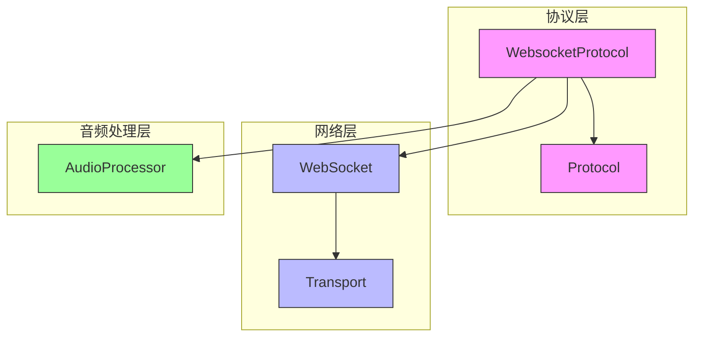
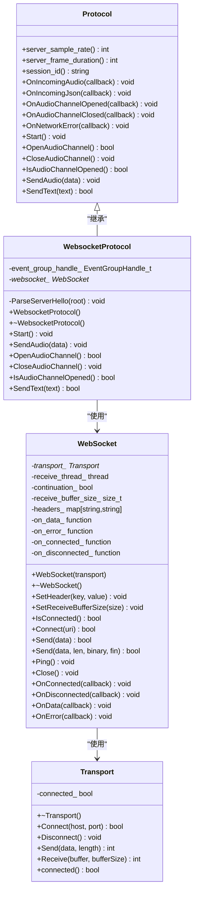
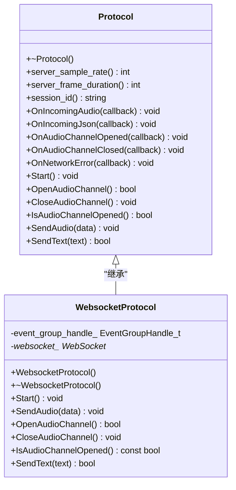
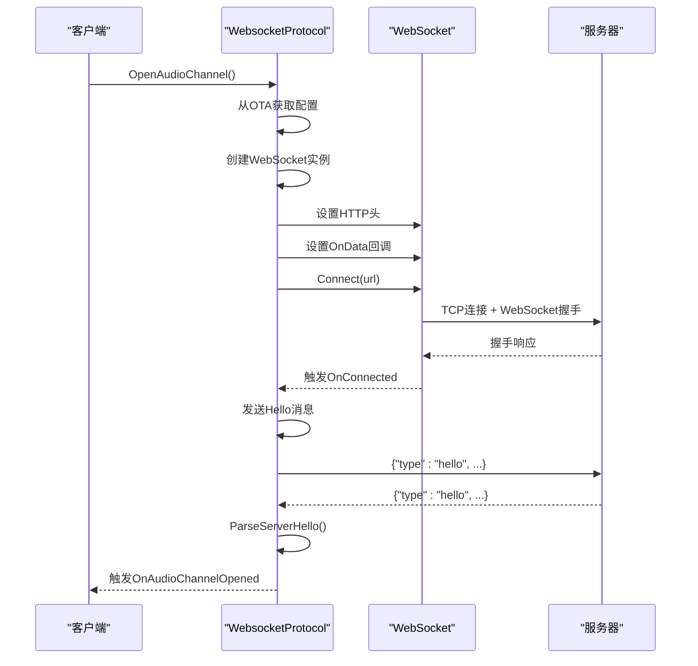
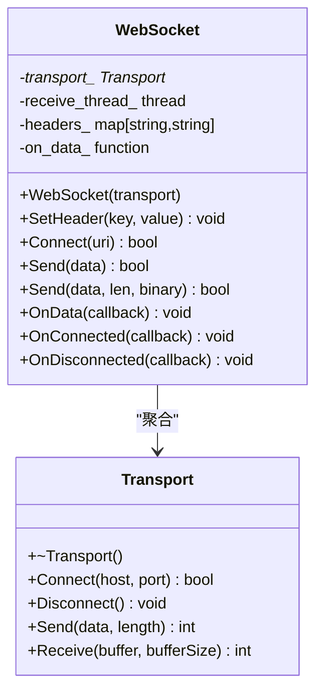
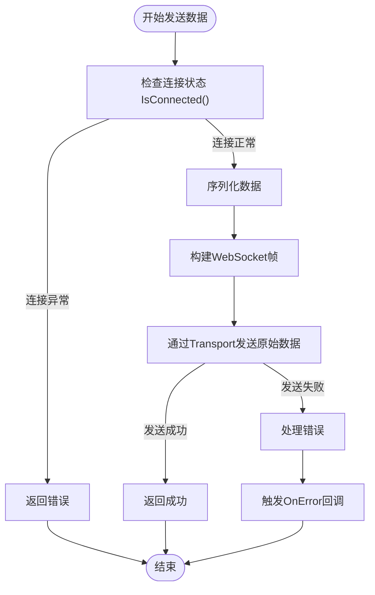
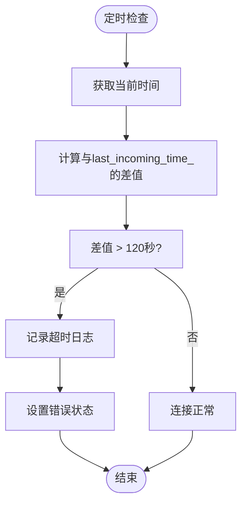
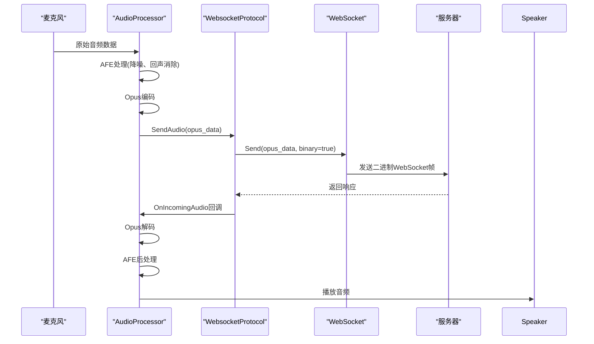
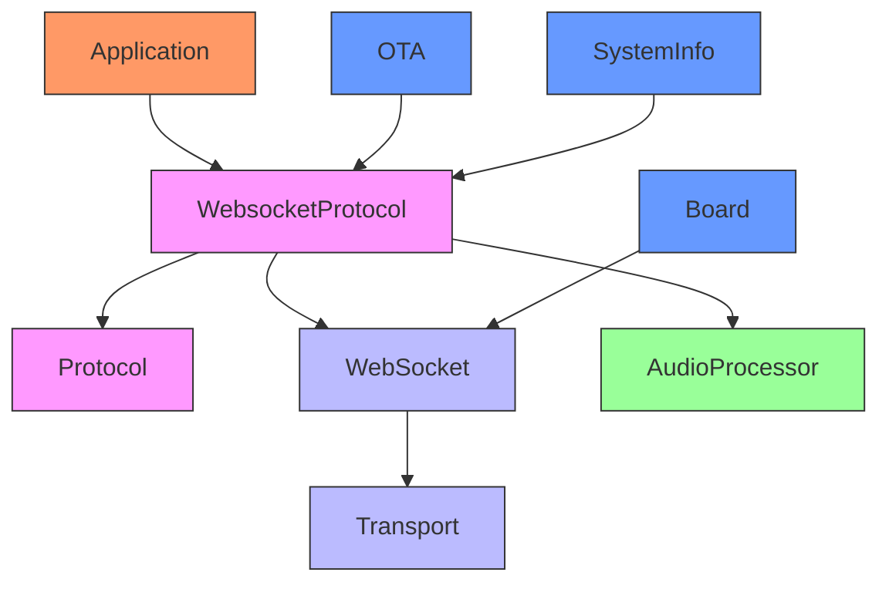

# WebSocket 实现

<cite>
**本文档引用的文件**   
- [websocket_protocol.h](file://main/protocols/websocket_protocol.h)
- [websocket_protocol.cc](file://main/protocols/websocket_protocol.cc)
- [protocol.h](file://main/protocols/protocol.h)
- [protocol.cc](file://main/protocols/protocol.cc)
- [board.h](file://main/boards/common/board.h)
- [web_socket.h](file://managed_components/78__esp-ml307/include/web_socket.h)
- [transport.h](file://managed_components/78__esp-ml307/include/transport.h)
- [application.h](file://main/application.h)
- [audio_processor.cc](file://main/audio_processing/audio_processor.cc)
</cite>

## 目录
1. [项目结构](#项目结构)
2. [核心组件](#核心组件)
3. [架构概览](#架构概览)
4. [详细组件分析](#详细组件分析)
5. [依赖关系分析](#依赖关系分析)
6. [性能考量](#性能考量)
7. [故障排除指南](#故障排除指南)

## 项目结构

本项目采用模块化分层架构，主要功能模块集中在`main`目录下。与WebSocket实现直接相关的文件位于`main/protocols/`目录中，包括`websocket_protocol.h`和`websocket_protocol.cc`。WebSocket协议依赖于底层的`web_socket.h`和`transport.h`组件，这些组件位于`managed_components`目录中。音频处理模块位于`main/audio_processing/`，通过`audio_processor.cc`与WebSocket协议协同工作。

**图示来源**
- [websocket_protocol.h](file://main/protocols/websocket_protocol.h)
- [web_socket.h](file://managed_components/78__esp-ml307/include/web_socket.h)
- [transport.h](file://managed_components/78__esp-ml307/include/transport.h)
- [audio_processor.cc](file://main/audio_processing/audio_processor.cc)

**本节来源**
- [websocket_protocol.h](file://main/protocols/websocket_protocol.h)
- [web_socket.h](file://managed_components/78__esp-ml307/include/web_socket.h)

## 核心组件

WebSocket实现的核心是`WebsocketProtocol`类，它继承自`Protocol`基类，实现了与云端服务器的双向通信。该类负责建立安全的WSS连接、发送和接收音频数据流、处理连接状态变化以及实现心跳机制。`WebsocketProtocol`通过`Board`单例获取`WebSocket`实例，并利用`Transport`抽象层进行底层网络通信。在语音流式传输场景中，`WebsocketProtocol`与`AudioProcessor`紧密协作，将采集的音频数据编码为Opus格式并通过WebSocket发送。

**本节来源**
- [websocket_protocol.h](file://main/protocols/websocket_protocol.h#L0-L30)
- [websocket_protocol.cc](file://main/protocols/websocket_protocol.cc#L0-L50)

## 架构概览

系统采用分层架构设计，上层应用通过`WebsocketProtocol`类与云端通信，该类实现了`Protocol`接口。`WebsocketProtocol`依赖于`WebSocket`类进行WebSocket协议的具体实现，而`WebSocket`类又依赖于`Transport`抽象类进行底层网络传输。这种分层设计实现了关注点分离，使得网络协议和传输机制可以独立变化。

**图示来源**
- [protocol.h](file://main/protocols/protocol.h#L0-L80)
- [websocket_protocol.h](file://main/protocols/websocket_protocol.h#L0-L30)
- [web_socket.h](file://managed_components/78__esp-ml307/include/web_socket.h#L0-L47)
- [transport.h](file://managed_components/78__esp-ml307/include/transport.h#L0-L20)

## 详细组件分析

### WebsocketProtocol 类分析

`WebsocketProtocol`类是WebSocket协议的具体实现，它继承自`Protocol`基类，提供了语音流式传输所需的所有功能。

#### 类关系图

**图示来源**
- [websocket_protocol.h](file://main/protocols/websocket_protocol.h#L0-L30)
- [protocol.h](file://main/protocols/protocol.h#L0-L80)

#### 连接建立流程

**图示来源**
- [websocket_protocol.cc](file://main/protocols/websocket_protocol.cc#L81-L256)

**本节来源**
- [websocket_protocol.h](file://main/protocols/websocket_protocol.h#L0-L30)
- [websocket_protocol.cc](file://main/protocols/websocket_protocol.cc#L81-L256)

### WebSocket 底层实现分析

`WebSocket`类提供了WebSocket协议的底层实现，它依赖于`Transport`抽象类进行网络通信。

#### 类关系图

**图示来源**
- [web_socket.h](file://managed_components/78__esp-ml307/include/web_socket.h#L0-L47)
- [transport.h](file://managed_components/78__esp-ml307/include/transport.h#L0-L20)

#### 消息收发流程

**图示来源**
- [web_socket.h](file://managed_components/78__esp-ml307/include/web_socket.h#L0-L47)
- [websocket_protocol.cc](file://main/protocols/websocket_protocol.cc#L45-L55)

**本节来源**
- [web_socket.h](file://managed_components/78__esp-ml307/include/web_socket.h#L0-L47)
- [websocket_protocol.cc](file://main/protocols/websocket_protocol.cc#L45-L55)

### 心跳与超时机制分析

系统通过心跳机制和超时检测确保长连接的稳定性。

#### 超时检测流程

**图示来源**
- [protocol.cc](file://main/protocols/protocol.cc#L106-L135)

#### 心跳机制实现
系统通过`last_incoming_time_`成员变量记录最后一次收到数据的时间，并在`IsTimeout()`方法中检查是否超过120秒未收到数据。每当收到数据时，`OnData`回调会更新`last_incoming_time_`。这种机制可以有效检测连接是否中断，避免僵尸连接。

**本节来源**
- [protocol.h](file://main/protocols/protocol.h#L0-L80)
- [protocol.cc](file://main/protocols/protocol.cc#L106-L135)

### 音频流式传输集成分析

`WebsocketProtocol`与`AudioProcessor`协同工作，实现高效的语音流式传输。

#### 音频数据流流程

**图示来源**
- [websocket_protocol.cc](file://main/protocols/websocket_protocol.cc#L45-L55)
- [audio_processor.cc](file://main/audio_processing/audio_processor.cc#L0-L162)

**本节来源**
- [websocket_protocol.cc](file://main/protocols/websocket_protocol.cc#L45-L55)
- [audio_processor.cc](file://main/audio_processing/audio_processor.cc#L0-L162)

## 依赖关系分析

系统各组件之间存在明确的依赖关系，形成了清晰的调用链。

**图示来源**
- [websocket_protocol.cc](file://main/protocols/websocket_protocol.cc#L0-L257)
- [board.h](file://main/boards/common/board.h#L0-L56)

**本节来源**
- [websocket_protocol.cc](file://main/protocols/websocket_protocol.cc#L0-L257)
- [board.h](file://main/boards/common/board.h#L0-L56)

## 性能考量

WebSocket实现考虑了多个性能因素：

1. **内存管理**：使用`std::vector<uint8_t>`管理音频数据，避免频繁内存分配
2. **线程模型**：`WebSocket`类使用独立线程处理接收任务，避免阻塞主线程
3. **连接复用**：通过`OpenAudioChannel`和`CloseAudioChannel`实现连接的优雅开启和关闭
4. **错误处理**：完善的错误回调机制，确保异常情况下的稳定运行
5. **资源释放**：在析构函数中确保`WebSocket`对象和`EventGroup`被正确释放

## 故障排除指南

### 常见问题及解决方案

**连接失败**
- **现象**：`OpenAudioChannel`返回`false`
- **原因**：可能缺少OTA配置或Client-Id
- **解决方案**：确保OTA配置包含WebSocket URL和Token，且NVS中存储了Client-Id

**音频传输中断**
- **现象**：连接正常但音频无法传输超过2分钟
- **原因**：超时机制触发
- **解决方案**：确保服务器定期发送数据以更新`last_incoming_time_`

**内存泄漏**
- **现象**：长时间运行后内存持续增长
- **解决方案**：检查`websocket_`指针是否在`CloseAudioChannel`中被正确删除

**本节来源**
- [websocket_protocol.cc](file://main/protocols/websocket_protocol.cc#L81-L256)
- [protocol.cc](file://main/protocols/protocol.cc#L106-L135)