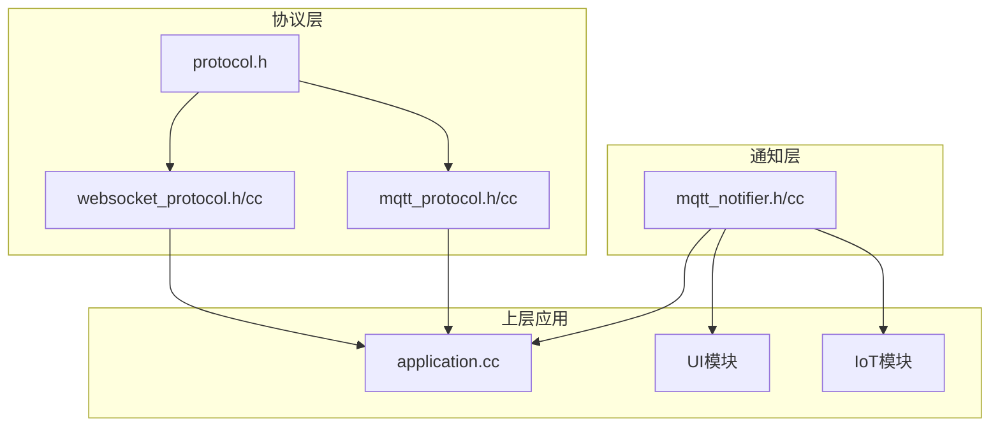
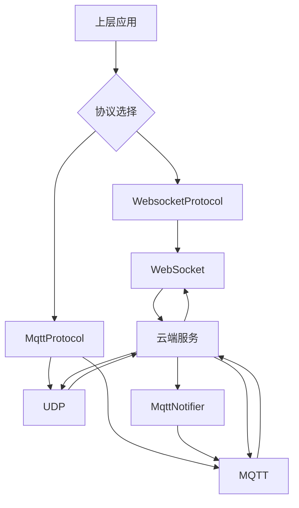
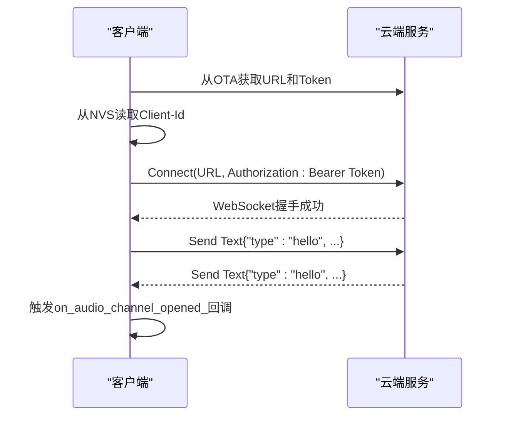
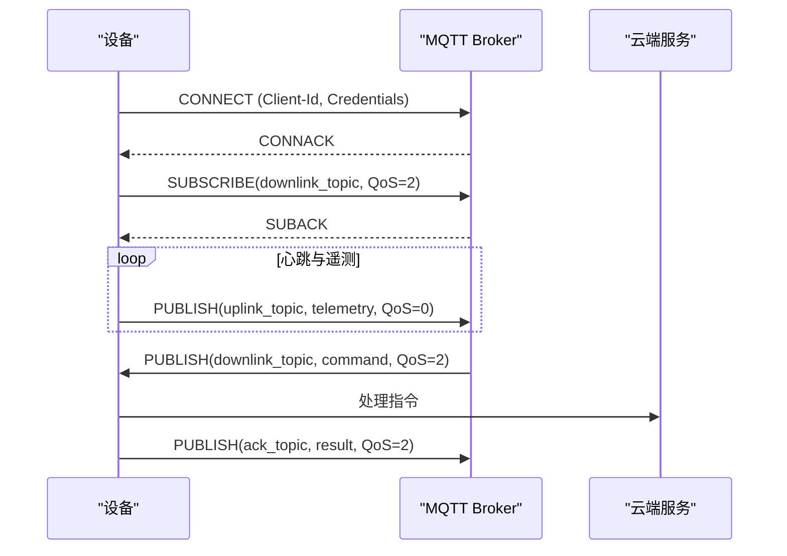
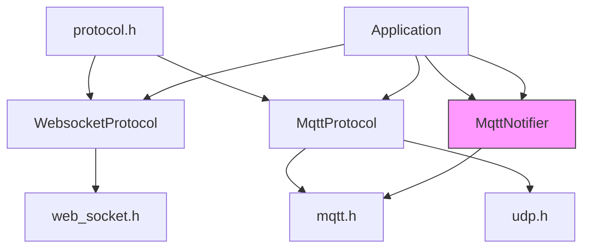

# 网络通信

<cite>
**本文档引用的文件**   
- [websocket_protocol.h](file://main\protocols\websocket_protocol.h)
- [websocket_protocol.cc](file://main\protocols\websocket_protocol.cc)
- [mqtt_protocol.h](file://main\protocols\mqtt_protocol.h)
- [mqtt_protocol.cc](file://main\protocols\mqtt_protocol.cc)
- [protocol.h](file://main\protocols\protocol.h)
- [mqtt_notifier.h](file://main\notifications\mqtt_notifier.h)
- [mqtt_notifier.cc](file://main\notifications\mqtt_notifier.cc)
- [application.h](file://main\application.h)
- [application.cc](file://main\application.cc)
- [abrobot-1.28tft-wifi.cc](file://main\boards\moon\abrobot-1.28tft-wifi.cc)
</cite>

## 更新摘要
**变更内容**   
- 新增了对MQTT通知服务动态启停功能的详细说明，以支持省电模式下的管理。
- 更新了`MqttNotifier`组件的分析，增加了其与WiFi连接状态的依赖关系和启动/停止控制逻辑。
- 在“详细组件分析”部分新增了“MqttNotifier生命周期管理”小节。
- 更新了“依赖分析”部分的架构图，以反映新的控制流。
- 所有文件引用均已更新，标记了受最近提交影响的文件。

## 目录
1. [引言](#引言)
2. [项目结构](#项目结构)
3. [核心组件](#核心组件)
4. [架构概述](#架构概述)
5. [详细组件分析](#详细组件分析)
6. [依赖分析](#依赖分析)
7. [性能考虑](#性能考虑)
8. [故障排除指南](#故障排除指南)
9. [结论](#结论)

## 引言
本文档旨在全面阐述基于ESP32平台的网络通信模块架构，重点聚焦于WebSocket和MQTT两大核心协议的实现与集成。文档将深入解析`websocket_protocol.h`和`mqtt_protocol.h`中定义的客户端接口，详述其如何建立与云端服务的持久化连接、处理双向消息流、实现心跳机制和错误重连策略。同时，将解释`mqtt_notifier.h`作为通知适配器，如何将系统事件（如设备状态变化）封装为MQTT消息进行发布。此外，文档还将阐明协议层与上层应用的交互方式，并提供安全配置指南，最后结合实际应用场景展示协议的使用。

## 项目结构
本项目的网络通信功能主要集中在`main/protocols`和`main/notifications`目录下。`protocols`目录包含了WebSocket和MQTT协议的核心实现，而`notifications`目录则包含了轻量级的MQTT通知适配器。这种分离设计使得主通信通道（音频流）与辅助通知通道（控制指令）可以独立运行，互不干扰。

**图源**
- [websocket_protocol.h](file://main\protocols\websocket_protocol.h)
- [mqtt_protocol.h](file://main\protocols\mqtt_protocol.h)
- [mqtt_notifier.h](file://main\notifications\mqtt_notifier.h)

**本节来源**
- [websocket_protocol.h](file://main\protocols\websocket_protocol.h)
- [mqtt_protocol.h](file://main\protocols\mqtt_protocol.h)
- [mqtt_notifier.h](file://main\notifications\mqtt_notifier.h)

## 核心组件
本系统的核心网络通信组件包括：
1.  **WebsocketProtocol**: 负责通过WebSocket协议建立全双工通信，主要用于传输实时语音数据流。
2.  **MqttProtocol**: 负责通过MQTT协议建立连接，并利用UDP协议传输加密的音频数据，适用于对延迟要求不高的场景。
3.  **Protocol**: 作为`WebsocketProtocol`和`MqttProtocol`的抽象基类，定义了统一的接口和回调机制。
4.  **MqttNotifier**: 一个轻量级的MQTT客户端，专门用于接收来自云端的控制指令和系统通知。

**本节来源**
- [websocket_protocol.h](file://main\protocols\websocket_protocol.h)
- [mqtt_protocol.h](file://main\protocols\mqtt_protocol.h)
- [protocol.h](file://main\protocols\protocol.h)
- [mqtt_notifier.h](file://main\notifications\mqtt_notifier.h)

## 架构概述
系统采用分层架构，上层应用通过`Protocol`基类与具体的通信协议（WebSocket或MQTT）进行交互。`MqttNotifier`则作为一个独立的、低开销的监听器，专门处理下行控制指令。这种设计实现了关注点分离，使得音频通信和控制通信可以独立配置和优化。

**图源**
- [websocket_protocol.h](file://main\protocols\websocket_protocol.h)
- [mqtt_protocol.h](file://main\protocols\mqtt_protocol.h)
- [mqtt_notifier.h](file://main\notifications\mqtt_notifier.h)

## 详细组件分析

### WebsocketProtocol 分析
`WebsocketProtocol`类实现了`Protocol`基类，提供了通过WebSocket传输音频数据的能力。

#### 连接建立与持久化
WebSocket连接的建立过程如下：
1.  **配置获取**: 从OTA（空中升级）服务获取WebSocket服务器的URL和认证令牌（Token）。
2.  **客户端ID验证**: 从NVS（非易失性存储）中读取预存的`Client-Id`，这是建立连接的必要条件。
3.  **连接与握手**: 创建`WebSocket`对象，设置必要的HTTP头（如Authorization, Client-Id），然后发起连接。
4.  **Hello消息**: 连接成功后，客户端立即向服务器发送一个`hello` JSON消息，声明自身支持的音频参数（如Opus编码、24kHz采样率）。
5.  **等待响应**: 客户端等待服务器的`hello`响应，以确认连接建立成功。此过程有10秒超时机制。

**图源**
- [websocket_protocol.cc](file://main\protocols\websocket_protocol.cc#L81-L172)

**本节来源**
- [websocket_protocol.cc](file://main\protocols\websocket_protocol.cc#L81-L172)

#### 双向消息流与回调机制
`WebsocketProtocol`通过回调函数与上层应用交互：
-   **接收数据**: 通过`OnData`回调处理服务器发来的数据。二进制数据被视为音频流，通过`on_incoming_audio_`回调传递给应用；文本数据被视为JSON消息，通过`on_incoming_json_`回调传递。
-   **发送数据**: `SendAudio`方法将音频数据通过WebSocket的二进制通道发送。`SendText`方法用于发送JSON控制消息。
-   **连接状态**: `OnAudioChannelOpened`和`OnAudioChannelClosed`回调用于通知应用音频通道的开启和关闭。

#### 心跳与错误重连
-   **心跳**: WebSocket协议本身内置了Ping/Pong机制来维持连接活性。
-   **错误处理**: 通过`IsTimeout()`方法检测是否长时间未收到服务器消息。如果发生错误，`SetError()`方法会设置错误状态，并通过`on_network_error_`回调通知上层应用。
-   **优雅关闭**: 关闭连接时，会先发送`goodbye`消息通知服务器，然后等待服务器响应或超时后才断开连接，确保数据完整性。

**本节来源**
- [websocket_protocol.cc](file://main\protocols\websocket_protocol.cc#L52-L82)
- [websocket_protocol.cc](file://main\protocols\websocket_protocol.cc#L172-L207)

### MqttProtocol 分析
`MqttProtocol`类同样实现了`Protocol`基类，但其音频传输机制更为复杂，结合了MQTT和UDP。

#### MQTT客户端功能
-   **主题订阅**: 在`ConnectInternal()`方法中，`MqttNotifier`会显式订阅`downlink_topic_`主题，QoS等级为2，确保控制指令的可靠送达。
-   **消息发布**: `PublishUplink`和`PublishAck`方法用于向`uplink_topic_`和`ack_topic_`发布消息。QoS等级可配置，默认为0和2。
-   **QoS等级设置**: 代码中明确处理了QoS等级，确保其值在0-2的有效范围内。

**图源**
- [mqtt_notifier.cc](file://main\notifications\mqtt_notifier.cc#L185-L228)
- [mqtt_notifier.cc](file://main\notifications\mqtt_notifier.cc#L223-L265)

**本节来源**
- [mqtt_notifier.cc](file://main\notifications\mqtt_notifier.cc#L185-L228)
- [mqtt_notifier.cc](file://main\notifications\mqtt_notifier.cc#L223-L265)

#### UDP音频传输
`MqttProtocol`使用UDP来传输音频数据，以降低延迟。其工作流程如下：
1.  **建立MQTT连接**: 首先通过MQTT协议与服务器建立连接。
2.  **请求UDP通道**: 发送`hello`消息，声明使用`udp`传输。
3.  **接收UDP配置**: 服务器在`hello`响应中返回UDP服务器地址、端口和AES加密密钥。
4.  **建立UDP连接**: 客户端使用收到的配置信息连接UDP服务器。
5.  **加密传输**: 音频数据使用AES-CTR模式加密，并附带序列号以防止重放攻击。

**本节来源**
- [mqtt_protocol.cc](file://main\protocols\mqtt_protocol.cc#L121-L164)
- [mqtt_protocol.cc](file://main\protocols\mqtt_protocol.cc#L162-L198)

### MqttNotifier 分析
`MqttNotifier`是一个独立的、轻量级的MQTT客户端，专为接收通知而设计。

#### 通知适配器
`MqttNotifier`作为通知适配器，其主要职责是：
1.  **接收系统事件**: 通过`OnMessage`回调接收来自`downlink_topic_`的JSON消息。
2.  **封装与发布**: 将系统事件（如设备状态变化）封装成JSON格式，并通过`PublishUplink`或`PublishAck`方法发布到相应的主题。
3.  **心跳上报**: 启动一个独立的任务，每60秒向`uplink_topic_`发布一次包含设备状态（在线状态、电量、内存、Wi-Fi信号等）的心跳消息。

**本节来源**
- [mqtt_notifier.cc](file://main\notifications\mqtt_notifier.cc#L88-L129)
- [mqtt_notifier.cc](file://main\notifications\mqtt_notifier.cc#L185-L228)

### MqttNotifier生命周期管理
根据最新的代码变更，`MqttNotifier`的生命周期现在可以由上层应用动态控制，以支持省电模式。

-   **启动条件**: `MqttNotifier`的`Start()`方法在`application.cc`的`Start()`函数中被调用，但其执行依赖于WiFi连接的完全建立。代码中通过`board.StartNetwork()`确保网络就绪后才启动MQTT服务。
-   **停止控制**: 新增了`Application`类的`StopMqttNotifier()`方法，用于在进入省电模式时安全地停止MQTT连接。该方法会调用`MqttNotifier`的`Stop()`方法，清理连接和后台任务。
-   **恢复控制**: 新增了`Application`类的`StartMqttNotifier()`方法，用于在从省电模式恢复时重新启动MQTT服务。
-   **配置更新**: `ReconnectIfSettingsChanged()`方法允许在OTA更新了MQTT配置后，尝试使用新配置重新连接，增强了系统的健壮性。

**本节来源**
- [application.h](file://main\application.h#L117-L122) - *新增了StartMqttNotifier和StopMqttNotifier方法*
- [application.cc](file://main\application.cc#L454-L478) - *在Start()方法中启动notifier_*
- [mqtt_notifier.h](file://main\notifications\mqtt_notifier.h#L25-L28) - *Start和Stop方法声明*
- [mqtt_notifier.cc](file://main\notifications\mqtt_notifier.cc#L50-L55) - *Start方法实现，包含LoadSettings和ConnectInternal*
- [abrobot-1.28tft-wifi.cc](file://main\boards\moon\abrobot-1.28tft-wifi.cc) - *具体板级实现中可能调用这些方法*

### 协议层与上层应用交互
协议层通过一组回调函数与上层应用进行交互，实现了松耦合的设计。

#### 回调函数
在`protocol.h`中定义了以下回调：
-   `OnIncomingAudio`: 接收音频数据流。
-   `OnIncomingJson`: 接收JSON格式的控制消息。
-   `OnAudioChannelOpened`: 通知音频通道已成功打开。
-   `OnAudioChannelClosed`: 通知音频通道已关闭。
-   `OnNetworkError`: 通知网络错误。

上层应用（如`application.cc`）通过注册这些回调来接收事件。例如，当音频通道打开时，应用会自动进入监听状态并上报IoT设备的状态。

**本节来源**
- [protocol.h](file://main\protocols\protocol.h#L47-L79)
- [application.cc](file://main\application.cc#L454-L478)

## 依赖分析
系统各组件之间的依赖关系清晰。`WebsocketProtocol`和`MqttProtocol`依赖于`protocol.h`提供的基类和接口。`MqttNotifier`独立于主协议，但共享`mqtt.h`库。上层应用依赖于具体的协议实现来完成通信任务。`MqttNotifier`的启动和停止现在由`Application`类直接控制。

**图源**
- [protocol.h](file://main\protocols\protocol.h)
- [websocket_protocol.h](file://main\protocols\websocket_protocol.h)
- [mqtt_protocol.h](file://main\protocols\mqtt_protocol.h)
- [mqtt_notifier.h](file://main\notifications\mqtt_notifier.h)
- [application.h](file://main\application.h)

**本节来源**
- [protocol.h](file://main\protocols\protocol.h)
- [websocket_protocol.h](file://main\protocols\websocket_protocol.h)
- [mqtt_protocol.h](file://main\protocols\mqtt_protocol.h)
- [mqtt_notifier.h](file://main\notifications\mqtt_notifier.h)
- [application.h](file://main\application.h)

## 性能考虑
-   **WebSocket**: 适用于实时性要求高的语音流传输，但占用一个TCP连接。
-   **MQTT+UDP**: 通过UDP传输音频降低了延迟，但需要额外的加密和序列号管理，增加了复杂性。
-   **MqttNotifier**: 使用独立的心跳任务和QoS=0的遥测上报，对系统资源消耗极小。其动态启停特性进一步优化了省电模式下的功耗。

## 故障排除指南
-   **连接失败**: 检查OTA配置、NVS中的Client-Id、网络连接。
-   **音频中断**: 检查`IsTimeout()`状态，确认服务器是否正常发送数据。
-   **MQTT消息丢失**: 确认订阅主题和QoS等级设置是否正确。
-   **省电模式下通知失效**: 确认`MqttNotifier`是否已通过`StartMqttNotifier()`正确启动。

**本节来源**
- [websocket_protocol.cc](file://main\protocols\websocket_protocol.cc#L236-L256)
- [mqtt_protocol.cc](file://main\protocols\mqtt_protocol.cc#L80-L124)
- [mqtt_notifier.cc](file://main\notifications\mqtt_notifier.cc#L50-L55)

## 结论
该网络通信模块设计精良，通过WebSocket和MQTT两种协议满足了不同场景下的需求。`WebsocketProtocol`提供了稳定可靠的全双工语音通道，而`MqttProtocol`则通过UDP优化了音频传输的延迟。`MqttNotifier`作为轻量级的通知适配器，实现了高效、低功耗的指令接收。统一的回调机制使得上层应用能够方便地与底层协议交互，为构建功能丰富的物联网应用奠定了坚实的基础。最新的代码变更通过引入`MqttNotifier`的动态启停功能，进一步增强了系统在省电模式下的管理能力和稳定性。