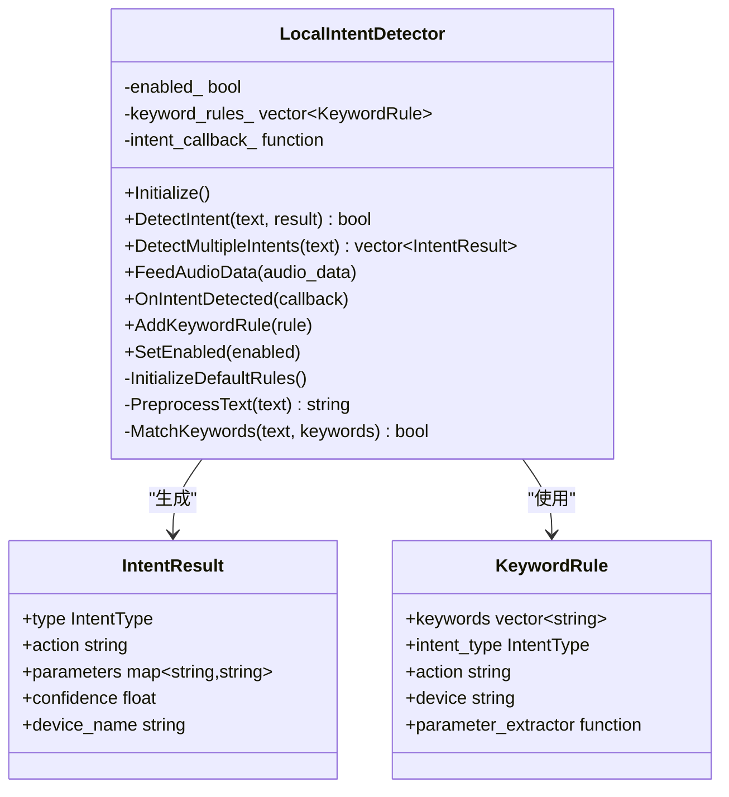
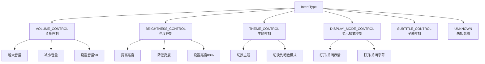
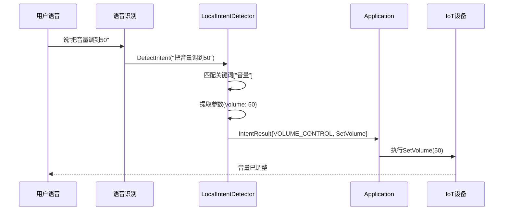

# 本地意图检测

<cite>
**本文档引用的文件**  
- [local_intent_detector.h](file://main/audio_processing/local_intent_detector.h)
- [local_intent_detector.cc](file://main/audio_processing/local_intent_detector.cc)
- [application.h](file://main/application.h)
- [application.cc](file://main/application.cc)
</cite>

## 目录
1. [功能概述](#功能概述)
2. [核心架构](#核心架构)
3. [意图类型](#意图类型)
4. [关键词规则系统](#关键词规则系统)
5. [参数提取机制](#参数提取机制)
6. [集成与使用](#集成与使用)
7. [扩展自定义意图](#扩展自定义意图)

## 功能概述

本地意图检测（LocalIntentDetector）是一个轻量级的关键词识别系统，能够在设备端直接识别用户的语音指令意图，无需依赖云端服务器。该系统通过关键词匹配和参数提取，实现对常见设备控制指令的快速响应。

**核心优势**：
- **零延迟响应**：本地处理，无需网络往返时间
- **隐私保护**：敏感指令不上传云端
- **离线可用**：在网络不稳定时仍可执行基本控制
- **可扩展**：支持自定义规则和意图类型

**Section sources**
- [local_intent_detector.h](file://main/audio_processing/local_intent_detector.h#L1-L40)

## 核心架构

### 类结构设计

LocalIntentDetector采用规则驱动的架构，通过KeywordRule定义检测规则，IntentResult存储检测结果。



**Diagram sources**
- [local_intent_detector.h](file://main/audio_processing/local_intent_detector.h#L12-L72)

## 意图类型

系统支持多种预定义的意图类型，涵盖常见的设备控制场景。



### 意图类型枚举

```cpp
enum class IntentType {
    UNKNOWN,                    // 未识别的意图
    VOLUME_CONTROL,             // 音量调节
    BRIGHTNESS_CONTROL,         // 屏幕亮度调节
    THEME_CONTROL,              // 主题切换
    DISPLAY_MODE_CONTROL,       // 显示模式切换（表情/字幕）
    SUBTITLE_CONTROL            // 字幕开关
};
```

**Section sources**
- [local_intent_detector.h](file://main/audio_processing/local_intent_detector.h#L13-L21)

## 关键词规则系统

### KeywordRule结构

每个KeywordRule定义了一组触发关键词、对应的意图类型、执行动作和参数提取器。

```cpp
struct KeywordRule {
    std::vector<std::string> keywords;        // 触发关键词列表
    IntentType intent_type;                   // 意图类型
    std::string action;                       // IoT设备动作名称
    std::string device;                       // 目标设备名称
    std::function<void(const std::string& text, IntentResult& result)> parameter_extractor;
};
```

### 默认规则示例

系统预置了一套默认规则，涵盖常见的控制场景：

**音量控制规则**：
- 关键词：["音量", "声音", "大声点", "小声点", "静音"]
- 动作：SetVolume / VolumeUp / VolumeDown
- 参数提取：识别数字（如"音量50"）

**亮度控制规则**：
- 关键词：["亮度", "屏幕", "亮一点", "暗一点"]
- 动作：SetBrightness / BrightnessUp / BrightnessDown
- 参数提取：识别百分比（如"亮度80%"）

**主题控制规则**：
- 关键词：["主题", "暗色模式", "明亮模式", "夜间模式"]
- 动作：SwitchTheme / SetDarkMode / SetLightMode

**Section sources**
- [local_intent_detector.h](file://main/audio_processing/local_intent_detector.h#L31-L38)
- [local_intent_detector.cc](file://main/audio_processing/local_intent_detector.cc#L15-L80)

## 参数提取机制

### 文本预处理

在进行关键词匹配前，系统会对输入文本进行预处理：
1. 移除标点符号
2. 转换为小写（如适用）
3. 去除多余空格

### 数字识别

系统支持多种数字表达方式的识别：

**阿拉伯数字**：
```cpp
"音量50" -> 50
"亮度80%" -> 80
"设置为30" -> 30
```

**中文数字**：
```cpp
"音量五十" -> 50
"亮度八十" -> 80
"三十" -> 30
```

**上下文感知提取**：
```cpp
int ExtractNumberWithContext(const std::string& text, 
                             const std::vector<std::string>& context_keywords)
```

该方法会查找距离关键词最近的数字，提高识别准确性。

### 参数提取器示例

```cpp
// 音量控制参数提取器
static void ExtractVolumeParameters(const std::string& text, IntentResult& result) {
    if (text.find("增大") != std::string::npos || 
        text.find("大声点") != std::string::npos) {
        result.action = "VolumeUp";
    } else if (text.find("减小") != std::string::npos || 
               text.find("小声点") != std::string::npos) {
        result.action = "VolumeDown";
    } else {
        // 尝试提取具体数值
        int volume = ExtractNumberWithContext(text, {"音量", "声音"});
        if (volume >= 0 && volume <= 100) {
            result.action = "SetVolume";
            result.parameters["volume"] = std::to_string(volume);
        }
    }
}
```

**Section sources**
- [local_intent_detector.cc](file://main/audio_processing/local_intent_detector.cc#L90-L250)

## 集成与使用

### 初始化

在Application类中，LocalIntentDetector会在启动时自动初始化：

```cpp
// application.cc
LocalIntentDetector local_intent_detector_;

void Application::Start() {
    // 初始化本地意图检测器
    local_intent_detector_.Initialize();
    local_intent_detector_.SetEnabled(true);
}
```

### 意图检测流程



### 代码示例

```cpp
#include "audio_processing/local_intent_detector.h"

// 创建检测器实例
intent::LocalIntentDetector detector;
detector.Initialize();

// 检测单个意图
std::string user_text = "把音量调到50";
intent::IntentResult result;
if (detector.DetectIntent(user_text, result)) {
    printf("检测到意图类型: %d\n", static_cast<int>(result.type));
    printf("执行动作: %s\n", result.action.c_str());
    printf("置信度: %.2f\n", result.confidence);
    
    // 执行意图
    Application::GetInstance().ExecuteLocalIntent(result);
}

// 检测多个意图
std::string complex_text = "把音量调到50并且提高亮度";
auto results = detector.DetectMultipleIntents(complex_text);
for (const auto& r : results) {
    Application::GetInstance().ExecuteLocalIntent(r);
}
```

**Section sources**
- [application.cc](file://main/application.cc#L1200-L1350)

## 扩展自定义意图

### 添加新的意图类型

1. **扩展IntentType枚举**：
```cpp
enum class IntentType {
    // ... 现有类型
    TEMPERATURE_CONTROL,   // 新增：温度控制
};
```

2. **定义KeywordRule**：
```cpp
intent::KeywordRule temp_rule;
temp_rule.keywords = {"温度", "空调", "制冷", "制热"};
temp_rule.intent_type = intent::IntentType::TEMPERATURE_CONTROL;
temp_rule.action = "SetTemperature";
temp_rule.device = "air_conditioner";
temp_rule.parameter_extractor = [](const std::string& text, 
                                   intent::IntentResult& result) {
    int temp = ExtractNumberWithContext(text, {"温度", "度"});
    if (temp >= 16 && temp <= 30) {
        result.parameters["temperature"] = std::to_string(temp);
    }
};
```

3. **注册规则**：
```cpp
detector.AddKeywordRule(temp_rule);
```

### 自定义参数提取器

对于复杂的参数提取逻辑，可以实现自定义提取器：

```cpp
void ExtractComplexParameters(const std::string& text, 
                              intent::IntentResult& result) {
    // 1. 正则表达式匹配
    std::regex pattern("设置.*为(.+)");
    std::smatch matches;
    if (std::regex_search(text, matches, pattern)) {
        result.parameters["value"] = matches[1].str();
    }
    
    // 2. 多关键词组合判断
    bool is_night_mode = (text.find("夜间") != std::string::npos) || 
                        (text.find("睡觉") != std::string::npos);
    if (is_night_mode) {
        result.parameters["mode"] = "night";
    }
    
    // 3. 置信度计算
    result.confidence = CalculateConfidence(text, result.parameters);
}
```

**Section sources**
- [local_intent_detector.h](file://main/audio_processing/local_intent_detector.h#L60-L61)
- [local_intent_detector.cc](file://main/audio_processing/local_intent_detector.cc#L250-L350)

## 总结

LocalIntentDetector为xiaozhi-esp32项目提供了高效的本地意图识别能力，具有以下特点：

1. **低延迟**：本地处理，响应速度快
2. **灵活扩展**：规则驱动，易于添加新意图
3. **智能提取**：支持中文数字识别和上下文感知
4. **轻量实现**：占用资源少，适合嵌入式设备

该系统与Application类深度集成，为用户提供流畅的语音控制体验，是设备智能化的重要组成部分。
