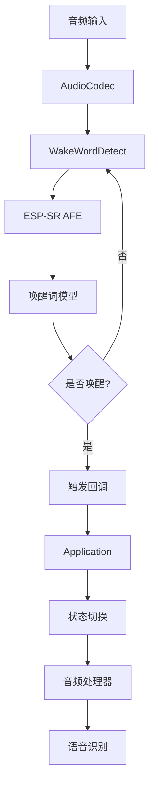
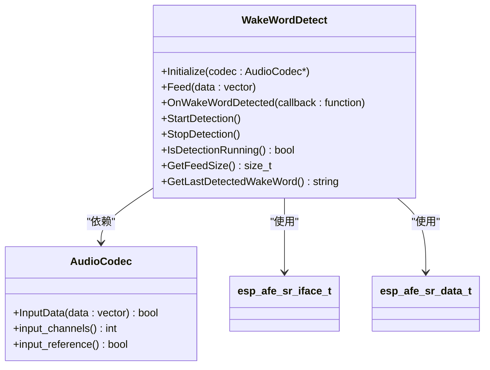
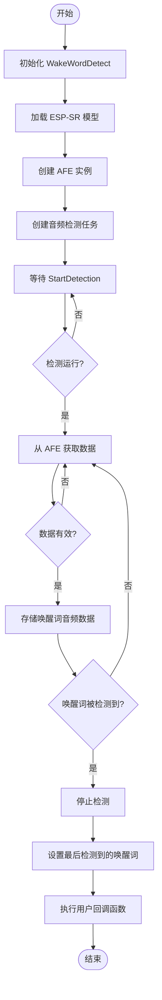
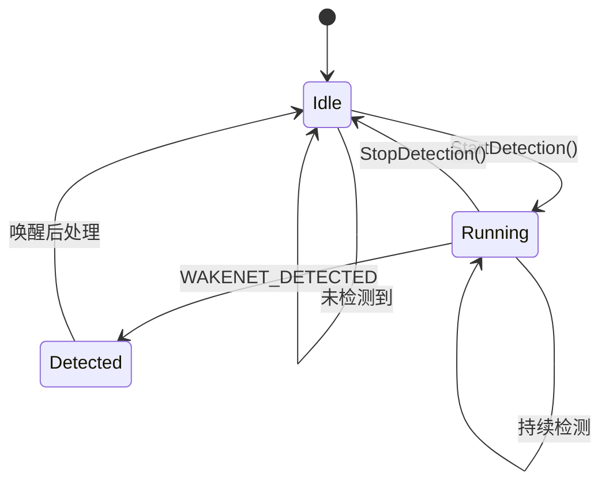
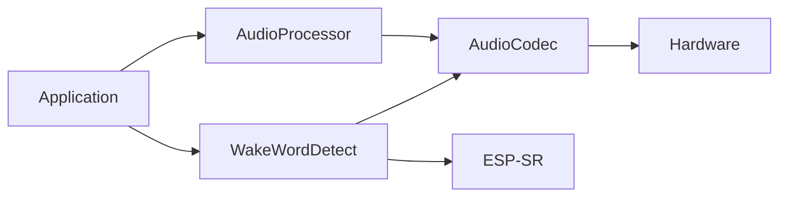

# 语音唤醒检测

<cite>
**本文档引用的文件**   
- [wake_word_detect.h](file://main/audio_processing/wake_word_detect.h)
- [wake_word_detect.cc](file://main/audio_processing/wake_word_detect.cc)
- [application.cc](file://main/application.cc)
- [config.json](file://main/boards/tudouzi/config.json)
</cite>

## 目录
1. [简介](#简介)
2. [核心组件](#核心组件)
3. [架构概述](#架构概述)
4. [详细组件分析](#详细组件分析)
5. [依赖分析](#依赖分析)
6. [性能考量](#性能考量)
7. [故障排除指南](#故障排除指南)
8. [结论](#结论)

## 简介
本文档详细阐述了基于ESP-SR库的语音唤醒检测系统的技术实现。该系统通过WakeWordDetect类实现，负责监听音频流并检测预设的唤醒词（如"小智"）。系统采用多线程架构，结合音频采集、特征提取、模型推理和状态管理，实现了低延迟、高准确率的唤醒功能。文档深入分析了其生命周期、关键参数配置、状态机设计以及与系统其他组件的交互方式，为开发者提供全面的技术参考。

## 核心组件
语音唤醒检测系统的核心是`WakeWordDetect`类，它封装了从音频输入到唤醒触发的完整流程。该类通过`Initialize`方法初始化，加载ESP-SR模型，并根据音频编解码器的配置创建相应的音频前端处理（AFE）实例。系统通过`Feed`方法接收实时音频数据，由独立的`AudioDetectionTask`任务进行后台处理。当检测到唤醒词时，系统会通过用户注册的回调函数`OnWakeWordDetected`通知上层应用，从而触发后续的语音交互流程。

**本节来源**
- [wake_word_detect.h](file://main/audio_processing/wake_word_detect.h#L1-L45)
- [wake_word_detect.cc](file://main/audio_processing/wake_word_detect.cc#L0-L45)

## 架构概述



**图示来源**
- [wake_word_detect.h](file://main/audio_processing/wake_word_detect.h#L1-L45)
- [wake_word_detect.cc](file://main/audio_processing/wake_word_detect.cc#L0-L181)
- [application.cc](file://main/application.cc#L1063-L1159)

## 详细组件分析

### WakeWordDetect 类分析

#### 类图


**图示来源**
- [wake_word_detect.h](file://main/audio_processing/wake_word_detect.h#L1-L57)
- [wake_word_detect.cc](file://main/audio_processing/wake_word_detect.cc#L0-L181)

### 唤醒词识别流程分析

#### 识别流程图


**图示来源**
- [wake_word_detect.cc](file://main/audio_processing/wake_word_detect.cc#L43-L147)

### 状态机设计分析

#### 状态转换图


**图示来源**
- [wake_word_detect.cc](file://main/audio_processing/wake_word_detect.cc#L77-L116)
- [wake_word_detect.cc](file://main/audio_processing/wake_word_detect.cc#L113-L147)

## 依赖分析



**图示来源**
- [wake_word_detect.h](file://main/audio_processing/wake_word_detect.h#L1-L57)
- [application.cc](file://main/application.cc#L1063-L1159)

## 性能考量
系统的性能特征主要体现在唤醒延迟和功耗控制上。在唤醒延迟方面，系统通过`fetch_with_delay`函数实现低延迟检测，从音频输入到触发回调的延迟通常在几十毫秒内。音频数据的处理以32ms为一个帧进行，这保证了实时性。在功耗控制方面，系统通过FreeRTOS事件组（EventGroup）精确控制检测任务的启停。当不处于监听状态时，`AudioDetectionTask`会因等待事件而进入阻塞状态，从而显著降低CPU占用率和整体功耗。此外，项目配置文件`config.json`中启用了`CONFIG_FREERTOS_USE_TICKLESS_IDLE`，允许系统在空闲时进入深度睡眠，进一步优化了功耗。

**本节来源**
- [wake_word_detect.cc](file://main/audio_processing/wake_word_detect.cc#L77-L116)
- [wake_word_detect.cc](file://main/audio_processing/wake_word_detect.cc#L113-L147)
- [config.json](file://main/boards/tudouzi/config.json#L1-L12)

## 故障排除指南

### 常见问题及优化策略

**本节来源**
- [wake_word_detect.cc](file://main/audio_processing/wake_word_detect.cc#L113-L147)
- [wake_word_detect.cc](file://main/audio_processing/wake_word_detect.cc#L43-L82)

#### 误唤醒（False Wake-up）
- **原因**: 
  1. 环境噪音过大，包含与唤醒词声学特征相似的音节。
  2. 音频编解码器的增益（Gain）设置过高，导致背景噪音被放大。
  3. 唤醒词模型本身对特定噪音的鲁棒性不足。
- **优化策略**:
  1. 调整音频前端（AFE）的降噪（NSN）和回声消除（AEC）参数，代码中通过`afe_config->aec_mode = AEC_MODE_SR_HIGH_PERF;`配置高性能模式。
  2. 在`afe_config_init`中调整`AFE_MODE`，例如尝试`AFE_MODE_LOW_POWER`以获得更严格的检测。
  3. 优化麦克风位置和硬件设计，减少环境噪音的拾取。

#### 漏唤醒（Missed Wake-up）
- **原因**:
  1. 用户发音不清晰或距离麦克风过远。
  2. 系统灵敏度阈值设置过高。
  3. 音频数据同步问题，导致部分音频帧丢失。
- **优化策略**:
  1. 确保`AudioCodec`正确初始化，并通过`GetFeedSize`获取正确的数据块大小，避免数据不匹配。
  2. 检查`Application`类中的`ReadAudio`调用，确保音频数据被正确地`Feed`到`WakeWordDetect`实例。
  3. 在安静环境下测试，确认硬件和驱动工作正常。

### 多线程同步机制
系统在多线程环境下通过多种机制保证音频数据同步：
1. **任务间通信**: `AudioDetectionTask`是一个独立的FreeRTOS任务，通过事件组（`event_group_`）接收`StartDetection`和`StopDetection`指令，实现与主线程的异步控制。
2. **数据缓冲与保护**: 检测到的唤醒词音频数据被存储在`std::list<std::vector<int16_t>> wake_word_pcm_`中。该容器被`std::mutex wake_word_mutex_`保护，防止多线程并发访问导致的数据竞争。
3. **条件变量通知**: 当编码任务完成或有新的Opus数据包生成时，通过`std::condition_variable wake_word_cv_`通知等待的线程，实现高效的线程间同步。

**本节来源**
- [wake_word_detect.h](file://main/audio_processing/wake_word_detect.h#L42-L57)
- [wake_word_detect.cc](file://main/audio_processing/wake_word_detect.cc#L145-L180)
- [application.cc](file://main/application.cc#L1063-L1099)

### 与音频处理器的交互
`WakeWordDetect`与`AudioProcessor`是互斥的音频处理模块。它们的交互由`Application`单例统一管理：
1. **状态驱动**: `Application`根据`device_state_`决定启用哪个模块。例如，在`kDeviceStateIdle`时启动唤醒检测，在`kDeviceStateListening`时启动音频处理器。
2. **资源协调**: `PauseAudioProcessing`和`ResumeAudioProcessing`方法确保在状态切换时，只有一个音频处理模块处于活动状态，避免资源冲突。
3. **代码示例**: 通过`Application`单例注册唤醒回调的代码如下：
```cpp
// 在Application初始化时
wake_word_detect_.OnWakeWordDetected([this](const std::string& wake_word) {
    ESP_LOGI(TAG, "检测到唤醒词: %s", wake_word.c_str());
    // 切换到聆听状态
    SetDeviceState(kDeviceStateListening);
});
```

**本节来源**
- [application.cc](file://main/application.cc#L1063-L1159)
- [application.cc](file://main/application.cc#L1406-L1451)

## 结论
本文档全面解析了基于ESP-SR库的语音唤醒检测系统。`WakeWordDetect`类通过高效的多线程设计和与ESP-SR库的深度集成，实现了可靠的唤醒功能。系统通过事件驱动的状态机精确控制检测生命周期，并通过精细的线程同步机制保证了数据安全。开发者可以通过配置AFE参数、管理应用状态和优化硬件设计来调整系统的灵敏度和功耗，以满足不同应用场景的需求。该系统为构建低功耗、高响应的语音交互设备提供了坚实的基础。