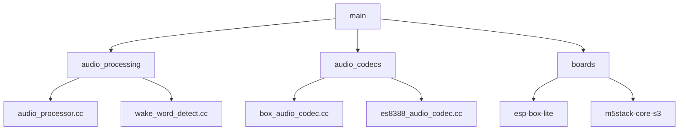
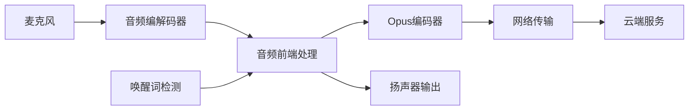
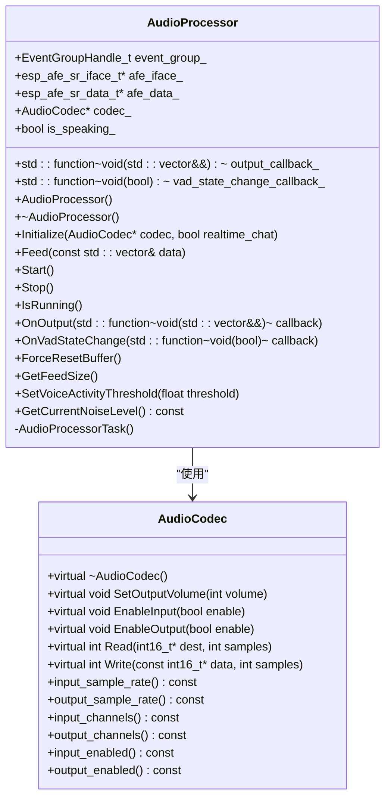
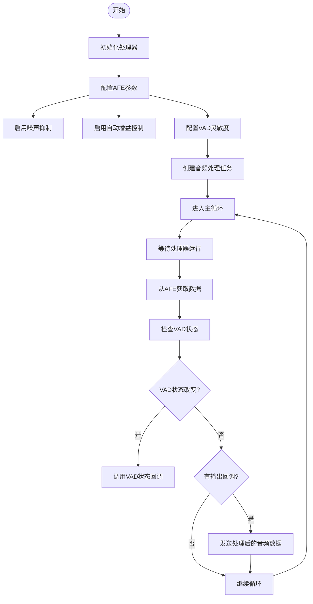
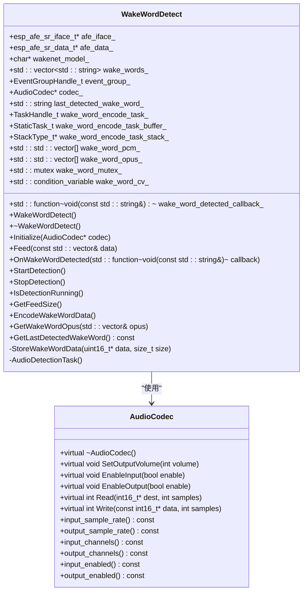
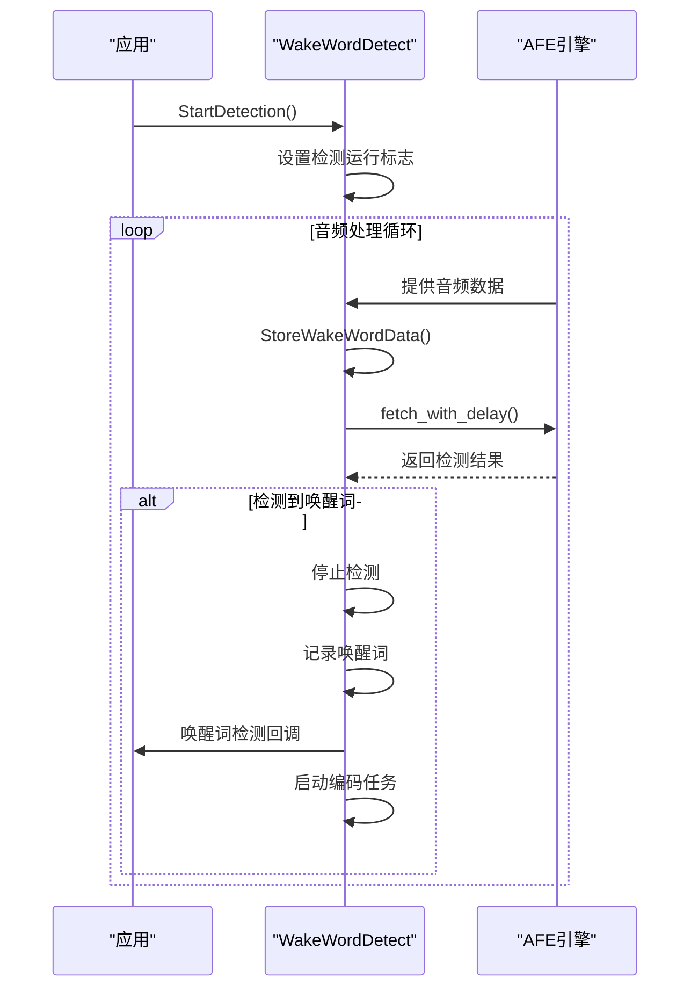
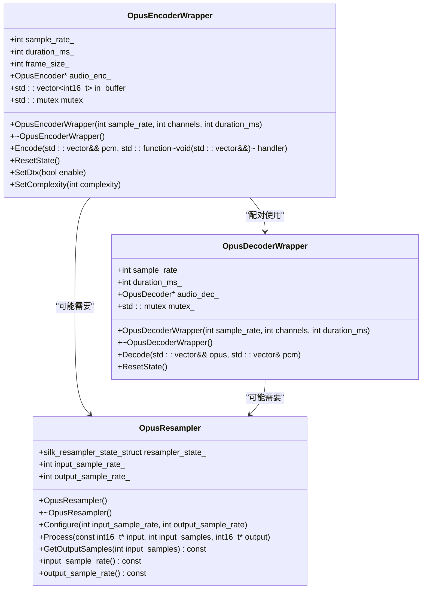
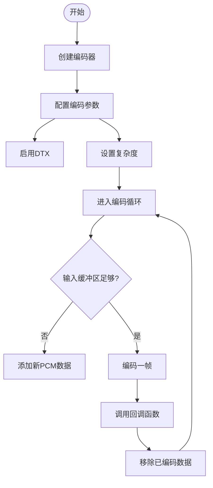
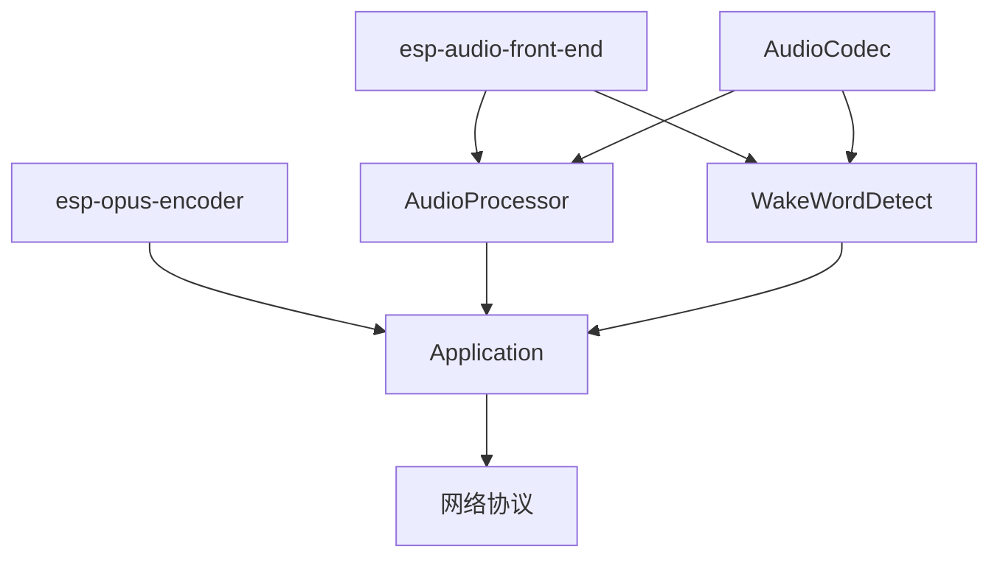

# 音频处理管道

<cite>
**本文档引用的文件**  
- [audio_processor.cc](file://main/audio_processing/audio_processor.cc)
- [audio_processor.h](file://main/audio_processing/audio_processor.h)
- [wake_word_detect.cc](file://main/audio_processing/wake_word_detect.cc)
- [wake_word_detect.h](file://main/audio_processing/wake_word_detect.h)
- [opus_encoder.cc](file://managed_components/78__esp-opus-encoder/opus_encoder.cc)
- [opus_resampler.cc](file://managed_components/78__esp-opus-encoder/opus_resampler.cc)
- [opus_resampler.h](file://managed_components/78__esp-opus-encoder/include/opus_resampler.h)
- [application.cc](file://main/application.cc)
- [box_audio_codec.cc](file://main/audio_codecs/box_audio_codec.cc)
</cite>

## 目录
1. [引言](#引言)
2. [项目结构](#项目结构)
3. [核心组件](#核心组件)
4. [架构概览](#架构概览)
5. [详细组件分析](#详细组件分析)
6. [依赖关系分析](#依赖关系分析)
7. [性能考量](#性能考量)
8. [故障排除指南](#故障排除指南)
9. [结论](#结论)

## 引言
本文档深入解析音频处理管道的实现，聚焦于`audio_processor.cc`中定义的数据流处理机制。文档将描述从麦克风采集到云端传输的完整音频流水线，包括原始PCM数据的缓冲管理、噪声抑制、增益控制、编码压缩（Opus）等处理阶段。同时，分析音频处理器与唤醒词检测模块的协同工作机制，以及多路音频流的调度逻辑。最后，提供性能调优建议和API使用示例。

## 项目结构
项目采用模块化设计，主要功能模块分布在`main`目录下。音频处理相关的核心代码位于`main/audio_processing`目录，包括音频处理器和唤醒词检测器。音频编解码器实现位于`main/audio_codecs`目录，支持多种硬件平台。音频数据的压缩编码依赖于外部组件`esp-opus-encoder`。

**Diagram sources**
- [main/audio_processing/audio_processor.cc](file://main/audio_processing/audio_processor.cc)
- [main/audio_codecs/box_audio_codec.cc](file://main/audio_codecs/box_audio_codec.cc)

**Section sources**
- [main/audio_processing/audio_processor.cc](file://main/audio_processing/audio_processor.cc)
- [main/audio_codecs/box_audio_codec.cc](file://main/audio_codecs/box_audio_codec.cc)

## 核心组件
音频处理管道的核心组件包括音频处理器（`AudioProcessor`）、唤醒词检测器（`WakeWordDetect`）和Opus编码器（`OpusEncoderWrapper`）。这些组件协同工作，完成从音频采集到网络传输的完整流程。

**Section sources**
- [main/audio_processing/audio_processor.cc](file://main/audio_processing/audio_processor.cc)
- [main/audio_processing/wake_word_detect.cc](file://main/audio_processing/wake_word_detect.cc)
- [managed_components/78__esp-opus-encoder/opus_encoder.cc](file://managed_components/78__esp-opus-encoder/opus_encoder.cc)

## 架构概览
系统采用分层架构，从硬件抽象层到应用逻辑层逐层封装。音频数据流从麦克风硬件开始，经过编解码器抽象层，进入音频处理层进行噪声抑制、回声消除等处理，最后通过编码压缩后发送到云端。

**Diagram sources**
- [main/audio_processing/audio_processor.cc](file://main/audio_processing/audio_processor.cc)
- [main/audio_processing/wake_word_detect.cc](file://main/audio_processing/wake_word_detect.cc)
- [managed_components/78__esp-opus-encoder/opus_encoder.cc](file://managed_components/78__esp-opus-encoder/opus_encoder.cc)

## 详细组件分析

### 音频处理器分析
`AudioProcessor`类负责管理音频数据的处理流程，包括噪声抑制、自动增益控制（AGC）和语音活动检测（VAD）。

#### 类图

**Diagram sources**
- [main/audio_processing/audio_processor.h](file://main/audio_processing/audio_processor.h)
- [main/audio_codecs/audio_codec.h](file://main/audio_codecs/audio_codec.h)

**Section sources**
- [main/audio_processing/audio_processor.cc](file://main/audio_processing/audio_processor.cc)
- [main/audio_processing/audio_processor.h](file://main/audio_processing/audio_processor.h)

#### 处理流程

**Diagram sources**
- [main/audio_processing/audio_processor.cc](file://main/audio_processing/audio_processor.cc)

### 唤醒词检测器分析
`WakeWordDetect`类负责检测预设的唤醒词，当检测到唤醒词时，会停止检测并通知上层应用。

#### 类图

**Diagram sources**
- [main/audio_processing/wake_word_detect.h](file://main/audio_processing/wake_word_detect.h)
- [main/audio_codecs/audio_codec.h](file://main/audio_codecs/audio_codec.h)

**Section sources**
- [main/audio_processing/wake_word_detect.cc](file://main/audio_processing/wake_word_detect.cc)
- [main/audio_processing/wake_word_detect.h](file://main/audio_processing/wake_word_detect.h)

#### 检测流程

**Diagram sources**
- [main/audio_processing/wake_word_detect.cc](file://main/audio_processing/wake_word_detect.cc)

### Opus编码器分析
`OpusEncoderWrapper`类封装了Opus编码库，提供异步编码功能。

#### 类图

**Diagram sources**
- [managed_components/78__esp-opus-encoder/opus_encoder.cc](file://managed_components/78__esp-opus-encoder/opus_encoder.cc)
- [managed_components/78__esp-opus-encoder/opus_resampler.cc](file://managed_components/78__esp-opus-encoder/opus_resampler.cc)

**Section sources**
- [managed_components/78__esp-opus-encoder/opus_encoder.cc](file://managed_components/78__esp-opus-encoder/opus_encoder.cc)
- [managed_components/78__esp-opus-encoder/opus_resampler.cc](file://managed_components/78__esp-opus-encoder/opus_resampler.cc)

#### 编码流程

**Diagram sources**
- [managed_components/78__esp-opus-encoder/opus_encoder.cc](file://managed_components/78__esp-opus-encoder/opus_encoder.cc)

## 依赖关系分析
系统各组件之间存在明确的依赖关系。音频处理器和唤醒词检测器都依赖于音频编解码器抽象层和AFE（音频前端）库。Opus编码器作为独立组件，被应用层直接调用。

**Diagram sources**
- [main/audio_processing/audio_processor.cc](file://main/audio_processing/audio_processor.cc)
- [main/audio_processing/wake_word_detect.cc](file://main/audio_processing/wake_word_detect.cc)
- [managed_components/78__esp-opus-encoder/opus_encoder.cc](file://managed_components/78__esp-opus-encoder/opus_encoder.cc)

**Section sources**
- [main/audio_processing/audio_processor.cc](file://main/audio_processing/audio_processor.cc)
- [main/audio_processing/wake_word_detect.cc](file://main/audio_processing/wake_word_detect.cc)

## 性能考量
### 缓冲区大小配置
音频处理管道中的缓冲区大小由AFE库自动配置，可以通过`GetFeedSize()`方法获取。典型配置如下：
- **输入缓冲区大小**: 320样本（20ms @ 16kHz）
- **输出缓冲区大小**: 320样本（20ms @ 16kHz）
- **Opus帧大小**: 480样本（30ms @ 16kHz）

### 处理优先级
关键任务的优先级配置：
- **音频处理任务**: 优先级3
- **编码任务**: 优先级2
- **检测任务**: 优先级3

### DMA中断配置
DMA中断周期通常设置为每10ms触发一次，以平衡CPU负载和音频延迟。

### 性能调优建议
1. **启用PSRAM**: 配置`memory_alloc_mode = AFE_MEMORY_ALLOC_MORE_PSRAM`以利用外部PSRAM
2. **调整VAD灵敏度**: 使用`SetVoiceActivityThreshold()`方法优化语音检测
3. **降低编码复杂度**: 在资源受限时，设置`SetComplexity(0)`以提高编码速度
4. **合理配置缓冲区**: 避免缓冲区过大导致延迟增加，过小导致数据丢失

**Section sources**
- [main/audio_processing/audio_processor.cc](file://main/audio_processing/audio_processor.cc)
- [managed_components/78__esp-opus-encoder/opus_encoder.cc](file://managed_components/78__esp-opus-encoder/opus_encoder.cc)

## 故障排除指南
### 常见问题
1. **音频失真**: 检查采样率是否匹配，确保重采样器正确配置
2. **高CPU占用**: 降低Opus编码复杂度或减少处理频率
3. **唤醒词检测不灵敏**: 调整VAD模式为`VAD_MODE_0`并启用AGC
4. **音频延迟过高**: 减小缓冲区大小或优化任务调度

### 调试技巧
1. 启用日志输出，监控`AudioProcessor`和`WakeWordDetect`的状态
2. 使用`GetCurrentNoiseLevel()`监控环境噪声水平
3. 检查事件组标志位，确认处理器和检测器的运行状态

**Section sources**
- [main/audio_processing/audio_processor.cc](file://main/audio_processing/audio_processor.cc)
- [main/audio_processing/wake_word_detect.cc](file://main/audio_processing/wake_word_detect.cc)

## 结论
本文档详细解析了音频处理管道的实现机制，涵盖了从硬件采集到云端传输的完整流程。通过分析`AudioProcessor`、`WakeWordDetect`和`OpusEncoderWrapper`等核心组件，揭示了系统的工作原理和优化策略。文档提供了详细的架构图、类图和流程图，帮助开发者深入理解系统设计。建议在实际应用中根据具体需求调整缓冲区大小、处理优先级和编码参数，以达到最佳的性能和用户体验。