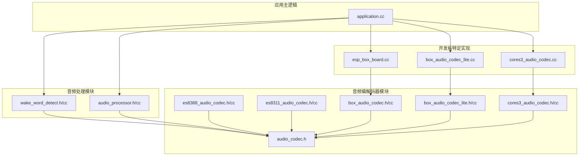
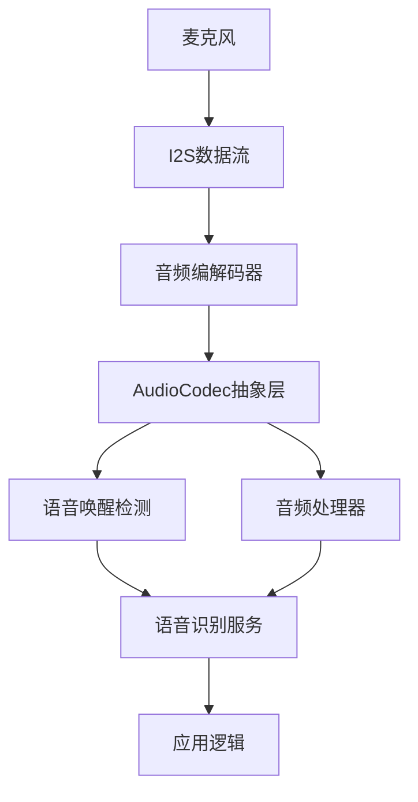
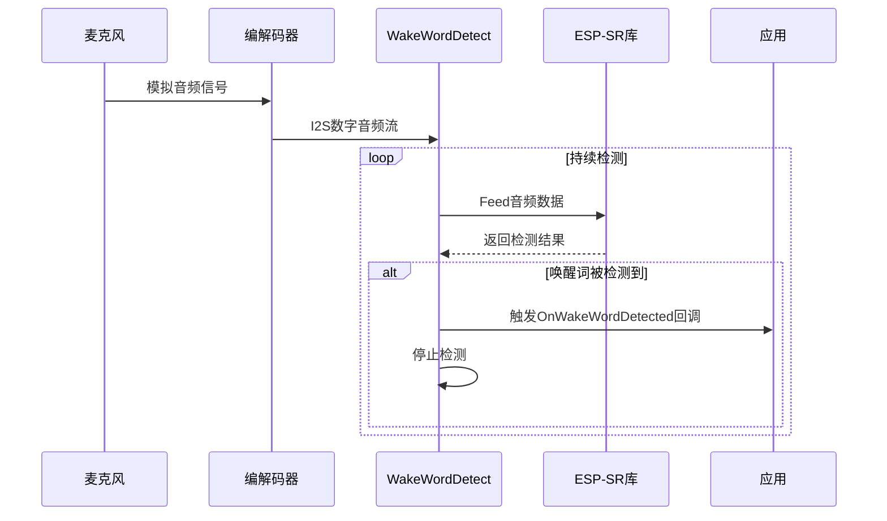
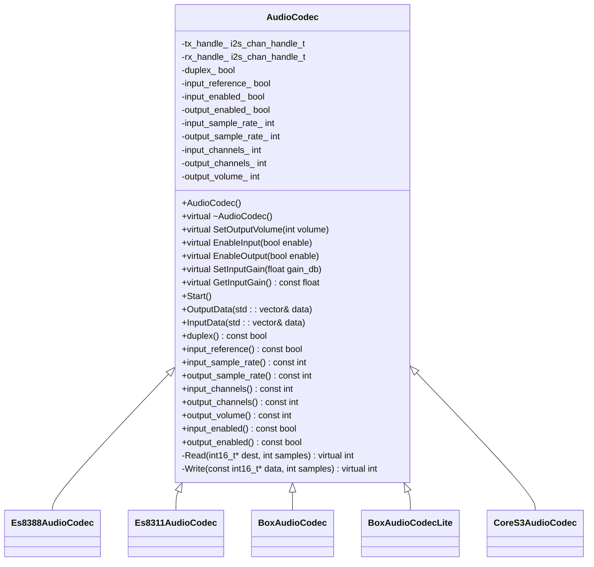
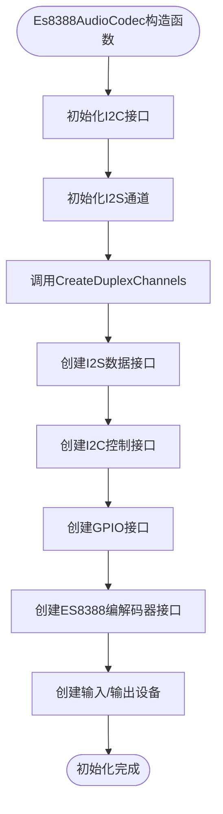
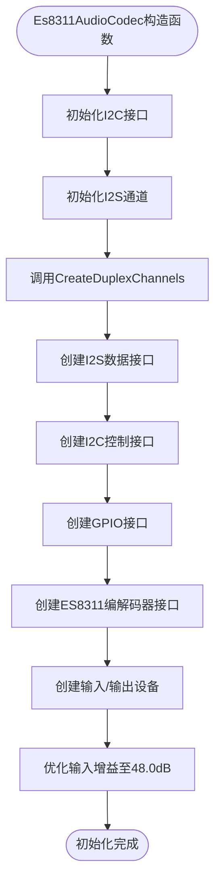
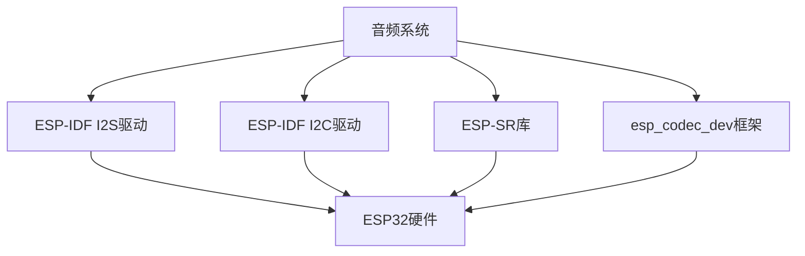

# 音频系统

<cite>
**本文档中引用的文件**   
- [wake_word_detect.h](file://main\audio_processing\wake_word_detect.h)
- [wake_word_detect.cc](file://main\audio_processing\wake_word_detect.cc)
- [audio_codec.h](file://main\audio_codecs\audio_codec.h)
- [es8388_audio_codec.h](file://main\audio_codecs\es8388_audio_codec.h)
- [es8388_audio_codec.cc](file://main\audio_codecs\es8388_audio_codec.cc)
- [es8311_audio_codec.h](file://main\audio_codecs\es8311_audio_codec.h)
- [es8311_audio_codec.cc](file://main\audio_codecs\es8311_audio_codec.cc)
- [application.cc](file://main\application.cc)
- [esp_box_board.cc](file://main\boards\esp-box\esp_box_board.cc)
- [box_audio_codec_lite.h](file://main\boards\esp-box-lite\box_audio_codec_lite.h)
- [box_audio_codec_lite.cc](file://main\boards\esp-box-lite\box_audio_codec_lite.cc)
- [cores3_audio_codec.h](file://main\boards\m5stack-core-s3\cores3_audio_codec.h)
- [cores3_audio_codec.cc](file://main\boards\m5stack-core-s3\cores3_audio_codec.cc)
- [audio_processor.h](file://main\audio_processing\audio_processor.h)
- [audio_processor.cc](file://main\audio_processing\audio_processor.cc)
- [abrobot-1.28tft-wifi.cc](file://main\boards\moon\abrobot-1.28tft-wifi.cc) - *更新了音频等待时间与任务堆栈*
</cite>

## 更新摘要
**已更新内容**   
- 根据提交 `8c2116a7b13875fc49989f6f59435a53b4c438d2` 更新了 **性能考虑** 和 **故障排除指南** 部分，以反映音频等待时间优化和任务堆栈调整。
- 新增了 **abrobot-1.28tft-wifi.cc** 文件作为文档引用源。
- 更新了 **性能考虑** 部分，强调了音频等待时间的减少和任务堆栈大小的调整。

## 目录
1. [引言](#引言)
2. [项目结构](#项目结构)
3. [核心组件](#核心组件)
4. [架构概述](#架构概述)
5. [详细组件分析](#详细组件分析)
6. [依赖分析](#依赖分析)
7. [性能考虑](#性能考虑)
8. [故障排除指南](#故障排除指南)
9. [结论](#结论)

## 引言
本文档全面介绍了音频系统的实现，重点是语音交互功能。文档详细解释了基于ESP-SR库的语音唤醒检测机制，包括其工作原理、灵敏度配置和低功耗优化策略。同时，文档深入分析了音频处理管道，从麦克风输入到音频编解码器的I2S数据流，再到语音识别服务的传输路径。此外，文档还阐述了音频编解码器的抽象设计，以及如何通过`audio_codec.h`中定义的通用接口被`es8388_audio_codec.h`等具体实现类继承。最后，文档提供了音频系统配置指南，并结合代码示例展示了如何在应用中启动语音唤醒监听。

## 项目结构
音频系统在项目中具有清晰的模块化结构，主要分为以下几个核心目录：
- `audio_codecs`: 包含所有音频编解码器的接口定义和具体实现。
- `audio_processing`: 包含音频处理逻辑，如语音唤醒检测和音频预处理。
- `boards`: 包含不同开发板的特定实现，其中包含了音频编解码器的初始化代码。
- `main`: 包含应用主逻辑，负责协调音频系统的各个组件。



**图源**
- [wake_word_detect.h](file://main\audio_processing\wake_word_detect.h)
- [audio_codec.h](file://main\audio_codecs\audio_codec.h)
- [es8388_audio_codec.h](file://main\audio_codecs\es8388_audio_codec.h)
- [es8311_audio_codec.h](file://main\audio_codecs\es8311_audio_codec.h)
- [box_audio_codec.h](file://main\audio_codecs\box_audio_codec.h)
- [box_audio_codec_lite.h](file://main\audio_codecs\box_audio_codec_lite.h)
- [cores3_audio_codec.h](file://main\boards\m5stack-core-s3\cores3_audio_codec.h)
- [esp_box_board.cc](file://main\boards\esp-box\esp_box_board.cc)
- [box_audio_codec_lite.cc](file://main\boards\esp-box-lite\box_audio_codec_lite.cc)
- [cores3_audio_codec.cc](file://main\boards\m5stack-core-s3\cores3_audio_codec.cc)
- [application.cc](file://main\application.cc)

**章节源**
- [wake_word_detect.h](file://main\audio_processing\wake_word_detect.h)
- [audio_codec.h](file://main\audio_codecs\audio_codec.h)
- [esp_box_board.cc](file://main\boards\esp-box\esp_box_board.cc)

## 核心组件
音频系统的核心组件包括语音唤醒检测模块、音频编解码器抽象层和具体的硬件适配器。`WakeWordDetect`类负责处理语音唤醒逻辑，`AudioCodec`类提供了与不同硬件编解码器交互的统一接口，而`Es8388AudioCodec`和`Es8311AudioCodec`等类则是针对特定硬件的具体实现。

**章节源**
- [wake_word_detect.h](file://main\audio_processing\wake_word_detect.h)
- [audio_codec.h](file://main\audio_codecs\audio_codec.h)
- [es8388_audio_codec.h](file://main\audio_codecs\es8388_audio_codec.h)
- [es8311_audio_codec.h](file://main\audio_codecs\es8311_audio_codec.h)

## 架构概述
音频系统采用分层架构，从硬件抽象到应用逻辑，各层职责分明。最底层是硬件编解码器，通过I2S接口与ESP32通信。中间层是`AudioCodec`抽象类，它为上层应用屏蔽了不同硬件的差异。上层是具体的音频处理模块，如`WakeWordDetect`，它们通过`AudioCodec`接口获取音频数据并进行处理。



**图源**
- [wake_word_detect.h](file://main\audio_processing\wake_word_detect.h)
- [audio_codec.h](file://main\audio_codecs\audio_codec.h)
- [application.cc](file://main\application.cc)

## 详细组件分析

### 语音唤醒检测分析
`WakeWordDetect`类是实现语音唤醒功能的核心。它利用ESP-SR库进行关键词检测，当检测到预设的唤醒词时，会触发回调函数。

#### 类图
```mermaid
classDiagram
class WakeWordDetect {
+WakeWordDetect()
+~WakeWordDetect()
+Initialize(AudioCodec* codec)
+Feed(const std : : vector<int16_t>& data)
+OnWakeWordDetected(std : : function<void(const std : : string& wake_word)> callback)
+StartDetection()
+StopDetection()
+IsDetectionRunning() bool
+GetFeedSize() size_t
+EncodeWakeWordData()
+GetWakeWordOpus(std : : vector<uint8_t>& opus) bool
+GetLastDetectedWakeWord() const std : : string&
-afe_iface_ esp_afe_sr_iface_t*
-afe_data_ esp_afe_sr_data_t*
-wakenet_model_ char*
-wake_words_ std : : vector<std : : string>
-event_group_ EventGroupHandle_t
-wake_word_detected_callback_ std : : function<void(const std : : string& wake_word)>
-codec_ AudioCodec*
-last_detected_wake_word_ std : : string
-wake_word_encode_task_ TaskHandle_t
-wake_word_encode_task_buffer_ StaticTask_t
-wake_word_encode_task_stack_ StackType_t*
-wake_word_pcm_ std : : list<std : : vector<int16_t>>
-wake_word_opus_ std : : list<std : : vector<uint8_t>>
-wake_word_mutex_ std : : mutex
-wake_word_cv_ std : : condition_variable
-StoreWakeWordData(uint16_t* data, size_t size)
-AudioDetectionTask()
}
```

**图源**
- [wake_word_detect.h](file://main\audio_processing\wake_word_detect.h)

#### 工作流程


**图源**
- [wake_word_detect.cc](file://main\audio_processing\wake_word_detect.cc)

**章节源**
- [wake_word_detect.h](file://main\audio_processing\wake_word_detect.h)
- [wake_word_detect.cc](file://main\audio_processing\wake_word_detect.cc)

### 音频编解码器抽象层分析
`AudioCodec`是一个抽象基类，定义了所有音频编解码器必须实现的接口。它提供了音量控制、输入/输出使能等通用功能，并通过纯虚函数`Read`和`Write`强制子类实现具体的I2S数据读写逻辑。

#### 类图


**图源**
- [audio_codec.h](file://main\audio_codecs\audio_codec.h)
- [es8388_audio_codec.h](file://main\audio_codecs\es8388_audio_codec.h)
- [es8311_audio_codec.h](file://main\audio_codecs\es8311_audio_codec.h)
- [box_audio_codec.h](file://main\audio_codecs\box_audio_codec.h)
- [box_audio_codec_lite.h](file://main\audio_codecs\box_audio_codec_lite.h)
- [cores3_audio_codec.h](file://main\boards\m5stack-core-s3\cores3_audio_codec.h)

**章节源**
- [audio_codec.h](file://main\audio_codecs\audio_codec.h)

### 不同音频编解码器的适配策略
系统通过继承`AudioCodec`抽象类来适配不同的硬件编解码器。每个具体实现类（如`Es8388AudioCodec`）负责初始化其特定的I2C和I2S配置，并实现`Read`和`Write`方法。

#### ES8388编解码器
`Es8388AudioCodec`是针对ES8388芯片的具体实现。它在构造函数中完成I2C和I2S通道的初始化，并通过`CreateDuplexChannels`方法配置双工通信。



**图源**
- [es8388_audio_codec.cc](file://main\audio_codecs\es8388_audio_codec.cc)

#### ES8311编解码器
`Es8311AudioCodec`是针对ES8311芯片的实现。与ES8388类似，它也继承自`AudioCodec`，但其内部配置和寄存器设置有所不同。一个显著的优化是，它支持动态调整输入增益（`SetInputGain`），这对于改善语音识别率非常有帮助。



**图源**
- [es8311_audio_codec.cc](file://main\audio_codecs\es8311_audio_codec.cc)

**章节源**
- [es8388_audio_codec.h](file://main\audio_codecs\es8388_audio_codec.h)
- [es8388_audio_codec.cc](file://main\audio_codecs\es8388_audio_codec.cc)
- [es8311_audio_codec.h](file://main\audio_codecs\es8311_audio_codec.h)
- [es8311_audio_codec.cc](file://main\audio_codecs\es8311_audio_codec.cc)

### 音频系统配置指南
音频系统的配置主要涉及采样率、声道数和增益等参数。这些参数通常在开发板的初始化代码中设置。

#### 关键配置参数
- **采样率**: 输入和输出的采样率，通常设置为16000Hz或48000Hz。
- **声道数**: 输入和输出的声道数，单声道为1，立体声为2。
- **增益**: 输入增益，用于调整麦克风的灵敏度。
- **音量**: 输出音量，用于控制扬声器的音量。

#### 配置示例
在`esp_box_board.cc`中，`GetAudioCodec`方法创建了一个`BoxAudioCodec`实例，并传入了以下配置参数：
- `AUDIO_INPUT_SAMPLE_RATE`: 输入采样率
- `AUDIO_OUTPUT_SAMPLE_RATE`: 输出采样率
- `AUDIO_INPUT_REFERENCE`: 是否使用参考输入进行回声消除

```c++
virtual AudioCodec* GetAudioCodec() override {
    static BoxAudioCodec audio_codec(
        i2c_bus_, 
        AUDIO_INPUT_SAMPLE_RATE, 
        AUDIO_OUTPUT_SAMPLE_RATE,
        AUDIO_I2S_GPIO_MCLK, 
        AUDIO_I2S_GPIO_BCLK, 
        AUDIO_I2S_GPIO_WS, 
        AUDIO_I2S_GPIO_DOUT, 
        AUDIO_I2S_GPIO_DIN,
        AUDIO_CODEC_PA_PIN, 
        AUDIO_CODEC_ES8311_ADDR, 
        AUDIO_CODEC_ES7210_ADDR, 
        AUDIO_INPUT_REFERENCE);
    return &audio_codec;
}
```

**章节源**
- [esp_box_board.cc](file://main\boards\esp-box\esp_box_board.cc)

### 在应用中启动语音唤醒监听
在应用中启动语音唤醒监听需要以下几个步骤：
1. 获取音频编解码器实例。
2. 初始化`WakeWordDetect`对象。
3. 设置唤醒词检测到的回调函数。
4. 启动检测。

#### 代码示例
```c++
// 在Application::Start()中初始化
auto codec = board.GetAudioCodec();
// ... 其他初始化代码 ...
codec->Start();

// 初始化语音唤醒检测
wake_word_detect_.Initialize(codec);
wake_word_detect_.OnWakeWordDetected([this](const std::string& wake_word) {
    ESP_LOGI(TAG, "检测到唤醒词: %s", wake_word.c_str());
    // 处理唤醒事件，例如开始语音识别
});
wake_word_detect_.StartDetection();

// 在主循环中持续喂入音频数据
void Application::OnAudioInput() {
    std::vector<int16_t> data;
    ReadAudio(data, 16000, wake_word_detect_.GetFeedSize());
    wake_word_detect_.Feed(data);
}
```

**章节源**
- [application.cc](file://main\application.cc)

## 依赖分析
音频系统依赖于多个外部库和组件，包括ESP-IDF的I2S和I2C驱动、ESP-SR语音识别库以及`esp_codec_dev`设备驱动框架。这些依赖关系通过头文件包含和链接库的方式建立。



**图源**
- [wake_word_detect.h](file://main\audio_processing\wake_word_detect.h)
- [audio_codec.h](file://main\audio_codecs\audio_codec.h)
- [es8388_audio_codec.h](file://main\audio_codecs\es8388_audio_codec.h)
- [es8311_audio_codec.h](file://main\audio_codecs\es8311_audio_codec.h)

## 性能考虑
音频系统的性能优化主要体现在以下几个方面：
- **内存使用**: `StoreWakeWordData`方法通过限制缓存大小来降低内存使用。
- **编码速度**: `EncodeWakeWordData`方法将Opus编码器的复杂度设置为0，以获得最快的编码速度。
- **任务调度**: 音频处理任务被固定绑定到Core 1，并使用最高优先级，以确保实时性。
- **响应速度**: 根据提交 `8c2116a7b13875fc49989f6f59435a53b4c438d2`，通过减少音频等待时间来提升响应速度。
- **内存效率**: 通过调整任务堆栈大小来提升内存使用效率。

**章节源**
- [wake_word_detect.cc](file://main\audio_processing\wake_word_detect.cc)
- [abrobot-1.28tft-wifi.cc](file://main\boards\moon\abrobot-1.28tft-wifi.cc)

## 故障排除指南
- **问题**: 无法检测到唤醒词。
  - **检查**: 确认麦克风连接正确，输入增益设置合理，唤醒词模型已正确加载。
- **问题**: 音频输出失真。
  - **检查**: 确认采样率匹配，输出音量未设置过高。
- **问题**: 系统内存不足。
  - **检查**: 减少音频缓冲区大小，优化内存分配策略。
- **问题**: 音频响应延迟。
  - **检查**: 确认音频等待时间已根据最新代码进行优化，避免不必要的延迟。

**章节源**
- [wake_word_detect.cc](file://main\audio_processing\wake_word_detect.cc)
- [application.cc](file://main\application.cc)
- [abrobot-1.28tft-wifi.cc](file://main\boards\moon\abrobot-1.28tft-wifi.cc)

## 结论
本文档详细介绍了音频系统的架构和实现细节。通过分层设计和抽象接口，系统能够灵活地支持多种硬件编解码器。语音唤醒检测功能通过高效的算法和优化的配置，实现了低功耗和高灵敏度。开发者可以参考本文档中的配置指南和代码示例，快速集成和定制音频功能。