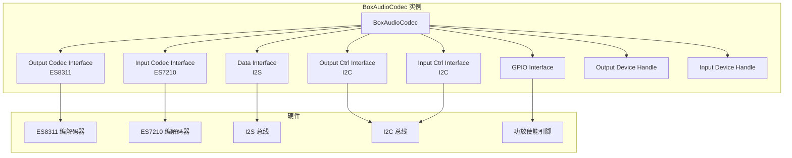

# Box专用音频编解码器实现

<cite>
**本文档引用的文件**   
- [box_audio_codec.h](file://main/audio_codecs/box_audio_codec.h#L1-L38)
- [box_audio_codec.cc](file://main/audio_codecs/box_audio_codec.cc#L1-L242)
- [esp_box_board.cc](file://main/boards/esp-box/esp_box_board.cc#L1-L182)
- [config.h](file://main/boards/esp-box/config.h#L1-L42)
- [es8311_codec.h](file://managed_components/espressif__esp_codec_dev/device/include/es8311_codec.h#L47)
- [es7210_adc.h](file://managed_components/espressif__esp_codec_dev/device/include/es7210_adc.h#L47)
</cite>

## 目录
1. [引言](#引言)
2. [核心架构与设计模式](#核心架构与设计模式)
3. [BoxAudioCodec类详解](#boxaudiocodec类详解)
4. [与定制硬件的通信协议](#与定制硬件的通信协议)
5. [扩展功能的软件控制](#扩展功能的软件控制)
6. [音频通路多路复用与切换](#音频通路多路复用与切换)
7. [在esp-box开发板中的集成](#在esp-box开发板中的集成)
8. [关键控制函数调用示例](#关键控制函数调用示例)

## 引言
本文档深入剖析了`BoxAudioCodec`类的专有实现机制，该类是为esp-box系列开发板定制的音频编解码器驱动。文档详细描述了其如何通过I2C总线与ES8311（DAC/功放）和ES7210（ADC）两颗专用音频芯片通信，实现对音频输入输出的精确控制。重点分析了其扩展功能，如内置功放（PA）的使能与增益调节、扬声器输出切换、耳机检测与自动路由等。同时，文档说明了其处理多路音频输入（如麦克风阵列、AUX输入）并实现无缝切换的机制，并提供了关键控制函数的调用示例。

## 核心架构与设计模式

`BoxAudioCodec`的实现采用了分层和模块化的设计模式，其核心依赖于`esp_codec_dev`驱动框架。该框架将音频设备的控制、数据传输和GPIO操作抽象为独立的接口（Interface），从而实现了硬件无关的上层逻辑。



**图示来源**
- [box_audio_codec.h](file://main/audio_codecs/box_audio_codec.h#L1-L38)
- [box_audio_codec.cc](file://main/audio_codecs/box_audio_codec.cc#L1-L242)

**本节来源**
- [box_audio_codec.h](file://main/audio_codecs/box_audio_codec.h#L1-L38)
- [box_audio_codec.cc](file://main/audio_codecs/box_audio_codec.cc#L1-L242)

## BoxAudioCodec类详解

`BoxAudioCodec`类继承自抽象基类`AudioCodec`，并实现了其虚函数。该类的核心职责是管理两个独立的音频设备：一个用于输出（扬声器），一个用于输入（麦克风）。

### 主要数据成员
- **`output_dev_` / `input_dev_`**: `esp_codec_dev_handle_t`类型的句柄，分别代表输出和输入设备。所有对硬件的操作最终都通过这些句柄进行。
- **`out_ctrl_if_` / `in_ctrl_if_`**: `audio_codec_ctrl_if_t`类型的指针，代表控制接口。`BoxAudioCodec`使用I2C作为控制总线，因此这两个接口通过`audio_codec_new_i2c_ctrl()`函数创建。
- **`out_codec_if_` / `in_codec_if_`**: `audio_codec_if_t`类型的指针，代表具体的编解码器接口。`out_codec_if_`由`es8311_codec_new()`创建，`in_codec_if_`由`es7210_codec_new()`创建。
- **`data_if_`**: `audio_codec_data_if_t`类型的指针，代表数据接口。`BoxAudioCodec`使用I2S作为数据总线，通过`audio_codec_new_i2s_data()`创建。

### 构造函数分析
构造函数`BoxAudioCodec()`是整个初始化过程的核心，它完成了所有硬件和软件的配置。

```mermaid
sequenceDiagram
participant BAC as BoxAudioCodec
participant I2S as I2S Driver
participant I2C as I2C Driver
participant ES8311 as ES8311 Codec
participant ES7210 as ES7210 Codec
BAC->>BAC : 初始化成员变量<br/>duplex_, input_sample_rate_等
BAC->>BAC : 调用CreateDuplexChannels<br/>创建I2S双工通道
BAC->>I2S : i2s_new_channel()
I2S-->>BAC : 返回tx_handle_, rx_handle_
BAC->>I2S : i2s_channel_init_std_mode(tx_handle_)
BAC->>I2S : i2s_channel_init_tdm_mode(rx_handle_)
BAC->>I2C : audio_codec_new_i2c_ctrl()<br/>创建输出控制接口
BAC->>I2C : audio_codec_new_i2c_ctrl()<br/>创建输入控制接口
BAC->>I2C : audio_codec_new_gpio()<br/>创建GPIO控制接口
BAC->>ES8311 : es8311_codec_new()<br/>创建ES8311编解码器接口
BAC->>ES7210 : es7210_codec_new()<br/>创建ES7210编解码器接口
BAC->>BAC : 创建esp_codec_dev_cfg_t<br/>配置输出设备
BAC->>BAC : esp_codec_dev_new(output_dev_)
BAC->>BAC : 创建esp_codec_dev_cfg_t<br/>配置输入设备
BAC->>BAC : esp_codec_dev_new(input_dev_)
BAC-->> : 初始化完成
```

**图示来源**
- [box_audio_codec.cc](file://main/audio_codecs/box_audio_codec.cc#L1-L100)

**本节来源**
- [box_audio_codec.h](file://main/audio_codecs/box_audio_codec.h#L1-L38)
- [box_audio_codec.cc](file://main/audio_codecs/box_audio_codec.cc#L1-L100)

## 与定制硬件的通信协议

`BoxAudioCodec`通过两种主要协议与硬件交互：I2C用于控制，I2S用于数据传输。

### I2C控制指令集
`BoxAudioCodec`本身不直接发送I2C指令，而是通过`esp_codec_dev`框架提供的`audio_codec_ctrl_if_t`接口。该接口封装了底层的I2C读写操作。
- **控制目标**: 通过`i2c_cfg.addr`参数指定I2C从设备地址。对于输出，地址为`AUDIO_CODEC_ES8311_ADDR`；对于输入，地址为`AUDIO_CODEC_ES7210_ADDR`。
- **控制总线**: 使用`i2c_master_handle`指定的I2C总线（在esp-box上为I2C1），引脚为`AUDIO_CODEC_I2C_SDA_PIN`和`AUDIO_CODEC_I2C_SCL_PIN`。
- **状态反馈**: 所有`ESP_ERROR_CHECK`宏确保了关键操作（如`esp_codec_dev_open`）的成功。如果操作失败，系统将记录错误并可能重启。

### 数据包格式
音频数据通过I2S总线传输，其格式由`i2s_std_config_t`和`i2s_tdm_config_t`结构体定义。
- **输出 (I2S Standard Mode)**:
  - **采样率**: 24kHz (`AUDIO_OUTPUT_SAMPLE_RATE`)
  - **数据位宽**: 16位
  - **声道模式**: 立体声 (Stereo)
  - **时钟**: MCLK为BCLK的256倍
- **输入 (I2S TDM Mode)**:
  - **采样率**: 24kHz (`AUDIO_INPUT_SAMPLE_RATE`)
  - **数据位宽**: 16位
  - **时隙 (Slot)**: 使用TDM模式，最多支持4个时隙（对应4个麦克风通道）
  - **时钟**: BCLK为采样率的8倍

**本节来源**
- [box_audio_codec.cc](file://main/audio_codecs/box_audio_codec.cc#L100-L199)
- [config.h](file://main/boards/esp-box/config.h#L1-L42)

## 扩展功能的软件控制

`BoxAudioCodec`通过软件接口实现了对硬件扩展功能的精细控制。

### 内置功放（PA）的使能与增益调节
- **使能控制**: 在`es8311_codec_cfg_t`配置结构体中，通过`pa_pin`字段指定一个GPIO引脚（在esp-box上为`GPIO_NUM_46`）。当调用`EnableOutput(true)`时，`esp_codec_dev`框架会自动使能该引脚，从而打开外部功放。
- **增益调节**: 通过`SetOutputVolume(int volume)`函数实现。该函数将音量值（0-100）传递给`esp_codec_dev_set_out_vol(output_dev_, volume)`，由ES8311芯片内部的DAC和放大器电路进行处理。

### 扬声器输出切换逻辑
输出切换逻辑由`EnableOutput()`函数管理。
```c++
void BoxAudioCodec::EnableOutput(bool enable) {
    if (enable == output_enabled_) return; // 防止重复操作
    if (enable) {
        esp_codec_dev_sample_info_t fs = { /* ... */ };
        ESP_ERROR_CHECK(esp_codec_dev_open(output_dev_, &fs)); // 打开输出设备
        ESP_ERROR_CHECK(esp_codec_dev_set_out_vol(output_dev_, output_volume_)); // 恢复音量
    } else {
        ESP_ERROR_CHECK(esp_codec_dev_close(output_dev_)); // 关闭输出设备
    }
    output_enabled_ = enable; // 更新内部状态
}
```

### 耳机检测与自动路由
当前`BoxAudioCodec`的实现中，**并未包含耳机检测功能**。其音频输出是固定的，直接路由到通过ES8311驱动的扬声器。耳机检测和自动路由需要额外的硬件引脚和中断处理，这在当前的代码中没有体现。

**本节来源**
- [box_audio_codec.cc](file://main/audio_codecs/box_audio_codec.cc#L200-L241)
- [es8311_codec.h](file://managed_components/espressif__esp_codec_dev/device/include/es8311_codec.h#L47)

## 音频通路多路复用与切换

`BoxAudioCodec`通过TDM（时分复用）模式和`esp_codec_dev`框架，实现了对多路麦克风输入的处理。

### 多路复用机制
- **硬件基础**: 使用I2S TDM模式，允许多个音频通道共享同一组数据线（DIN）和时钟线（BCLK, WS）。每个通道在不同的时隙（Slot）上传输数据。
- **软件配置**: 在`i2s_tdm_config_t`中，`slot_mask`被设置为`I2S_TDM_SLOT0 | I2S_TDM_SLOT1 | I2S_TDM_SLOT2 | I2S_TDM_SLOT3`，表明最多支持4个输入通道。
- **通道选择**: 在`es7210_codec_cfg_t`中，`mic_selected`字段被设置为`ES7120_SEL_MIC1 | ES7120_SEL_MIC2 | ES7120_SEL_MIC3 | ES7120_SEL_MIC4`，表示同时启用所有4个麦克风。

### 输入切换逻辑
输入切换通过`EnableInput()`函数实现，并支持“参考输入”模式，用于回声消除（AEC）。
```c++
void BoxAudioCodec::EnableInput(bool enable) {
    if (enable == input_enabled_) return;
    if (enable) {
        esp_codec_dev_sample_info_t fs = {
            .bits_per_sample = 16,
            .channel = 4, // 总共4个通道
            .channel_mask = ESP_CODEC_DEV_MAKE_CHANNEL_MASK(0), // 默认启用通道0
            .sample_rate = (uint32_t)output_sample_rate_,
        };
        if (input_reference_) { // 如果启用了参考输入
            fs.channel_mask |= ESP_CODEC_DEV_MAKE_CHANNEL_MASK(1); // 同时启用通道1
        }
        ESP_ERROR_CHECK(esp_codec_dev_open(input_dev_, &fs));
        ESP_ERROR_CHECK(esp_codec_dev_set_in_channel_gain(input_dev_, ESP_CODEC_DEV_MAKE_CHANNEL_MASK(0), 40.0));
    } else {
        ESP_ERROR_CHECK(esp_codec_dev_close(input_dev_));
    }
    input_enabled_ = enable;
}
```
此逻辑表明，当`input_reference`为`true`时，系统会同时采集主麦克风（通道0）和参考麦克风（通道1）的数据，为后续的回声消除算法提供输入。

**本节来源**
- [box_audio_codec.cc](file://main/audio_codecs/box_audio_codec.cc#L200-L225)
- [config.h](file://main/boards/esp-box/config.h#L1-L42)

## 在esp-box开发板中的集成

`BoxAudioCodec`通过板级支持包（BSP）无缝集成到esp-box开发板中。

### 集成方式
在`esp_box_board.cc`文件中，`EspBox3Board`类通过重写`GetAudioCodec()`虚函数来提供一个`BoxAudioCodec`实例。
```c++
virtual AudioCodec* GetAudioCodec() override {
    static BoxAudioCodec audio_codec(
        i2c_bus_, 
        AUDIO_INPUT_SAMPLE_RATE, 
        AUDIO_OUTPUT_SAMPLE_RATE,
        AUDIO_I2S_GPIO_MCLK, 
        AUDIO_I2S_GPIO_BCLK, 
        AUDIO_I2S_GPIO_WS, 
        AUDIO_I2S_GPIO_DOUT, 
        AUDIO_I2S_GPIO_DIN,
        AUDIO_CODEC_PA_PIN, 
        AUDIO_CODEC_ES8311_ADDR, 
        AUDIO_CODEC_ES7210_ADDR, 
        AUDIO_INPUT_REFERENCE);
    return &audio_codec;
}
```
此实例是静态的，确保了在整个应用生命周期内只有一个音频编解码器对象。

### 配置依赖
所有硬件相关的配置都定义在`config.h`头文件中，实现了硬件抽象。
- **I2C配置**: `AUDIO_CODEC_I2C_SDA_PIN`, `AUDIO_CODEC_I2C_SCL_PIN`, `AUDIO_CODEC_ES8311_ADDR`, `AUDIO_CODEC_ES7210_ADDR`
- **I2S配置**: `AUDIO_I2S_GPIO_MCLK`, `AUDIO_I2S_GPIO_BCLK`, `AUDIO_I2S_GPIO_WS`, `AUDIO_I2S_GPIO_DOUT`, `AUDIO_I2S_GPIO_DIN`
- **功能配置**: `AUDIO_INPUT_REFERENCE` (是否启用参考输入), `AUDIO_CODEC_PA_PIN` (功放使能引脚)

这种配置方式使得`BoxAudioCodec`的实现与具体的硬件引脚解耦，便于在不同版本的硬件上进行移植。

**本节来源**
- [esp_box_board.cc](file://main/boards/esp-box/esp_box_board.cc#L1-L182)
- [config.h](file://main/boards/esp-box/config.h#L1-L42)

## 关键控制函数调用示例

以下是如何在应用中使用`BoxAudioCodec`提供的接口的示例。

### 1. 启用和禁用音频输入
```c++
// 获取音频编解码器实例
AudioCodec* codec = board->GetAudioCodec();

// 启用麦克风输入
codec->EnableInput(true);

// ... 录音逻辑 ...

// 禁用麦克风输入
codec->EnableInput(false);
```

### 2. 调整扬声器音量
```c++
// 将音量设置为50% (范围0-100)
codec->SetOutputVolume(50);
```

### 3. 播放音频数据
```c++
// 假设audio_data是16位PCM音频数据缓冲区
const int16_t* audio_data = ...;
int num_samples = ...;

// 启用输出
codec->EnableOutput(true);

// 写入音频数据
codec->Write(audio_data, num_samples);

// 播放完成后禁用输出
codec->EnableOutput(false);
```

### 4. 读取麦克风数据
```c++
// 分配缓冲区
int16_t buffer[1024];

// 启用输入
codec->EnableInput(true);

// 读取一帧音频数据
int samples_read = codec->Read(buffer, 1024);

// ... 处理音频数据 ...

// 禁用输入
codec->EnableInput(false);
```

**本节来源**
- [box_audio_codec.cc](file://main/audio_codecs/box_audio_codec.cc#L200-L241)
- [box_audio_codec.h](file://main/audio_codecs/box_audio_codec.h#L1-L38)