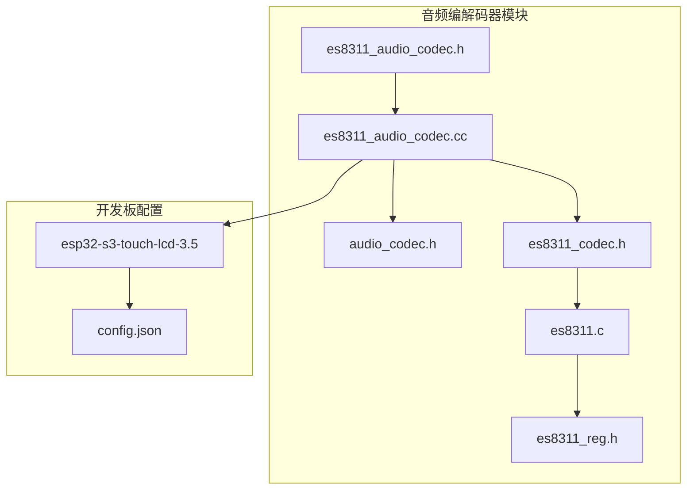
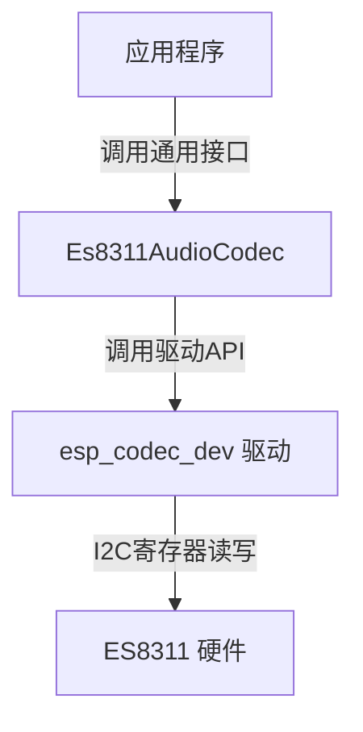
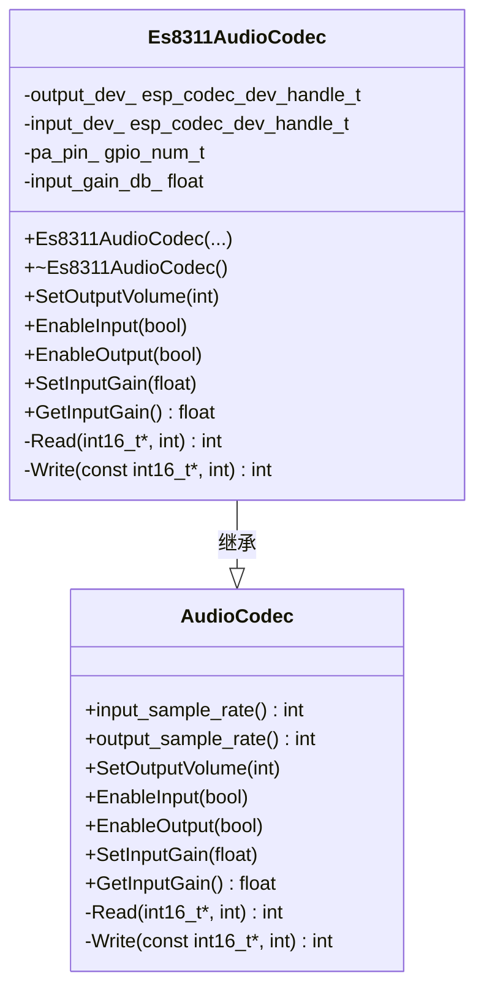
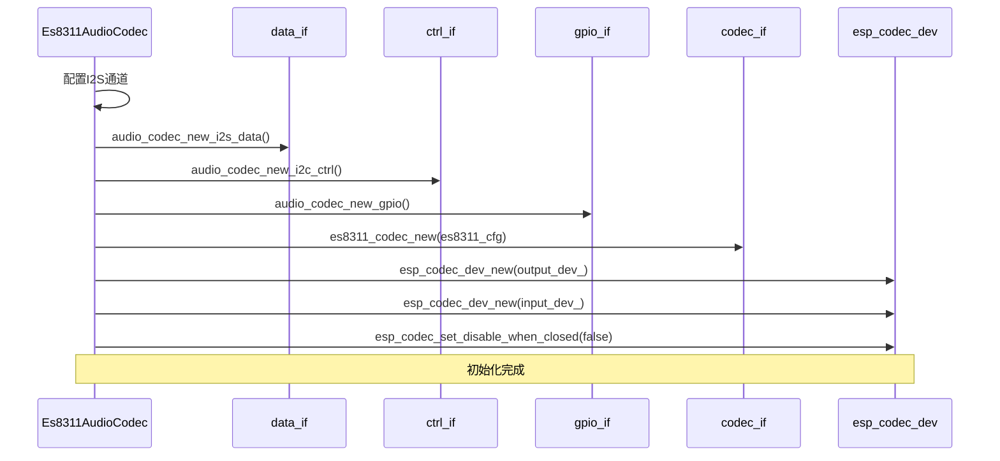
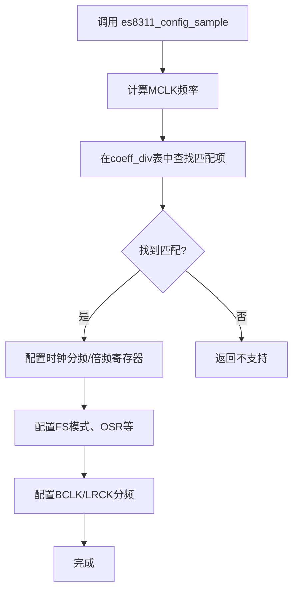
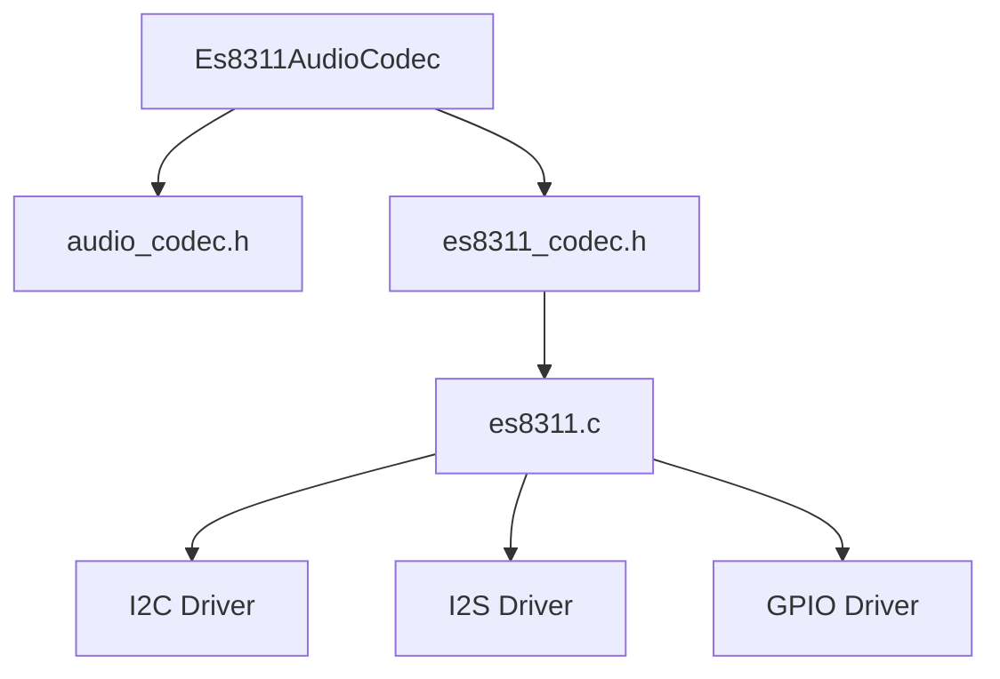

# ES8311音频编解码器实现

<cite>
**本文档引用的文件**   
- [es8311_audio_codec.h](file://main/audio_codecs/es8311_audio_codec.h)
- [es8311_audio_codec.cc](file://main/audio_codecs/es8311_audio_codec.cc)
- [audio_codec.h](file://main/audio_codecs/audio_codec.h)
- [es8311.c](file://managed_components/espressif__esp_codec_dev/device/es8311/es8311.c)
- [es8311_reg.h](file://managed_components/espressif__esp_codec_dev/device/es8311/es8311_reg.h)
- [es8311_codec.h](file://managed_components/espressif__esp_codec_dev/device/include/es8311_codec.h)
- [config.json](file://main/boards/esp32-s3-touch-lcd-3.5/config.json)
</cite>

## 目录
1. [项目结构](#项目结构)
2. [核心组件](#核心组件)
3. [架构概述](#架构概述)
4. [详细组件分析](#详细组件分析)
5. [依赖分析](#依赖分析)
6. [性能考量](#性能考量)
7. [故障排除指南](#故障排除指南)
8. [结论](#结论)

## 项目结构
项目采用模块化分层架构，将音频编解码器实现独立于主应用逻辑。核心音频功能位于`main/audio_codecs/`目录下，其中`es8311_audio_codec.cc`和`es8311_audio_codec.h`文件专门负责ES8311编解码器的封装。该实现依赖于ESP-IDF的`esp_codec_dev`组件，其底层驱动位于`managed_components/espressif__esp_codec_dev/device/es8311/`路径下，包含`es8311.c`、`es8311_reg.h`和`es8311_codec.h`等文件。通用的`AudioCodec`抽象基类定义在`audio_codec.h`中，为所有编解码器提供统一接口。特定开发板如`esp32-s3-touch-lcd-3.5`通过其`config.json`进行配置，表明该编解码器可被集成到具体硬件平台。



**图示来源**
- [es8311_audio_codec.h](file://main/audio_codecs/es8311_audio_codec.h)
- [es8311_audio_codec.cc](file://main/audio_codecs/es8311_audio_codec.cc)
- [audio_codec.h](file://main/audio_codecs/audio_codec.h)
- [es8311_codec.h](file://managed_components/espressif__esp_codec_dev/device/include/es8311_codec.h)
- [es8311.c](file://managed_components/espressif__esp_codec_dev/device/es8311/es8311.c)
- [es8311_reg.h](file://managed_components/espressif__esp_codec_dev/device/es8311/es8311_reg.h)
- [config.json](file://main/boards/esp32-s3-touch-lcd-3.5/config.json)

**本节来源**
- [es8311_audio_codec.h](file://main/audio_codecs/es8311_audio_codec.h)
- [es8311_audio_codec.cc](file://main/audio_codecs/es8311_audio_codec.cc)
- [es8311.c](file://managed_components/espressif__esp_codec_dev/device/es8311/es8311.c)
- [config.json](file://main/boards/esp32-s3-touch-lcd-3.5/config.json)

## 核心组件
ES8311音频编解码器的核心组件由一个C++封装类`Es8311AudioCodec`构成，该类继承自通用的`AudioCodec`基类。它通过调用底层`esp_codec_dev`驱动库的C语言API来实现对硬件的控制。`Es8311AudioCodec`负责管理I2C控制接口、I2S数据接口和GPIO接口，并将这些底层操作抽象为高级的音量控制、输入/输出使能等方法。其核心功能依赖于`managed_components`中的`es8311_codec_new`函数创建的`audio_codec_if_t`接口实例，该实例封装了所有与ES8311芯片通信的底层逻辑，包括寄存器读写、采样率配置和电源管理。

**本节来源**
- [es8311_audio_codec.h](file://main/audio_codecs/es8311_audio_codec.h#L10-L25)
- [es8311_audio_codec.cc](file://main/audio_codecs/es8311_audio_codec.cc#L10-L30)
- [es8311_codec.h](file://managed_components/espressif__esp_codec_dev/device/include/es8311_codec.h#L20-L35)

## 架构概述
整个音频系统采用分层架构。顶层是应用代码，它通过`AudioCodec`的通用接口与编解码器交互。中间层是`Es8311AudioCodec`类，它作为适配器，将通用接口调用转换为对ESP-IDF `esp_codec_dev`驱动的具体调用。底层是`esp_codec_dev`提供的`es8311.c`驱动，它直接通过I2C总线操作ES8311芯片的寄存器，实现精确的硬件控制。这种架构实现了硬件抽象，使得上层应用无需关心底层细节，同时保证了代码的可移植性和可维护性。



**图示来源**
- [es8311_audio_codec.h](file://main/audio_codecs/es8311_audio_codec.h)
- [es8311_audio_codec.cc](file://main/audio_codecs/es8311_audio_codec.cc)
- [es8311.c](file://managed_components/espressif__esp_codec_dev/device/es8311/es8311.c)

## 详细组件分析

### Es8311AudioCodec 类分析
`Es8311AudioCodec`类是ES8311编解码器在C++层面的实现。它通过私有成员`ctrl_if_`、`data_if_`、`gpio_if_`和`codec_if_`来管理与底层驱动的连接。

#### 类图


**图示来源**
- [es8311_audio_codec.h](file://main/audio_codecs/es8311_audio_codec.h#L10-L42)
- [audio_codec.h](file://main/audio_codecs/audio_codec.h#L15-L58)

#### 构造函数与初始化流程
`Es8311AudioCodec`的构造函数是初始化的核心。它首先配置I2S通道，然后创建数据、控制和GPIO接口，最后使用`es8311_codec_new`函数创建编解码器接口实例，并据此创建输入和输出设备句柄。



**图示来源**
- [es8311_audio_codec.cc](file://main/audio_codecs/es8311_audio_codec.cc#L10-L90)

**本节来源**
- [es8311_audio_codec.h](file://main/audio_codecs/es8311_audio_codec.h#L10-L42)
- [es8311_audio_codec.cc](file://main/audio_codecs/es8311_audio_codec.cc#L10-L90)

### 低功耗设计特性
ES8311的低功耗设计在软件层面主要通过动态电源管理来实现。当音频输入或输出被禁用时，相应的设备会被关闭，从而切断其电源。

#### 待机模式与动态电源管理
`EnableInput`和`EnableOutput`方法是实现动态电源管理的关键。当`enable`参数为`false`时，`esp_codec_dev_close`函数会被调用，这会触发底层驱动的`es8311_suspend`函数。该函数会向一系列系统和时钟管理寄存器写入特定值，以关闭ADC、DAC、时钟分频器等模块的电源，使芯片进入低功耗待机模式。当需要重新启用时，`esp_codec_dev_open`会调用`es8311_start`函数，重新配置并激活相关模块。

```mermaid
flowchart TD
A[调用 EnableOutput(false)] --> B{输出已启用?}
B --> |是| C[调用 esp_codec_dev_close]
C --> D[底层调用 es8311_suspend]
D --> E[向寄存器写入待机值]
E --> F[关闭ADC/DAC电源]
F --> G[进入待机模式]
B --> |否| H[无操作]
```

**图示来源**
- [es8311_audio_codec.cc](file://main/audio_codecs/es8311_audio_codec.cc#L130-L160)
- [es8311.c](file://managed_components/espressif__esp_codec_dev/device/es8311/es8311.c#L250-L280)

**本节来源**
- [es8311_audio_codec.cc](file://main/audio_codecs/es8311_audio_codec.cc#L130-L160)
- [es8311.c](file://managed_components/espressif__esp_codec_dev/device/es8311/es8311.c#L250-L280)

### 内置DSP功能与音频处理
ES8311芯片内置了DSP功能，支持自动增益控制（AGC）、降噪（ALC）和动态范围控制（DRC）等音频处理效果。这些功能的启用和配置主要通过I2C寄存器完成。

#### 启用流程与可配置效果
虽然当前的`es8311.c`驱动代码中没有直接暴露所有DSP功能的高级API，但通过`es8311_set_reg`函数，理论上可以配置这些功能。例如，ADC的ALC功能可以通过配置`ES8311_ADC_REG18`到`ES8311_ADC_REG1A`等寄存器来启用和调整。DAC的DRC功能则通过`ES8311_DAC_REG34`和`ES8311_DAC_REG35`进行配置。然而，在`Es8311AudioCodec`的封装中，这些功能并未被直接暴露为公共方法，表明当前实现可能主要聚焦于基本的音频播放和录制。

**本节来源**
- [es8311.c](file://managed_components/espressif__esp_codec_dev/device/es8311/es8311.c#L30-L100)
- [es8311_reg.h](file://managed_components/espressif__esp_codec_dev/device/es8311/es8311_reg.h#L50-L70)

### I2C寄存器映射与初始化序列
ES8311通过I2C总线进行配置，其寄存器映射结构在`es8311_reg.h`头文件中定义。

#### 寄存器映射结构
寄存器按功能分组，例如：
- **时钟管理**：`ES8311_CLK_MANAGER_REG01` 到 `ES8311_CLK_MANAGER_REG08`
- **系统控制**：`ES8311_SYSTEM_REG0B` 到 `ES8311_SYSTEM_REG14`
- **ADC配置**：`ES8311_ADC_REG15` 到 `ES8311_ADC_REG1C`
- **DAC配置**：`ES8311_DAC_REG31` 到 `ES8311_DAC_REG37`
- **GPIO控制**：`ES8311_GPIO_REG44`, `ES8311_GP_REG45`

#### 初始化序列
完整的初始化序列在`es8311_open`函数中实现。它首先进行一系列寄存器的写入以增强I2C抗噪能力并进行初始化，然后根据配置设置主从模式、MCLK源等，最后通过`es8311_start`函数完成最终的启动配置。

**本节来源**
- [es8311_reg.h](file://managed_components/espressif__esp_codec_dev/device/es8311/es8311_reg.h)
- [es8311.c](file://managed_components/espressif__esp_codec_dev/device/es8311/es8311.c#L400-L500)

### 与ES8388的ADC/DAC配置对比
ES8311和ES8388是同一系列的编解码器，但存在差异。ES8388通常具有更复杂的配置和更多的功能。在ADC/DAC配置上，两者都通过类似的寄存器分组进行控制，但具体的寄存器地址和位定义可能不同。例如，ES8388可能有独立的ADC和DAC音量控制寄存器，而ES8311的音量控制集中在`ES8311_DAC_REG32`。此外，ES8388可能支持更高级的滤波器和处理功能。由于项目中未包含ES8388的驱动代码，此对比基于通用知识。

**本节来源**
- [es8311_reg.h](file://managed_components/espressif__esp_codec_dev/device/es8311/es8311_reg.h)
- [es8311.c](file://managed_components/espressif__esp_codec_dev/device/es8311/es8311.c)

### I2S数据格式与采样率配置
ES8311支持多种I2S数据格式和广泛的采样率。

#### I2S数据格式支持
通过`es8311_config_fmt`函数，ES8311可以配置为标准I2S模式、左对齐（LJ）模式或DSP-A模式。在`Es8311AudioCodec`的`CreateDuplexChannels`方法中，I2S配置被硬编码为标准模式（`I2S_SLOT_MODE_STEREO`）和16位数据宽度。

#### 采样率配置范围
ES8311支持从8kHz到96kHz的多种采样率。配置过程由`es8311_config_sample`函数完成，该函数根据输入的采样率和MCLK频率，从预定义的`coeff_div`表中查找合适的时钟分频和倍频系数，并将其写入相应的时钟管理寄存器。



**图示来源**
- [es8311.c](file://managed_components/espressif__esp_codec_dev/device/es8311/es8311.c#L400-L500)
- [es8311.c](file://managed_components/espressif__esp_codec_dev/device/es8311/es8311.c#L0-L200)

**本节来源**
- [es8311.c](file://managed_components/espressif__esp_codec_dev/device/es8311/es8311.c#L400-L500)
- [es8311.c](file://managed_components/espressif__esp_codec_dev/device/es8311/es8311.c#L0-L200)

### 适配通用AudioCodec接口
`Es8311AudioCodec`通过继承`AudioCodec`基类来适配通用接口。它实现了基类中声明的纯虚函数，如`Read`、`Write`、`SetOutputVolume`、`EnableInput`和`EnableOutput`。这使得上层应用可以使用统一的`AudioCodec`指针来操作不同的编解码器，而无需关心其具体类型，实现了多态性。

**本节来源**
- [es8311_audio_codec.h](file://main/audio_codecs/es8311_audio_codec.h#L10-L42)
- [audio_codec.h](file://main/audio_codecs/audio_codec.h#L15-L58)
- [es8311_audio_codec.cc](file://main/audio_codecs/es8311_audio_codec.cc#L100-L170)

### 在esp32-s3-touch-lcd-3.5开发板中的调用
虽然未能直接读取到`esp32-s3-touch-lcd-3.5.cc`文件，但通过其`config.json`文件可以推断，该开发板被配置为使用ESP32-S3芯片。`Es8311AudioCodec`类的构造函数需要传入I2C总线句柄、I2S引脚定义和PA使能引脚等参数。在开发板的初始化代码中，会创建一个`Es8311AudioCodec`实例，并将其传递给音频播放或录音模块。具体的引脚配置和I2C地址（默认0x30）会在开发板的配置文件或初始化代码中定义。

**本节来源**
- [es8311_audio_codec.h](file://main/audio_codecs/es8311_audio_codec.h#L25-L40)
- [es8311_codec.h](file://managed_components/espressif__esp_codec_dev/device/include/es8311_codec.h#L20-L35)
- [config.json](file://main/boards/esp32-s3-touch-lcd-3.5/config.json)

## 依赖分析
`Es8311AudioCodec`的依赖关系清晰。它直接依赖于`audio_codec.h`中的基类和`esp_codec_dev`库中的头文件。在运行时，它依赖于`esp_codec_dev`库提供的`es8311.c`驱动实现。`esp_codec_dev`库本身又依赖于ESP-IDF的I2C、I2S和GPIO驱动。这种依赖关系确保了代码的模块化，`Es8311AudioCodec`只需与`esp_codec_dev`的API交互，而无需直接处理底层硬件驱动。



**图示来源**
- [es8311_audio_codec.h](file://main/audio_codecs/es8311_audio_codec.h)
- [es8311_codec.h](file://managed_components/espressif__esp_codec_dev/device/include/es8311_codec.h)
- [es8311.c](file://managed_components/espressif__esp_codec_dev/device/es8311/es8311.c)

**本节来源**
- [es8311_audio_codec.h](file://main/audio_codecs/es8311_audio_codec.h)
- [es8311_codec.h](file://managed_components/espressif__esp_codec_dev/device/include/es8311_codec.h)
- [es8311.c](file://managed_components/espressif__esp_codec_dev/device/es8311/es8311.c)

## 性能考量
该实现的性能主要受I2S数据传输和I2C配置延迟的影响。I2S采用DMA方式进行数据传输，保证了音频流的实时性和低CPU占用率。I2C配置仅在初始化和改变设置时发生，对实时音频流影响很小。`Read`和`Write`方法中的`ESP_ERROR_CHECK_WITHOUT_ABORT`确保了数据传输的健壮性，即使发生错误也不会导致系统崩溃。整体设计在性能和稳定性之间取得了良好平衡。

## 故障排除指南
*   **音频无声**：检查`pa_pin_`引脚是否正确配置并被拉高；确认I2S引脚（BCLK, WS, DIN/DOUT）连接正确；使用`es8311_dump`函数检查寄存器状态。
*   **I2C通信失败**：确认I2C总线地址（默认0x30）正确；检查I2C总线的上拉电阻；确保I2C总线未被其他设备占用。
*   **采样率不支持**：确保所选采样率在`coeff_div`表中有对应的MCLK配置；检查MCLK信号是否稳定。
*   **噪音过大**：尝试调整输入增益（`SetInputGain`）；检查模拟电源的滤波电容；确保数字和模拟地正确连接。

**本节来源**
- [es8311_audio_codec.cc](file://main/audio_codecs/es8311_audio_codec.cc#L130-L160)
- [es8311.c](file://managed_components/espressif__esp_codec_dev/device/es8311/es8311.c#L400-L500)
- [es8311.c](file://managed_components/espressif__esp_codec_dev/device/es8311/es8311.c#L650-L690)

## 结论
ES8311音频编解码器的实现是一个结构良好、分层清晰的软件模块。它通过`Es8311AudioCodec`类为上层应用提供了简洁的C++接口，并通过`esp_codec_dev`驱动库与硬件进行交互。该实现充分利用了ES8311芯片的特性，支持标准I2S格式和多种采样率，并通过`EnableInput/Output`方法实现了有效的动态电源管理。尽管内置DSP功能在当前封装中未完全暴露，但其基础架构支持未来扩展。该实现成功地适配了通用`AudioCodec`接口，可以无缝集成到`esp32-s3-touch-lcd-3.5`等开发板中，为嵌入式音频应用提供了可靠的解决方案。