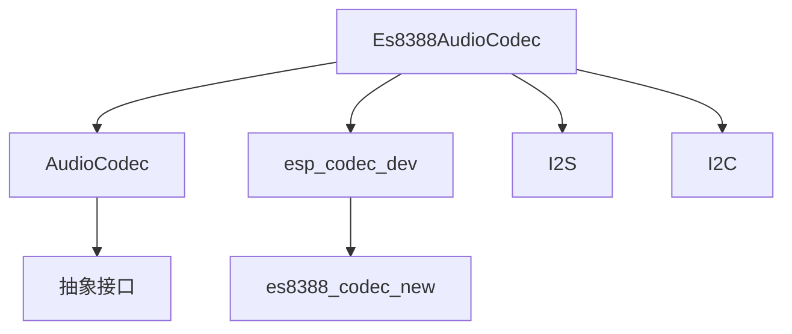
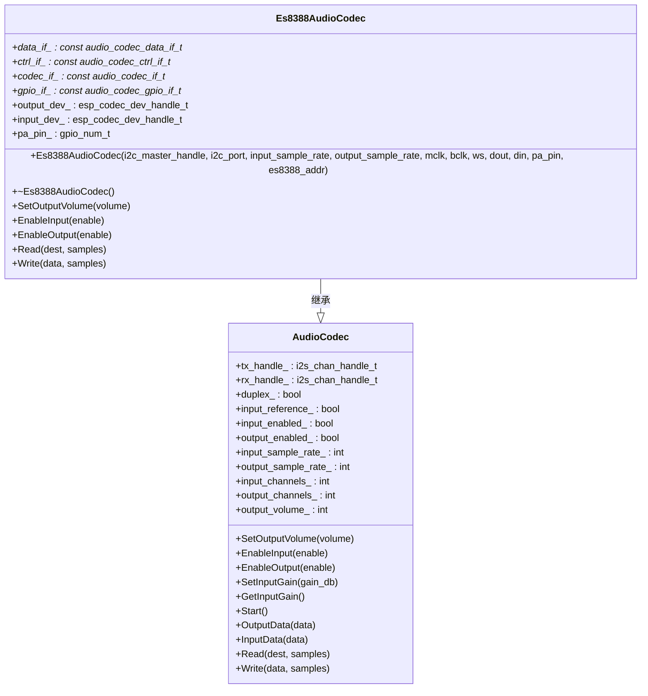
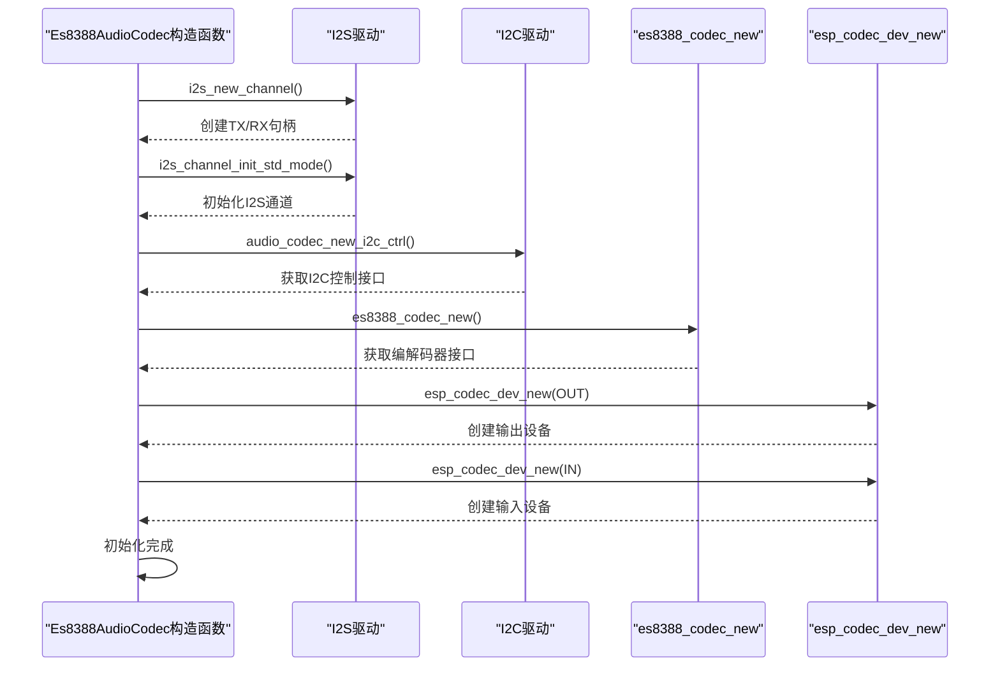
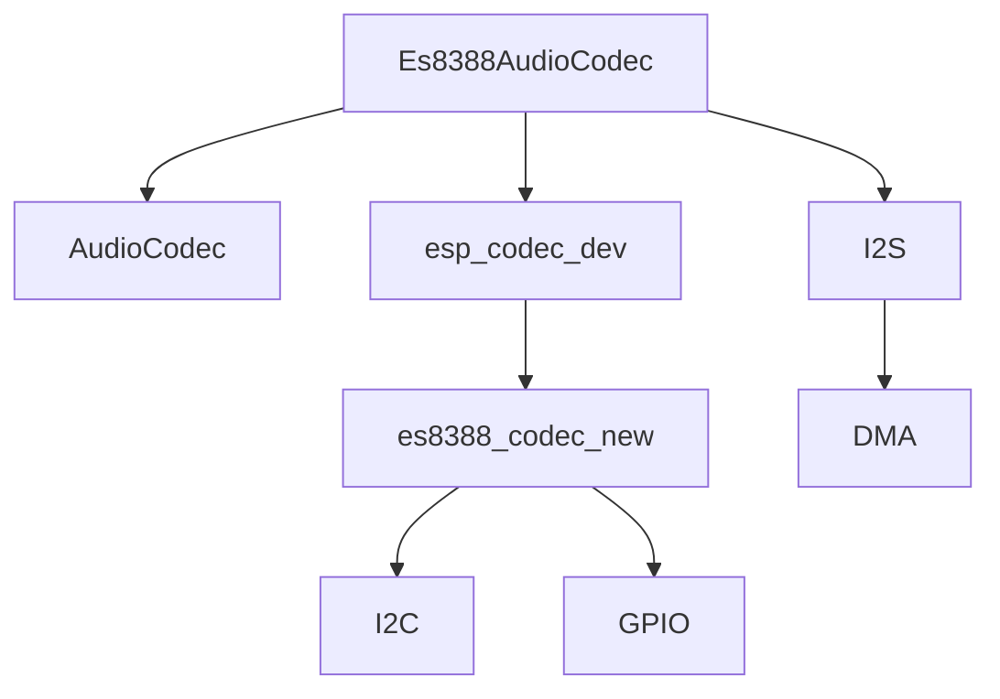

# ES8388音频编解码器实现

<cite>
**本文档中引用的文件**  
- [es8388_audio_codec.h](file://main\audio_codecs\es8388_audio_codec.h)
- [es8388_audio_codec.cc](file://main\audio_codecs\es8388_audio_codec.cc)
- [audio_codec.h](file://main\audio_codecs\audio_codec.h)
- [es8388_codec.h](file://managed_components\espressif__esp_codec_dev\device\include\es8388_codec.h)
- [es8388_reg.h](file://managed_components\espressif__esp_codec_dev\device\es8388\es8388_reg.h)
</cite>

## 目录
1. [项目结构](#项目结构)
2. [核心组件分析](#核心组件分析)
3. [架构概述](#架构概述)
4. [详细组件分析](#详细组件分析)
5. [依赖关系分析](#依赖关系分析)

## 项目结构

ES8388音频编解码器的实现位于项目的`main/audio_codecs/`目录下，主要由`es8388_audio_codec.h`和`es8388_audio_codec.cc`两个文件构成。该实现基于ESP-IDF的`esp_codec_dev`驱动框架，并通过继承`AudioCodec`抽象基类来提供统一的音频编解码接口。



**图示来源**  
- [es8388_audio_codec.h](file://main\audio_codecs\es8388_audio_codec.h#L9-L34)
- [es8388_audio_codec.cc](file://main\audio_codecs\es8388_audio_codec.cc#L6-L67)

**本节来源**  
- [es8388_audio_codec.h](file://main\audio_codecs\es8388_audio_codec.h)
- [es8388_audio_codec.cc](file://main\audio_codecs\es8388_audio_codec.cc)

## 核心组件分析

`Es8388AudioCodec`类是ES8388音频编解码器的核心实现，它继承自`AudioCodec`基类，实现了具体的硬件配置和音频数据处理逻辑。该类通过I2C接口与ES8388芯片通信，配置其内部寄存器，并通过I2S接口进行音频数据的输入输出。

**本节来源**  
- [es8388_audio_codec.h](file://main\audio_codecs\es8388_audio_codec.h#L9-L34)
- [es8388_audio_codec.cc](file://main\audio_codecs\es8388_audio_codec.cc#L6-L67)

## 架构概述

`Es8388AudioCodec`的架构基于分层设计，利用了ESP-IDF提供的`esp_codec_dev`设备驱动框架。该框架将编解码器的控制接口（I2C）、数据接口（I2S）和GPIO接口分离，通过`es8388_codec_new`函数创建一个统一的编解码器接口，然后使用`esp_codec_dev_new`创建输入和输出设备句柄。



**图示来源**  
- [es8388_audio_codec.h](file://main\audio_codecs\es8388_audio_codec.h#L9-L34)
- [audio_codec.h](file://main\audio_codecs\audio_codec.h#L15-L58)

## 详细组件分析

### 初始化与配置流程

`Es8388AudioCodec`的构造函数完成了对ES8388编解码器的完整初始化和配置流程。该流程包括创建I2S双工通道、初始化I2C控制接口、创建编解码器设备句柄等关键步骤。

#### 初始化流程分析



**图示来源**  
- [es8388_audio_codec.cc](file://main\audio_codecs\es8388_audio_codec.cc#L6-L67)

**本节来源**  
- [es8388_audio_codec.cc](file://main\audio_codecs\es8388_audio_codec.cc#L6-L67)

### I2S接口配置

`CreateDuplexChannels`方法负责配置I2S接口。它创建了一个主模式的I2S通道，并设置了标准的I2S配置，包括采样率、数据位宽、时钟极性等参数。

```cpp
void Es8388AudioCodec::CreateDuplexChannels(gpio_num_t mclk, gpio_num_t bclk, gpio_num_t ws, gpio_num_t dout, gpio_num_t din){
    assert(input_sample_rate_ == output_sample_rate_);

    i2s_chan_config_t chan_cfg = {
        .id = I2S_NUM_0,
        .role = I2S_ROLE_MASTER,
        .dma_desc_num = 6,
        .dma_frame_num = 240,
        .auto_clear_after_cb = true,
        .auto_clear_before_cb = false,
        .intr_priority = 0,
    };
    ESP_ERROR_CHECK(i2s_new_channel(&chan_cfg, &tx_handle_, &rx_handle_));

    i2s_std_config_t std_cfg = {
        .clk_cfg = {
            .sample_rate_hz = (uint32_t)output_sample_rate_,
            .clk_src = I2S_CLK_SRC_DEFAULT,
            .ext_clk_freq_hz = 0,
            .mclk_multiple = I2S_MCLK_MULTIPLE_256
        },
        .slot_cfg = {
            .data_bit_width = I2S_DATA_BIT_WIDTH_16BIT,
            .slot_bit_width = I2S_SLOT_BIT_WIDTH_AUTO,
            .slot_mode = I2S_SLOT_MODE_STEREO,
            .slot_mask = I2S_STD_SLOT_BOTH,
            .ws_width = I2S_DATA_BIT_WIDTH_16BIT,
            .ws_pol = false,
            .bit_shift = true,
            .left_align = true,
            .big_endian = false,
            .bit_order_lsb = false
        },
        .gpio_cfg = {
            .mclk = mclk,
            .bclk = bclk,
            .ws = ws,
            .dout = dout,
            .din = din,
            .invert_flags = {
                .mclk_inv = false,
                .bclk_inv = false,
                .ws_inv = false
            }
        }
    };

    ESP_ERROR_CHECK(i2s_channel_init_std_mode(tx_handle_, &std_cfg));
    ESP_ERROR_CHECK(i2s_channel_init_std_mode(rx_handle_, &std_cfg));
    ESP_LOGI(TAG, "Duplex channels created");
}
```

此配置的关键点包括：
- **主模式**：`I2S_ROLE_MASTER`，由ESP32提供MCLK、BCLK和WS时钟信号。
- **左对齐**：`.left_align = true`，实现了左对齐的数据传输模式。
- **帧同步极性**：`.ws_pol = false`，表示帧同步信号在低电平时为左声道，高电平时为右声道。
- **时钟倍频**：`.mclk_multiple = I2S_MCLK_MULTIPLE_256`，MCLK是采样率的256倍。

**本节来源**  
- [es8388_audio_codec.cc](file://main\audio_codecs\es8388_audio_codec.cc#L105-L155)

### 寄存器配置与功能实现

#### PLL与主时钟配置

在`Es8388AudioCodec`的构造函数中，通过`es8388_codec_cfg_t`结构体配置了编解码器的工作模式和主时钟设置。`es8388_codec_new`函数内部会根据这些配置初始化ES8388的PLL和主时钟。

```cpp
es8388_codec_cfg_t es8388_cfg = {};
es8388_cfg.ctrl_if = ctrl_if_;
es8388_cfg.gpio_if = gpio_if_;
es8388_cfg.codec_mode = ESP_CODEC_DEV_WORK_MODE_BOTH; // ADC和DAC同时工作
es8388_cfg.master_mode = true; // 主模式
es8388_cfg.pa_pin = pa_pin;
es8388_cfg.pa_reverted = false;
es8388_cfg.hw_gain.pa_voltage = 5.0;
es8388_cfg.hw_gain.codec_dac_voltage = 3.3;
codec_if_ = es8388_codec_new(&es8388_cfg);
```

#### ADC与DAC通道使能

`EnableInput`和`EnableOutput`方法用于使能或禁用ADC和DAC通道。当使能时，会调用`esp_codec_dev_open`打开相应的输入或输出设备。

```cpp
void Es8388AudioCodec::EnableInput(bool enable) {
    if (enable == input_enabled_) {
        return;
    }
    if (enable) {
        esp_codec_dev_sample_info_t fs = {
            .bits_per_sample = 16,
            .channel = 1,
            .channel_mask = 0,
            .sample_rate = (uint32_t)input_sample_rate_,
            .mclk_multiple = 0,
        };
        ESP_ERROR_CHECK(esp_codec_dev_open(input_dev_, &fs));
        ESP_ERROR_CHECK(esp_codec_dev_set_in_gain(input_dev_, 24.0)); // 设置输入增益为24dB
    } else {
        ESP_ERROR_CHECK(esp_codec_dev_close(input_dev_));
    }
    AudioCodec::EnableInput(enable);
}
```

#### 麦克风输入增益调节

在`EnableInput`方法中，通过调用`esp_codec_dev_set_in_gain(input_dev_, 24.0)`将麦克风输入增益设置为24.0dB。该值在0dB至30dB范围内，符合文档要求。

#### 耳机输出音量控制

`SetOutputVolume`方法用于设置数字输出音量，而`EnableOutput`方法在使能输出时，会通过直接写入I2C寄存器的方式设置模拟输出音量为0dB。

```cpp
void Es8388AudioCodec::EnableOutput(bool enable) {
    // ... 其他代码 ...
    if (enable) {
        // ... 其他代码 ...
        // Set analog output volume to 0dB, default is -45dB
        uint8_t reg_val = 30; // 0dB
        uint8_t regs[] = { 46, 47, 48, 49 }; // HP_LVOL, HP_RVOL, SPK_LVOL, SPK_RVOL
        for (uint8_t reg : regs) {
            ctrl_if_->write_reg(ctrl_if_, reg, 1, &reg_val, 1);
        }
        // ... 其他代码 ...
    }
    // ... 其他代码 ...
}
```

此代码通过I2C接口直接向寄存器地址46、47、48、49写入值30，将耳机和扬声器的左右声道模拟音量均设置为0dB。

**本节来源**  
- [es8388_audio_codec.cc](file://main\audio_codecs\es8388_audio_codec.cc#L29-L67)
- [es8388_audio_codec.cc](file://main\audio_codecs\es8388_audio_codec.cc#L141-L180)
- [es8388_audio_codec.cc](file://main\audio_codecs\es8388_audio_codec.cc#L161-L176)

## 依赖关系分析

`Es8388AudioCodec`的实现依赖于多个外部组件和接口，形成了一个清晰的依赖链。



**图示来源**  
- [es8388_audio_codec.h](file://main\audio_codecs\es8388_audio_codec.h#L9-L34)
- [es8388_audio_codec.cc](file://main\audio_codecs\es8388_audio_codec.cc#L6-L67)

**本节来源**  
- [es8388_audio_codec.h](file://main\audio_codecs\es8388_audio_codec.h)
- [es8388_audio_codec.cc](file://main\audio_codecs\es8388_audio_codec.cc)