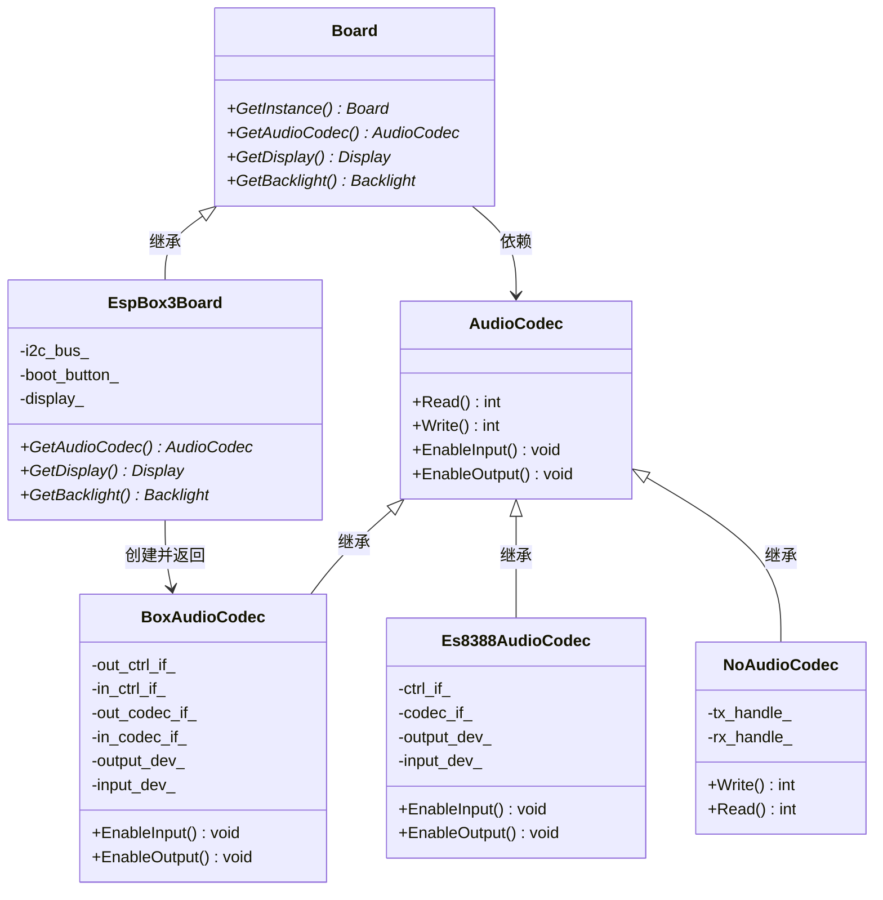

# 具体实现分析

<cite>
**本文档中引用的文件**   
- [es8388_audio_codec.cc](file://main/audio_codecs/es8388_audio_codec.cc)
- [es8311_audio_codec.cc](file://main/audio_codecs/es8311_audio_codec.cc)
- [box_audio_codec.cc](file://main/audio_codecs/box_audio_codec.cc)
- [no_audio_codec.cc](file://main/audio_codecs/no_audio_codec.cc)
- [esp_box_board.cc](file://main/boards/esp-box/esp_box_board.cc)
- [esp_box3_board.cc](file://main/boards/esp-box-3/esp_box3_board.cc)
- [esp_box_lite_board.cc](file://main/boards/esp-box-lite/esp_box_lite_board.cc)
- [box_audio_codec_lite.cc](file://main/boards/esp-box-lite/box_audio_codec_lite.cc)
</cite>

## 目录
1. [引言](#引言)
2. [ES8388音频编解码器实现](#es8388音频编解码器实现)
3. [ES8311音频编解码器实现](#es8311音频编解码器实现)
4. [BoxAudioCodec实现](#boxaudiocodec实现)
5. [NoAudioCodec实现](#noaudiocodec实现)
6. [I2S配置差异对比](#i2s配置差异对比)
7. [工厂模式与Board系统集成](#工厂模式与board系统集成)

## 引言
本文档详细解析了项目中各硬件平台音频编解码器的具体实现机制。通过对ES8388、ES8311、BoxAudioCodec和NoAudioCodec四个核心实现类的深入分析，揭示了其初始化流程、功能特性和配置细节。文档还对比了它们在I2S接口配置上的关键差异，并阐明了这些实现如何通过工厂模式被Board系统自动加载和管理。所有分析均基于项目源代码，旨在为开发者提供一份全面、准确的技术参考。

## ES8388音频编解码器实现

### 初始化与寄存器配置
ES8388音频编解码器通过I2C接口进行配置和控制。其初始化过程在`Es8388AudioCodec`构造函数中完成，主要步骤包括：

1.  **接口初始化**：创建I2S数据接口(`data_if_`)、I2C控制接口(`ctrl_if_`)和GPIO接口(`gpio_if_`)。
2.  **编解码器配置**：使用`es8388_codec_cfg_t`结构体配置编解码器工作模式（双工）、主从模式、功放引脚等。
3.  **设备创建**：通过`es8388_codec_new`函数创建编解码器实例，并分别创建输入和输出设备句柄。

```c++
// ES8388编解码器配置结构体
es8388_codec_cfg_t es8388_cfg = {};
es8388_cfg.ctrl_if = ctrl_if_; // I2C控制接口
es8388_cfg.gpio_if = gpio_if_; // GPIO接口
es8388_cfg.codec_mode = ESP_CODEC_DEV_WORK_MODE_BOTH; // 双工模式
es8388_cfg.master_mode = true; // 主模式
es8388_cfg.pa_pin = pa_pin; // 功放控制引脚
es8388_cfg.pa_reverted = false; // 功放电平不反转
es8388_cfg.hw_gain.pa_voltage = 5.0; // 功放电压5V
es8388_cfg.hw_gain.codec_dac_voltage = 3.3; // 编解码器DAC电压3.3V
codec_if_ = es8388_codec_new(&es8388_cfg); // 创建编解码器实例
```

### PLL与时钟设置
ES8388的时钟配置由I2S驱动层自动处理。在`CreateDuplexChannels`方法中，通过`i2s_std_config_t`结构体配置了标准I2S模式：
- **时钟源**：`I2S_CLK_SRC_DEFAULT`
- **主时钟倍数**：`I2S_MCLK_MULTIPLE_256`
- **采样率**：根据`output_sample_rate_`参数动态设置。

### ADC/DAC使能与增益调节
- **ADC使能**：在`EnableInput`方法中，调用`esp_codec_dev_open`打开输入设备，并通过`esp_codec_dev_set_in_gain`设置输入增益为24.0dB。
- **DAC使能**：在`EnableOutput`方法中，同样调用`esp_codec_dev_open`打开输出设备，并通过`esp_codec_dev_set_out_vol`设置输出音量。
- **模拟音量设置**：为了将模拟输出音量从默认的-45dB提升至0dB，代码直接通过I2C向寄存器46-49（HP_LVOL, HP_RVOL, SPK_LVOL, SPK_RVOL）写入值30。

```c++
// 在EnableOutput中设置模拟输出音量为0dB
uint8_t reg_val = 30; // 0dB
uint8_t regs[] = { 46, 47, 48, 49 }; // 目标寄存器
for (uint8_t reg : regs) {
    ctrl_if_->write_reg(ctrl_if_, reg, 1, &reg_val, 1);
}
```

**节来源**
- [es8388_audio_codec.cc](file://main/audio_codecs/es8388_audio_codec.cc#L0-L205)

## ES8311音频编解码器实现

### 低功耗特性与DSP功能
ES8311编解码器的低功耗特性主要通过其硬件设计和驱动配置实现。在`Es8311AudioCodec`的构造函数中，通过`es8311_codec_cfg_t`结构体进行配置，其中`use_mclk`参数允许开发者选择是否使用外部主时钟，以优化功耗。

该实现并未直接启用复杂的DSP功能，但其驱动架构支持通过`esp_codec_dev` API进行更高级的配置。其主要功能体现在：
- **高输入增益**：在`EnableInput`方法中，将输入增益优化设置为48.0dB，显著提升了语音识别的信噪比。
- **灵活的I2S配置**：代码中使用了`#ifdef I2S_HW_VERSION_2`预处理指令，表明其配置可根据不同的硬件版本进行调整，体现了良好的兼容性和可维护性。

```c++
// 在EnableInput中优化输入增益
ESP_ERROR_CHECK(esp_codec_dev_set_in_gain(input_dev_, input_gain_db_)); // 设置为48.0dB
ESP_LOGI(TAG, "ES8311 input gain optimized to %.1fdB for better voice recognition", input_gain_db_);
```

**节来源**
- [es8311_audio_codec.cc](file://main/audio_codecs/es8311_audio_codec.cc#L0-L218)

## BoxAudioCodec实现

### 专有通信协议与扩展功能
BoxAudioCodec是一个复合型编解码器，它同时管理一个ES8311（用于输出）和一个ES7210（用于输入）芯片，通过一个统一的接口对外提供服务。

- **通信协议**：其“专有”性体现在对两个不同I2C地址的协调管理上。构造函数接收两个地址参数（`es8311_addr`, `es7210_addr`），并分别为它们创建独立的I2C控制接口（`out_ctrl_if_`, `in_ctrl_if_`）和编解码器实例（`out_codec_if_`, `in_codec_if_`）。
- **内置功放控制**：通过`pa_pin`引脚控制ES8311的功放，在`EnableOutput`方法中，当使能输出时，会将`pa_pin`置高电平。

### 扩展功能
- **多麦克风输入**：在初始化`es7210_codec_cfg_t`时，通过`mic_selected`参数同时选中了MIC1至MIC4四个通道，实现了多麦克风阵列的支持。
- **回声消除支持**：`input_reference_`参数用于指示是否使用参考输入，为实现回声消除（AEC）功能提供了硬件基础。

```c++
// 初始化ES7210，选择所有四个麦克风
es7210_codec_cfg_t es7210_cfg = {};
es7210_cfg.ctrl_if = in_ctrl_if_;
es7210_cfg.mic_selected = ES7120_SEL_MIC1 | ES7120_SEL_MIC2 | ES7120_SEL_MIC3 | ES7120_SEL_MIC4;
in_codec_if_ = es7210_codec_new(&es7210_cfg);
```

### TDM模式配置
BoxAudioCodec的一个关键特性是其输入通道使用了TDM（时分复用）模式，以支持多路麦克风输入。在`CreateDuplexChannels`方法中，输出（TX）使用标准I2S模式，而输入（RX）则使用TDM模式：
- **时钟分频**：`bclk_div`设置为8。
- **时隙掩码**：`slot_mask`配置为`I2S_TDM_SLOT0 | I2S_TDM_SLOT1 | I2S_TDM_SLOT2 | I2S_TDM_SLOT3`，表示使用前四个时隙。
- **总时隙数**：`total_slot`设置为`I2S_TDM_AUTO_SLOT_NUM`。

```c++
// TDM模式配置
i2s_tdm_config_t tdm_cfg = {
    .clk_cfg = {
        .bclk_div = 8, // BCLK分频
    },
    .slot_cfg = {
        .slot_mask = i2s_tdm_slot_mask_t(I2S_TDM_SLOT0 | I2S_TDM_SLOT1 | I2S_TDM_SLOT2 | I2S_TDM_SLOT3),
        .total_slot = I2S_TDM_AUTO_SLOT_NUM
    },
    // ... 其他配置
};
ESP_ERROR_CHECK(i2s_channel_init_tdm_mode(rx_handle_, &tdm_cfg));
```

**节来源**
- [box_audio_codec.cc](file://main/audio_codecs/box_audio_codec.cc#L0-L241)

## NoAudioCodec实现

### 哑元实现的测试与调试用途
`NoAudioCodec`是一个哑元（Dummy）实现，它不连接任何物理音频硬件，而是直接与ESP32的I2S外设进行交互。其主要用途是：
- **测试与调试**：在没有物理音频编解码器的开发板上，可以使用此实现来测试音频处理、网络传输等上层逻辑。
- **性能基准**：提供一个无硬件延迟的基准，用于评估软件处理性能。
- **PDM支持**：`NoAudioCodecSimplexPdm`子类专门用于支持PDM（脉冲密度调制）麦克风，展示了如何配置I2S的PDM接收模式。

### 核心功能实现
- **数据写入**：`Write`方法接收16位PCM数据，将其转换为32位整数，并应用音量缩放（`volume_factor`），然后通过I2S DMA写入。
- **数据读取**：`Read`方法从I2S DMA读取32位数据，右移12位以匹配16位范围，并进行溢出保护，最后写入目标缓冲区。

```c++
// NoAudioCodec::Write 方法中的音量缩放
int32_t volume_factor = pow(double(output_volume_) / 100.0, 2) * 65536;
for (int i = 0; i < samples; i++) {
    int64_t temp = int64_t(data[i]) * volume_factor;
    // ... 溢出处理
    buffer[i] = static_cast<int32_t>(temp);
}
ESP_ERROR_CHECK(i2s_channel_write(tx_handle_, buffer.data(), samples * sizeof(int32_t), &bytes_written, portMAX_DELAY));
```

**节来源**
- [no_audio_codec.cc](file://main/audio_codecs/no_audio_codec.cc#L0-L394)

## I2S配置差异对比

下表对比了各音频编解码器实现类在I2S配置上的关键差异：

| 配置项 | ES8388 | ES8311 | BoxAudioCodec (输出) | BoxAudioCodec (输入) | NoAudioCodecDuplex |
| :--- | :--- | :--- | :--- | :--- | :--- |
| **数据位宽** | 16位 | 16位 | 16位 | 16位 | 32位 |
| **时隙位宽** | 自动 | 自动 | 自动 | 自动 | 32位 |
| **时隙模式** | 立体声 | 立体声 | 立体声 | 立体声 | 单声道 |
| **时隙掩码** | 左右声道 | 左右声道 | 左右声道 | 时隙0-3 (TDM) | 左声道 |
| **帧宽度** | 16位 | 16位 | 16位 | 自动 | 32位 |
| **时钟极性** | 低电平有效 | 低电平有效 | 低电平有效 | 低电平有效 | 低电平有效 |
| **数据偏移** | 是 | 是 | 是 | 是 | 是 |
| **对齐方式** | 左对齐 | 左对齐 | 左对齐 | 非左对齐 | 左对齐 |
| **主时钟倍数** | 256 | 256 | 256 | 256 | 256 |

**关键差异说明**：
- **数据位宽**：`NoAudioCodecDuplex`使用32位数据宽度，而其他实现多为16位，这影响了数据处理的精度和内存占用。
- **时隙模式**：`BoxAudioCodec`的输入通道使用TDM模式，这是其支持多麦克风的关键，而其他实现使用标准的立体声或单声道模式。
- **帧宽度**：`NoAudioCodecDuplex`的帧宽度与数据位宽一致为32位，而其他实现通常为16位。
- **对齐方式**：`BoxAudioCodec`的TDM输入配置为非左对齐（`.left_align = false`），这与输出通道的左对齐形成对比。

**节来源**
- [es8388_audio_codec.cc](file://main/audio_codecs/es8388_audio_codec.cc#L0-L205)
- [es8311_audio_codec.cc](file://main/audio_codecs/es8311_audio_codec.cc#L0-L218)
- [box_audio_codec.cc](file://main/audio_codecs/box_audio_codec.cc#L0-L241)
- [no_audio_codec.cc](file://main/audio_codecs/no_audio_codec.cc#L0-L394)

## 工厂模式与Board系统集成

### 工厂模式实现
本项目中的“工厂模式”并非一个显式的工厂类，而是通过**Board基类的虚函数**和**具体Board子类的静态实例化**来实现的。这是一种基于继承的工厂模式。

- **抽象工厂（Board类）**：`Board`基类定义了`GetAudioCodec()`等虚函数，作为创建音频编解码器的“工厂方法”。
- **具体工厂（Board子类）**：每个具体的开发板（如`EspBox3Board`）都重写了`GetAudioCodec()`方法，在该方法中直接创建并返回其专属的音频编解码器实例。

### 自动加载机制
Board系统通过以下步骤自动加载正确的音频编解码器：
1.  **单例获取**：应用程序通过`Board::GetInstance()`获取当前硬件平台的Board实例。
2.  **多态调用**：调用`GetAudioCodec()`方法。由于该方法是虚函数，实际执行的是当前Board子类的重写版本。
3.  **实例创建**：具体的Board子类在其`GetAudioCodec()`方法中，使用`static`关键字创建一个单例的音频编解码器对象，并返回其指针。

```c++
// esp_box3_board.cc 中的实现
virtual AudioCodec* GetAudioCodec() override {
    static BoxAudioCodec audio_codec( // 静态实例，保证全局唯一
        i2c_bus_, 
        AUDIO_INPUT_SAMPLE_RATE, 
        // ... 其他参数
        AUDIO_INPUT_REFERENCE);
    return &audio_codec; // 返回该实例的指针
}
```

### 集成流程
1.  **编译时选择**：通过`idf.py set-target`和`idf.py menuconfig`选择目标开发板（如`esp-box-3`）。
2.  **链接时确定**：构建系统会将对应开发板的实现文件（如`esp_box3_board.cc`）编译并链接到最终的固件中。
3.  **运行时加载**：程序启动时，`Board::GetInstance()`返回的是`EspBox3Board`实例。当需要音频功能时，调用`GetAudioCodec()`，便会自动加载并初始化`BoxAudioCodec`。

此机制确保了代码的高内聚、低耦合，使得为新硬件平台添加支持变得简单，只需创建一个新的Board子类并实现其`GetAudioCodec()`方法即可。



**图来源**
- [esp_box3_board.cc](file://main/boards/esp-box-3/esp_box3_board.cc#L0-L181)
- [box_audio_codec.cc](file://main/audio_codecs/box_audio_codec.cc#L0-L241)
- [es8388_audio_codec.cc](file://main/audio_codecs/es8388_audio_codec.cc#L0-L205)
- [no_audio_codec.cc](file://main/audio_codecs/no_audio_codec.cc#L0-L394)

**节来源**
- [esp_box_board.cc](file://main/boards/esp-box/esp_box_board.cc#L0-L181)
- [esp_box3_board.cc](file://main/boards/esp-box-3/esp_box3_board.cc#L0-L181)
- [esp_box_lite_board.cc](file://main/boards/esp-box-lite/esp_box_lite_board.cc#L0-L256)
- [box_audio_codec_lite.cc](file://main/boards/esp-box-lite/box_audio_codec_lite.cc#L0-L181)