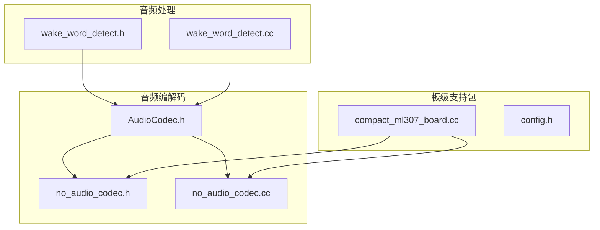
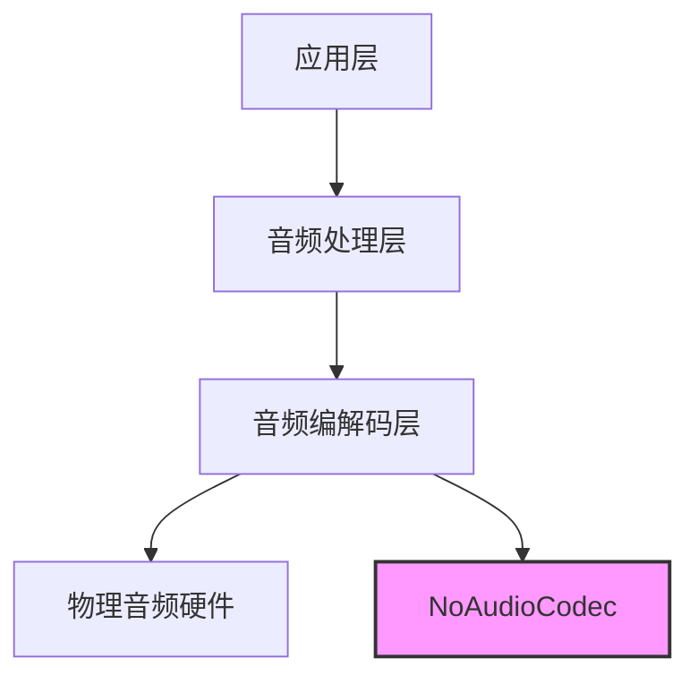
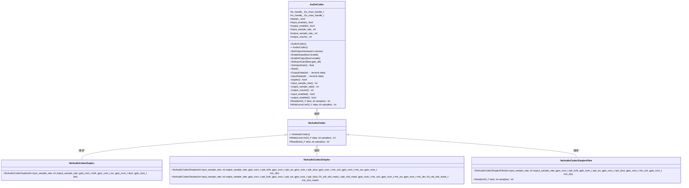
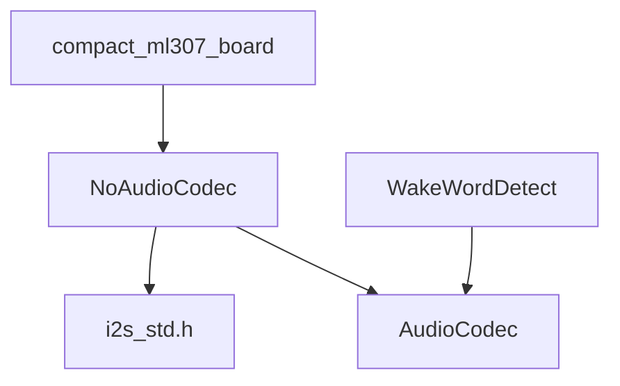

# 无音频编解码器哑元实现

<cite>
**本文档引用的文件**   
- [no_audio_codec.h](file://main/audio_codecs/no_audio_codec.h)
- [no_audio_codec.cc](file://main/audio_codecs/no_audio_codec.cc)
- [audio_codec.h](file://main/audio_codecs/audio_codec.h)
- [audio_codec.cc](file://main/audio_codecs/audio_codec.cc)
- [compact_ml307_board.cc](file://main/boards/bread-compact-ml307/compact_ml307_board.cc)
- [config.h](file://main/boards/bread-compact-ml307/config.h)
- [wake_word_detect.h](file://main/audio_processing/wake_word_detect.h)
- [wake_word_detect.cc](file://main/audio_processing/wake_word_detect.cc)
</cite>

## 目录
1. [简介](#简介)
2. [项目结构](#项目结构)
3. [核心组件](#核心组件)
4. [架构概述](#架构概述)
5. [详细组件分析](#详细组件分析)
6. [依赖分析](#依赖分析)
7. [性能考量](#性能考量)
8. [故障排除指南](#故障排除指南)
9. [结论](#结论)

## 简介
本文档详细解析了`NoAudioCodec`类作为哑元（Null Object）模式的具体实现。该实现主要用于在缺乏物理音频硬件或进行系统调试时，提供一个`AudioCodec`接口的空实现，以避免空指针异常。文档将阐述其成员函数的空操作行为、返回默认成功状态的设计考量、在特定开发板配置中的选用条件，并说明其如何支持系统其他模块在无真实音频流情况下的逻辑验证与单元测试。

## 项目结构
本项目采用功能模块化组织方式，主要模块包括音频编解码、音频处理、板级支持包（BSP）、显示、物联网（IoT）等。`NoAudioCodec`作为音频编解码模块的一部分，位于`main/audio_codecs/`目录下，与具体的板级支持文件（位于`main/boards/`目录）协同工作。



**图示来源**
- [no_audio_codec.h](file://main/audio_codecs/no_audio_codec.h)
- [no_audio_codec.cc](file://main/audio_codecs/no_audio_codec.cc)
- [compact_ml307_board.cc](file://main/boards/bread-compact-ml307/compact_ml307_board.cc)
- [wake_word_detect.h](file://main/audio_processing/wake_word_detect.h)

**本节来源**
- [no_audio_codec.h](file://main/audio_codecs/no_audio_codec.h)
- [compact_ml307_board.cc](file://main/boards/bread-compact-ml307/compact_ml307_board.cc)

## 核心组件
`NoAudioCodec`的核心是其作为`AudioCodec`抽象基类的派生类，实现了哑元模式。它通过提供空操作（no-op）的`Read`和`Write`方法，确保了在没有物理音频设备时，上层应用代码可以正常编译和运行，而不会因调用空指针导致崩溃。

**本节来源**
- [no_audio_codec.h](file://main/audio_codecs/no_audio_codec.h)
- [audio_codec.h](file://main/audio_codecs/audio_codec.h)

## 架构概述
系统架构采用分层设计，`NoAudioCodec`位于硬件抽象层（HAL），向上为音频处理和应用层提供统一的音频接口。当物理音频硬件不可用时，`NoAudioCodec`作为替代品，保证了系统架构的完整性。



**图示来源**
- [audio_codec.h](file://main/audio_codecs/audio_codec.h)
- [no_audio_codec.h](file://main/audio_codecs/no_audio_codec.h)

## 详细组件分析

### NoAudioCodec 类分析
`NoAudioCodec`类是哑元模式的具体实现，它继承自`AudioCodec`基类，并重写了`Read`和`Write`两个纯虚函数。

#### 类图


**图示来源**
- [audio_codec.h](file://main/audio_codecs/audio_codec.h#L13-L55)
- [no_audio_codec.h](file://main/audio_codecs/no_audio_codec.h#L8-L40)

#### 成员函数空操作行为
`NoAudioCodec`的`Write`和`Read`方法并非完全“空”，而是模拟了真实的I2S数据传输行为，但不与任何物理引脚交互。

- **Write 方法**: 该方法接收一个16位整数数组和样本数。它首先将16位数据转换为32位，并应用音量增益（`output_volume_`），然后调用`i2s_channel_write`将数据“写入”到一个虚拟的I2S通道（`tx_handle_`）。由于`tx_handle_`是在构造函数中通过`i2s_new_channel`创建的，因此该调用在ESP-IDF框架下是有效的，但数据最终被丢弃。
- **Read 方法**: 该方法从一个虚拟的I2S接收通道（`rx_handle_`）读取32位数据，然后将其右移12位并截断为16位，最后填充到目标缓冲区。如果读取失败，则返回0。

这种设计使得上层应用在调用`OutputData`和`InputData`时，能够获得与真实硬件相似的返回值，从而保证了逻辑的连贯性。

**本节来源**
- [no_audio_codec.cc](file://main/audio_codecs/no_audio_codec.cc#L272-L394)
- [audio_codec.cc](file://main/audio_codecs/audio_codec.cc#L4-L14)

#### 返回默认成功状态的设计考量
`NoAudioCodec`的设计考量在于**稳定性**和**可测试性**。

- **避免空指针异常**: 通过提供一个始终存在的`AudioCodec`实例，系统在初始化时不会因缺少硬件而失败。
- **返回成功状态**: `Write`和`Read`方法都返回实际处理的样本数，这使得上层逻辑（如语音唤醒）认为数据传输是成功的。这对于单元测试和系统调试至关重要，开发者可以专注于业务逻辑，而不必处理硬件缺失的异常分支。
- **模拟真实行为**: 尽管是哑元，但其内部仍调用了ESP-IDF的I2S API，这有助于在集成测试中验证I2S通道的配置和管理逻辑是否正确。

### NoAudioCodec 在开发板配置中的应用
`NoAudioCodec`被用于那些没有物理音频编解码芯片的开发板，例如`bread-compact-ml307`平台。

#### 配置方式
在`bread-compact-ml307`开发板的配置中，通过以下方式选用`NoAudioCodec`：

1.  **包含头文件**: 在板级支持文件`compact_ml307_board.cc`中，包含了`no_audio_codec.h`。
2.  **条件编译**: 在`GetAudioCodec()`方法中，使用`#ifdef AUDIO_I2S_METHOD_SIMPLEX`宏来决定实例化`NoAudioCodecSimplex`还是`NoAudioCodecDuplex`。
3.  **参数传递**: 构造函数需要传入音频采样率和I2S引脚配置，这些参数在`config.h`文件中定义。

```c++
virtual AudioCodec* GetAudioCodec() override {
#ifdef AUDIO_I2S_METHOD_SIMPLEX
    static NoAudioCodecSimplex audio_codec(AUDIO_INPUT_SAMPLE_RATE, AUDIO_OUTPUT_SAMPLE_RATE,
        AUDIO_I2S_SPK_GPIO_BCLK, AUDIO_I2S_SPK_GPIO_LRCK, AUDIO_I2S_SPK_GPIO_DOUT, AUDIO_I2S_MIC_GPIO_SCK, AUDIO_I2S_MIC_GPIO_WS, AUDIO_I2S_MIC_GPIO_DIN);
#else
    static NoAudioCodecDuplex audio_codec(AUDIO_INPUT_SAMPLE_RATE, AUDIO_OUTPUT_SAMPLE_RATE,
        AUDIO_I2S_GPIO_BCLK, AUDIO_I2S_GPIO_WS, AUDIO_I2S_GPIO_DOUT, AUDIO_I2S_GPIO_DIN);
#endif
    return &audio_codec;
}
```

**本节来源**
- [compact_ml307_board.cc](file://main/boards/bread-compact-ml307/compact_ml307_board.cc#L148-L172)
- [config.h](file://main/boards/bread-compact-ml307/config.h#L1-L57)

### 对系统其他模块的支持
`NoAudioCodec`极大地支持了系统其他模块在无真实音频流情况下的开发和测试。

#### 支持语音唤醒模块
语音唤醒模块`WakeWordDetect`依赖于`AudioCodec`接口来获取音频数据。当`NoAudioCodec`被使用时：

1.  **初始化**: `WakeWordDetect::Initialize()`方法接收一个`AudioCodec*`指针，并将其保存为`codec_`。
2.  **数据采集**: 在`AudioDetectionTask`循环中，会调用`codec_->InputData(data)`来获取音频样本。
3.  **逻辑验证**: 由于`NoAudioCodec::InputData()`会返回一个非零的样本数（即使数据是虚拟的），`WakeWordDetect`的检测循环会持续运行，开发者可以验证唤醒词检测算法的逻辑是否正确，而无需真实的麦克风输入。

```c++
bool AudioCodec::InputData(std::vector<int16_t>& data) {
    int samples = Read(data.data(), data.size());
    if (samples > 0) {
        return true; // 即使数据是虚拟的，也返回true
    }
    return false;
}
```

这使得开发者可以在硬件到位前，就完成大部分软件逻辑的开发和单元测试。

**本节来源**
- [wake_word_detect.cc](file://main/audio_processing/wake_word_detect.cc#L118-L181)
- [audio_codec.cc](file://main/audio_codecs/audio_codec.cc#L10-L14)

## 依赖分析
`NoAudioCodec`的实现依赖于ESP-IDF框架的I2S驱动库（`driver/i2s_std.h`），并作为`AudioCodec`抽象接口的具体实现，被板级支持包和音频处理模块所依赖。



**图示来源**
- [no_audio_codec.h](file://main/audio_codecs/no_audio_codec.h)
- [audio_codec.h](file://main/audio_codecs/audio_codec.h)

**本节来源**
- [no_audio_codec.h](file://main/audio_codecs/no_audio_codec.h)
- [audio_codec.h](file://main/audio_codecs/audio_codec.h)

## 性能考量
使用`NoAudioCodec`时，系统性能主要消耗在模拟的I2S数据传输上。虽然数据是虚拟的，但`i2s_channel_write`和`i2s_channel_read`的调用仍然会产生CPU开销。然而，这种开销是可控且可预测的，远小于处理真实音频流的开销。对于调试和测试环境，这种性能损耗是可以接受的。

## 故障排除指南
- **问题**: 系统在没有音频硬件时崩溃。
  - **解决方案**: 确保板级支持文件正确包含了`no_audio_codec.h`，并且`GetAudioCodec()`方法返回了`NoAudioCodec`的实例。
- **问题**: 语音唤醒模块无法启动。
  - **解决方案**: 检查`NoAudioCodec`的构造函数参数（如采样率、引脚）是否与`config.h`中的定义一致。

**本节来源**
- [compact_ml307_board.cc](file://main/boards/bread-compact-ml307/compact_ml307_board.cc)
- [config.h](file://main/boards/bread-compact-ml307/config.h)

## 结论
`NoAudioCodec`是哑元模式的一个优秀实践。它通过提供一个功能完整的`AudioCodec`接口实现，有效解决了在缺乏物理音频硬件时的开发和测试难题。其设计不仅避免了空指针异常，还通过模拟真实的数据流行为，支持了上层模块（如语音唤醒）的逻辑验证和单元测试，极大地提高了开发效率和系统的健壮性。