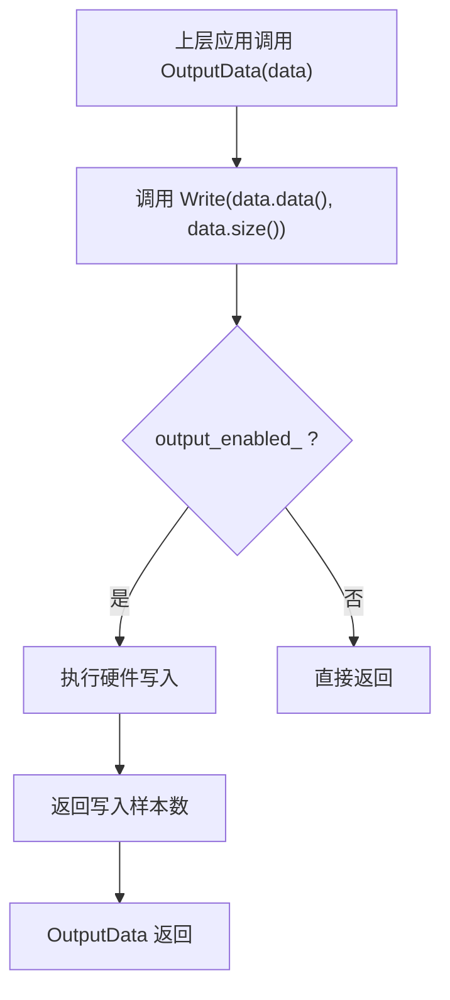
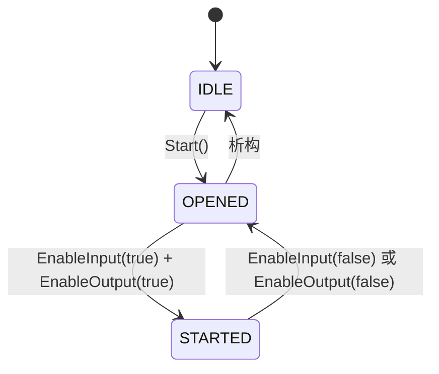
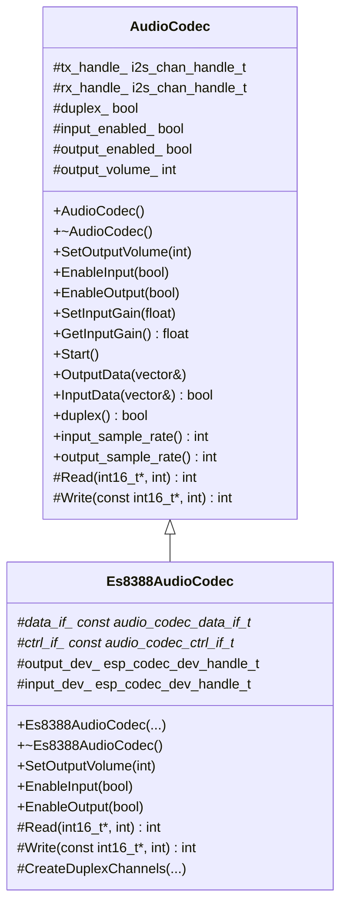
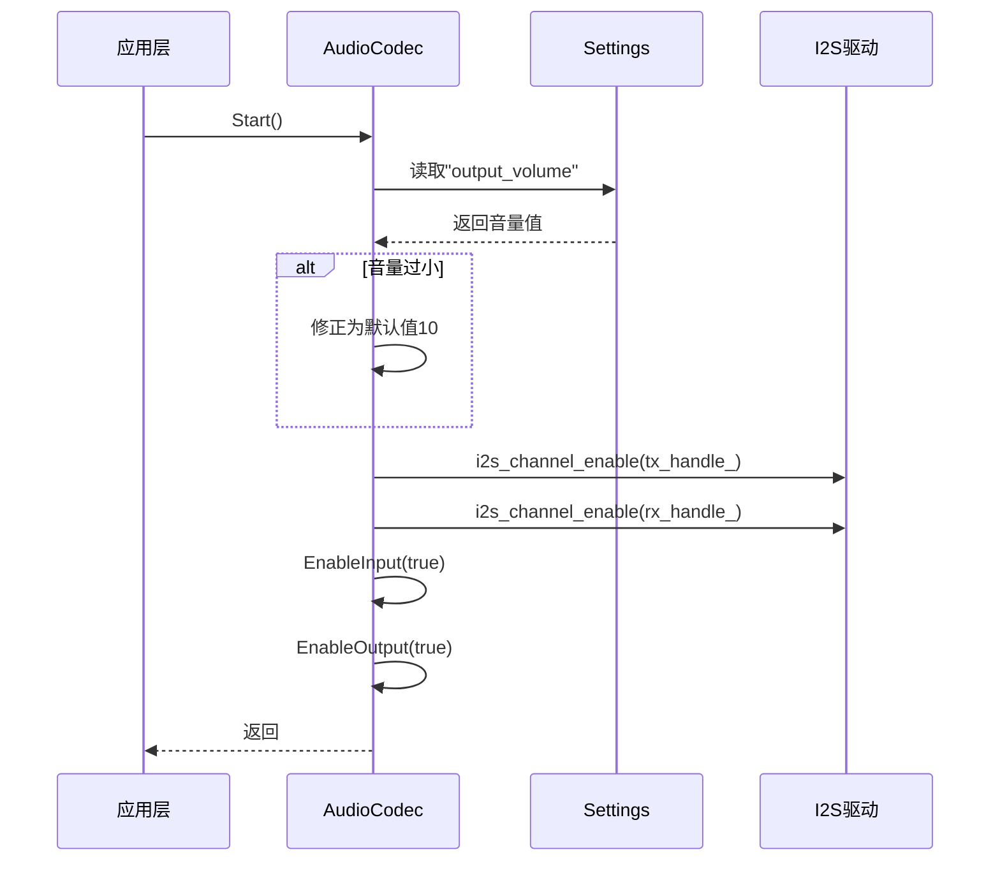

# 核心接口设计

<cite>
**本文档中引用的文件**  
- [audio_codec.h](file://main/audio_codecs/audio_codec.h)
- [audio_codec.cc](file://main/audio_codecs/audio_codec.cc)
- [es8388_audio_codec.h](file://main/audio_codecs/es8388_audio_codec.h)
- [es8388_audio_codec.cc](file://main/audio_codecs/es8388_audio_codec.cc)
</cite>

## 目录
1. [引言](#引言)  
2. [AudioCodec抽象基类设计原理](#audiocodec抽象基类设计原理)  
3. [核心虚函数语义定义与参数约束](#核心虚函数语义定义与参数约束)  
4. [硬件无关的音频数据流抽象机制](#硬件无关的音频数据流抽象机制)  
5. [同步/异步读写模式支持](#同步异步读写模式支持)  
6. [错误处理机制与状态机管理](#错误处理机制与状态机管理)  
7. [接口使用示例代码](#接口使用示例代码)  
8. [继承要求与可选重写方法](#继承要求与可选重写方法)  
9. [类图与方法调用序列图](#类图与方法调用序列图)

## 引言
本文件深入分析`AudioCodec`抽象基类的设计原理与接口规范，旨在为开发者提供清晰的音频驱动开发指导。该类位于`main/audio_codecs/`目录下，作为所有音频编解码器实现的统一接口，封装了I2S通信、音量控制、输入输出使能等核心功能，实现了硬件无关的音频数据流抽象。

**本节不涉及具体源码分析，因此无须列出源文件。**

## AudioCodec抽象基类设计原理
`AudioCodec`是一个抽象基类，定义了一套统一的音频设备操作接口，屏蔽底层硬件差异，实现跨平台音频驱动的可插拔设计。其设计遵循面向对象的多态性原则，允许不同型号的音频芯片（如ES8388、ES8311）通过继承该类并实现其纯虚函数来适配系统。

该类通过保护成员变量管理音频通道句柄（`tx_handle_`, `rx_handle_`）、采样率、通道数、音量等状态信息，并通过公共接口暴露控制方法。所有具体实现必须重写`Read`和`Write`两个纯虚函数以完成实际的数据读写操作。

**Section sources**  
- [audio_codec.h](file://main/audio_codecs/audio_codec.h#L13-L55)

## 核心虚函数语义定义与参数约束
### **SetOutputVolume**
设置输出音量，取值范围通常为0-100。该方法在基类中提供默认实现，会将音量值持久化到`settings`中，并更新内部状态`output_volume_`。

- **参数**：`int volume` - 音量值
- **约束**：若设置值小于等于0，则自动修正为默认值10

### **EnableInput / EnableOutput**
启用或禁用音频输入/输出通道。这两个方法在基类中提供默认实现，通过检查当前状态避免重复操作，并记录日志。

- **参数**：`bool enable` - 是否启用
- **约束**：仅当状态变化时执行操作

### **Read / Write（纯虚函数）**
这两个是必须由派生类实现的核心数据通道函数。

- **Read**：从音频输入设备读取`samples`个16位样本到`dest`缓冲区，返回实际读取的样本数。
  - **参数**：`int16_t* dest` - 目标缓冲区指针，`int samples` - 请求样本数
  - **语义**：同步阻塞读取，返回值应为`samples`或0（表示无数据）

- **Write**：向音频输出设备写入`samples`个16位样本。
  - **参数**：`const int16_t* data` - 源数据指针，`int samples` - 样本数
  - **语义**：同步写入，成功返回`samples`

### **SetInputGain / GetInputGain**
动态调整输入增益（单位：dB）。`SetInputGain`在基类中提供空实现，`GetInputGain`返回默认增益值48.0f。

- **参数**：`float gain_db` - 增益值（dB）
- **用途**：用于优化麦克风输入信号强度

**Section sources**  
- [audio_codec.h](file://main/audio_codecs/audio_codec.h#L18-L24)
- [audio_codec.h](file://main/audio_codecs/audio_codec.h#L53-L54)

## 硬件无关的音频数据流抽象机制
`AudioCodec`通过以下方式实现硬件无关性：

1. **抽象数据通道**：`Read`和`Write`接口仅操作`int16_t`数组，不关心底层I2C、I2S或SPI协议细节。
2. **统一配置接口**：`SetOutputVolume`、`EnableInput/Output`等方法提供标准化控制，具体硬件操作由派生类完成。
3. **状态封装**：所有音频参数（采样率、通道数、双工模式等）在基类中统一管理，确保上层应用访问一致性。

例如，`Es8388AudioCodec`通过`esp_codec_dev_write`调用ESP-IDF的通用音频设备驱动层，而`BoxAudioCodec`可能使用不同的硬件抽象层，但对外暴露相同的`AudioCodec`接口。

**Section sources**  
- [audio_codec.h](file://main/audio_codecs/audio_codec.h#L13-L55)
- [es8388_audio_codec.cc](file://main/audio_codecs/es8388_audio_codec.cc#L194-L201)

## 同步/异步读写模式支持
`AudioCodec`主要支持**同步读写模式**，其`Read`和`Write`方法为阻塞调用，确保数据完整性。

- **OutputData**：调用`Write(data.data(), data.size())`，同步写入整个缓冲区。
- **InputData**：调用`Read(data.data(), data.size())`，若返回样本数大于0则返回`true`，否则`false`。

虽然基类本身未直接实现异步模式，但可通过多线程或事件驱动机制在上层封装异步行为。例如，在后台任务中循环调用`InputData`采集音频流。



**Diagram sources**  
- [audio_codec.cc](file://main/audio_codecs/audio_codec.cc#L22-L24)
- [audio_codec.cc](file://main/audio_codecs/audio_codec.cc#L59-L61)

## 错误处理机制与状态机管理
### 错误处理
- 使用`ESP_ERROR_CHECK_WITHOUT_ABORT`进行非致命错误检查，避免因单次I/O失败导致系统崩溃。
- 在`Start()`中对音量进行边界检查，防止无效值。
- 派生类在硬件操作失败时应记录日志但不中断流程。

### 状态机管理
`AudioCodec`通过布尔标志位实现简单的状态管理：

- **IDLE**：对象创建后初始状态，未调用`Start()`。
- **OPENED**：调用`Start()`后，I2S通道已使能，但输入输出未激活。
- **STARTED**：`EnableInput(true)`和`EnableOutput(true)`后，音频流已就绪。

状态转换由`Start()`和`EnableInput/Output`方法驱动，关键状态变量包括：
- `input_enabled_`：输入是否启用
- `output_enabled_`：输出是否启用
- `duplex_`：是否双工模式



**Diagram sources**  
- [audio_codec.cc](file://main/audio_codecs/audio_codec.cc#L56-L66)
- [audio_codec.h](file://main/audio_codecs/audio_codec.h#L43-L45)

**Section sources**  
- [audio_codec.cc](file://main/audio_codecs/audio_codec.cc#L56-L66)
- [audio_codec.h](file://main/audio_codecs/audio_codec.h#L43-L45)

## 接口使用示例代码
```cpp
// 创建具体编解码器实例（以ES8388为例）
Es8388AudioCodec* codec = new Es8388AudioCodec(
    i2c_handle, I2C_NUM_0, 16000, 16000,
    GPIO_NUM_0, GPIO_NUM_1, GPIO_NUM_2, GPIO_NUM_3, GPIO_NUM_4,
    GPIO_NUM_5, 0x30
);

// 启动音频系统
codec->Start();

// 设置音量
codec->SetOutputVolume(70);

// 开始音频流
codec->EnableInput(true);
codec->EnableOutput(true);

// 写入音频数据
std::vector<int16_t> audio_buffer = { /* PCM数据 */ };
codec->OutputData(audio_buffer);

// 读取麦克风数据
std::vector<int16_t> mic_buffer(160); // 10ms at 16kHz
if (codec->InputData(mic_buffer)) {
    // 处理采集到的音频
}
```

**Section sources**  
- [es8388_audio_codec.h](file://main/audio_codecs/es8388_audio_codec.h#L9-L34)
- [audio_codec.cc](file://main/audio_codecs/audio_codec.cc#L22-L27)

## 继承要求与可选重写方法
### 必须重写的最小接口集
所有派生类必须重写以下两个纯虚函数：
- `virtual int Read(int16_t* dest, int samples) override`
- `virtual int Write(const int16_t* data, int samples) override`

### 可选重写的方法
以下方法可根据硬件特性选择性重写：
- `SetOutputVolume`：若需硬件级音量控制（如ES8388通过I2C寄存器设置）
- `EnableInput` / `EnableOutput`：若需在使能时配置硬件参数（如采样率、增益）
- `SetInputGain`：若支持动态输入增益调整

例如，`Es8388AudioCodec`重写了`SetOutputVolume`以通过`esp_codec_dev_set_out_vol`设置硬件音量。

**Section sources**  
- [es8388_audio_codec.h](file://main/audio_codecs/es8388_audio_codec.h#L30-L33)
- [es8388_audio_codec.cc](file://main/audio_codecs/es8388_audio_codec.cc#L178-L185)

## 类图与方法调用序列图
### 类图


**Diagram sources**  
- [audio_codec.h](file://main/audio_codecs/audio_codec.h#L13-L55)
- [es8388_audio_codec.h](file://main/audio_codecs/es8388_audio_codec.h#L9-L34)

### 方法调用序列图（Start流程）


**Diagram sources**  
- [audio_codec.cc](file://main/audio_codecs/audio_codec.cc#L56-L66)
- [audio_codec.cc](file://main/audio_codecs/audio_codec.cc#L68-L75)