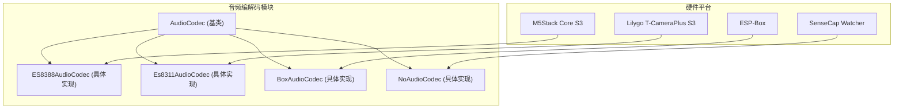
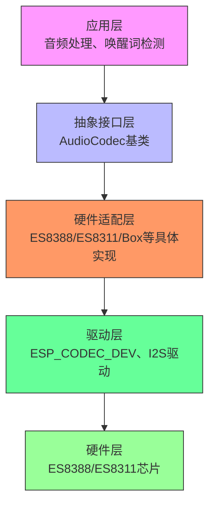
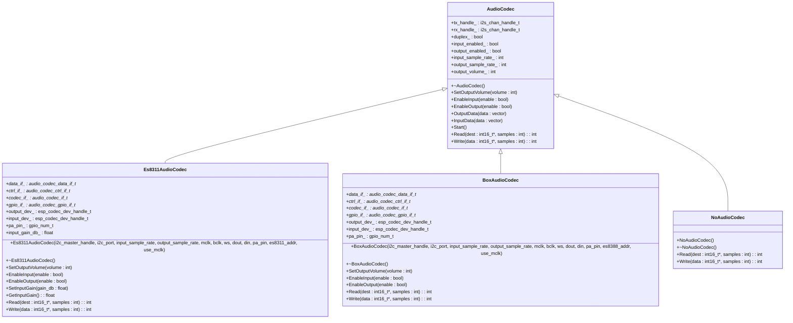
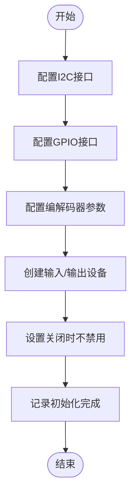
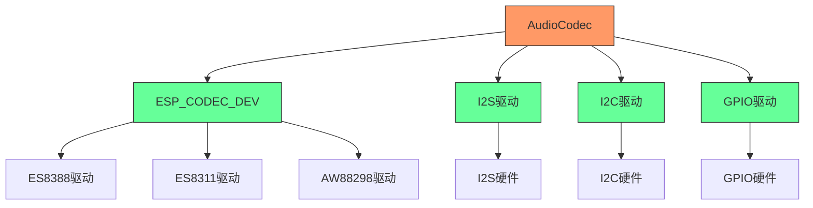

# 音频编解码架构

<cite>
**本文档中引用的文件**   
- [audio_codec.h](file://main/audio_codecs/audio_codec.h)
- [audio_codec.cc](file://main/audio_codecs/audio_codec.cc)
- [es8388_audio_codec.cc](file://main/audio_codecs/es8388_audio_codec.cc)
- [es8311_audio_codec.h](file://main/audio_codecs/es8311_audio_codec.h)
- [es8311_audio_codec.cc](file://main/audio_codecs/es8311_audio_codec.cc)
- [box_audio_codec.cc](file://main/audio_codecs/box_audio_codec.cc)
- [box_audio_codec.h](file://main/audio_codecs/box_audio_codec.h)
- [no_audio_codec.h](file://main/audio_codecs/no_audio_codec.h)
- [no_audio_codec.cc](file://main/audio_codecs/no_audio_codec.cc)
- [board.h](file://main/boards/common/board.h)
</cite>

## 目录
1. [引言](#引言)
2. [项目结构](#项目结构)
3. [核心组件](#核心组件)
4. [架构概述](#架构概述)
5. [详细组件分析](#详细组件分析)
6. [依赖分析](#依赖分析)
7. [性能考虑](#性能考虑)
8. [故障排除指南](#故障排除指南)
9. [结论](#结论)

## 引言
本文档旨在深入分析音频编解码系统的架构设计，重点阐述基于ESP32平台的音频编解码器抽象接口设计原则及其在不同硬件平台上的具体实现。文档将详细解析AudioCodec基类提供的核心方法如何被ES8388、ES8311、Box等具体编解码器继承和重写，说明I2S通信协议的配置细节，并描述编解码器工厂模式的构建方式。通过结合具体硬件初始化流程，为开发者提供自定义音频编解码器的扩展指南。

## 项目结构
音频编解码系统位于`main/audio_codecs`目录下，采用模块化设计，包含抽象基类和多个具体实现。系统通过继承机制实现多态性，允许不同硬件平台使用统一的接口进行音频处理。



**图源**
- [audio_codec.h](file://main/audio_codecs/audio_codec.h)
- [es8388_audio_codec.h](file://main/audio_codecs/es8388_audio_codec.h)
- [es8311_audio_codec.h](file://main/audio_codecs/es8311_audio_codec.h)
- [box_audio_codec.h](file://main/audio_codecs/box_audio_codec.h)
- [no_audio_codec.h](file://main/audio_codecs/no_audio_codec.h)

**本节来源**
- [audio_codec.h](file://main/audio_codecs/audio_codec.h)
- [es8388_audio_codec.h](file://main/audio_codecs/es8388_audio_codec.h)
- [es8311_audio_codec.h](file://main/audio_codecs/es8311_audio_codec.h)

## 核心组件

音频编解码系统的核心是`AudioCodec`抽象基类，它定义了所有音频编解码器必须实现的接口。该类提供了`open`、`close`、`read`、`write`等核心方法的抽象声明，以及音量控制、输入输出使能等通用功能的实现。

```cpp
class AudioCodec {
protected:
    i2s_chan_handle_t tx_handle_ = nullptr;
    i2s_chan_handle_t rx_handle_ = nullptr;

    bool duplex_ = false;
    bool input_enabled_ = false;
    bool output_enabled_ = false;
    int input_sample_rate_ = 0;
    int output_sample_rate_ = 0;
    int output_volume_ = 70;

    virtual int Read(int16_t* dest, int samples) = 0;
    virtual int Write(const int16_t* data, int samples) = 0;

public:
    virtual ~AudioCodec() {}
    virtual void SetOutputVolume(int volume);
    virtual void EnableInput(bool enable);
    virtual void EnableOutput(bool enable);
    void OutputData(std::vector<int16_t>& data);
    bool InputData(std::vector<int16_t>& data);
    void Start();
};
```

具体实现类如`Es8311AudioCodec`、`BoxAudioCodec`等通过继承`AudioCodec`并重写纯虚函数来提供特定硬件的实现。这种设计模式实现了接口与实现的分离，提高了代码的可维护性和可扩展性。

**本节来源**
- [audio_codec.h](file://main/audio_codecs/audio_codec.h#L37-L57)
- [audio_codec.cc](file://main/audio_codecs/audio_codec.cc#L0-L67)

## 架构概述

音频编解码系统采用分层架构设计，从上到下分为应用层、抽象接口层、硬件适配层和驱动层。这种分层设计使得系统具有良好的可移植性和可扩展性。



**图源**
- [audio_codec.h](file://main/audio_codecs/audio_codec.h)
- [es8388_audio_codec.h](file://main/audio_codecs/es8388_audio_codec.h)
- [es8311_audio_codec.h](file://main/audio_codecs/es8311_audio_codec.h)
- [box_audio_codec.h](file://main/audio_codecs/box_audio_codec.h)

## 详细组件分析

### 抽象接口设计分析

`AudioCodec`基类作为所有音频编解码器的抽象接口，定义了统一的操作方法。这种设计遵循了面向对象的开闭原则，对扩展开放，对修改关闭。



**图源**
- [audio_codec.h](file://main/audio_codecs/audio_codec.h#L37-L57)
- [es8311_audio_codec.h](file://main/audio_codecs/es8311_audio_codec.h#L0-L42)
- [box_audio_codec.h](file://main/audio_codecs/box_audio_codec.h)
- [no_audio_codec.h](file://main/audio_codecs/no_audio_codec.h)

**本节来源**
- [audio_codec.h](file://main/audio_codecs/audio_codec.h#L37-L57)
- [es8311_audio_codec.h](file://main/audio_codecs/es8311_audio_codec.h#L0-L42)

### I2S通信协议配置

I2S（Inter-IC Sound）通信协议的配置是音频编解码器初始化的关键部分。系统通过`i2s_std_config_t`结构体配置I2S参数，包括时钟极性、数据格式和采样率等。

```cpp
i2s_std_config_t std_cfg = {
    .clk_cfg = {
        .sample_rate_hz = (uint32_t)output_sample_rate_,
        .clk_src = I2S_CLK_SRC_DEFAULT,
        .mclk_multiple = I2S_MCLK_MULTIPLE_256,
        #ifdef I2S_HW_VERSION_2    
            .ext_clk_freq_hz = 0,
        #endif
    },
    .slot_cfg = {
        .data_bit_width = I2S_DATA_BIT_WIDTH_16BIT,
        .slot_bit_width = I2S_SLOT_BIT_WIDTH_AUTO,
        .slot_mode = I2S_SLOT_MODE_STEREO,
        .slot_mask = I2S_STD_SLOT_BOTH,
        .ws_width = I2S_DATA_BIT_WIDTH_16BIT,
        .ws_pol = false,
        .bit_shift = true,
        #ifdef I2S_HW_VERSION_2   
            .left_align = true,
            .big_endian = false,
            .bit_order_lsb = false
        #endif
    },
    .gpio_cfg = {
        .mclk = mclk,
        .bclk = bclk,
        .ws = ws,
        .dout = dout,
        .din = din,
        .invert_flags = {
            .mclk_inv = false,
            .bclk_inv = false,
            .ws_inv = false
        }
    }
};
```

关键配置参数包括：
- **时钟极性**：通过`ws_pol`字段配置，`false`表示低电平有效
- **数据格式**：支持I2S和LPCM格式，通过`slot_mode`字段配置
- **采样率范围**：支持8kHz到48kHz的采样率，通过`sample_rate_hz`字段配置
- **位宽**：支持16位、24位和32位数据格式

**本节来源**
- [es8311_audio_codec.cc](file://main/audio_codecs/es8311_audio_codec.cc#L100-L150)
- [box_audio_codec.cc](file://main/audio_codecs/box_audio_codec.cc)

### 编解码器工厂模式

系统通过硬件配置自动实例化对应的编解码器驱动，实现了工厂模式。不同硬件平台通过包含相应的头文件并创建具体编解码器实例来实现。

```mermaid
sequenceDiagram
participant Board as "硬件平台"
participant Factory as "编解码器工厂"
participant ES8311 as "Es8311AudioCodec"
participant Box as "BoxAudioCodec"
participant No as "NoAudioCodec"
Board->>Factory : 根据硬件配置选择编解码器
alt ESP-Box平台
Factory->>Box : 创建BoxAudioCodec实例
Box-->>Factory : 返回实例
else M5Stack Core S3平台
Factory->>ES8311 : 创建Es8311AudioCodec实例
ES8311-->>Factory : 返回实例
else 其他平台
Factory->>No : 创建NoAudioCodec实例
No-->>Factory : 返回实例
end
Factory-->>Board : 返回编解码器实例
```

**图源**
- [board.h](file://main/boards/common/board.h)
- [es8311_audio_codec.h](file://main/audio_codecs/es8311_audio_codec.h)
- [box_audio_codec.h](file://main/audio_codecs/box_audio_codec.h)
- [no_audio_codec.h](file://main/audio_codecs/no_audio_codec.h)

**本节来源**
- [board.h](file://main/boards/common/board.h)
- [es8311_audio_codec.h](file://main/audio_codecs/es8311_audio_codec.h)
- [box_audio_codec.h](file://main/audio_codecs/box_audio_codec.h)

### 硬件初始化流程

以ES8311编解码器为例，硬件初始化流程包括I2C接口配置、GPIO接口配置、编解码器配置和设备创建等步骤。



具体实现代码如下：

```cpp
Es8311AudioCodec::Es8311AudioCodec(void* i2c_master_handle, i2c_port_t i2c_port, 
    int input_sample_rate, int output_sample_rate, gpio_num_t mclk, gpio_num_t bclk, 
    gpio_num_t ws, gpio_num_t dout, gpio_num_t din, gpio_num_t pa_pin, 
    uint8_t es8311_addr, bool use_mclk) {
    
    // 创建双工通道
    CreateDuplexChannels(mclk, bclk, ws, dout, din);

    // 初始化I2S数据接口
    audio_codec_i2s_cfg_t i2s_cfg = {
        .port = I2S_NUM_0,
        .rx_handle = rx_handle_,
        .tx_handle = tx_handle_,
    };
    data_if_ = audio_codec_new_i2s_data(&i2s_cfg);

    // 初始化I2C控制接口
    audio_codec_i2c_cfg_t i2c_cfg = {
        .port = i2c_port,
        .addr = es8311_addr,
        .bus_handle = i2c_master_handle,
    };
    ctrl_if_ = audio_codec_new_i2c_ctrl(&i2c_cfg);

    // 初始化GPIO接口
    gpio_if_ = audio_codec_new_gpio();

    // 配置ES8311编解码器
    es8311_codec_cfg_t es8311_cfg = {};
    es8311_cfg.ctrl_if = ctrl_if_;
    es8311_cfg.gpio_if = gpio_if_;
    es8311_cfg.codec_mode = ESP_CODEC_DEV_WORK_MODE_BOTH;
    es8311_cfg.pa_pin = pa_pin;
    es8311_cfg.use_mclk = use_mclk;
    es8311_cfg.hw_gain.pa_voltage = 5.0;
    es8311_cfg.hw_gain.codec_dac_voltage = 3.3;
    codec_if_ = es8311_codec_new(&es8311_cfg);

    // 创建输入/输出设备
    esp_codec_dev_cfg_t dev_cfg = {
        .dev_type = ESP_CODEC_DEV_TYPE_OUT,
        .codec_if = codec_if_,
        .data_if = data_if_,
    };
    output_dev_ = esp_codec_dev_new(&dev_cfg);
    dev_cfg.dev_type = ESP_CODEC_DEV_TYPE_IN;
    input_dev_ = esp_codec_dev_new(&dev_cfg);
    
    // 设置关闭时不自动禁用
    esp_codec_set_disable_when_closed(output_dev_, false);
    esp_codec_set_disable_when_closed(input_dev_, false);
}
```

**图源**
- [es8311_audio_codec.cc](file://main/audio_codecs/es8311_audio_codec.cc#L20-L180)

**本节来源**
- [es8311_audio_codec.cc](file://main/audio_codecs/es8311_audio_codec.cc#L20-L180)

## 依赖分析

音频编解码系统依赖于多个外部组件和驱动，形成了复杂的依赖关系网络。



**图源**
- [audio_codec.h](file://main/audio_codecs/audio_codec.h)
- [es8311_audio_codec.cc](file://main/audio_codecs/es8311_audio_codec.cc)
- [box_audio_codec.cc](file://main/audio_codecs/box_audio_codec.cc)

**本节来源**
- [audio_codec.h](file://main/audio_codecs/audio_codec.h)
- [es8311_audio_codec.cc](file://main/audio_codecs/es8311_audio_codec.cc)
- [box_audio_codec.cc](file://main/audio_codecs/box_audio_codec.cc)

## 性能考虑
音频编解码系统的性能主要受以下因素影响：
- **采样率**：更高的采样率需要更多的处理能力和带宽
- **位深度**：16位、24位或32位数据格式影响内存使用和处理效率
- **双工模式**：同时进行录音和播放会增加系统负载
- **I2S配置**：MCLK倍数、DMA描述符数量等参数影响数据传输效率

系统通过以下方式优化性能：
- 使用DMA进行数据传输，减少CPU占用
- 合理配置DMA描述符数量和帧数，平衡延迟和内存使用
- 在关闭设备时不自动禁用，减少重新初始化的开销
- 优化输入增益设置，提高语音识别率

## 故障排除指南

### 常见问题及解决方案

**问题1：音频播放无声**
- 检查PA使能引脚配置是否正确
- 确认输出音量设置是否合理（默认70）
- 验证I2S引脚连接是否正确（BCLK、WS、DOUT）

**问题2：录音无数据**
- 检查麦克风硬件连接
- 确认输入增益设置是否合适
- 验证I2S输入引脚配置（DIN）

**问题3：I2C通信失败**
- 检查I2C总线连接和上拉电阻
- 确认I2C地址配置是否正确
- 验证I2C时钟频率设置

**问题4：采样率不匹配**
- 确保输入和输出采样率一致（双工模式下）
- 检查MCLK配置是否支持目标采样率
- 验证I2S时钟源配置

**本节来源**
- [es8311_audio_codec.cc](file://main/audio_codecs/es8311_audio_codec.cc)
- [box_audio_codec.cc](file://main/audio_codecs/box_audio_codec.cc)
- [audio_codec.cc](file://main/audio_codecs/audio_codec.cc)

## 结论
音频编解码系统通过抽象基类`AudioCodec`和具体实现类的继承关系，实现了对不同硬件平台的统一接口访问。系统采用工厂模式根据硬件配置自动实例化对应的编解码器驱动，具有良好的可扩展性和可维护性。I2S通信协议的灵活配置支持多种采样率和数据格式，满足不同应用场景的需求。通过合理的硬件初始化流程和性能优化策略，系统能够稳定高效地处理音频数据。开发者可以基于现有架构轻松扩展新的音频编解码器实现，只需继承`AudioCodec`基类并实现相应的虚函数即可。