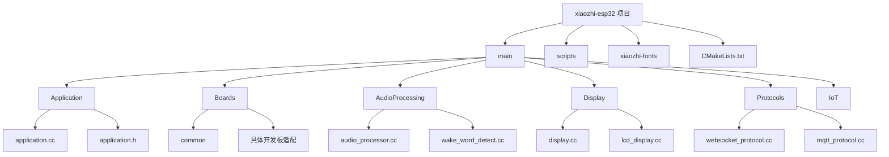
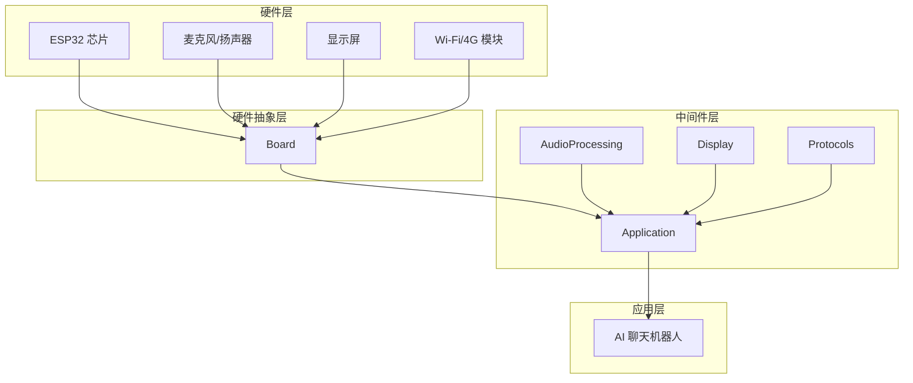
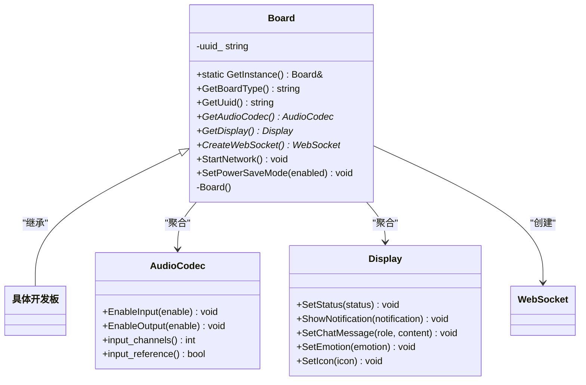
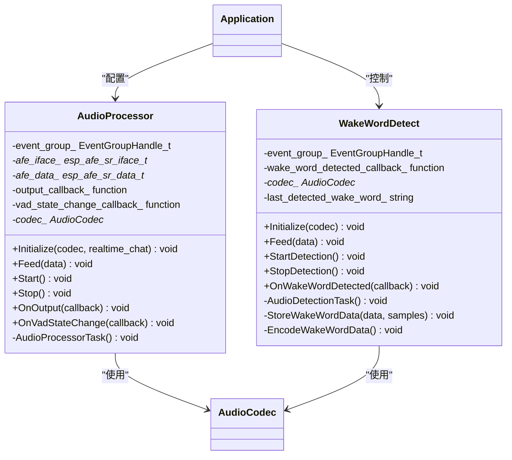
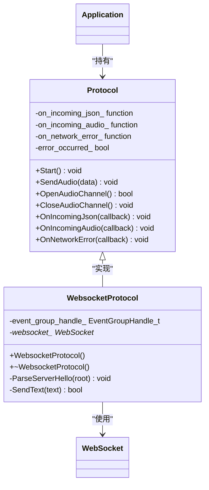
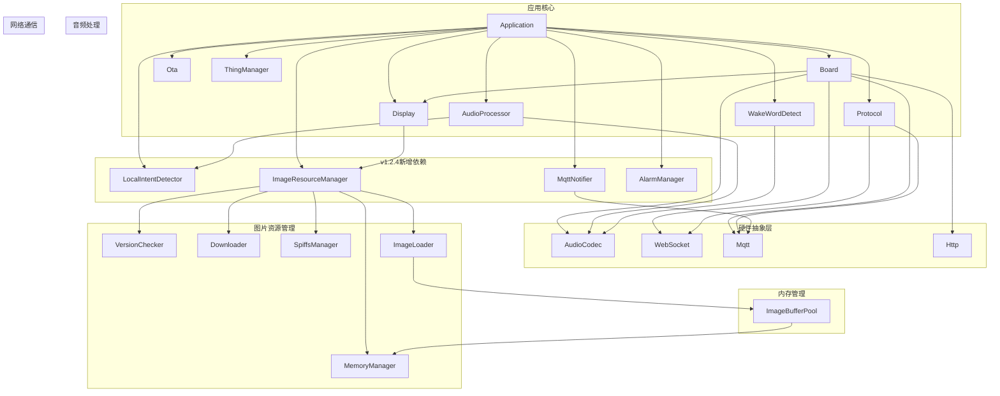

# 项目概述

<cite>
**本文档引用的文件**  
- [README.md](file://README.md)
- [main.cc](file://main/main.cc)
- [application.h](file://main/application.h)
- [application.cc](file://main/application.cc)
- [board.h](file://main/boards/common/board.h)
- [display.h](file://main/display/display.h)
- [audio_processor.h](file://main/audio_processing/audio_processor.h)
- [websocket_protocol.h](file://main/protocols/websocket_protocol.h)
- [CMakeLists.txt](file://CMakeLists.txt)
</cite>

## 目录
1. [项目概述](#项目概述)
2. [项目结构](#项目结构)
3. [核心组件](#核心组件)
4. [架构概览](#架构概览)
5. [详细组件分析](#详细组件分析)
6. [依赖关系分析](#依赖关系分析)

## 项目结构

xiaozhi-esp32 项目是一个基于 ESP32 的开源 AI 聊天机器人硬件平台，旨在将大语言模型（LLM）与嵌入式硬件结合，实现语音唤醒、流式对话、多语言交互和物联网控制等功能。项目采用模块化设计，代码结构清晰，便于扩展和维护。



**图源**  
- [README.md](file://README.md)
- 项目根目录结构

## 核心组件

项目的核心组件包括主控模块（Application）、硬件抽象层（Board）、音频处理（AudioProcessing）、显示系统（Display）、网络通信协议（Protocols）以及v1.2.4版本新增的多个智能子系统。这些模块协同工作，实现了从硬件交互到云端通信的完整功能链。

### 核心模块列表

**传统核心模块**：
- **Application**：主控单例类，协调所有子系统
- **Board**：硬件抽象层，屏蔽不同开发板差异
- **AudioProcessing**：音频采集、处理和编码
- **Display**：显示驱动和UI渲染
- **Protocols**：网络通信协议（WebSocket/MQTT）

**v1.2.4新增模块**：
- **LocalIntentDetector**：本地意图检测系统，支持离线语音指令识别
- **MqttNotifier**：轻量级MQTT通知服务，用于省电模式下的消息推送
- **ImageResource**：模块化图片资源管理系统（含VersionChecker、Downloader等子模块）
- **MemoryManager**：智能内存管理器和ImageBufferPool缓冲池
- **AlarmManager**：闹钟管理系统，支持定时和重复闹钟
- **EmoticonSystem**：7种情绪表情管理和动态加载

**本节来源**  
- [application.h](file://main/application.h)
- [board.h](file://main/boards/common/board.h)
- [display.h](file://main/display/display.h)
- [local_intent_detector.h](file://main/audio_processing/local_intent_detector.h)
- [mqtt_notifier.h](file://main/notifications/mqtt_notifier.h)
- [image_manager.h](file://main/image_manager.h)
- [memory_manager.h](file://main/memory/memory_manager.h)
- [AlarmClock.h](file://main/AlarmClock/AlarmClock.h)

## 架构概览

xiaozhi-esp32 项目采用分层架构设计，从底层硬件到上层应用逻辑逐层抽象，确保了代码的可移植性和可维护性。系统以 ESP-IDF 框架为基础，利用 LVGL 实现图形用户界面，通过 ESP-SR 实现离线语音唤醒，并使用 Opus 编码进行高效的音频流传输。



**图源**  
- [README.md](file://README.md)
- [main.cc](file://main/main.cc)
- [application.h](file://main/application.h)

## 详细组件分析

### 主控模块（Application）分析

`Application` 类是整个系统的核心控制器，采用单例模式（Singleton Pattern）确保全局唯一实例。它负责协调所有其他模块，管理设备状态机，并处理用户交互事件。

```mermaid
classDiagram
class Application {
+static GetInstance() Application&
+Start() void
+GetDeviceState() DeviceState
+Schedule(callback) void
+SetDeviceState(state) void
+Alert(status, message, emotion, sound) void
+PlaySound(sound) void
+Reboot() void
-Application()
-~Application()
-device_state_ DeviceState
-event_group_ EventGroupHandle_t
-main_tasks_ list<function<void()>>
-ota_ Ota
-protocol_ unique_ptr<Protocol>
-mutex_ mutex
}
Application --> Ota : "包含"
Application --> Protocol : "依赖"
Application --> Board : "访问"
Application --> Display : "访问"
Application --> AudioProcessor : "配置"
Application --> WakeWordDetect : "启动/停止"
```

**图源**  
- [application.h](file://main/application.h#L50-L200)
- [application.cc](file://main/application.cc#L0-L200)

#### 硬件抽象层（Board）分析

`Board` 类是硬件抽象层的核心，采用工厂模式（Factory Pattern）通过 `create_board()` 函数动态创建具体开发板实例。它为上层应用提供了统一的硬件接口，屏蔽了不同开发板之间的差异。



**图源**  
- [board.h](file://main/boards/common/board.h#L0-L57)
- [display.h](file://main/display/display.h#L0-L113)

#### 音频处理模块分析

音频处理模块由 `AudioProcessor` 和 `WakeWordDetect` 两个核心类组成，负责语音信号的采集、处理和编码。



**图源**  
- [audio_processor.h](file://main/audio_processing/audio_processor.h#L0-L47)
- [wake_word_detect.h](file://main/audio_processing/wake_word_detect.h#L0-L45)

#### 网络通信协议分析

网络通信模块采用策略模式（Strategy Pattern），`Protocol` 作为抽象基类，`WebsocketProtocol` 是其实现之一，负责与云端服务器进行实时音频流通信。



**图源**  
- [websocket_protocol.h](file://main/protocols/websocket_protocol.h#L0-L32)
- [protocol.h](file://main/protocols/protocol.h)

## 依赖关系分析

项目各模块之间的依赖关系清晰，遵循了高内聚、低耦合的设计原则。主控模块（Application）作为中心枢纽，协调其他所有模块，而硬件抽象层（Board）则有效隔离了硬件差异。v1.2.4版本进一步完善了模块间协作，新增了本地意图检测、智能内存管理和表情包系统等功能模块。



**图源**  
- [application.h](file://main/application.h)
- [board.h](file://main/boards/common/board.h)
- [main.cc](file://main/main.cc)
- [local_intent_detector.h](file://main/audio_processing/local_intent_detector.h)
- [mqtt_notifier.h](file://main/notifications/mqtt_notifier.h)
- [image_manager.h](file://main/image_manager.h)
- [memory_manager.h](file://main/memory/memory_manager.h)