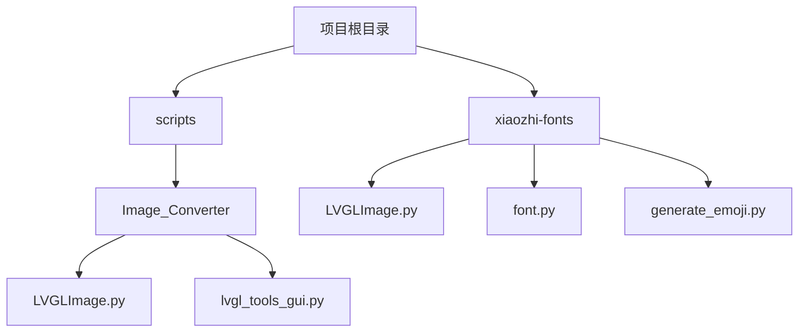
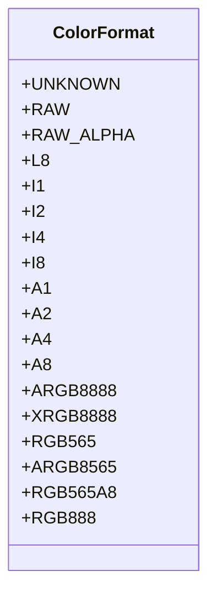
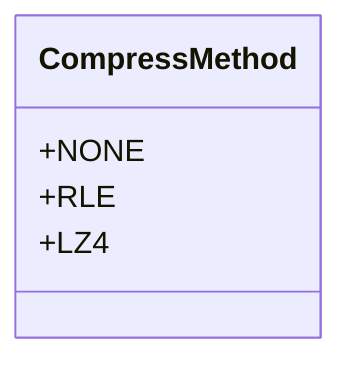
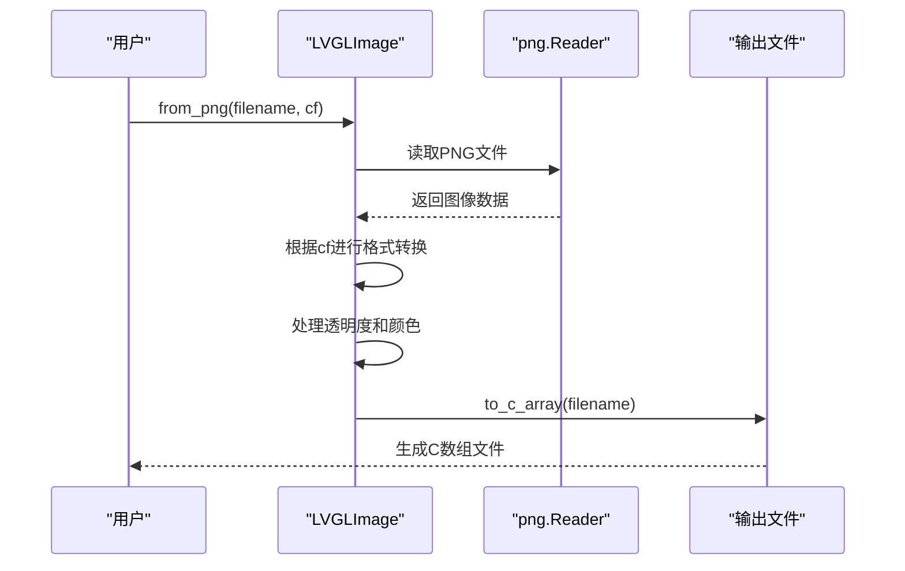
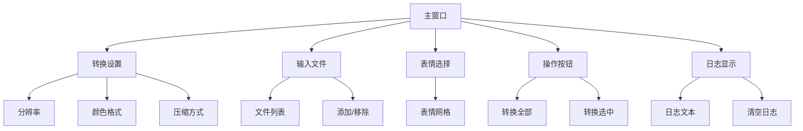
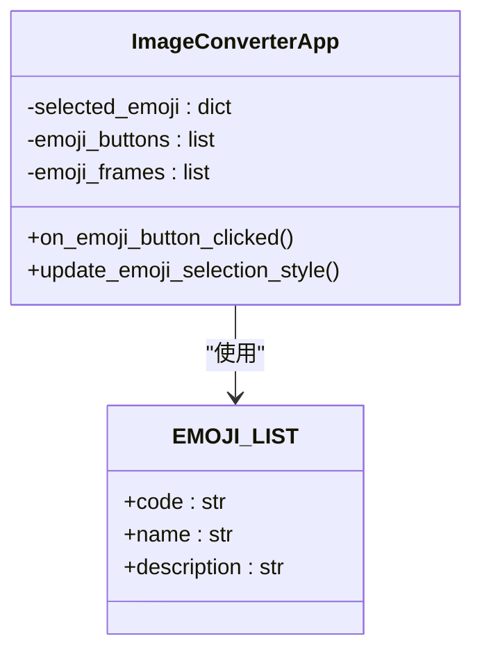
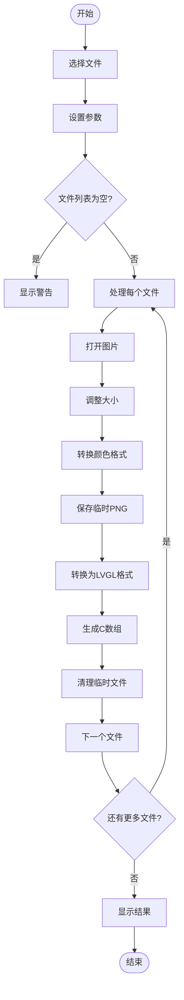
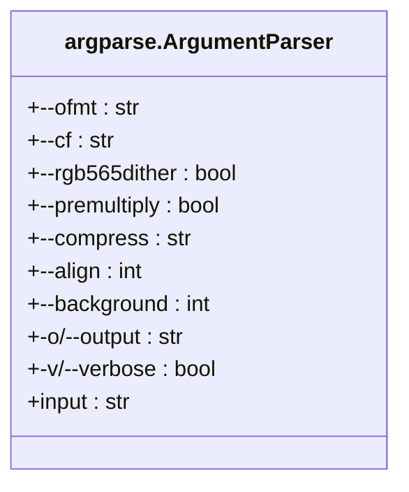
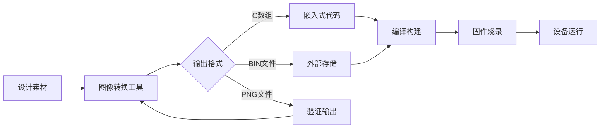

# 图像转换工具

<cite>
**本文档中引用的文件**   
- [LVGLImage.py](file://scripts\Image_Converter\LVGLImage.py)
- [lvgl_tools_gui.py](file://scripts\Image_Converter\lvgl_tools_gui.py)
- [LVGLImage.py](file://xiaozhi-fonts\LVGLImage.py)
</cite>

## 目录
1. [项目结构](#项目结构)
2. [核心组件分析](#核心组件分析)
3. [LVGLImage工具详解](#lvglimage工具详解)
4. [图形化工具分析](#图形化工具分析)
5. [命令行参数说明](#命令行参数说明)
6. [工作流程与集成](#工作流程与集成)
7. [结论](#结论)

## 项目结构
项目包含两个主要的图像转换工具实现，分别位于不同的目录中。`scripts/Image_Converter` 目录下包含主要的转换工具和图形化界面，而 `xiaozhi-fonts` 目录下也包含一个相同的 `LVGLImage.py` 文件，可能是为了字体生成的独立使用。

**图源**
- [scripts/Image_Converter/LVGLImage.py](file://scripts\Image_Converter\LVGLImage.py)
- [scripts/Image_Converter/lvgl_tools_gui.py](file://scripts\Image_Converter\lvgl_tools_gui.py)
- [xiaozhi-fonts/LVGLImage.py](file://xiaozhi-fonts\LVGLImage.py)

## 核心组件分析
项目的核心图像转换功能由 `LVGLImage.py` 文件实现，它提供了一个完整的Python类库，用于将标准图像格式转换为LVGL图形库兼容的数据结构。`lvgl_tools_gui.py` 则基于此核心库构建了一个用户友好的图形化界面。

**组件源**
- [LVGLImage.py](file://scripts\Image_Converter\LVGLImage.py)
- [lvgl_tools_gui.py](file://scripts\Image_Converter\lvgl_tools_gui.py)

## LVGLImage工具详解
`LVGLImage.py` 是一个功能强大的图像转换工具，它能够将PNG、JPG等常见图像格式转换为LVGL图形库兼容的C语言数组。该工具支持多种颜色深度和像素格式。

### 颜色格式支持
工具通过 `ColorFormat` 枚举类定义了多种颜色格式，涵盖了从1位到32位的各种深度。

**图源**
- [LVGLImage.py](file://scripts\Image_Converter\LVGLImage.py#L100-L150)

### 压缩方法
工具支持多种压缩方法，通过 `CompressMethod` 枚举类进行管理。

**图源**
- [LVGLImage.py](file://scripts\Image_Converter\LVGLImage.py#L80-L90)

### 核心转换流程
图像转换的核心流程包括从PNG文件读取、格式转换、数据处理和输出。

**图源**
- [LVGLImage.py](file://scripts\Image_Converter\LVGLImage.py#L700-L900)

## 图形化工具分析
`lvgl_tools_gui.py` 提供了一个基于PySide6的图形化界面，极大地简化了图像转换的操作流程。

### 界面组件
图形化工具的界面由多个功能区域组成，包括转换设置、文件管理、表情选择和日志显示。

**图源**
- [lvgl_tools_gui.py](file://scripts\Image_Converter\lvgl_tools_gui.py#L100-L300)

### 表情功能
工具内置了表情符号列表，允许用户将图片快速转换为预定义的表情文件。

**图源**
- [lvgl_tools_gui.py](file://scripts\Image_Converter\lvgl_tools_gui.py#L30-L70)

### 转换流程
图形化工具的转换流程封装了核心库的功能，提供了更直观的操作方式。

**图源**
- [lvgl_tools_gui.py](file://scripts\Image_Converter\lvgl_tools_gui.py#L600-L700)

## 命令行参数说明
`LVGLImage.py` 支持丰富的命令行参数，允许用户通过命令行方式进行批量转换。

**图源**
- [LVGLImage.py](file://scripts\Image_Converter\LVGLImage.py#L1300-L1400)

## 工作流程与集成
该工具链可以无缝集成到项目的构建流程中，确保UI资源与代码同步更新。

**图源**
- [LVGLImage.py](file://scripts\Image_Converter\LVGLImage.py)
- [lvgl_tools_gui.py](file://scripts\Image_Converter\lvgl_tools_gui.py)

## 结论
`LVGLImage.py` 及其图形化界面 `lvgl_tools_gui.py` 构成了一个功能完整、易于使用的图像转换工具链。该工具支持多种颜色深度（1/8/16/24/32位）、像素格式（RGB565、ARGB8888等）和压缩选项（RLE、LZ4），能够满足嵌入式UI开发的各种需求。通过命令行和图形化两种方式，开发者可以灵活地将PNG、JPG等常见图像格式转换为LVGL图形库兼容的C语言数组，极大地提升了资源处理效率。该工具链可以轻松集成到自动化构建流程中，确保UI资源与代码的同步更新。