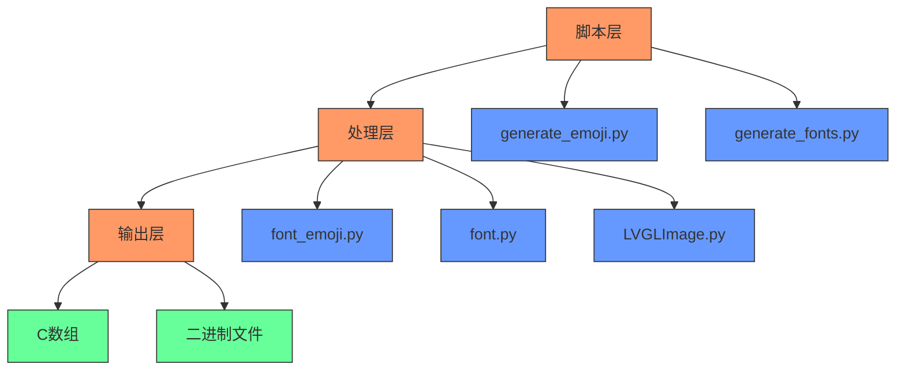
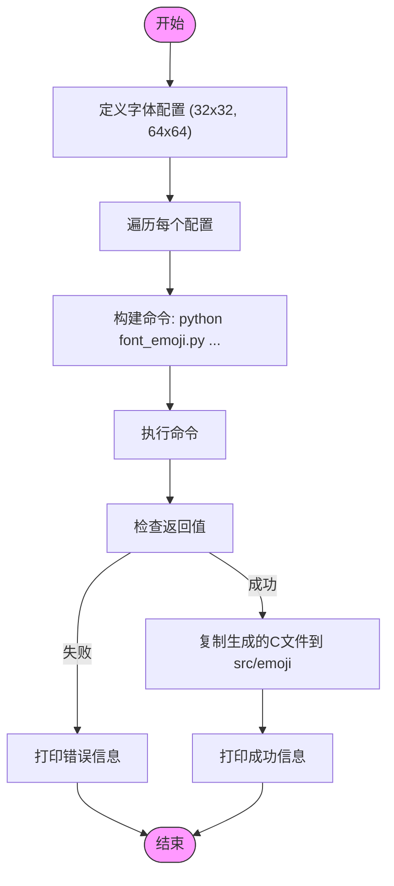
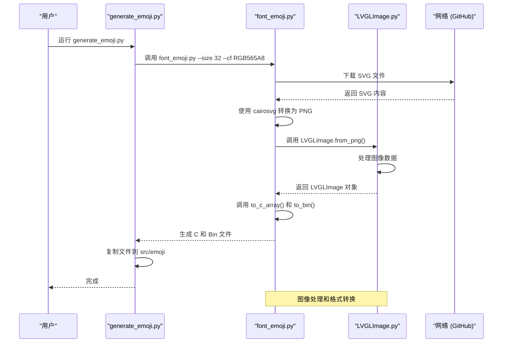
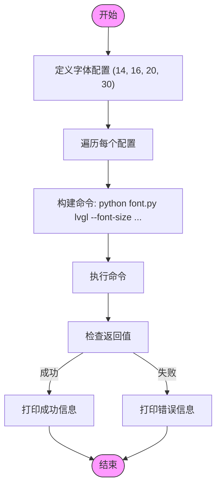
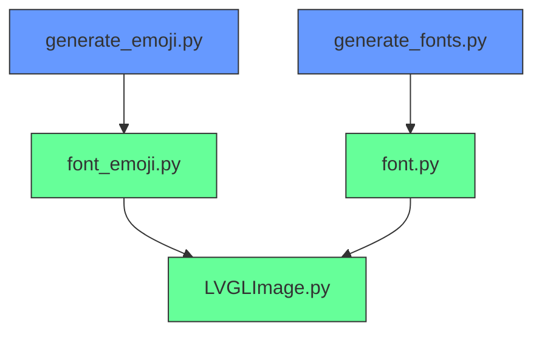

# 字体生成工具

<cite>
**本文档中引用的文件**   
- [generate_emoji.py](file://xiaozhi-fonts/generate_emoji.py)
- [font_emoji.py](file://xiaozhi-fonts/font_emoji.py)
- [generate_fonts.py](file://xiaozhi-fonts/generate_fonts.py)
- [font.py](file://xiaozhi-fonts/font.py)
- [LVGLImage.py](file://xiaozhi-fonts/LVGLImage.py)
- [font_emoji.h](file://xiaozhi-fonts/include/font_emoji.h)
- [src/emoji](file://xiaozhi-fonts/src/emoji)
</cite>

## 目录
1. [简介](#简介)
2. [项目结构](#项目结构)
3. [核心组件](#核心组件)
4. [架构概述](#架构概述)
5. [详细组件分析](#详细组件分析)
6. [依赖分析](#依赖分析)
7. [性能考虑](#性能考虑)
8. [故障排除指南](#故障排除指南)
9. [结论](#结论)

## 简介
本文档详细阐述了 `generate_emoji.py` 和相关字体生成脚本的工作原理与使用方法。说明如何从PNG格式的emoji图像生成指定尺寸（32x32、64x64）的C数组字体资源，并集成到LVGL显示系统中。介绍字体配置文件的结构，包括字符映射、字间距、行高、Unicode范围等参数设置。讲解 `generate_fonts.py` 如何批量生成FontAwesome图标字体，支持不同字号与编码格式输出。提供自定义字体添加流程，包括新emoji图像的命名规范、目录组织、生成脚本调用方式。展示如何将生成的字体资源自动嵌入固件构建过程，确保资源一致性与版本可控。

## 项目结构
项目结构清晰，主要分为 `main`、`scripts` 和 `xiaozhi-fonts` 三个主要目录。`main` 目录包含应用程序的核心代码，`scripts` 目录包含各种工具脚本，`xiaozhi-fonts` 目录则专门用于字体资源的生成和管理。

**图示来源**
- [project_structure](file://project_structure)

## 核心组件
核心组件包括 `generate_emoji.py`、`font_emoji.py`、`generate_fonts.py` 和 `font.py`。这些脚本共同协作，完成从原始图像到嵌入式系统可用字体资源的转换。

**组件来源**
- [generate_emoji.py](file://xiaozhi-fonts/generate_emoji.py)
- [font_emoji.py](file://xiaozhi-fonts/font_emoji.py)
- [generate_fonts.py](file://xiaozhi-fonts/generate_fonts.py)
- [font.py](file://xiaozhi-fonts/font.py)

## 架构概述
字体生成工具的架构分为三个主要层次：脚本层、处理层和输出层。脚本层负责调用处理层的函数，处理层负责具体的图像和字体处理，输出层负责生成最终的C数组和二进制文件。

**图示来源**
- [generate_emoji.py](file://xiaozhi-fonts/generate_emoji.py)
- [font_emoji.py](file://xiaozhi-fonts/font_emoji.py)
- [generate_fonts.py](file://xiaozhi-fonts/generate_fonts.py)
- [font.py](file://xiaozhi-fonts/font.py)
- [LVGLImage.py](file://xiaozhi-fonts/LVGLImage.py)

## 详细组件分析
### generate_emoji.py 分析
`generate_emoji.py` 是一个主控脚本，负责生成指定尺寸和颜色格式的emoji字体资源。它通过调用 `font_emoji.py` 脚本来完成具体的生成任务。

**图示来源**
- [generate_emoji.py](file://xiaozhi-fonts/generate_emoji.py#L0-L40)

**组件来源**
- [generate_emoji.py](file://xiaozhi-fonts/generate_emoji.py#L0-L40)

### font_emoji.py 分析
`font_emoji.py` 负责从SVG文件下载并转换为PNG，然后生成LVGL格式的C数组和二进制文件。它支持多种颜色格式和压缩方法。

**图示来源**
- [font_emoji.py](file://xiaozhi-fonts/font_emoji.py#L0-L119)
- [LVGLImage.py](file://xiaozhi-fonts/LVGLImage.py)

**组件来源**
- [font_emoji.py](file://xiaozhi-fonts/font_emoji.py#L0-L119)
- [LVGLImage.py](file://xiaozhi-fonts/LVGLImage.py)

### generate_fonts.py 分析
`generate_fonts.py` 负责批量生成FontAwesome图标字体，支持不同字号与编码格式输出。

**图示来源**
- [generate_fonts.py](file://xiaozhi-fonts/generate_fonts.py#L0-L25)

**组件来源**
- [generate_fonts.py](file://xiaozhi-fonts/generate_fonts.py#L0-L25)

## 依赖分析
字体生成工具的依赖关系清晰，`generate_emoji.py` 和 `generate_fonts.py` 作为主控脚本，分别依赖 `font_emoji.py` 和 `font.py` 进行具体的处理，而这些处理脚本又依赖 `LVGLImage.py` 进行图像格式转换。

**图示来源**
- [generate_emoji.py](file://xiaozhi-fonts/generate_emoji.py)
- [font_emoji.py](file://xiaozhi-fonts/font_emoji.py)
- [generate_fonts.py](file://xiaozhi-fonts/generate_fonts.py)
- [font.py](file://xiaozhi-fonts/font.py)
- [LVGLImage.py](file://xiaozhi-fonts/LVGLImage.py)

**组件来源**
- [generate_emoji.py](file://xiaozhi-fonts/generate_emoji.py)
- [font_emoji.py](file://xiaozhi-fonts/font_emoji.py)
- [generate_fonts.py](file://xiaozhi-fonts/generate_fonts.py)
- [font.py](file://xiaozhi-fonts/font.py)
- [LVGLImage.py](file://xiaozhi-fonts/LVGLImage.py)

## 性能考虑
字体生成工具在处理大量图像时，性能主要受网络下载速度和图像转换算法的影响。建议在生成大量字体资源时，使用高速网络连接，并确保系统有足够的内存和计算资源。

## 故障排除指南
### 常见问题
1. **网络连接问题**：确保能够访问 `raw.githubusercontent.com`，否则无法下载SVG文件。
2. **依赖缺失**：确保安装了 `pypng` 和 `lz4` 包，否则 `LVGLImage.py` 无法正常工作。
3. **权限问题**：确保脚本有写入 `build` 和 `src/emoji` 目录的权限。

**组件来源**
- [generate_emoji.py](file://xiaozhi-fonts/generate_emoji.py)
- [font_emoji.py](file://xiaozhi-fonts/font_emoji.py)
- [LVGLImage.py](file://xiaozhi-fonts/LVGLImage.py)

## 结论
本文档详细介绍了 `generate_emoji.py` 和相关字体生成脚本的工作原理与使用方法。通过这些工具，可以高效地生成适用于LVGL显示系统的字体资源，确保资源的一致性和版本可控性。