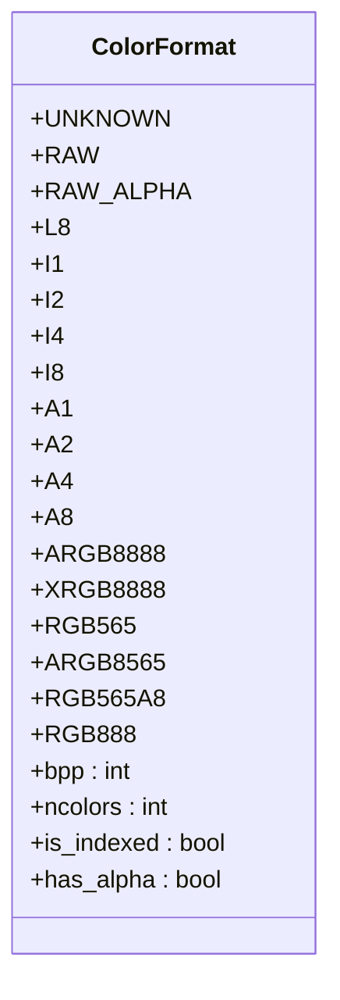
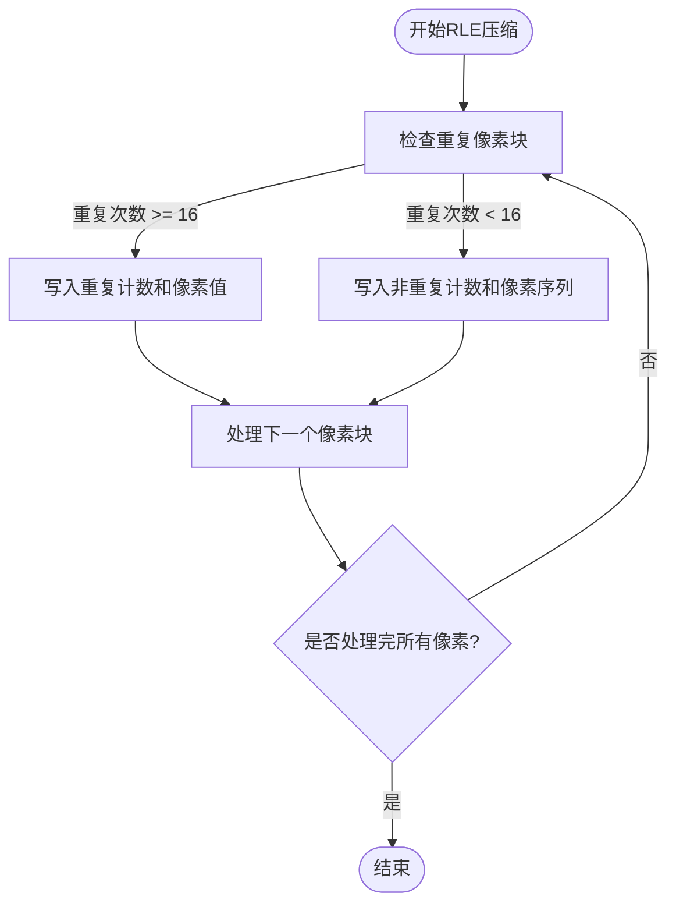
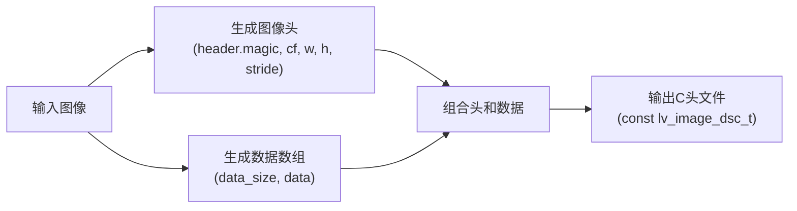
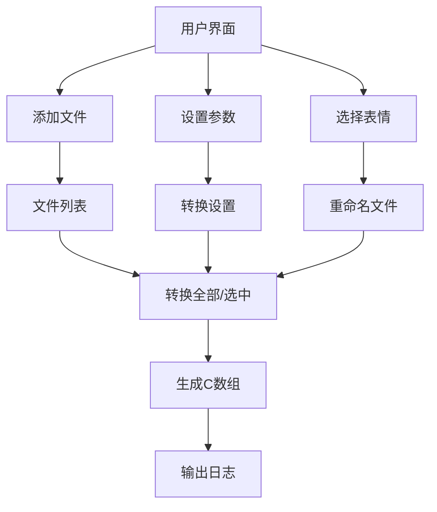
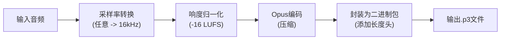

# 工具高级用法

<cite>
**本文档中引用的文件**   
- [LVGLImage.py](file://scripts/Image_Converter/LVGLImage.py)
- [lvgl_tools_gui.py](file://scripts/Image_Converter/lvgl_tools_gui.py)
- [convert_audio_to_p3.py](file://scripts/p3_tools/convert_audio_to_p3.py)
- [generate_emoji.py](file://xiaozhi-fonts/generate_emoji.py)
</cite>

## 目录
1. [图像与资源转换工具高级使用指南](#图像与资源转换工具高级使用指南)
2. [LVGL图像转换原理](#lvgl图像转换原理)
3. [图形界面批量处理](#图形界面批量处理)
4. [Emoji字体生成](#emoji字体生成)
5. [音频资源优化](#音频资源优化)
6. [自动化构建集成](#自动化构建集成)

## 图像与资源转换工具高级使用指南

本指南详细介绍了项目中用于图像、字体和音频资源转换的高级工具链。这些工具旨在将标准格式的资源文件（如PNG、JPG、WAV）转换为适用于嵌入式系统（特别是LVGL图形库）的优化格式，包括C数组、压缩二进制流等，以实现高效的内存使用和快速渲染。

**Section sources**
- [LVGLImage.py](file://scripts/Image_Converter/LVGLImage.py)
- [lvgl_tools_gui.py](file://scripts/Image_Converter/lvgl_tools_gui.py)
- [convert_audio_to_p3.py](file://scripts/p3_tools/convert_audio_to_p3.py)
- [generate_emoji.py](file://xiaozhi-fonts/generate_emoji.py)

## LVGL图像转换原理

`LVGLImage.py` 是核心的图像转换工具，负责将PNG/JPG等图像文件转换为LVGL兼容的C数组或二进制格式。其工作原理基于对LVGL图像数据结构的精确实现。

### 颜色格式与深度

该工具支持多种LVGL颜色格式（`ColorFormat`），每种格式对应不同的颜色深度和存储方式。颜色深度（bpp）直接影响图像质量和内存占用。



**Diagram sources**
- [LVGLImage.py](file://scripts/Image_Converter/LVGLImage.py#L100-L150)

**Section sources**
- [LVGLImage.py](file://scripts/Image_Converter/LVGLImage.py#L100-L200)

### 压缩格式（RLE）

工具支持RLE（Run-Length Encoding）和LZ4两种压缩方式。RLE算法特别适用于包含大面积相同颜色的图像。



**Diagram sources**
- [LVGLImage.py](file://scripts/Image_Converter/LVGLImage.py#L1100-L1200)

**Section sources**
- [LVGLImage.py](file://scripts/Image_Converter/LVGLImage.py#L1100-L1200)

### 输出头文件配置

转换后的图像被封装为一个C语言结构体 `lv_image_dsc_t`，包含图像头信息和数据数组。`write_c_array_file` 函数负责生成此结构。



**Diagram sources**
- [LVGLImage.py](file://scripts/Image_Converter/LVGLImage.py#L400-L500)

**Section sources**
- [LVGLImage.py](file://scripts/Image_Converter/LVGLImage.py#L400-L500)

## 图形界面批量处理

`lvgl_tools_gui.py` 提供了一个基于PySide6的图形用户界面，极大地简化了批量图像转换的流程。

### 批量处理功能

该GUI工具支持以下核心功能：
- **批量导入**：通过“添加文件”按钮一次性选择多个图像文件。
- **参数配置**：统一设置分辨率、颜色格式和压缩方式。
- **表情重命名**：内置表情符号列表，可一键选择并自动重命名文件。
- **日志输出**：实时显示转换过程中的详细信息。



**Diagram sources**
- [lvgl_tools_gui.py](file://scripts/Image_Converter/lvgl_tools_gui.py#L200-L400)

**Section sources**
- [lvgl_tools_gui.py](file://scripts/Image_Converter/lvgl_tools_gui.py#L200-L400)

## Emoji字体生成

`generate_emoji.py` 是一个自动化脚本，用于生成不同尺寸的emoji字体。

### 参数配置方法

该脚本通过定义 `emoji_configs` 列表来配置生成任务。每个配置项是一个元组，包含尺寸和颜色格式。

```python
emoji_configs = [
    (32, 'RGB565A8'),  # 32x32
    (64, 'RGB565A8'),  # 64x64
]
```

脚本会遍历此列表，为每个配置项调用 `font_emoji.py` 脚本，并将生成的C文件复制到指定目录。

**Section sources**
- [generate_emoji.py](file://xiaozhi-fonts/generate_emoji.py#L5-L20)

## 音频资源优化

`convert_audio_to_p3.py` 工具链用于将音频文件转换为协议v3流，实现音频资源的优化。

### 工具链应用

该工具链执行以下优化步骤：
- **采样率转换**：使用 `librosa.resample` 将音频统一转换为16kHz。
- **比特率压缩**：使用Opus编码器进行高效压缩。
- **格式封装**：将Opus数据封装为带有长度头的二进制包。
- **响度归一化**：使用 `pyloudnorm` 库调整音频响度，确保播放音量一致。



**Diagram sources**
- [convert_audio_to_p3.py](file://scripts/p3_tools/convert_audio_to_p3.py#L10-L30)

**Section sources**
- [convert_audio_to_p3.py](file://scripts/p3_tools/convert_audio_to_p3.py#L10-L30)

## 自动化构建集成

这些工具可以轻松集成到CI/CD流程中，实现资源文件的自动转换与版本控制。

### 自动化构建脚本示例

```bash
#!/bin/bash
# 构建脚本示例

# 1. 转换所有图像资源
python scripts/Image_Converter/LVGLImage.py --ofmt C --cf RGB565 --compress RLE assets/images/*.png -o build/images

# 2. 生成emoji字体
cd xiaozhi-fonts && python generate_emoji.py && cd ..

# 3. 转换音频资源
python scripts/p3_tools/convert_audio_to_p3.py -l -16 assets/audio/greeting.wav build/audio/greeting.p3

# 4. 编译主程序
idf.py build
```

此脚本可以在每次代码提交时自动执行，确保所有资源文件都是最新且优化过的。

**Section sources**
- [LVGLImage.py](file://scripts/Image_Converter/LVGLImage.py)
- [generate_emoji.py](file://xiaozhi-fonts/generate_emoji.py)
- [convert_audio_to_p3.py](file://scripts/p3_tools/convert_audio_to_p3.py)