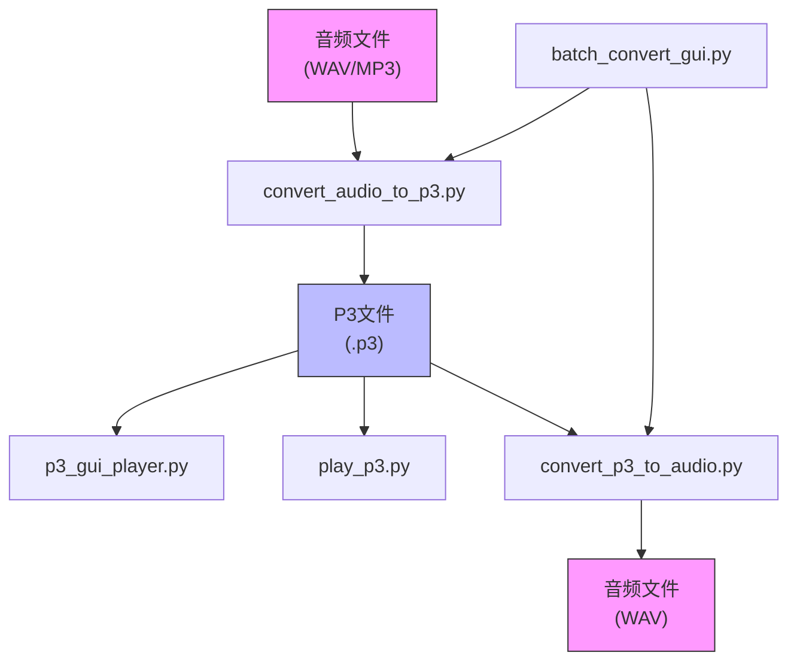
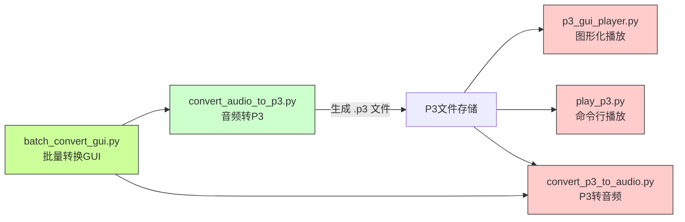
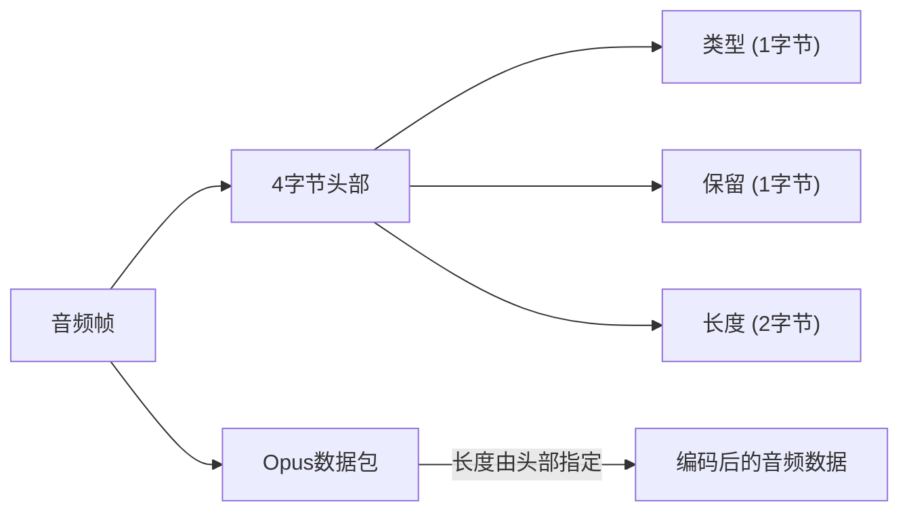
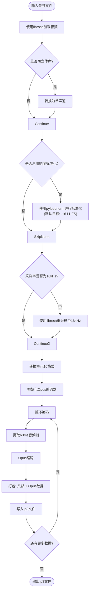
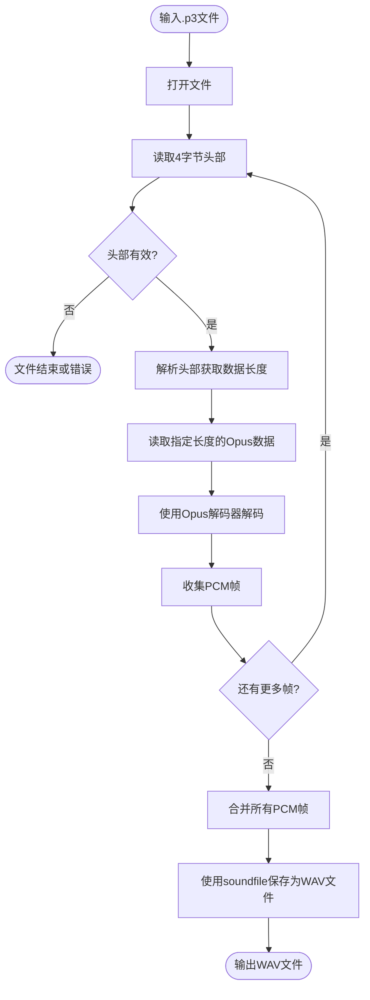
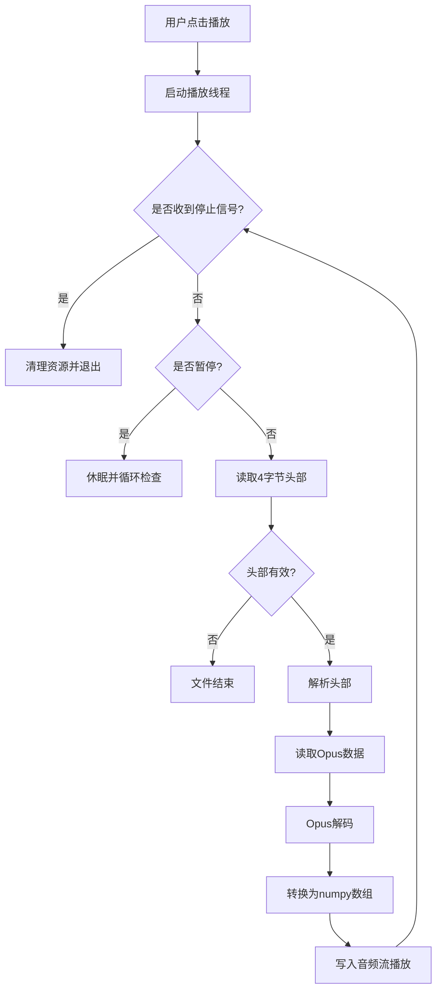
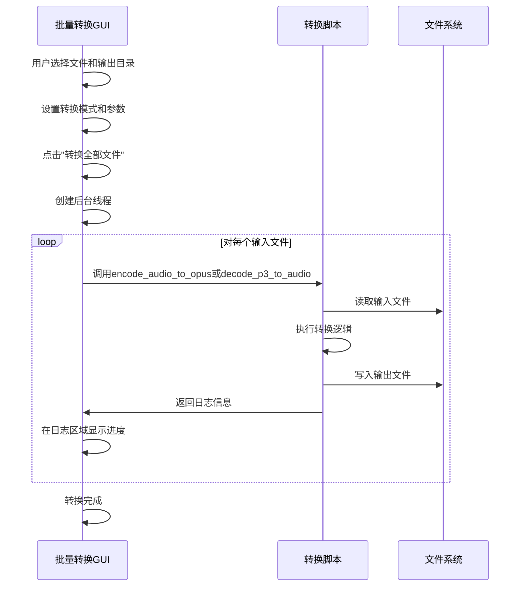
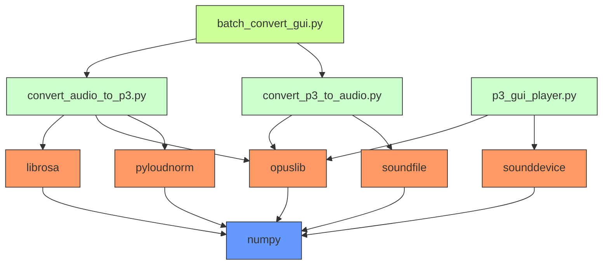

# 音频处理工具

<cite>
**本文档引用的文件**   
- [convert_audio_to_p3.py](file://scripts/p3_tools/convert_audio_to_p3.py)
- [convert_p3_to_audio.py](file://scripts/p3_tools/convert_p3_to_audio.py)
- [p3_gui_player.py](file://scripts/p3_tools/p3_gui_player.py)
- [batch_convert_gui.py](file://scripts/p3_tools/batch_convert_gui.py)
- [play_p3.py](file://scripts/p3_tools/play_p3.py)
- [README.md](file://scripts/p3_tools/README.md)
</cite>

## 目录
1. [简介](#简介)
2. [项目结构](#项目结构)
3. [核心组件](#核心组件)
4. [架构概述](#架构概述)
5. [详细组件分析](#详细组件分析)
6. [依赖分析](#依赖分析)
7. [性能考量](#性能考量)
8. [故障排除指南](#故障排除指南)
9. [结论](#结论)

## 简介
本文档全面介绍了一套用于处理P3音频格式的工具链，该工具链位于`scripts/p3_tools`目录下。P3格式是一种专为嵌入式设备优化的流式音频格式，采用Opus编码，具有高压缩率和低延迟特性。本工具链包含音频转换、反向解包、播放和批量处理等功能，旨在提升语音资源的加载效率与存储利用率。文档将详细说明P3格式的封装机制、各工具的使用方法，并提供自动化集成示例。

## 项目结构
音频处理工具链集中于`scripts/p3_tools`目录，提供了一套完整的Python脚本，用于处理P3格式音频文件。这些工具相互协作，形成了一个从音频转换到播放验证的完整工作流。

**图示来源**
- [README.md](file://scripts/p3_tools/README.md#L1-L94)

## 核心组件
本工具链的核心功能由三个主要Python脚本实现：`convert_audio_to_p3.py`负责将普通音频文件转换为P3格式；`convert_p3_to_audio.py`提供反向解包功能，用于调试和验证；`p3_gui_player.py`和`play_p3.py`则提供了图形化和命令行的播放能力。`batch_convert_gui.py`作为前端，集成了转换功能，支持批量处理。

**本节来源**
- [convert_audio_to_p3.py](file://scripts/p3_tools/convert_audio_to_p3.py#L0-L61)
- [convert_p3_to_audio.py](file://scripts/p3_tools/convert_p3_to_audio.py#L0-L51)
- [p3_gui_player.py](file://scripts/p3_tools/p3_gui_player.py#L0-L199)

## 架构概述
P3音频工具链的架构是一个典型的生产者-消费者模型。`convert_audio_to_p3.py`作为生产者，将原始音频数据转换并封装成P3格式。生成的P3文件可以被多个消费者使用：`p3_gui_player.py`和`play_p3.py`用于播放和预览，`convert_p3_to_audio.py`用于解包和验证。`batch_convert_gui.py`作为用户界面，协调了生产者和部分消费者的功能，实现了批量自动化处理。

**图示来源**
- [README.md](file://scripts/p3_tools/README.md#L1-L94)
- [batch_convert_gui.py](file://scripts/p3_tools/batch_convert_gui.py#L0-L220)

## 详细组件分析
### P3格式封装机制分析
P3格式是一种简单的流式音频容器，其设计旨在高效地在资源受限的嵌入式设备上进行流式解码。其核心特点包括Opus编码、标准化的采样率和帧结构。

#### P3格式结构
P3文件由一系列连续的音频帧组成，每个帧包含一个4字节的头部和可变长度的Opus数据包。
- **头部 (4字节)**: 使用大端字节序（`>BBH`）。
  - **类型 (1字节)**: 当前未使用，通常为0。
  - **保留 (1字节)**: 当前未使用，通常为0。
  - **长度 (2字节)**: 紧随其后的Opus数据包的字节长度。
- **Opus数据包**: 经过Opus编码的音频数据。

**图示来源**
- [README.md](file://scripts/p3_tools/README.md#L88-L94)
- [convert_p3_to_audio.py](file://scripts/p3_tools/convert_p3_to_audio.py#L10-L12)

#### 音频处理流程
`convert_audio_to_p3.py`脚本执行了完整的音频预处理和编码流程，确保输出的P3文件符合设备要求。

**图示来源**
- [convert_audio_to_p3.py](file://scripts/p3_tools/convert_audio_to_p3.py#L0-L61)

### 反向解包与调试功能
`convert_p3_to_audio.py`是`convert_audio_to_p3.py`的逆向工具，用于将P3文件解包回标准的WAV文件，这对于验证转换过程的完整性和调试音频问题至关重要。

**本节来源**
- [convert_p3_to_audio.py](file://scripts/p3_tools/convert_p3_to_audio.py#L0-L51)

#### 解包流程
该脚本的解包流程与封装流程相反，它读取P3文件的头部以确定数据包长度，然后使用Opus解码器还原PCM音频数据。

**图示来源**
- [convert_p3_to_audio.py](file://scripts/p3_tools/convert_p3_to_audio.py#L10-L51)

### 图形化播放器使用方法
`p3_gui_player.py`提供了一个图形用户界面（GUI），允许用户方便地加载、播放和管理P3音频文件列表。

#### 播放器功能
- **播放列表管理**: 用户可以添加、移除和清空P3文件。
- **播放控制**: 提供播放、暂停、停止按钮。
- **循环播放**: 可通过复选框启用。
- **状态显示**: 实时显示当前播放的文件名。

**本节来源**
- [p3_gui_player.py](file://scripts/p3_tools/p3_gui_player.py#L0-L199)

#### 播放逻辑
播放器使用`sounddevice`库创建音频输出流，并在独立线程中循环读取P3文件的每一帧进行解码和播放，确保主线程的GUI响应性。

**图示来源**
- [p3_gui_player.py](file://scripts/p3_tools/p3_gui_player.py#L20-L100)

### 自动化脚本集成
`batch_convert_gui.py`是工具链的集大成者，它提供了一个图形界面来批量执行音频到P3以及P3到音频的转换，非常适合在CI/CD流程中进行自动化处理。

#### 批量转换逻辑
该脚本通过`threading`模块在后台线程中执行转换任务，避免阻塞GUI。它根据用户选择的模式，调用`convert_audio_to_p3.py`或`convert_p3_to_audio.py`中的函数。

**图示来源**
- [batch_convert_gui.py](file://scripts/p3_tools/batch_convert_gui.py#L0-L220)
- [convert_audio_to_p3.py](file://scripts/p3_tools/convert_audio_to_p3.py#L0-L61)
- [convert_p3_to_audio.py](file://scripts/p3_tools/convert_p3_to_audio.py#L0-L51)

## 依赖分析
P3工具链依赖于多个Python库来实现其功能。这些依赖关系清晰地划分了不同模块的职责。

**图示来源**
- [requirements.txt](file://scripts/p3_tools/requirements.txt)
- [convert_audio_to_p3.py](file://scripts/p3_tools/convert_audio_to_p3.py#L1-L10)
- [convert_p3_to_audio.py](file://scripts/p3_tools/convert_p3_to_audio.py#L1-L10)

## 性能考量
P3格式的设计充分考虑了嵌入式设备的性能限制：
- **采样率**: 固定为16kHz，平衡了音质和计算负载。
- **声道**: 单声道，减少数据量和处理复杂度。
- **帧大小**: 60ms的帧长在延迟和编码效率之间取得了良好平衡。
- **编码**: Opus编码在低比特率下仍能保持良好的语音清晰度。

## 故障排除指南
- **转换失败**: 检查输入文件路径是否正确，确认依赖库已安装。如果音频已标准化，尝试使用`-d`参数禁用响度调整。
- **播放无声**: 确认P3文件非空，检查音频设备是否正常工作。
- **GUI无响应**: 转换大文件时，后台线程可能占用大量CPU，导致GUI短暂卡顿，属正常现象。
- **依赖缺失**: 运行`pip install -r scripts/p3_tools/requirements.txt`安装所有依赖。

**本节来源**
- [README.md](file://scripts/p3_tools/README.md#L75-L94)
- [convert_audio_to_p3.py](file://scripts/p3_tools/convert_audio_to_p3.py#L10-L20)

## 结论
本文档详细介绍了P3音频工具链的各个组成部分及其工作原理。该工具链通过`convert_audio_to_p3.py`实现了高效的音频压缩和标准化，通过`convert_p3_to_audio.py`和`p3_gui_player.py`提供了强大的调试和验证能力，并通过`batch_convert_gui.py`实现了用户友好的批量处理。这套工具非常适合在语音资源的版本化管理和CI/CD流程中集成，能够显著提升开发效率和资源质量。