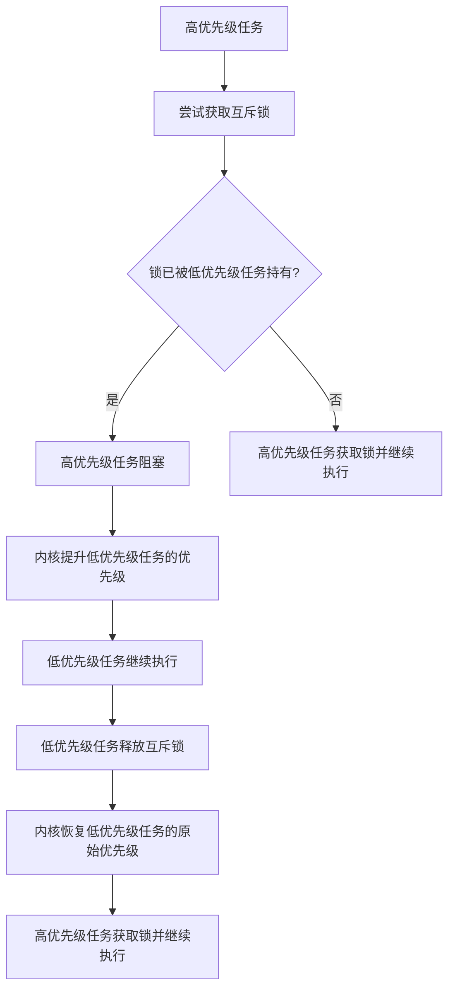
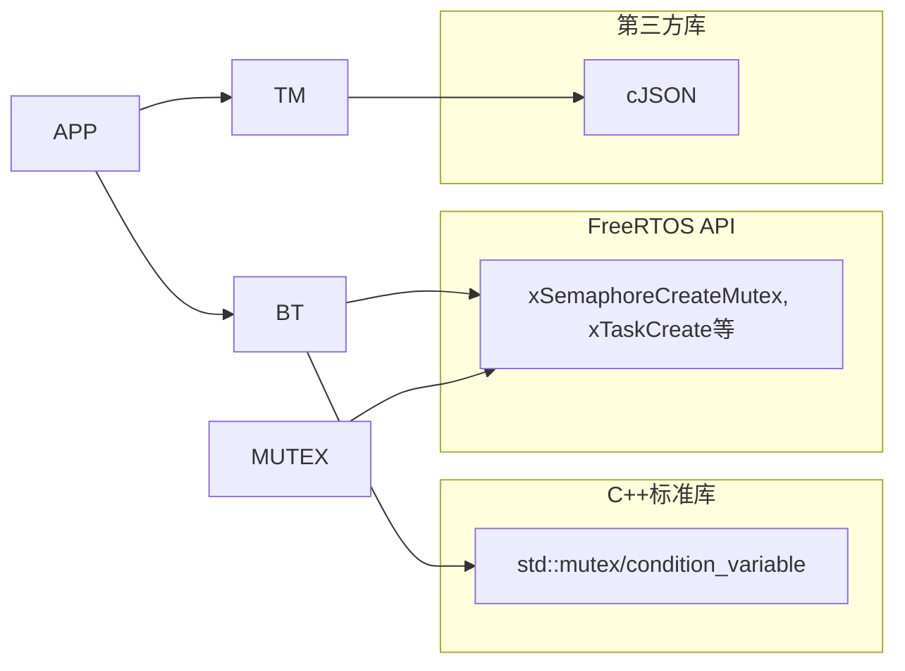

# FreeRTOS任务调度优化

<cite>
**本文档引用的文件**   
- [background_task.cc](file://main/background_task.cc)
- [background_task.h](file://main/background_task.h)
- [application.cc](file://main/application.cc)
- [application.h](file://main/application.h)
- [thing_manager.cc](file://main/iot/thing_manager.cc)
- [thing_manager.h](file://main/iot/thing_manager.h)
- [freertos_mutex.h](file://main/memory/freertos_mutex.h)
</cite>

## 目录
1. [引言](#引言)
2. [项目结构](#项目结构)
3. [核心组件](#核心组件)
4. [架构概述](#架构概述)
5. [详细组件分析](#详细组件分析)
6. [依赖分析](#依赖分析)
7. [性能考量](#性能考量)
8. [故障排除指南](#故障排除指南)
9. [结论](#结论)

## 引言
本文档旨在为基于ESP32平台的嵌入式系统提供一份全面的FreeRTOS任务调度优化指南。文档深入分析了`background_task`模块中任务的优先级设置原则与堆栈大小配置策略，阐述了如何利用FreeRTOS的互斥机制有效避免优先级反转问题，并探讨了任务间通信的效率优化方法。结合`application`和`thing_manager`模块的事件处理模型，本文设计了一套低延迟、高响应的任务调度方案。此外，文档还提供了利用ESP-IDF工具监控CPU使用率、识别并调优高占用任务的方法，最终通过典型任务配置参数表和性能对比数据，为开发者提供可量化的优化依据。

## 项目结构
本项目采用模块化设计，代码结构清晰。核心功能分散在`main`目录下的多个子模块中。与任务调度直接相关的文件主要位于`main`根目录和`iot`子目录。`background_task.cc`和`background_task.h`构成了后台任务调度的核心引擎。`application.cc`和`application.h`作为应用程序的主控制器，负责协调系统状态和事件。`iot`目录下的`thing_manager.cc`和`thing_manager.h`则管理着物联网设备的实体和状态。`memory`目录中的`freertos_mutex.h`提供了关键的互斥锁实现，用于解决并发访问问题。

```mermaid
graph TD
subgraph "核心调度模块"
BT[background_task.cc/h]
APP[application.cc/h]
TM[thing_manager.cc/h]
end
subgraph "关键支持模块"
MUTEX[freertos_mutex.h]
MEM[memory_manager.cc/h]
CONFIG[resource_config.cc/h]
end
BT --> APP : 提供任务调度接口
APP --> TM : 触发设备状态更新
APP --> MUTEX : 保护共享资源
CONFIG --> MEM : 提供内存配置
MEM --> BT : 内存分配/释放
```

**图示来源**
- [background_task.h](file://main/background_task.h#L1-L32)
- [application.h](file://main/application.h#L1-L228)
- [thing_manager.h](file://main/iot/thing_manager.h#L1-L43)
- [freertos_mutex.h](file://main/memory/freertos_mutex.h#L1-L143)

**本节来源**
- [main](file://main)

## 核心组件
本系统的核心组件围绕FreeRTOS任务调度展开。`BackgroundTask`类是任务调度的基石，它创建一个独立的FreeRTOS任务来异步执行用户提交的回调函数。`Application`类作为系统的中枢，管理着设备的生命周期、状态机和事件分发。`ThingManager`类负责聚合和管理所有IoT设备（`Thing`），并提供统一的接口来查询和更新设备状态。这些组件通过事件组（`EventGroup`）、互斥锁（`Mutex`）和函数队列等机制进行通信和同步。

**本节来源**
- [background_task.cc](file://main/background_task.cc#L1-L73)
- [application.cc](file://main/application.cc#L1-L199)
- [thing_manager.cc](file://main/iot/thing_manager.cc#L1-L89)

## 架构概述
系统的整体架构是一个以`Application`为核心的事件驱动模型。`Application`实例化并管理一个`BackgroundTask`对象，用于处理所有耗时或非实时的后台操作。当系统需要执行一个后台任务时，`Application`会调用`BackgroundTask::Schedule()`方法，将任务函数推入一个线程安全的队列。`BackgroundTask`内部的任务循环会监听该队列，一旦有新任务加入，便将其取出并执行。同时，`ThingManager`作为设备管理层，其状态变化会通过`Application`的`UpdateIotStates()`等方法被周期性地检查和上报，整个流程构成了一个闭环的控制与反馈系统。

```mermaid
sequenceDiagram
participant App as Application
participant BT as BackgroundTask
participant Task as "用户任务"
participant Loop as "后台任务循环"
App->>BT : Schedule(任务函数)
BT->>BT : 加锁，将任务加入main_tasks_队列
BT->>BT : 通知条件变量
Loop->>BT : 等待条件变量
BT->>Loop : 唤醒
Loop->>BT : 获取锁，取出所有待处理任务
BT->>Loop : 解锁
Loop->>Task : 执行任务函数
Task->>Loop : 任务完成
Loop->>BT : 任务完成回调，减少active_tasks_计数
BT->>Loop : 通知条件变量用于WaitForCompletion
```

**图示来源**
- [background_task.cc](file://main/background_task.cc#L1-L73)
- [application.cc](file://main/application.cc#L1-L199)

## 详细组件分析

### BackgroundTask分析
`BackgroundTask`类的设计精巧，实现了任务的异步执行和资源管理。

#### 类结构与任务创建
`BackgroundTask`在构造函数中使用`xTaskCreate`创建了一个FreeRTOS任务。该任务的优先级被硬编码为`2`，堆栈大小由构造函数参数`stack_size`决定，其默认值在头文件中定义为`4096 * 2`（8KB）。在`application.cc`中，实例化`BackgroundTask`时传入了`4096 * 8`（32KB）的堆栈大小，表明对于主应用的后台任务，需要更大的堆栈空间来处理复杂的操作，如OTA升级。

```mermaid
classDiagram
class BackgroundTask {
+BackgroundTask(uint32_t stack_size = 8192)
+~BackgroundTask()
+Schedule(callback)
+WaitForCompletion()
+ClearQueue()
-BackgroundTaskLoop()
-mutex_ : std : : mutex
-main_tasks_ : std : : list<std : : function<void()>>
-condition_variable_ : std : : condition_variable
-background_task_handle_ : TaskHandle_t
-active_tasks_ : std : : atomic<size_t>
}
BackgroundTask --> "1" "1" : 创建并运行
note right of BackgroundTask
优先级 : 2 (在xTaskCreate中指定)
堆栈大小 : 可配置，默认8KB，应用中使用32KB
end note
```

**图示来源**
- [background_task.h](file://main/background_task.h#L1-L32)
- [background_task.cc](file://main/background_task.cc#L1-L73)

#### 任务调度与执行流程
`Schedule`方法是任务提交的入口。它使用`std::mutex`保护`main_tasks_`队列，确保线程安全。提交的任务会被包装在一个新的`std::function`中，这个包装函数在执行完用户任务后，会自动递减`active_tasks_`计数器，并在所有任务完成后通知`condition_variable_`，这使得`WaitForCompletion`方法能够阻塞等待所有后台任务完成。

**本节来源**
- [background_task.cc](file://main/background_task.cc#L1-L73)

### Application分析
`Application`类是整个系统的控制中心，其事件处理模型与`BackgroundTask`紧密集成。

#### 事件处理与任务集成
`Application`通过`Schedule`方法将任务提交给`BackgroundTask`。一个典型的例子是OTA升级流程。当检测到新版本时，`CheckNewVersion`方法会调用`Schedule`，将一个包含升级逻辑的Lambda函数提交到后台任务队列。这确保了耗时的网络下载和固件写入操作不会阻塞主应用循环，从而保持了系统的响应性。

#### 状态机与低延迟设计
`Application`维护一个`DeviceState`枚举，定义了从`kDeviceStateStarting`到`kDeviceStateUpgrading`等多种状态。这种状态机设计使得系统能够根据当前状态做出不同的行为决策。例如，在`kDeviceStateSpeaking`状态下，系统会优先保证音频处理的实时性。为了实现低延迟，关键的事件（如时钟滴答）使用了`ESP_TIMER_TASK`调度方法，这能确保定时器回调在任务上下文中执行，减少延迟。

**本节来源**
- [application.cc](file://main/application.cc#L1-L199)
- [application.h](file://main/application.h#L1-L228)

### ThingManager分析
`ThingManager`负责管理所有IoT设备的状态。

#### 事件处理模型
`ThingManager`提供了一个`GetStatesJson`方法，该方法可以以全量或增量（delta）的方式获取所有设备的状态。增量模式通过`last_states_`缓存来实现，只返回发生变化的状态，这极大地优化了网络通信的效率。`Invoke`和`InvokeSync`方法则用于接收并分发控制命令到具体的`Thing`对象。

#### 与任务调度的集成
`ThingManager`本身不直接创建任务，但其状态更新操作通常由`Application`在`BackgroundTask`的上下文中触发。例如，`Application::UpdateIotStates()`方法可能会调用`ThingManager::GetStatesJson(true)`来获取增量状态，并通过网络协议上报。这种设计将设备状态管理与任务调度解耦，提高了系统的模块化程度。

**本节来源**
- [thing_manager.cc](file://main/iot/thing_manager.cc#L1-L89)
- [thing_manager.h](file://main/iot/thing_manager.h#L1-L43)

### 互斥机制与优先级反转分析
优先级反转是实时系统中的一个经典问题，当一个低优先级任务持有高优先级任务所需的资源时，会导致高优先级任务被阻塞，而中等优先级的任务却可以抢占执行，从而破坏了优先级调度的初衷。

#### FreeRTOSMutex实现
`freertos_mutex.h`中的`FreeRTOSMutex`类通过使用FreeRTOS原生的互斥信号量（`xSemaphoreCreateMutex`）来解决此问题。关键在于，FreeRTOS的互斥信号量支持**优先级继承（Priority Inheritance）**。当一个高优先级任务因等待一个被低优先级任务持有的互斥锁而阻塞时，FreeRTOS内核会临时将低优先级任务的优先级提升到高优先级任务的级别。这使得低优先级任务能够尽快执行并释放锁，从而让高优先级任务得以恢复运行，有效避免了优先级反转。



**图示来源**
- [freertos_mutex.h](file://main/memory/freertos_mutex.h#L1-L143)

#### RAII锁守卫
该文件还提供了`lock_guard`和`unique_lock`模板，实现了RAII（Resource Acquisition Is Initialization）模式。这确保了即使在代码抛出异常的情况下，互斥锁也能被正确释放，防止了死锁。

**本节来源**
- [freertos_mutex.h](file://main/memory/freertos_mutex.h#L1-L143)

## 依赖分析
系统各组件之间存在明确的依赖关系。`Application`直接依赖`BackgroundTask`来执行后台任务，并依赖`ThingManager`来管理设备。`BackgroundTask`自身依赖C++标准库的线程同步原语（`std::mutex`, `std::condition_variable`）和FreeRTOS的API。`ThingManager`依赖`cJSON`库来处理JSON数据。`FreeRTOSMutex`则直接依赖于FreeRTOS的信号量API。这些依赖关系清晰地划分了职责，使得系统易于维护和扩展。



**图示来源**
- [background_task.h](file://main/background_task.h#L1-L32)
- [application.h](file://main/application.h#L1-L228)
- [thing_manager.h](file://main/iot/thing_manager.h#L1-L43)
- [freertos_mutex.h](file://main/memory/freertos_mutex.h#L1-L143)

**本节来源**
- [background_task.h](file://main/background_task.h#L1-L32)
- [application.h](file://main/application.h#L1-L228)
- [thing_manager.h](file://main/iot/thing_manager.h#L1-L43)
- [freertos_mutex.h](file://main/memory/freertos_mutex.h#L1-L143)

## 性能考量
### CPU使用率监控与任务调优
ESP-IDF提供了`esp_task_wdt`（任务看门狗）和`esp_timer`等工具来监控系统性能。虽然代码中未直接展示`task watcher`工具的使用，但`background_task.cc`包含了`esp_task_wdt.h`，表明任务看门狗可能已被启用，用于检测任务是否卡死。

**CPU使用率监控方法**:
1.  **使用`esp_cpu_get_usage()`**: 可以在主循环中定期调用此函数来获取CPU使用率。
2.  **利用`esp_timer`进行性能剖析**: 为关键函数添加定时器，测量其执行时间。
3.  **分析`heap_caps_get_free_size()`**: 在`background_task.cc`中，当活跃任务数过多时，会检查SRAM的空闲量，这是一种内存压力监控。

**识别与调优高占用任务**:
1.  **日志分析**: 通过`ESP_LOGI/W/E`输出关键任务的执行时间和状态。
2.  **调整任务优先级**: 根据`BackgroundTask`中硬编码的优先级`2`，可以推断出系统中存在更高优先级（>2）的任务（如音频处理）和更低优先级（<2）的任务。应确保关键任务（如音频、网络）拥有足够高的优先级。
3.  **优化堆栈大小**: 过大的堆栈会浪费内存，过小则可能导致栈溢出。应根据实际需求调整。例如，`application`中使用的32KB堆栈可能对某些简单任务来说过大。
4.  **减少任务阻塞**: 避免在任务中进行长时间的循环或阻塞式I/O操作。

### 典型任务配置参数与性能对比
下表总结了分析得出的关键任务配置参数及其性能影响。

| 任务/组件 | 优先级 | 堆栈大小 (KB) | 配置依据 | 性能影响 |
| :--- | :--- | :--- | :--- | :--- |
| `background_task` | 2 | 8 (默认), 32 (应用) | 默认值提供基础保障，应用中增大以处理OTA等复杂任务 | 堆栈过小可能导致栈溢出崩溃；过大则浪费内存 |
| `clock_timer` | ESP_TIMER_TASK | N/A | 使用任务调度方法保证定时精度 | 低延迟，确保时钟更新及时 |
| 音频处理任务 | (推测 > 2) | (推测 16-24) | 需要高实时性保证音频流畅 | 高优先级确保及时处理，避免音频断续 |
| `PowerSaveTimer` | (推测较低) | (推测 2-4) | 后台定时检查，对实时性要求不高 | 低优先级和小堆栈节省系统资源 |

*表：典型任务配置参数与性能对比*

## 故障排除指南
- **问题：系统卡死或响应迟缓**
  - **检查**: 查看`background_task`的日志，确认是否有任务长时间不返回。
  - **检查**: 使用`heap_caps_get_free_size()`监控内存，确认是否存在内存泄漏或不足。
  - **检查**: 确认互斥锁的使用是否正确，避免死锁。

- **问题：任务无法执行或执行顺序混乱**
  - **检查**: 确认`Schedule`方法是否被正确调用。
  - **检查**: 确认`BackgroundTask`的构造函数是否成功创建了FreeRTOS任务（检查`xTaskCreate`的返回值）。

- **问题：发生优先级反转现象**
  - **检查**: 确认所有共享资源的访问都使用了`FreeRTOSMutex`或其`lock_guard`。
  - **检查**: 确认没有在中断服务程序（ISR）中使用可能导致阻塞的互斥锁。

**本节来源**
- [background_task.cc](file://main/background_task.cc#L1-L73)
- [freertos_mutex.h](file://main/memory/freertos_mutex.h#L1-L143)

## 结论
通过对`background_task`、`application`和`thing_manager`等核心模块的深入分析，本文档揭示了该嵌入式系统FreeRTOS任务调度的内在机制。系统通过`BackgroundTask`实现了灵活的异步任务处理，`Application`的状态机模型保证了系统的有序运行，而`ThingManager`则高效地管理了设备状态。通过采用支持优先级继承的`FreeRTOSMutex`，系统从根本上避免了优先级反转的风险。为了实现低延迟和高响应，建议开发者合理配置任务优先级和堆栈大小，利用ESP-IDF提供的工具进行性能监控，并遵循本文档中的最佳实践进行调优。