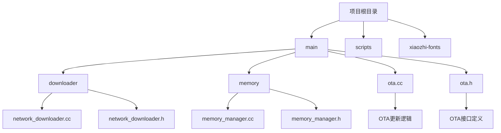
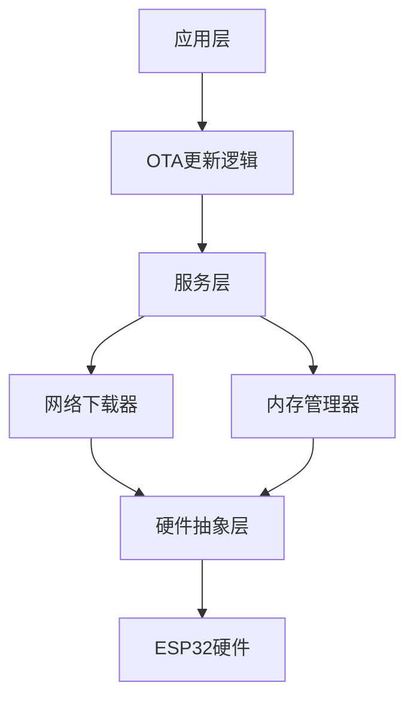
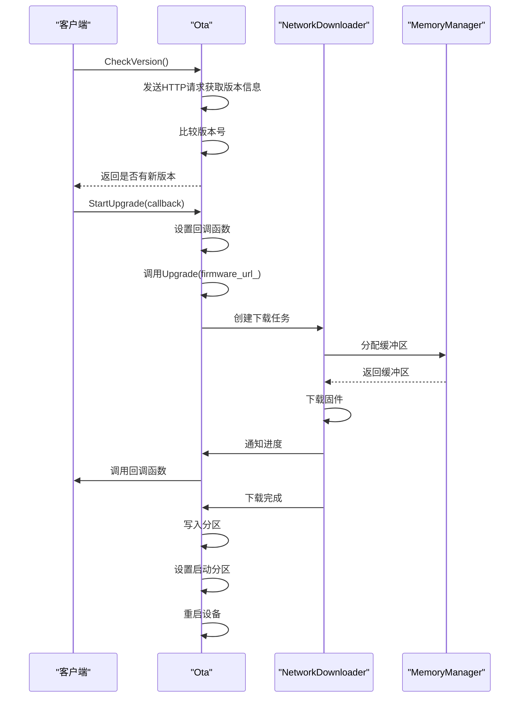
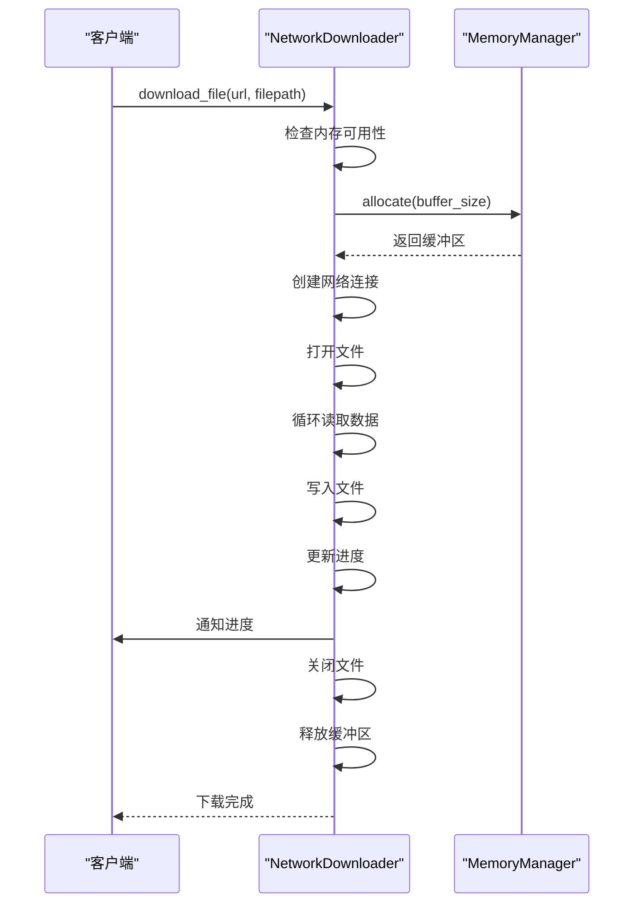
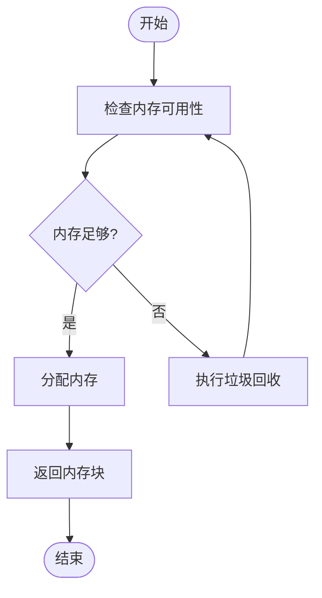
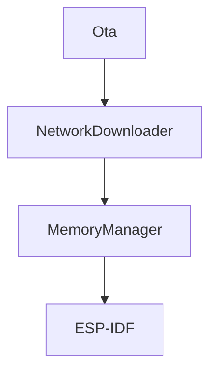

# OTA更新性能优化

<cite>
**本文档引用文件**   
- [ota.cc](file://main/ota.cc)
- [ota.h](file://main/ota.h)
- [network_downloader.cc](file://main/downloader/network_downloader.cc)
- [network_downloader.h](file://main/downloader/network_downloader.h)
- [memory_manager.cc](file://main/memory/memory_manager.cc)
- [memory_manager.h](file://main/memory/memory_manager.h)
- [resource_config.h](file://main/config/resource_config.h)
</cite>

## 目录
1. [引言](#引言)
2. [项目结构](#项目结构)
3. [核心组件](#核心组件)
4. [架构概述](#架构概述)
5. [详细组件分析](#详细组件分析)
6. [依赖分析](#依赖分析)
7. [性能考量](#性能考量)
8. [故障排除指南](#故障排除指南)
9. [结论](#结论)

## 引言
本文档旨在深入分析并优化ESP32设备上的OTA（空中下载）更新过程，重点解决大文件下载与写入时的系统性能瓶颈。通过分析`ota.cc`中的分块处理机制对内存的压力，优化`network_downloader`的缓冲区大小与接收窗口，提出双分区无缝升级的最佳实践，并指导如何在OTA期间动态调整其他任务优先级，保证下载稳定性同时维持基础功能响应。结合`memory_manager`实现OTA专用内存池，避免内存碎片。同时提供OTA速度测试方法和成功率优化建议，以提升用户体验和系统稳定性。

## 项目结构
项目结构清晰地组织了各个功能模块，主要分为`main`、`scripts`、`xiaozhi-fonts`等目录。`main`目录下包含了核心功能模块，如`AlarmClock`、`audio_codecs`、`audio_processing`、`boards`、`config`、`display`、`downloader`、`error`、`images`、`iot`、`led`、`memory`、`notifications`、`protocols`、`ui`等。其中，`downloader`模块负责网络下载，`memory`模块负责内存管理，`ota.cc`和`ota.h`文件位于`main`目录下，是OTA更新的核心实现。

**Diagram sources**
- [main/ota.cc](file://main/ota.cc#L0-L366)
- [main/downloader/network_downloader.cc](file://main/downloader/network_downloader.cc#L0-L412)
- [main/memory/memory_manager.cc](file://main/memory/memory_manager.cc#L0-L200)

## 核心组件
核心组件包括OTA更新逻辑、网络下载器和内存管理器。OTA更新逻辑通过`Ota`类实现，负责检查版本、下载固件、写入分区和重启设备。网络下载器通过`NetworkDownloader`类实现，负责管理网络连接、下载文件和处理错误。内存管理器通过`MemoryManager`类实现，负责分配和释放内存，监控内存状态，避免内存碎片。

**Section sources**
- [main/ota.cc](file://main/ota.cc#L0-L366)
- [main/downloader/network_downloader.cc](file://main/downloader/network_downloader.cc#L0-L412)
- [main/memory/memory_manager.cc](file://main/memory/memory_manager.cc#L0-L200)

## 架构概述
系统架构采用分层设计，顶层为应用层，包含OTA更新逻辑；中间层为服务层，包含网络下载器和内存管理器；底层为硬件抽象层，包含各种板级支持包（BSP）。OTA更新逻辑通过调用网络下载器下载固件，通过内存管理器分配内存，最终将固件写入指定分区并重启设备。

**Diagram sources**
- [main/ota.cc](file://main/ota.cc#L0-L366)
- [main/downloader/network_downloader.cc](file://main/downloader/network_downloader.cc#L0-L412)
- [main/memory/memory_manager.cc](file://main/memory/memory_manager.cc#L0-L200)

## 详细组件分析

### OTA更新逻辑分析
`Ota`类是OTA更新的核心，提供了检查版本、开始升级、标记当前版本有效等接口。`CheckVersion`方法通过HTTP请求获取服务器上的固件版本信息，比较当前版本与新版本，决定是否需要升级。`Upgrade`方法负责下载固件并写入分区，`StartUpgrade`方法启动升级过程，`MarkCurrentVersionValid`方法标记当前固件为有效。

#### OTA更新流程

**Diagram sources**
- [main/ota.cc](file://main/ota.cc#L0-L366)
- [main/downloader/network_downloader.cc](file://main/downloader/network_downloader.cc#L0-L412)
- [main/memory/memory_manager.cc](file://main/memory/memory_manager.cc#L0-L200)

**Section sources**
- [main/ota.cc](file://main/ota.cc#L0-L366)

### 网络下载器分析
`NetworkDownloader`类负责管理网络下载任务，支持单文件下载和批量下载。`download_file`方法下载单个文件，`download_files`方法下载多个文件。`download_with_retry`方法支持重试机制，`perform_download`方法执行实际的下载操作。

#### 网络下载流程

**Diagram sources**
- [main/downloader/network_downloader.cc](file://main/downloader/network_downloader.cc#L0-L412)
- [main/memory/memory_manager.cc](file://main/memory/memory_manager.cc#L0-L200)

**Section sources**
- [main/downloader/network_downloader.cc](file://main/downloader/network_downloader.cc#L0-L412)

### 内存管理器分析
`MemoryManager`类负责管理内存分配和释放，提供内存池功能，避免内存碎片。`allocate`方法分配内存，`has_available_memory`方法检查内存可用性，`force_gc`方法执行垃圾回收。

#### 内存管理流程

**Diagram sources**
- [main/memory/memory_manager.cc](file://main/memory/memory_manager.cc#L0-L200)

**Section sources**
- [main/memory/memory_manager.cc](file://main/memory/memory_manager.cc#L0-L200)

## 依赖分析
各组件之间存在明确的依赖关系。`Ota`类依赖`NetworkDownloader`类进行固件下载，`NetworkDownloader`类依赖`MemoryManager`类分配内存。`MemoryManager`类独立运行，提供内存管理服务。

**Diagram sources**
- [main/ota.cc](file://main/ota.cc#L0-L366)
- [main/downloader/network_downloader.cc](file://main/downloader/network_downloader.cc#L0-L412)
- [main/memory/memory_manager.cc](file://main/memory/memory_manager.cc#L0-L200)

**Section sources**
- [main/ota.cc](file://main/ota.cc#L0-L366)
- [main/downloader/network_downloader.cc](file://main/downloader/network_downloader.cc#L0-L412)
- [main/memory/memory_manager.cc](file://main/memory/memory_manager.cc#L0-L200)

## 性能考量
为了优化OTA更新性能，可以从以下几个方面入手：
1. **缓冲区大小**：根据设备内存情况动态调整缓冲区大小，避免内存不足或浪费。
2. **接收窗口**：优化TCP接收窗口大小，提高网络吞吐量。
3. **任务优先级**：在OTA期间提升下载任务优先级，降低其他非关键任务优先级，确保下载稳定性。
4. **内存池**：使用内存池减少内存分配开销，避免内存碎片。
5. **双分区无缝升级**：采用双分区方案，实现无缝升级，减少用户等待时间。

## 故障排除指南
常见问题及解决方案：
1. **内存不足**：检查内存使用情况，优化内存分配策略，增加内存阈值。
2. **网络连接失败**：检查网络配置，确保设备连接到正确的Wi-Fi网络。
3. **固件下载失败**：检查服务器地址和端口，确保服务器正常运行。
4. **固件写入失败**：检查分区配置，确保目标分区可写。
5. **设备无法启动**：检查固件完整性，确保固件未损坏。

**Section sources**
- [main/ota.cc](file://main/ota.cc#L0-L366)
- [main/downloader/network_downloader.cc](file://main/downloader/network_downloader.cc#L0-L412)
- [main/memory/memory_manager.cc](file://main/memory/memory_manager.cc#L0-L200)

## 结论
通过深入分析OTA更新过程中的各个组件，我们提出了多项优化建议，包括优化缓冲区大小、调整任务优先级、使用内存池等，以提升OTA更新的性能和稳定性。未来可以进一步研究更高效的压缩算法和更智能的网络调度策略，进一步优化OTA更新体验。