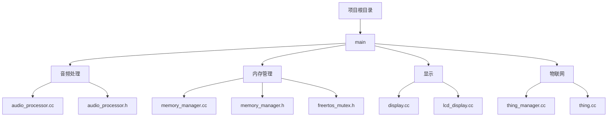
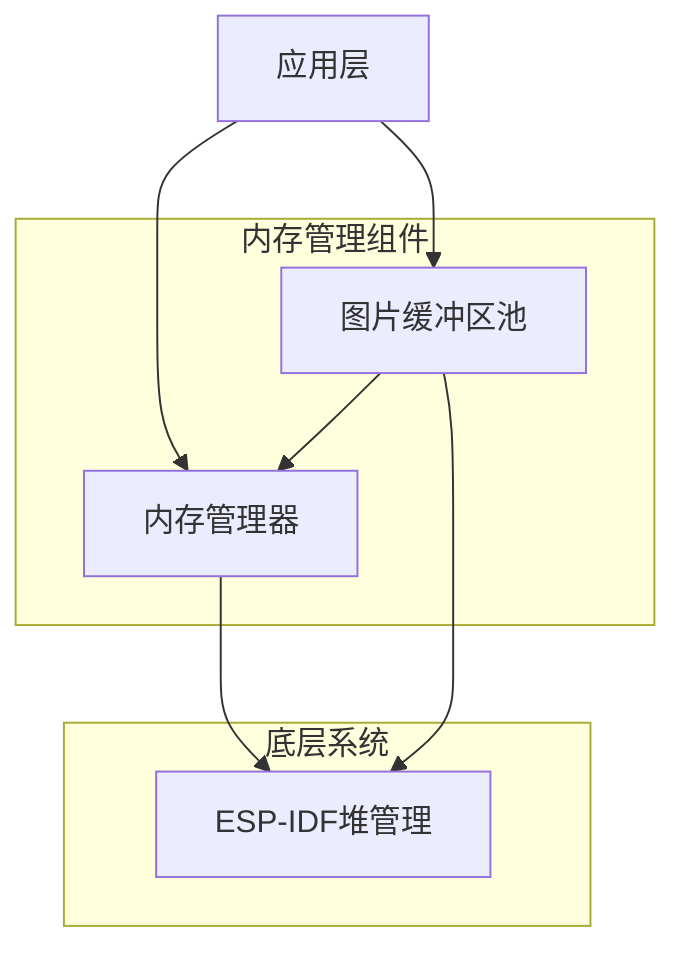
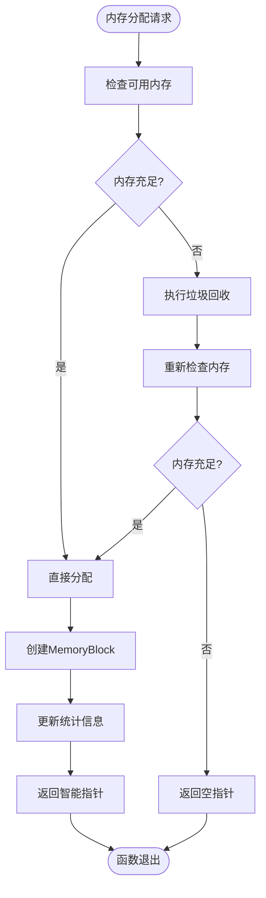
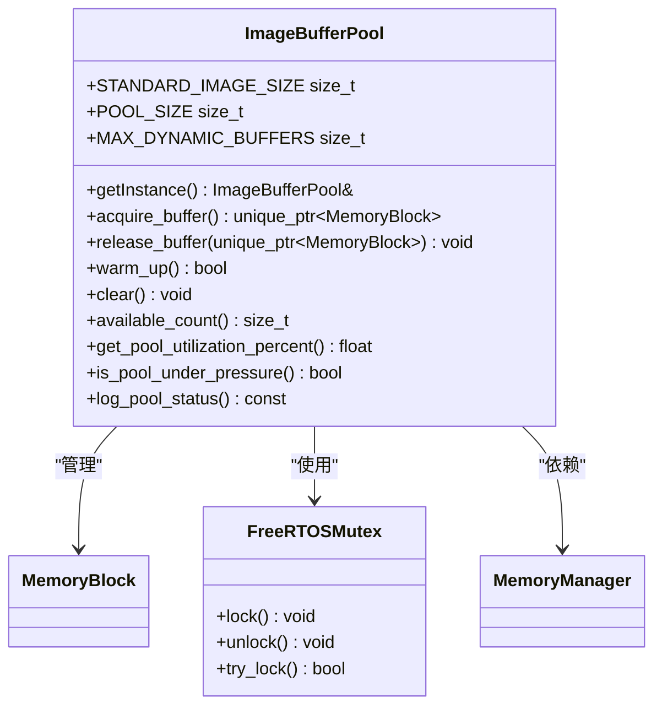
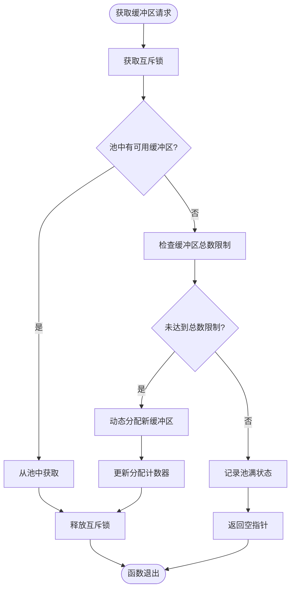
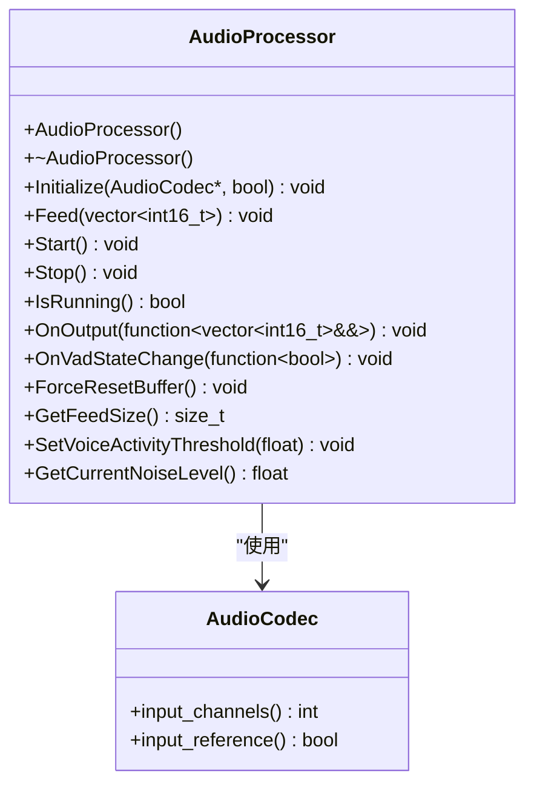
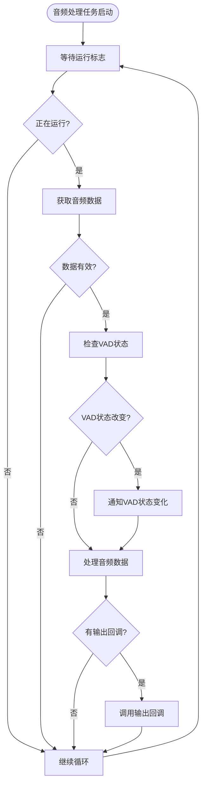
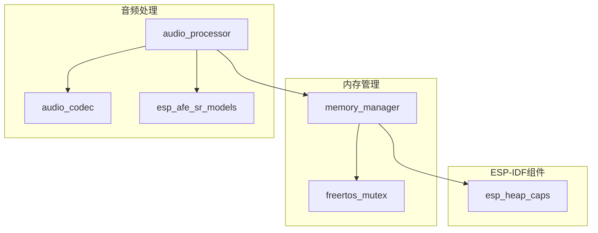
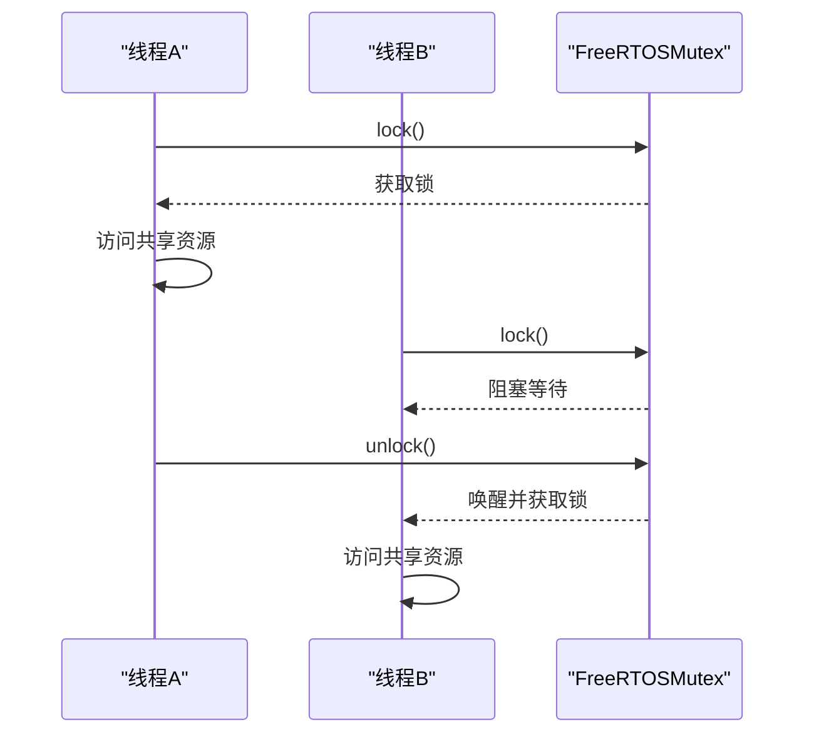

# 内存使用优化

<cite>
**本文档引用的文件**
- [OPTIMIZATION_SUMMARY.md](file://OPTIMIZATION_SUMMARY.md)
- [memory_manager.h](file://main/memory/memory_manager.h)
- [memory_manager.cc](file://main/memory/memory_manager.cc)
- [audio_processor.h](file://main/audio_processing/audio_processor.h)
- [audio_processor.cc](file://main/audio_processing/audio_processor.cc)
- [freertos_mutex.h](file://main/memory/freertos_mutex.h)
</cite>

## 目录
1. [简介](#简介)
2. [项目结构](#项目结构)
3. [核心组件](#核心组件)
4. [架构概览](#架构概览)
5. [详细组件分析](#详细组件分析)
6. [依赖分析](#依赖分析)
7. [性能考量](#性能考量)
8. [故障排除指南](#故障排除指南)
9. [结论](#结论)

## 简介
本文档基于`OPTIMIZATION_SUMMARY.md`和`memory_manager`模块，创建了内存使用优化专项指南。文档详细阐述了如何选择合适的ESP-IDF内存分配器，分析了`audio_processor`中内存池的实现机制与复用策略。同时，文档深入探讨了动态内存分配的风险及规避方法，包括内存碎片预防、临界区保护和异常处理。此外，还提供了内存泄漏检测方案，并给出了典型场景的内存布局建议。

## 项目结构
项目采用功能模块化组织方式，主要模块包括音频处理、显示、内存管理、物联网设备管理等。内存管理相关代码位于`main/memory`目录下，音频处理相关代码位于`main/audio_processing`目录下。



**图示来源**
- [main/memory/memory_manager.h](file://main/memory/memory_manager.h)
- [main/audio_processing/audio_processor.h](file://main/audio_processing/audio_processor.h)

**本节来源**
- [main/memory/memory_manager.h](file://main/memory/memory_manager.h)
- [main/audio_processing/audio_processor.h](file://main/audio_processing/audio_processor.h)

## 核心组件
本项目的核心内存管理组件包括`MemoryManager`、`ImageBufferPool`和`FreeRTOSMutex`。这些组件共同构成了一个安全、高效的内存管理系统，通过RAII机制、内存池技术和线程安全保护，有效解决了嵌入式系统中的内存管理难题。

**本节来源**
- [main/memory/memory_manager.h](file://main/memory/memory_manager.h#L52-L145)
- [main/memory/freertos_mutex.h](file://main/memory/freertos_mutex.h#L1-L56)

## 架构概览
系统采用分层架构设计，上层应用通过内存管理器间接访问底层内存资源，实现了内存分配的统一管理和监控。



**图示来源**
- [main/memory/memory_manager.h](file://main/memory/memory_manager.h)
- [main/memory/memory_manager.cc](file://main/memory/memory_manager.cc)

## 详细组件分析

### 内存管理器分析
`MemoryManager`类是系统内存管理的核心，提供统一的内存分配接口和全面的内存监控功能。

#### 类图
```mermaid
classDiagram
class MemoryManager {
+getInstance() MemoryManager&
+allocate(size_t) unique_ptr~MemoryBlock~
+has_available_memory(size_t) bool
+get_stats() MemoryStats
+force_gc() void
+is_memory_critical() bool
+is_memory_warning() bool
+get_memory_status() MemoryStatus
+log_memory_status() const
+get_heap_fragmentation_percent() size_t
}
class MemoryBlock {
+data() uint8_t*
+size() size_t
+is_valid() bool
+reset() void
}
class MemoryStats {
+total_allocated size_t
+peak_usage size_t
+current_usage size_t
+allocation_count size_t
+deallocation_count size_t
}
enum MemoryStatus {
GOOD
WARNING
CRITICAL
}
MemoryManager --> MemoryBlock : "创建"
MemoryManager --> MemoryStats : "包含"
MemoryManager --> MemoryStatus : "返回"
```

**图示来源**
- [main/memory/memory_manager.h](file://main/memory/memory_manager.h#L52-L98)
- [main/memory/memory_manager.cc](file://main/memory/memory_manager.cc#L49-L94)

#### 内存分配流程


**图示来源**
- [main/memory/memory_manager.cc](file://main/memory/memory_manager.cc#L49-L94)

**本节来源**
- [main/memory/memory_manager.h](file://main/memory/memory_manager.h#L52-L98)
- [main/memory/memory_manager.cc](file://main/memory/memory_manager.cc#L49-L94)

### 图片缓冲区池分析
`ImageBufferPool`类实现了专用的图片缓冲区内存池，通过预分配和复用机制，显著减少了动态内存分配的开销。

#### 类图


**图示来源**
- [main/memory/memory_manager.h](file://main/memory/memory_manager.h#L107-L145)
- [main/memory/freertos_mutex.h](file://main/memory/freertos_mutex.h#L1-L56)

#### 缓冲区获取流程


**图示来源**
- [main/memory/memory_manager.cc](file://main/memory/memory_manager.cc#L225-L261)

**本节来源**
- [main/memory/memory_manager.h](file://main/memory/memory_manager.h#L107-L145)
- [main/memory/memory_manager.cc](file://main/memory/memory_manager.cc#L225-L261)

#### ImageBufferPool配置详解

`ImageBufferPool`针对图片资源加载场景进行了优化，采用了精心设计的内存分配策略。

**关键参数说明**：

| 参数 | 值 | 说明 | 内存占用 |
|:----|:---|:-----|:---------|
| `STANDARD_IMAGE_SIZE` | 240 × 240 × 2 | 标准图片大小（RGB565格式） | ~115 KB |
| `POOL_SIZE` | 3 | 预分配缓冲区数量 | ~345 KB |
| `MAX_DYNAMIC_BUFFERS` | 7 | 最大动态分配缓冲区数 | 总计最多 ~1.15 MB |

**设计权衡**：
- **预分配 vs 按需分配**：预分配3个缓冲区可满足大多数场景（Logo + 2个动画帧），避免启动时的内存抖动
- **固定池 vs 无限增长**：限制总数为10个（3固定 + 7动态），防止内存耗尽
- **内存占用 vs 性能**：345KB的固定开销换来零碎片和快速分配

**使用示例**：

```cpp
// 获取缓冲区
auto buffer = ImageBufferPool::GetInstance().acquire_buffer();
if (!buffer || !buffer->is_valid()) {
    ESP_LOGE(TAG, "无法获取图片缓冲区");
    return ESP_ERR_NO_MEM;
}

// 使用缓冲区加载图片
memcpy(buffer->data(), image_data, STANDARD_IMAGE_SIZE);

// 缓冲区会在作用域结束时自动释放回池中
```

**池压力监控**：

```cpp
// 检查池状态
float utilization = ImageBufferPool::GetInstance().get_pool_utilization_percent();
if (utilization > 90.0f) {
    ESP_LOGW(TAG, "图片缓冲池利用率达到 %.1f%%", utilization);
}

if (ImageBufferPool::GetInstance().is_pool_under_pressure()) {
    ESP_LOGW(TAG, "图片缓冲池承受压力，考虑延迟非关键加载");
}
```

**Section sources**
- [main/memory/memory_manager.h](file://main/memory/memory_manager.h#L108-L112)
- [main/memory/memory_manager.h](file://main/memory/memory_manager.h#L134-L137)

### 音频处理器分析
`AudioProcessor`类负责音频数据的处理和流式传输，其内存管理策略与系统内存管理器紧密集成。

#### 类图


**图示来源**
- [main/audio_processing/audio_processor.h](file://main/audio_processing/audio_processor.h#L1-L46)

#### 音频处理任务流程


**图示来源**
- [main/audio_processing/audio_processor.cc](file://main/audio_processing/audio_processor.cc#L130-L162)

**本节来源**
- [main/audio_processing/audio_processor.h](file://main/audio_processing/audio_processor.h#L1-L46)
- [main/audio_processing/audio_processor.cc](file://main/audio_processing/audio_processor.cc#L130-L162)

## 依赖分析
系统各组件之间存在明确的依赖关系，形成了清晰的调用链。



**图示来源**
- [main/memory/memory_manager.h](file://main/memory/memory_manager.h)
- [main/audio_processing/audio_processor.h](file://main/audio_processing/audio_processor.h)

**本节来源**
- [main/memory/memory_manager.h](file://main/memory/memory_manager.h)
- [main/audio_processing/audio_processor.h](file://main/audio_processing/audio_processor.h)

## 性能考量
### 内存分配器选择
在ESP-IDF系统中，应根据内存使用场景选择合适的分配器：

- **`malloc/free`**: 通用内存分配，适用于小块、频繁分配的内存
- **`heap_caps_malloc`**: 可指定内存域分配，适用于大块内存或特定内存域需求
- **`ps_malloc`**: 优先分配PSRAM，适用于大块数据缓冲区

文档中的`MemoryManager`使用标准`malloc`进行分配，但可通过修改`MemoryBlock`构造函数集成`heap_caps_malloc`：

```cpp
// 示例：使用heap_caps_malloc分配PSRAM内存
data_ = static_cast<uint8_t*>(heap_caps_malloc(size, MALLOC_CAP_SPIRAM));
```

### 内存碎片预防
系统通过以下机制预防内存碎片：
1. **内存池技术**: `ImageBufferPool`预分配固定大小的缓冲区，避免频繁分配释放
2. **RAII机制**: `MemoryBlock`确保内存自动释放，防止泄漏
3. **监控与告警**: 实时监控内存碎片率，及时预警

### 临界区保护
多线程环境下的内存安全通过`FreeRTOSMutex`实现：



**图示来源**
- [main/memory/freertos_mutex.h](file://main/memory/freertos_mutex.h#L1-L56)

### 内存泄漏检测
虽然当前代码未直接集成ESP-IDF的heap tracing工具，但提供了完善的内存监控接口：

```cpp
// 启用heap tracing（需在menuconfig中配置）
// #include "esp_heap_trace.h"
// static heap_trace_record_t trace_record[100];
// esp_heap_trace_init();
// esp_heap_trace_start(HEAP_TRACE_ALL, trace_record, 100);

// 使用现有监控接口
MemoryManager::GetInstance().log_memory_status();
ImageBufferPool::GetInstance().log_pool_status();
```

**本节来源**
- [main/memory/memory_manager.h](file://main/memory/memory_manager.h#L85-L88)
- [main/memory/memory_manager.cc](file://main/memory/memory_manager.cc#L160-L195)

## 故障排除指南
### 常见内存问题及解决方案
**内存不足**
- **现象**: `allocate`返回空指针，日志显示"内存不足"
- **解决方案**: 
  1. 检查`memory_threshold_`设置是否合理
  2. 调用`force_gc()`尝试垃圾回收
  3. 优化算法减少内存使用

**缓冲区池满**
- **现象**: `acquire_buffer`返回空指针，日志显示"已达到缓冲区总数限制"
- **解决方案**:
  1. 检查是否有未释放的缓冲区
  2. 调整`MAX_DYNAMIC_BUFFERS`参数
  3. 优化缓冲区使用策略

**内存碎片严重**
- **现象**: 可用内存充足但大块分配失败
- **解决方案**:
  1. 增加内存池预分配数量
  2. 使用`heap_caps_malloc`指定内存域
  3. 优化内存分配模式

**本节来源**
- [main/memory/memory_manager.cc](file://main/memory/memory_manager.cc#L49-L94)
- [main/memory/memory_manager.cc](file://main/memory/memory_manager.cc#L225-L261)

## 结论
本文档详细分析了项目的内存管理架构，重点介绍了`MemoryManager`和`ImageBufferPool`的设计与实现。通过RAII机制、内存池技术和线程安全保护，系统实现了高效、安全的内存管理。建议在实际开发中：
1. 优先使用内存池管理大块缓冲区
2. 合理设置内存阈值和监控策略
3. 在多线程环境下严格使用互斥锁保护共享资源
4. 定期监控内存状态，及时发现潜在问题

这些最佳实践将有助于构建稳定、高效的嵌入式应用程序。