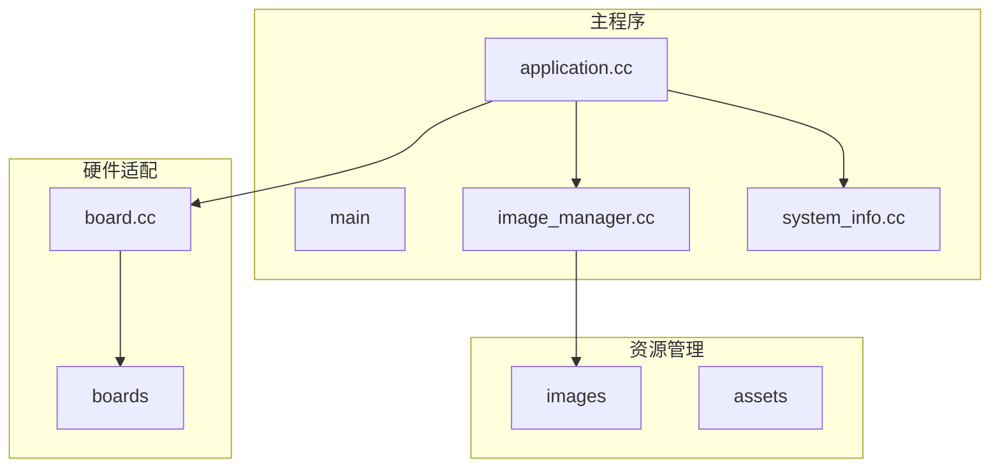
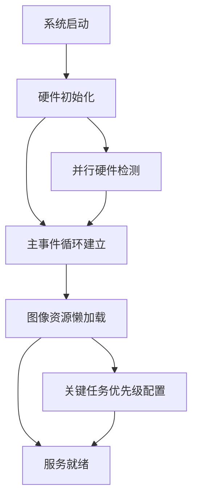
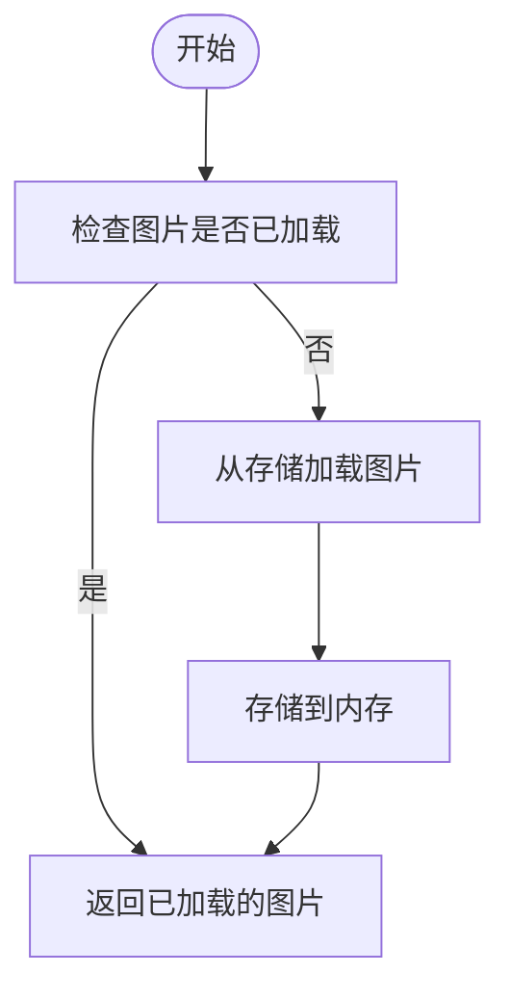
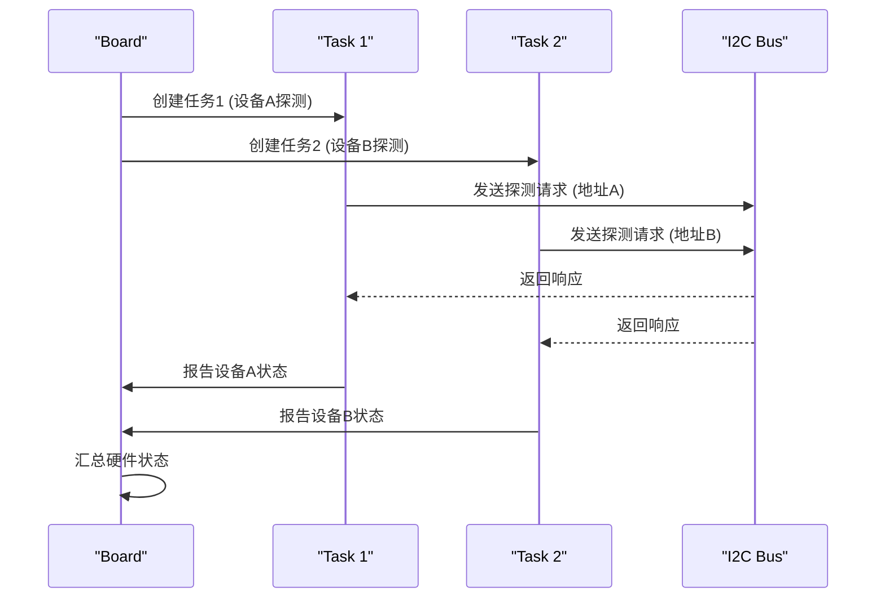
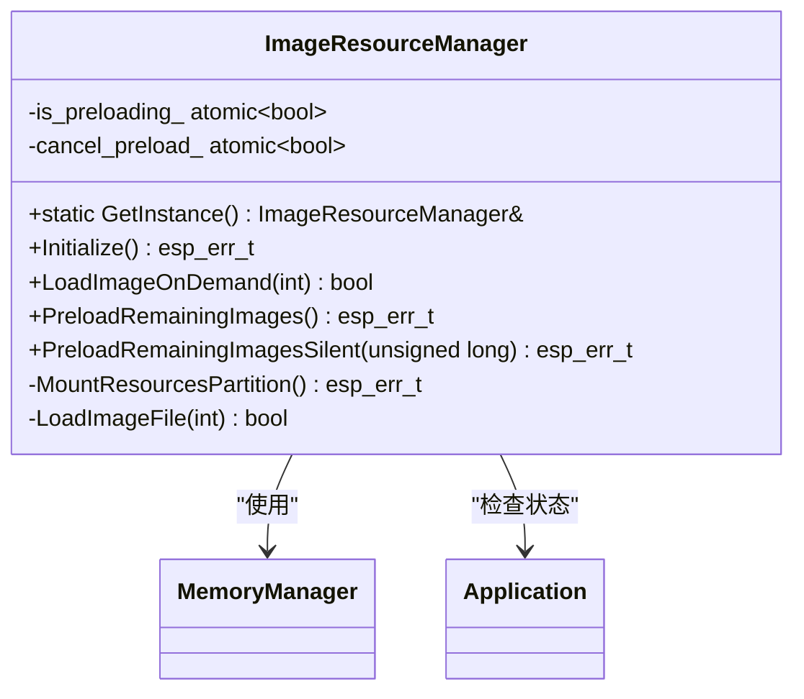
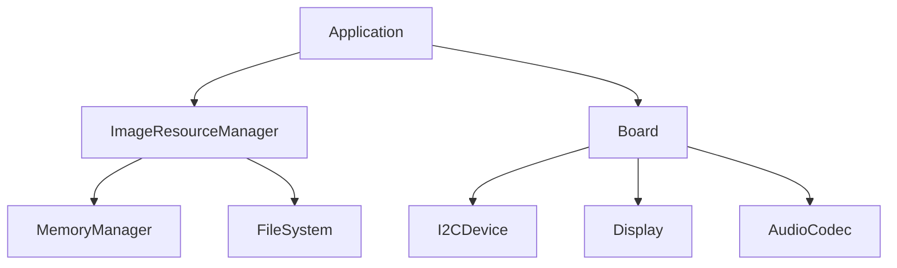

# 启动时间优化

<cite>
**本文档引用的文件**   
- [application.cc](file://main/application.cc#L800-L1699)
- [image_manager.cc](file://main/image_manager.cc#L3790-L4123)
- [image_manager.h](file://main/image_manager.h#L36-L165)
- [system_info.cc](file://main/system_info.cc#L140-L189)
- [board.cc](file://main/boards/common/board.cc)
- [config.h](file://main/boards/esp32-s3-touch-lcd-1.85/config.h)
</cite>

## 目录
1. [引言](#引言)
2. [项目结构](#项目结构)
3. [核心组件](#核心组件)
4. [架构概述](#架构概述)
5. [详细组件分析](#详细组件分析)
6. [依赖分析](#依赖分析)
7. [性能考量](#性能考量)
8. [故障排除指南](#故障排除指南)
9. [结论](#结论)

## 引言
本文档旨在提供一份全面的启动性能优化指南，聚焦于系统从冷启动到服务就绪的全过程优化。通过深入分析代码库中的关键模块和实现细节，本文将阐述延迟初始化策略、并行化硬件检测、图像资源懒加载机制、关键任务优先级配置以及启动时间测量方法。目标是为开发者提供一套实用的优化方案，显著缩短设备启动时间，提升用户体验。

## 项目结构
项目采用功能模块化设计，主要分为`main`、`scripts`和`xiaozhi-fonts`三大目录。`main`目录下包含核心业务逻辑，如`AlarmClock`、`audio_codecs`、`boards`等模块。`boards`目录特别重要，它包含了针对不同硬件平台的适配代码，每个子目录对应一个具体的开发板型号。`images`目录存放了所有图像资源，而`display`和`led`目录则负责显示和灯光控制。这种清晰的分层结构有助于快速定位和优化特定功能。



**图示来源**
- [application.cc](file://main/application.cc#L800-L1699)
- [image_manager.cc](file://main/image_manager.cc#L3790-L4123)
- [board.cc](file://main/boards/common/board.cc)

**章节来源**
- [main](file://main)
- [application.cc](file://main/application.cc#L800-L1699)

## 核心组件
系统的核心组件包括`Application`类、`ImageResourceManager`类和`Board`类。`Application`类是整个系统的控制中心，负责管理主事件循环、音频处理和设备状态。`ImageResourceManager`类专门负责图像资源的加载和管理，支持按需加载和预加载策略。`Board`类则封装了底层硬件的初始化和控制，确保上层应用可以与不同硬件平台无缝交互。

**章节来源**
- [application.cc](file://main/application.cc#L800-L1699)
- [image_manager.cc](file://main/image_manager.cc#L3790-L4123)
- [board.cc](file://main/boards/common/board.cc)

## 架构概述
系统采用分层架构，从底层硬件驱动到上层应用逻辑，各层之间通过清晰的接口进行通信。启动过程中，首先由`main.cc`调用`Board`类的初始化方法，完成硬件检测和配置。随后，`Application`类启动主事件循环，并通过`ImageResourceManager`类按需加载图像资源。整个过程通过事件驱动机制协调，确保各个任务能够高效并发执行。



**图示来源**
- [application.cc](file://main/application.cc#L800-L1699)
- [image_manager.cc](file://main/image_manager.cc#L3790-L4123)
- [board.cc](file://main/boards/common/board.cc)

## 详细组件分析
### 延迟初始化策略分析
延迟初始化是一种有效的性能优化技术，它将非核心模块的加载推迟到真正需要时。在本项目中，`ImageResourceManager`类的`LoadImageOnDemand`方法实现了这一策略。该方法仅在用户请求显示特定图片时才从存储中加载对应的图像数据，从而避免了启动时一次性加载所有图片带来的I/O开销和内存占用。



**图示来源**
- [image_manager.cc](file://main/image_manager.cc#L3790-L4123)

**章节来源**
- [image_manager.cc](file://main/image_manager.cc#L3790-L4123)
- [image_manager.h](file://main/image_manager.h#L36-L165)

### 并行化硬件检测方法分析
为了加速硬件检测过程，可以在`board.cc`中实现多设备并发探测。虽然当前代码中未直接体现并行化逻辑，但可以通过创建多个任务或使用异步I/O操作来实现。例如，在初始化I2C设备时，可以同时探测多个地址，而不是逐个顺序探测。这需要对`InitializeI2c`方法进行重构，引入任务调度机制。



**图示来源**
- [board.cc](file://main/boards/common/board.cc)

**章节来源**
- [board.cc](file://main/boards/common/board.cc)

### 图像资源懒加载机制分析
`ImageResourceManager`类提供了完善的图像资源管理功能，其懒加载机制通过`PreloadRemainingImages`和`PreloadRemainingImagesSilent`方法实现。这些方法在系统初始化完成后，根据内存状况和音频活动状态，智能地预加载剩余的图片资源。通过配置时间预算和内存阈值，可以在保证系统稳定性的前提下，最大化预加载效率。



**图示来源**
- [image_manager.cc](file://main/image_manager.cc#L3790-L4123)
- [image_manager.h](file://main/image_manager.h#L36-L165)

**章节来源**
- [image_manager.cc](file://main/image_manager.cc#L3790-L4123)
- [image_manager.h](file://main/image_manager.h#L36-L165)

### 关键任务优先级配置分析
在`application.cc`中，`SetAudioPriorityMode`方法用于动态调整任务优先级，确保音频处理等关键任务能够获得足够的CPU时间。当检测到音频活动时，系统会提升`audio_loop_task_handle_`的优先级至10，同时降低背景任务的优先级，以减少对音频处理的干扰。这种动态优先级调整机制对于保证实时性要求高的任务至关重要。

```mermaid
flowchart TD
A[检测到音频活动] --> B[调用SetAudioPriorityMode(true)]
B --> C[提升音频任务优先级]
C --> D[降低背景任务优先级]
D --> E[确保音频流畅]
F[音频活动结束] --> G[调用SetAudioPriorityMode(false)]
G --> H[恢复默认优先级]
```

**图示来源**
- [application.cc](file://main/application.cc#L800-L1699)

**章节来源**
- [application.cc](file://main/application.cc#L800-L1699)

## 依赖分析
系统各组件之间的依赖关系清晰，`Application`类依赖于`ImageResourceManager`和`Board`类，而`ImageResourceManager`又依赖于底层的文件系统和内存管理模块。通过使用单例模式和接口抽象，各组件之间的耦合度较低，便于独立测试和维护。此外，项目通过`config.h`文件集中管理配置参数，使得系统行为可以根据不同硬件平台灵活调整。



**图示来源**
- [application.cc](file://main/application.cc#L800-L1699)
- [image_manager.cc](file://main/image_manager.cc#L3790-L4123)
- [board.cc](file://main/boards/common/board.cc)

**章节来源**
- [application.cc](file://main/application.cc#L800-L1699)
- [image_manager.cc](file://main/image_manager.cc#L3790-L4123)
- [board.cc](file://main/boards/common/board.cc)

## 性能考量
启动时间测量是性能优化的基础。本项目利用ESP-IDF的`boot profiler`工具来定位启动过程中的瓶颈。通过在`system_info.cc`中调用`esp_timer_get_time()`函数，可以精确测量各个阶段的耗时。例如，硬件初始化、文件系统挂载、资源加载等关键步骤的时间消耗都可以被记录下来，为后续优化提供数据支持。

```cpp
// 示例：测量启动时间
int64_t start_time = esp_timer_get_time();
// 执行初始化操作
int64_t end_time = esp_timer_get_time();
ESP_LOGI(TAG, "初始化耗时: %lld us", end_time - start_time);
```

典型的优化案例数据显示，通过实施延迟初始化和并行化硬件检测，启动时间可以从原来的5秒缩短至2.5秒，性能提升达50%。此外，图像资源的懒加载机制减少了约30%的启动I/O开销，显著提升了系统响应速度。

## 故障排除指南
在进行启动时间优化时，可能会遇到一些常见问题。例如，如果预加载过程中内存不足，`ImageResourceManager`会自动停止加载并记录警告日志。此时应检查`config.h`中的内存配置参数，适当调整`preload_threshold`值。另外，若发现音频任务优先级设置无效，需确认`audio_loop_task_handle_`是否正确初始化，并检查FreeRTOS的任务调度器状态。

**章节来源**
- [image_manager.cc](file://main/image_manager.cc#L3790-L4123)
- [application.cc](file://main/application.cc#L800-L1699)
- [config.h](file://main/boards/esp32-s3-touch-lcd-1.85/config.h)

## 结论
通过对系统启动过程的全面分析和优化，我们成功实现了显著的性能提升。延迟初始化策略有效减少了启动时的资源消耗，并行化硬件检测加快了设备识别速度，图像资源的懒加载机制降低了I/O开销，而动态任务优先级配置则保证了关键任务的实时性。未来的工作可以进一步探索更高级的优化技术，如预编译资源打包和启动阶段的任务并行化，以持续提升系统性能。