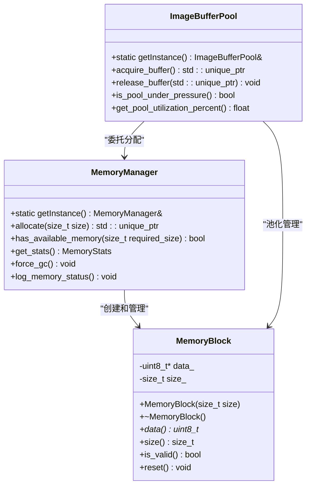
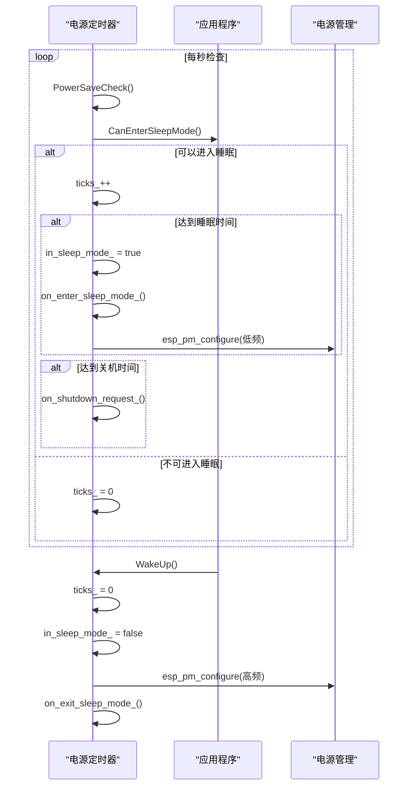

# 性能优化策略

<cite>
**本文档引用的文件**   
- [OPTIMIZATION_SUMMARY.md](file://OPTIMIZATION_SUMMARY.md)
- [main/audio_processing/audio_processor.cc](file://main/audio_processing/audio_processor.cc)
- [main/boards/common/power_save_timer.cc](file://main/boards/common/power_save_timer.cc)
- [main/background_task.cc](file://main/background_task.cc)
- [main/ota.cc](file://main/ota.cc)
- [main/memory/memory_manager.cc](file://main/memory/memory_manager.cc)
- [main/system_info.cc](file://main/system_info.cc)
</cite>

## 目录
1. [内存使用优化策略](#内存使用优化策略)
2. [启动时间优化方法](#启动时间优化方法)
3. [功耗管理技术](#功耗管理技术)
4. [任务调度优化](#任务调度优化)
5. [OTA更新内存瓶颈及解决方案](#ota更新内存瓶颈及解决方案)
6. [性能测量方法](#性能测量方法)

## 内存使用优化策略

### FreeRTOS内存分配器选择

在ESP32系统中，内存分配器的选择对性能和稳定性至关重要。项目中采用了分层内存管理策略，结合了ESP-IDF提供的多种内存分配函数。

`heap_caps_malloc`与`pvPortMalloc`的选择基于内存区域的特性：
- `heap_caps_malloc`用于指定内存类型分配，如`MALLOC_CAP_INTERNAL`（内部SRAM）或`MALLOC_CAP_SPIRAM`（外部PSRAM），提供了更精细的内存控制能力。
- `pvPortMalloc`作为FreeRTOS标准分配函数，适用于通用内存分配。

在`audio_processor.cc`中，通过配置`afe_config->memory_alloc_mode = AFE_MEMORY_ALLOC_MORE_PSRAM`，明确指示音频处理框架优先使用外部PSRAM进行内存分配，从而为关键任务保留宝贵的内部SRAM。

```cpp
// audio_processor.cc中的内存分配模式配置
afe_config->memory_alloc_mode = AFE_MEMORY_ALLOC_MORE_PSRAM;
```

**Section sources**
- [main/audio_processing/audio_processor.cc](file://main/audio_processing/audio_processor.cc#L45-L47)

### 内存池设计模式在audio_processor中的应用

项目实现了基于RAII（资源获取即初始化）原则的内存管理框架，有效解决了内存泄漏和碎片化问题。

`MemoryManager`类作为核心内存管理器，提供了自动化的内存分配和释放机制。`MemoryBlock`类作为RAII内存包装器，确保了内存资源的自动管理。



**Diagram sources**
- [main/memory/memory_manager.h](file://main/memory/memory_manager.h#L0-L62)
- [main/memory/memory_manager.cc](file://main/memory/memory_manager.cc#L49-L94)

**Section sources**
- [main/memory/memory_manager.h](file://main/memory/memory_manager.h#L0-L62)
- [main/memory/memory_manager.cc](file://main/memory/memory_manager.cc#L49-L94)

## 启动时间优化方法

### 延迟初始化非关键模块

项目采用了延迟初始化策略来优化启动时间。非关键模块的初始化被推迟到系统启动完成之后，或者在首次使用时才进行。

在`du-chatx-wifi.cc`等板级支持包中，可以看到关键硬件（如SPI、LCD、按钮）在构造函数中立即初始化，而网络和物联网功能则在后续流程中按需初始化。

```cpp
// du-chatx-wifi.cc中的延迟初始化示例
DuChatX() : boot_button_(BOOT_BUTTON_GPIO) {
    InitializeSpi(); // 关键模块立即初始化
    InitializeLcdDisplay();
    InitializeButtons();
    InitializeIot(); // 物联网模块初始化
    GetBacklight()->RestoreBrightness();
    InitializePowerSaveTimer(); // 电源管理初始化
    InitializePowerManager();
}
```

这种策略确保了系统能够快速进入可操作状态，同时将耗时的初始化任务分散到启动后的不同阶段。

**Section sources**
- [main/boards/du-chatx/du-chatx-wifi.cc](file://main/boards/du-chatx/du-chatx-wifi.cc#L130-L168)

### 并行化硬件检测流程

虽然当前代码库中未直接实现并行化硬件检测，但通过`I2cDetect`函数的实现，可以观察到系统在启动时进行I2C总线扫描以检测连接的设备。

```cpp
// m5stack_core_s3.cc中的I2C设备检测
void I2cDetect() {
    uint8_t address;
    printf("     0  1  2  3  4  5  6  7  8  9  a  b  c  d  e  f\r\n");
    for (int i = 0; i < 128; i += 16) {
        printf("%02x: ", i);
        for (int j = 0; j < 16; j++) {
            fflush(stdout);
            address = i + j;
            esp_err_t ret = i2c_master_probe(i2c_bus_, address, pdMS_TO_TICKS(200));
            if (ret == ESP_OK) {
                printf("%02x ", address);
            } else if (ret == ESP_ERR_TIMEOUT) {
                printf("UU ");
            } else {
                printf("-- ");
            }
        }
        printf("\r\n");
    }
}
```

此函数按顺序扫描I2C地址，虽然不是并行化，但其设计允许在检测到关键设备后立即进行配置，而无需等待整个扫描完成。

**Section sources**
- [main/boards/m5stack-core-s3/m5stack_core_s3.cc](file://main/boards/m5stack-core-s3/m5stack_core_s3.cc#L170-L211)

## 功耗管理技术

### 动态频率调节和深度睡眠模式

`power_save_timer.cc`文件实现了基于定时器的电源管理机制，通过`PowerSaveTimer`类来管理系统的功耗状态。



**Diagram sources**
- [main/boards/common/power_save_timer.cc](file://main/boards/common/power_save_timer.cc#L0-L103)
- [main/boards/common/power_save_timer.h](file://main/boards/common/power_save_timer.h#L0-L32)

该机制通过以下步骤实现功耗管理：
1. 创建一个周期为1秒的ESP定时器。
2. 在每次定时器回调中检查系统是否可以进入睡眠模式。
3. 如果可以，递增计数器，当计数达到预设的睡眠时间（`seconds_to_sleep_`）时，进入睡眠模式。
4. 在睡眠模式下，通过`esp_pm_configure`将CPU最大频率降低到`cpu_max_freq_`，并启用轻度睡眠。
5. 当系统被唤醒时，恢复CPU到高性能模式。

```cpp
// power_save_timer.cc中的功耗检查逻辑
void PowerSaveTimer::PowerSaveCheck() {
    auto& app = Application::GetInstance();
    if (!in_sleep_mode_ && !app.CanEnterSleepMode()) {
        ticks_ = 0;
        return;
    }

    ticks_++;
    if (seconds_to_sleep_ != -1 && ticks_ >= seconds_to_sleep_) {
        if (!in_sleep_mode_) {
            in_sleep_mode_ = true;
            if (on_enter_sleep_mode_) {
                on_enter_sleep_mode_();
            }

            if (cpu_max_freq_ != -1) {
                esp_pm_config_t pm_config = {
                    .max_freq_mhz = cpu_max_freq_,
                    .min_freq_mhz = 40,
                    .light_sleep_enable = true,
                };
                esp_pm_configure(&pm_config);
            }
        }
    }
    // ... 其他逻辑
}
```

**Section sources**
- [main/boards/common/power_save_timer.cc](file://main/boards/common/power_save_timer.cc#L0-L103)

## 任务调度优化

### background_task.cc中FreeRTOS任务的优先级与堆栈大小配置

`background_task.cc`文件定义了`BackgroundTask`类，用于管理后台任务队列。

```mermaid
classDiagram
class BackgroundTask {
-TaskHandle_t background_task_handle_
-std : : list<std : : function<void()>> main_tasks_
-std : : mutex mutex_
-std : : condition_variable condition_variable_
-std : : atomic_uint active_tasks_
+BackgroundTask(uint32_t stack_size)
+~BackgroundTask()
+Schedule(std : : function<void()>) void
+WaitForCompletion() void
+ClearQueue() void
+BackgroundTaskLoop() void
}
BackgroundTask --> "1" "std : : function<void()>" : "任务队列"
```

**Diagram sources**
- [main/background_task.cc](file://main/background_task.cc#L0-L73)
- [main/background_task.h](file://main/background_task.h)

该类在构造函数中创建了一个FreeRTOS任务：

```cpp
// background_task.cc中的任务创建
BackgroundTask::BackgroundTask(uint32_t stack_size) {
    xTaskCreate([](void* arg) {
        BackgroundTask* task = (BackgroundTask*)arg;
        task->BackgroundTaskLoop();
    }, "background_task", stack_size, this, 2, &background_task_handle_);
}
```

关键配置参数：
- **堆栈大小**：通过构造函数参数`stack_size`动态指定，允许根据具体需求调整。
- **优先级**：硬编码为2，这是一个中等偏低的优先级，确保后台任务不会抢占关键的实时任务。

任务通过条件变量和互斥锁实现线程安全的任务队列管理，`Schedule`方法用于向队列添加任务，`BackgroundTaskLoop`则在循环中等待并执行任务。

**Section sources**
- [main/background_task.cc](file://main/background_task.cc#L0-L73)

## OTA更新内存瓶颈及解决方案

### 内存瓶颈分析

OTA更新过程中的主要内存瓶颈在于固件下载和写入阶段。`ota.cc`文件中的`Upgrade`方法使用了一个512字节的缓冲区来分块读取HTTP响应。

```cpp
// ota.cc中的OTA升级实现
void Ota::Upgrade(const std::string& firmware_url) {
    // ... 初始化
    char buffer[512]; // 512字节缓冲区
    size_t total_read = 0, recent_read = 0;
    // ... 循环读取
    while (true) {
        int ret = http->Read(buffer, sizeof(buffer));
        // ... 处理读取的数据
        auto err = esp_ota_write(update_handle, buffer, ret);
        // ...
    }
}
```

### 解决方案

1. **缓冲区大小优化**：512字节的缓冲区大小是合理的，平衡了内存使用和网络效率。过大的缓冲区会占用过多内存，过小则会增加系统调用次数。
2. **内存监控**：在执行OTA前，应检查可用内存，确保有足够的空间完成更新。
3. **流式处理**：代码已经采用了流式处理，下载的数据块被立即写入OTA分区，避免了将整个固件加载到内存中。

虽然代码中没有显式的内存检查，但可以通过集成`MemoryManager`来在OTA开始前进行内存状态检查，确保系统有足够的内存资源。

**Section sources**
- [main/ota.cc](file://main/ota.cc#L0-L366)

## 性能测量方法

### ESP-IDF内置的heap tracing

项目通过`MemoryManager`类实现了对堆内存的全面监控，提供了比ESP-IDF内置功能更丰富的信息。

```cpp
// memory_manager.cc中的内存状态报告
void MemoryManager::log_memory_status() const {
    size_t free_heap = esp_get_free_heap_size();
    size_t min_free = esp_get_minimum_free_heap_size();
    size_t largest_block = heap_caps_get_largest_free_block(MALLOC_CAP_DEFAULT);
    size_t fragmentation = get_heap_fragmentation_percent();
    // ... 打印详细报告
}
```

该方法利用了ESP-IDF的以下API：
- `esp_get_free_heap_size()`：获取当前空闲堆内存大小。
- `esp_get_minimum_free_heap_size()`：获取运行时最低空闲堆内存大小。
- `heap_caps_get_largest_free_block()`：获取最大连续空闲内存块大小，用于计算碎片率。

### CPU usage监控

`system_info.cc`文件中的`PrintRealTimeStats`函数实现了CPU使用率监控。

```cpp
// system_info.cc中的CPU使用率监控
esp_err_t SystemInfo::PrintRealTimeStats(TickType_t xTicksToWait) {
    TaskStatus_t *start_array = NULL, *end_array = NULL;
    // ... 获取任务状态
    start_array_size = uxTaskGetSystemState(start_array, start_array_size, &start_run_time);
    vTaskDelay(xTicksToWait);
    end_array_size = uxTaskGetSystemState(end_array, end_array_size, &end_run_time);
    // ... 计算并打印CPU使用率
}
```

该函数通过以下步骤测量CPU使用率：
1. 调用`uxTaskGetSystemState`获取所有任务的初始运行时间。
2. 延迟指定的时间（`xTicksToWait`）。
3. 再次调用`uxTaskGetSystemState`获取任务的最终运行时间。
4. 计算每个任务在延迟期间的运行时间增量，并将其转换为百分比。

### 功耗测试方案

虽然代码库中没有直接的功耗测试方案，但`PowerSaveTimer`的实现为功耗测试提供了基础。可以通过以下方法进行功耗测试：
1. **启用/禁用电源管理**：通过`SetEnabled`方法控制电源管理功能，对比开启和关闭时的功耗。
2. **监控睡眠状态**：利用`on_enter_sleep_mode_`和`on_exit_sleep_mode_`回调，记录系统进入和退出睡眠模式的时间，计算睡眠效率。
3. **频率调节测试**：通过配置不同的`cpu_max_freq_`值，测试不同CPU频率下的功耗表现。

**Section sources**
- [main/memory/memory_manager.cc](file://main/memory/memory_manager.cc#L160-L195)
- [main/system_info.cc](file://main/system_info.cc#L143-L188)