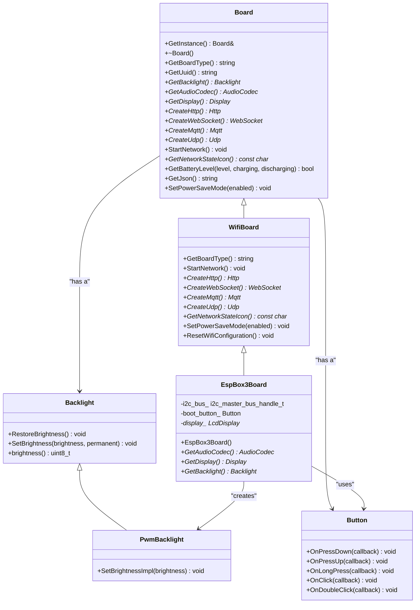

# 硬件适配流程指南

<cite>
**本文档引用的文件**  
- [main/boards/common/board.h](file://main/boards/common/board.h)
- [main/boards/common/board.cc](file://main/boards/common/board.cc)
- [main/boards/esp-box/esp_box_board.cc](file://main/boards/esp-box/esp_box_board.cc)
- [main/boards/common/wifi_board.h](file://main/boards/common/wifi_board.h)
- [main/boards/common/wifi_board.cc](file://main/boards/common/wifi_board.cc)
- [main/boards/common/backlight.h](file://main/boards/common/backlight.h)
- [main/boards/common/backlight.cc](file://main/boards/common/backlight.cc)
- [main/boards/common/button.h](file://main/boards/common/button.h)
- [main/boards/common/button.cc](file://main/boards/common/button.cc)
- [main/boards/common/axp2101.h](file://main/boards/common/axp2101.h)
- [main/boards/common/axp2101.cc](file://main/boards/common/axp2101.cc)
- [main/boards/common/i2c_device.h](file://main/boards/common/i2c_device.h)
- [main/boards/common/i2c_device.cc](file://main/boards/common/i2c_device.cc)
- [main/application.h](file://main/application.h)
- [main/iot/thing_manager.h](file://main/iot/thing_manager.h)
</cite>

## 目录
1. [引言](#引言)
2. [项目结构](#项目结构)
3. [核心组件](#核心组件)
4. [架构概览](#架构概览)
5. [详细组件分析](#详细组件分析)
6. [依赖分析](#依赖分析)
7. [性能考量](#性能考量)
8. [调试指南](#调试指南)
9. [结论](#结论)

## 引言
本文档详细阐述了自定义开发板的硬件适配全流程，重点分析了基于DECLARE_BOARD宏的运行时硬件实例化机制。通过分析Board基类及其派生类的实现，解释了硬件初始化、外设驱动加载和电源管理的生命周期管理。文档以esp_box_board.cc为例，展示了如何实现具体的GPIO初始化、外设配置和物联网功能集成。同时，文档提供了类图说明继承关系，并给出了调试建议，帮助开发者理解和维护硬件适配代码。

## 项目结构
项目采用模块化设计，将不同功能的代码组织在独立的目录中。硬件适配相关的代码主要位于`main/boards`目录下，其中`common`子目录存放了所有开发板共享的基类和通用组件，而其他子目录则对应具体的开发板型号。


**Diagram sources**
- [main/boards/common/board.h](file://main/boards/common/board.h)
- [main/boards/esp-box/esp_box_board.cc](file://main/boards/esp-box/esp_box_board.cc)

**Section sources**
- [main/boards/common/board.h](file://main/boards/common/board.h)
- [main/boards/esp-box/esp_box_board.cc](file://main/boards/esp-box/esp_box_board.cc)

## 核心组件
本节分析硬件适配的核心组件，包括Board基类、DECLARE_BOARD宏、单例模式和硬件抽象接口。

**Section sources**
- [main/boards/common/board.h](file://main/boards/common/board.h)
- [main/boards/common/board.cc](file://main/boards/common/board.cc)

## 架构概览
系统采用基于抽象基类和工厂模式的硬件抽象架构。Board基类定义了所有开发板必须实现的接口，而具体的开发板通过继承该基类并实现其虚函数来提供特定的硬件功能。



**Diagram sources**
- [main/boards/common/board.h](file://main/boards/common/board.h)
- [main/boards/common/wifi_board.h](file://main/boards/common/wifi_board.h)
- [main/boards/esp-box/esp_box_board.cc](file://main/boards/esp-box/esp_box_board.cc)
- [main/boards/common/backlight.h](file://main/boards/common/backlight.h)
- [main/boards/common/button.h](file://main/boards/common/button.h)

## 详细组件分析
本节深入分析硬件适配的关键组件，包括宏注册机制、基类实现、具体开发板实现和外设驱动。

### DECLARE_BOARD宏与运行时实例化
DECLARE_BOARD宏是实现运行时硬件实例化的关键机制。它定义了一个全局的`create_board()`函数，该函数在程序启动时被Board基类的单例模式调用，从而创建具体开发板的实例。

```cpp
#define DECLARE_BOARD(BOARD_CLASS_NAME) \
void* create_board() { \
    return new BOARD_CLASS_NAME(); \
}
```

当编译特定开发板时，链接器会将该开发板实现文件中的`create_board()`函数链接到最终的可执行文件中。Board基类通过调用这个函数来实例化具体的开发板对象，实现了硬件无关的初始化流程。

**Section sources**
- [main/boards/common/board.h](file://main/boards/common/board.h)
- [main/boards/esp-box/esp_box_board.cc](file://main/boards/esp-box/esp_box_board.cc)

### Board基类与生命周期管理
Board基类定义了硬件抽象的核心接口，其生命周期管理通过单例模式和虚函数调用时序来实现。


Board基类的构造函数在`GetInstance()`首次被调用时执行，负责生成设备UUID。具体开发板的构造函数则负责初始化所有外设，包括I2C、SPI、显示屏、按钮和物联网设备。

**Diagram sources**
- [main/boards/common/board.h](file://main/boards/common/board.h)
- [main/boards/common/board.cc](file://main/boards/common/board.cc)
- [main/boards/esp-box/esp_box_board.cc](file://main/boards/esp-box/esp_box_board.cc)

**Section sources**
- [main/boards/common/board.h](file://main/boards/common/board.h)
- [main/boards/common/board.cc](file://main/boards/common/board.cc)
- [main/boards/esp-box/esp_box_board.cc](file://main/boards/esp-box/esp_box_board.cc)

### 具体开发板实现：esp_box_board.cc
以ESP-BOX开发板为例，分析具体开发板的实现细节。

```cpp
class EspBox3Board : public WifiBoard {
private:
    i2c_master_bus_handle_t i2c_bus_;
    Button boot_button_;
    LcdDisplay* display_;

    void InitializeI2c() { /* I2C初始化 */ }
    void InitializeSpi() { /* SPI初始化 */ }
    void InitializeButtons() { /* 按钮初始化 */ }
    void InitializeIli9341Display() { /* 显示屏初始化 */ }
    void InitializeIot() { /* 物联网设备注册 */ }

public:
    EspBox3Board() : boot_button_(BOOT_BUTTON_GPIO) {
        InitializeI2c();
        InitializeSpi();
        InitializeIli9341Display();
        InitializeButtons();
        InitializeIot();
        GetBacklight()->RestoreBrightness();
    }

    virtual AudioCodec* GetAudioCodec() override { /* 返回音频编解码器实例 */ }
    virtual Display* GetDisplay() override { return display_; }
    virtual Backlight* GetBacklight() override { /* 返回背光控制器实例 */ }
};

DECLARE_BOARD(EspBox3Board);
```

该实现展示了如何通过继承WifiBoard基类来复用网络功能，并通过重写虚函数来提供具体的硬件实现。构造函数中按顺序初始化了所有外设，确保了正确的初始化时序。

**Section sources**
- [main/boards/esp-box/esp_box_board.cc](file://main/boards/esp-box/esp_box_board.cc)

### 外设驱动与硬件抽象
系统通过一系列硬件抽象类来管理外设，如背光控制、按钮处理和电源管理。

#### 背光控制
PwmBacklight类通过LEDC外设实现PWM背光控制，并支持亮度渐变效果。


**Diagram sources**
- [main/boards/common/backlight.h](file://main/boards/common/backlight.h)
- [main/boards/common/backlight.cc](file://main/boards/common/backlight.cc)

#### 按钮事件处理
Button类封装了iot_button库，提供了丰富的事件回调接口。

```cpp
Button boot_button_(BOOT_BUTTON_GPIO);
boot_button_.OnClick([this]() {
    auto& app = Application::GetInstance();
    if (app.GetDeviceState() == kDeviceStateStarting && !WifiStation::GetInstance().IsConnected()) {
        ResetWifiConfiguration();
    }
    app.ToggleChatState();
});
```

**Section sources**
- [main/boards/common/button.h](file://main/boards/common/button.h)
- [main/boards/common/button.cc](file://main/boards/common/button.cc)

#### 电源管理
Axp2101类通过I2C接口与电源管理芯片通信，提供电池状态查询功能。

```cpp
class Axp2101 : public I2cDevice {
public:
    bool IsCharging();
    bool IsDischarging();
    int GetBatteryLevel();
    void PowerOff();
};
```

**Section sources**
- [main/boards/common/axp2101.h](file://main/boards/common/axp2101.h)
- [main/boards/common/axp2101.cc](file://main/boards/common/axp2101.cc)

## 依赖分析
系统组件之间存在清晰的依赖关系，形成了分层的硬件抽象架构。


**Diagram sources**
- [main/boards/common/board.h](file://main/boards/common/board.h)
- [main/boards/esp-box/esp_box_board.cc](file://main/boards/esp-box/esp_box_board.cc)
- [main/application.h](file://main/application.h)

## 性能考量
硬件适配层的设计考虑了性能和资源使用效率：

1. **单例模式**：Board实例全局唯一，避免了重复创建和内存浪费。
2. **静态实例**：外设驱动如AudioCodec和Backlight使用静态实例，确保了生命周期与程序一致。
3. **延迟初始化**：部分资源在首次使用时才创建，减少了启动时的内存占用。
4. **DMA传输**：SPI显示屏使用DMA进行数据传输，提高了显示性能。

## 调试指南
### 日志输出
系统使用ESP-IDF的日志系统，通过`ESP_LOGI`、`ESP_LOGE`等宏输出调试信息。关键日志包括：
- Board构造函数中的UUID生成日志
- 外设初始化过程中的状态信息
- 网络连接状态变化日志

### 初始化顺序验证
确保外设按正确顺序初始化：
1. I2C/SPI总线初始化
2. 显示屏和音频编解码器初始化
3. 按钮和传感器初始化
4. 网络服务启动

### 资源冲突排查
常见问题及解决方案：
- **GPIO冲突**：检查`config.h`中的引脚定义是否与其他外设冲突。
- **I2C地址冲突**：使用逻辑分析仪检查I2C总线上是否有地址冲突。
- **内存不足**：通过`heap_caps_get_free_size()`监控内存使用情况。
- **初始化失败**：检查外设的电源和复位信号是否正常。

**Section sources**
- [main/boards/common/board.cc](file://main/boards/common/board.cc)
- [main/boards/common/wifi_board.cc](file://main/boards/common/wifi_board.cc)

## 结论
本文档详细阐述了自定义开发板的硬件适配全流程。通过DECLARE_BOARD宏和Board基类的单例模式，系统实现了灵活的运行时硬件实例化。开发者可以通过继承WifiBoard等基类，重写虚函数来适配新的开发板，而无需修改高层应用逻辑。这种分层的硬件抽象架构提高了代码的可维护性和可扩展性，为支持多种硬件平台提供了坚实的基础。