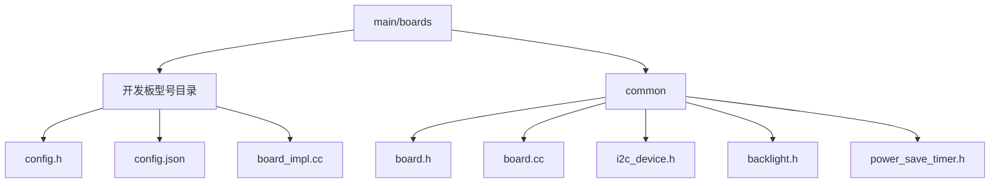
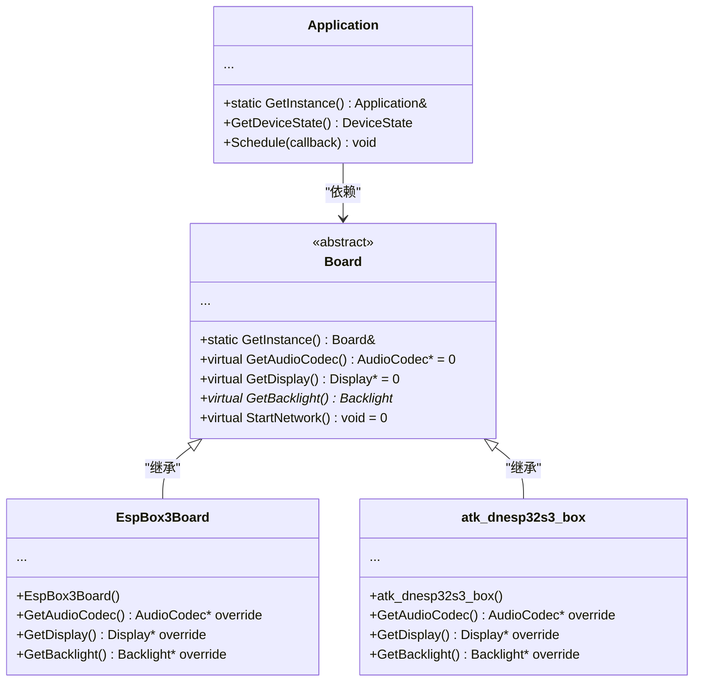
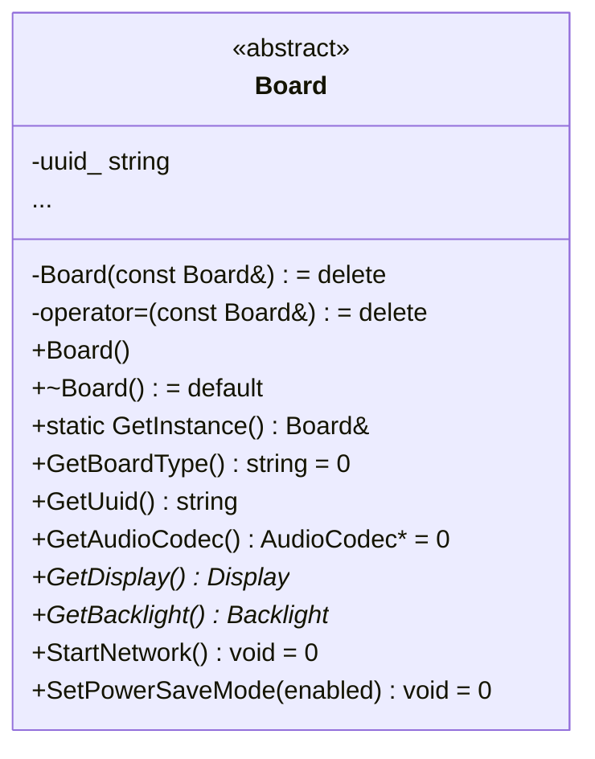
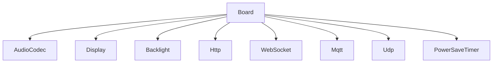

# 自定义开发板开发

<cite>
**本文档引用的文件**   
- [board.h](file://main/boards/common/board.h)
- [board.cc](file://main/boards/common/board.cc)
- [esp_box_board.cc](file://main/boards/esp-box/esp_box_board.cc)
- [atk_dnesp32s3_box.cc](file://main/boards/atk-dnesp32s3-box/atk_dnesp32s3_box.cc)
- [config.h](file://main/boards/esp-box/config.h)
- [config.json](file://main/boards/esp-box/config.json)
- [config.h](file://main/boards/atk-dnesp32s3-box/config.h)
- [config.json](file://main/boards/atk-dnesp32s3-box/config.json)
- [i2c_device.h](file://main/boards/common/i2c_device.h)
- [i2c_device.cc](file://main/boards/common/i2c_device.cc)
- [power_save_timer.h](file://main/boards/common/power_save_timer.h)
- [power_save_timer.cc](file://main/boards/common/power_save_timer.cc)
- [application.h](file://main/application.h)
- [application.cc](file://main/application.cc)
- [no_audio_codec.h](file://main/audio_codecs/no_audio_codec.h)
- [no_audio_codec.cc](file://main/audio_codecs/no_audio_codec.cc)
- [display.h](file://main/display/display.h)
</cite>

## 目录
1. [引言](#引言)
2. [项目结构](#项目结构)
3. [核心组件](#核心组件)
4. [架构概述](#架构概述)
5. [详细组件分析](#详细组件分析)
6. [依赖分析](#依赖分析)
7. [性能考量](#性能考量)
8. [故障排除指南](#故障排除指南)
9. [结论](#结论)

## 引言
本文档旨在为有经验的嵌入式开发者提供一份关于如何在现有框架下开发自定义开发板的深度技术指南。文档将详细阐述通过`DECLARE_BOARD`宏注册新硬件平台的机制，解析`board.h`中`Board`基类的设计原理与虚函数接口。开发者将学习如何继承`Board`类并实现具体的硬件初始化、外设配置和电源管理功能。文档还将涵盖`config.json`和`config.h`的配置规范，包括GPIO引脚映射、I2C设备地址、显示屏分辨率等关键参数的定义方式。通过分析`esp_box_board.cc`和`atk_dnesp32s3_box.cc`等实际案例，展示从硬件原理图设计到软件驱动适配的完整流程。此外，文档提供常见问题的解决方案，并强调硬件抽象层（HAL）的设计原则，以确保新开发板能无缝集成到Application单例架构中。

## 项目结构
项目采用功能模块化的目录结构，核心硬件抽象层（HAL）位于`main/boards`目录下。该目录包含多个子目录，每个子目录代表一个具体的开发板型号，如`esp-box`、`atk-dnesp32s3-box`等。每个开发板目录包含其特有的`config.h`和`config.json`配置文件，以及一个继承自`Board`基类的`.cc`实现文件。`common`子目录存放所有开发板共享的基础组件，如`board.h`、`i2c_device.h`、`backlight.h`等。这种结构实现了硬件特定代码与通用代码的分离，便于代码复用和维护。

**图源**
- [main/boards/common/board.h](file://main/boards/common/board.h)
- [main/boards/esp-box/esp_box_board.cc](file://main/boards/esp-box/esp_box_board.cc)

**本节来源**
- [main/boards/common/board.h](file://main/boards/common/board.h)
- [main/boards/esp-box/esp_box_board.cc](file://main/boards/esp-box/esp_box_board.cc)

## 核心组件
本项目的核心是`Board`基类，它定义了一个硬件抽象层（HAL），为上层应用（如`Application`）提供统一的硬件访问接口。`Board`类通过单例模式（`GetInstance()`）确保系统中只有一个硬件实例。`DECLARE_BOARD`宏是注册新开发板的关键，它定义了一个全局的`create_board()`函数，该函数负责创建特定开发板类的实例。`Board`类本身是抽象的，包含一系列纯虚函数（如`GetAudioCodec()`, `GetDisplay()`），这些函数必须由具体的开发板类实现，从而实现了多态性。

**本节来源**
- [main/boards/common/board.h](file://main/boards/common/board.h)
- [main/boards/common/board.cc](file://main/boards/common/board.cc)

## 架构概述
系统采用分层架构，上层应用逻辑（`Application`）与底层硬件细节通过`Board`抽象层进行解耦。`Application`单例通过调用`Board::GetInstance()`来获取对当前硬件平台的引用，并通过其虚函数接口访问具体的硬件功能，如音频、显示、网络等。当系统启动时，`create_board()`函数（由`DECLARE_BOARD`宏生成）被调用，根据编译时选择的开发板，创建对应的`Board`派生类实例。这种设计使得上层应用无需关心具体的硬件实现，极大地提高了代码的可移植性和可维护性。

**图源**
- [main/boards/common/board.h](file://main/boards/common/board.h)
- [main/boards/esp-box/esp_box_board.cc](file://main/boards/esp-box/esp_box_board.cc)
- [main/boards/atk-dnesp32s3-box/atk_dnesp32s3_box.cc](file://main/boards/atk-dnesp32s3-box/atk_dnesp32s3_box.cc)

## 详细组件分析

### Board 基类设计分析
`Board`基类是整个硬件抽象层的基石。它通过禁用拷贝构造函数和赋值操作符（`delete`）来确保单例模式的正确性。其构造函数负责初始化设备的唯一标识符（UUID），该标识符优先从NVS（非易失性存储）中读取，若不存在则生成一个并保存。`GetInstance()`是单例模式的核心，它利用静态变量和`create_board()`函数来延迟创建并返回唯一的`Board`实例。

#### Board 类图

**图源**
- [main/boards/common/board.h](file://main/boards/common/board.h)

**本节来源**
- [main/boards/common/board.h](file://main/boards/common/board.h)
- [main/boards/common/board.cc](file://main/boards/common/board.cc)

### DECLARE_BOARD 宏机制分析
`DECLARE_BOARD`宏是实现开发板动态注册的核心。它定义了一个名为`create_board`的全局函数，该函数返回一个指向新创建的指定开发板类实例的`void*`指针。`Board::GetInstance()`在首次被调用时，会执行这个`create_board`函数，并将其返回的`void*`指针强制转换为`Board*`指针并存储在静态变量`instance`中。由于C++的链接规则，当链接包含特定开发板实现的`.o`文件时，该开发板的`DECLARE_BOARD`宏所生成的`create_board`函数会覆盖链接器中的符号，从而确保`GetInstance()`返回的是正确的开发板实例。

**本节来源**
- [main/boards/common/board.h](file://main/boards/common/board.h)

### 开发板实现案例分析
以`esp_box_board.cc`和`atk_dnesp32s3_box.cc`为例，分析如何继承`Board`类。

#### esp_box_board.cc 实现
`EspBox3Board`类继承自`WifiBoard`（`WifiBoard`又继承自`Board`），在其构造函数中完成了所有硬件的初始化：
1.  **I2C初始化**：配置I2C总线，用于连接音频编解码器（ES8311）。
2.  **SPI初始化**：配置SPI总线，用于驱动ILI9341显示屏。
3.  **显示屏初始化**：创建`esp_lcd_panel_io_t`和`esp_lcd_panel_handle_t`对象，配置并初始化ILI9341驱动芯片，最后创建`LcdDisplay`对象。
4.  **按钮初始化**：设置启动按钮的点击回调函数。
5.  **物联网初始化**：向`ThingManager`注册“Speaker”和“Screen”设备。

其虚函数`GetAudioCodec()`、`GetDisplay()`和`GetBacklight()`返回在构造函数中初始化好的单例对象。

#### atk_dnesp32s3_box.cc 实现
`atk_dnesp32s3_box`类同样继承自`WifiBoard`，其初始化流程类似，但有其特定之处：
1.  **I2C初始化**：配置I2C总线，并使用`XL9555_IN`类（继承自`I2cDevice`）来读取一个I/O扩展芯片的状态，以判断音频编解码器的型号（ES8311或NS4168）。
2.  **并行总线初始化**：使用`esp_lcd_new_i80_bus`初始化8位并行总线（I80），用于驱动ST7789显示屏。
3.  **显示屏初始化**：与`esp_box`类似，但针对ST7789的特性进行了配置。

**本节来源**
- [main/boards/esp-box/esp_box_board.cc](file://main/boards/esp-box/esp_box_board.cc)
- [main/boards/atk-dnesp32s3-box/atk_dnesp32s3_box.cc](file://main/boards/atk-dnesp32s3-box/atk_dnesp32s3_box.cc)

### 配置文件规范
开发板的硬件参数通过`config.h`和`config.json`两个文件定义。

#### config.h
这是一个C/C++头文件，使用`#define`宏定义具体的硬件参数。例如：
-   **音频**：`AUDIO_I2S_GPIO_WS`, `AUDIO_CODEC_I2C_SDA_PIN`
-   **显示**：`DISPLAY_WIDTH`, `DISPLAY_HEIGHT`, `DISPLAY_BACKLIGHT_PIN`
-   **GPIO**：`BOOT_BUTTON_GPIO`, `BUILTIN_LED_GPIO`

这些宏在开发板的`.cc`实现文件中被直接引用，确保了代码与硬件引脚的强关联性。

#### config.json
这是一个JSON格式的配置文件，主要用于构建系统（如idf.py）的配置。它指定了目标芯片（`"target": "esp32s3"`）和构建时需要追加的SDK配置（`sdkconfig_append`），例如`CONFIG_USE_WECHAT_MESSAGE_STYLE=y`。

**本节来源**
- [main/boards/esp-box/config.h](file://main/boards/esp-box/config.h)
- [main/boards/esp-box/config.json](file://main/boards/esp-box/config.json)
- [main/boards/atk-dnesp32s3-box/config.h](file://main/boards/atk-dnesp32s3-box/config.h)
- [main/boards/atk-dnesp32s3-box/config.json](file://main/boards/atk-dnesp32s3-box/config.json)

## 依赖分析
`Board`类与多个核心组件存在依赖关系，这些依赖通过虚函数接口暴露给上层应用。
-   **音频**：依赖`AudioCodec`类，通过`GetAudioCodec()`提供音频输入/输出功能。
-   **显示**：依赖`Display`类，通过`GetDisplay()`提供图形界面渲染功能。
-   **网络**：依赖`Http`, `WebSocket`, `Mqtt`, `Udp`等类，通过`CreateHttp()`等函数创建网络连接。
-   **电源管理**：依赖`PowerSaveTimer`类，通过`SetPowerSaveMode()`控制设备的节能模式。

**图源**
- [main/boards/common/board.h](file://main/boards/common/board.h)

**本节来源**
- [main/boards/common/board.h](file://main/boards/common/board.h)

## 性能考量
硬件抽象层的设计对性能有重要影响。`Board`类的虚函数调用会引入少量的间接寻址开销，但在现代处理器上通常可以忽略不计。性能瓶颈更可能出现在具体的硬件驱动实现中，例如：
-   **显示屏刷新**：高分辨率或高刷新率的屏幕会占用大量CPU和SPI/I80总线带宽。
-   **音频处理**：实时音频编解码和处理对CPU资源要求较高。
-   **I2C通信**：低速的I2C总线可能成为外设通信的瓶颈。

`Application`类中的`CanEnterSleepMode()`函数和`PowerSaveTimer`类协同工作，可以在系统空闲时降低CPU频率或进入轻度睡眠，以优化功耗。

## 故障排除指南
### I2C通信失败
1.  **检查引脚连接**：确认SDA和SCL引脚在`config.h`中的定义与实际硬件连接一致。
2.  **检查上拉电阻**：确保I2C总线上有合适的上拉电阻（通常为4.7kΩ）。
3.  **使用探测工具**：参考`atoms3r-echo-base`等开发板的实现，在初始化时使用`i2c_master_probe`函数扫描I2C总线，打印出所有响应的设备地址，以确认设备是否被正确识别。
4.  **检查设备地址**：确认`config.h`中定义的设备地址（如`AUDIO_CODEC_ES8311_ADDR`）与设备手册一致。

### 显示屏初始化异常
1.  **检查复位引脚**：确保显示屏的复位（RST）引脚连接正确，并在初始化时正确执行了复位操作。
2.  **检查电源**：确认显示屏已获得正确的电源电压。
3.  **检查通信总线**：根据显示屏类型（SPI、I2C、I80），检查相应的总线配置（时钟、数据线）是否正确。
4.  **优雅降级**：参考`kevin_box_board.cc`的实现，在`esp_lcd_panel_init()`失败时，创建一个`NoDisplay`对象作为占位符，避免程序崩溃。

### 音频编解码器不识别
1.  **检查I2C通信**：首先解决I2C通信问题。
2.  **检查供电**：确认音频编解码器芯片已上电。
3.  **使用备用驱动**：如果无法识别特定编解码器，可以像`atk_dnesp32s3_box`那样，通过检测引脚电平来判断型号，并使用不同的驱动。或者，可以实现一个`NoAudioCodec`类作为备用，提供基本的I2S音频功能。

## 结论
本文档详细阐述了基于`Board`基类和`DECLARE_BOARD`宏的自定义开发板开发框架。通过继承`Board`类并实现其虚函数，开发者可以轻松地为新硬件平台提供驱动支持。`config.h`和`config.json`文件提供了清晰的硬件参数配置方式。该框架通过硬件抽象层（HAL）有效地将应用逻辑与硬件细节分离，确保了代码的可移植性和可维护性。遵循本文档的指导，开发者可以高效地完成新开发板的集成工作。