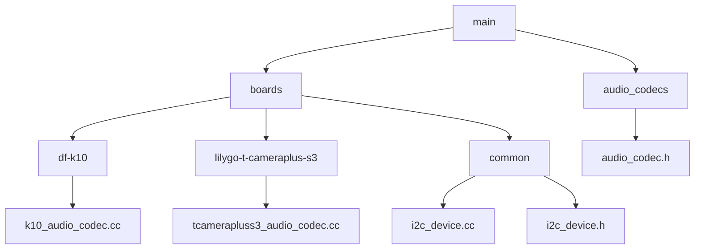
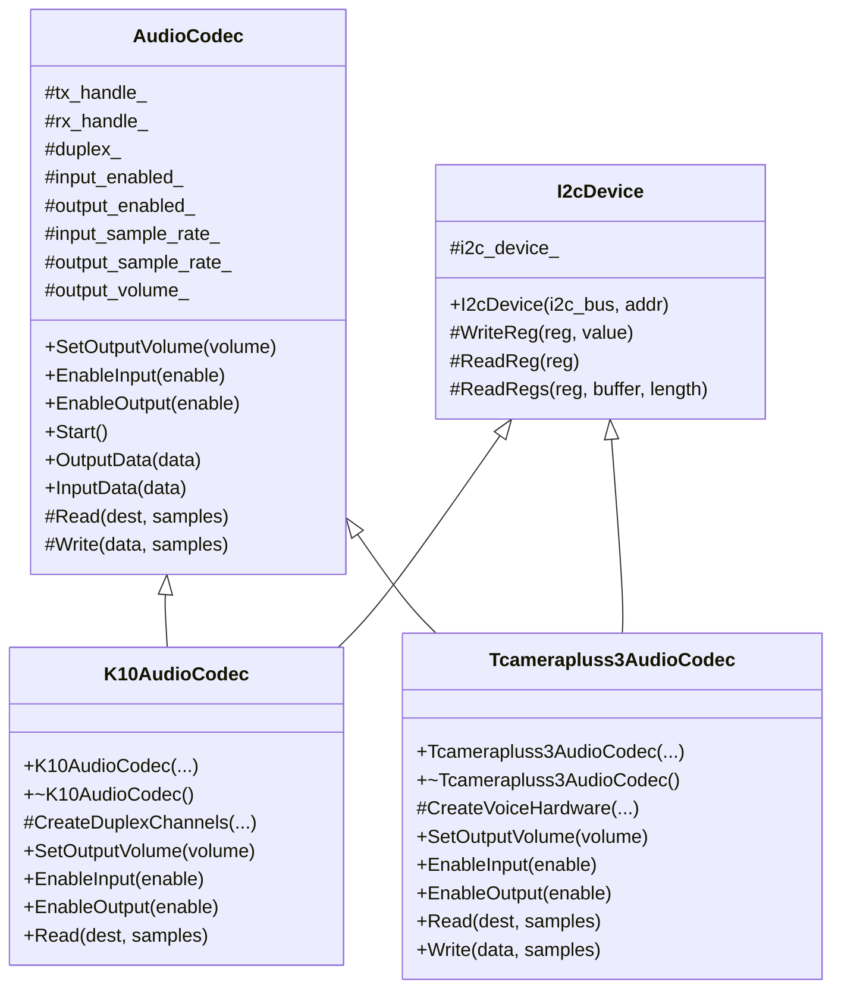
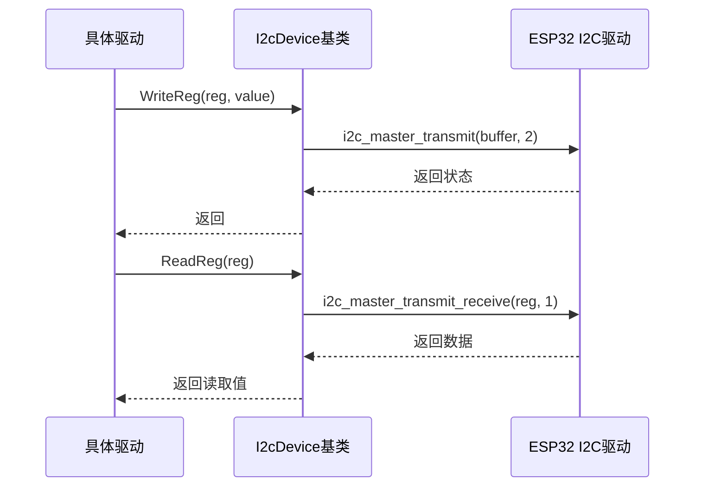
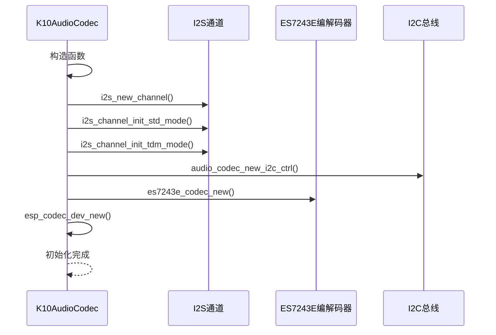

# 驱动开发实践

<cite>
**本文档引用文件**  
- [k10_audio_codec.cc](file://main/boards/df-k10/k10_audio_codec.cc)
- [tcamerapluss3_audio_codec.cc](file://main/boards/lilygo-t-cameraplus-s3/tcamerapluss3_audio_codec.cc)
- [board_control.cc](file://main/boards/esp32-s3-touch-lcd-3.5/board_control.cc)
- [board_control.cc](file://main/boards/esp32-s3-touch-amoled-1.8/board_control.cc)
- [i2c_device.cc](file://main/boards/common/i2c_device.cc)
- [i2c_device.h](file://main/boards/common/i2c_device.h)
- [audio_codec.h](file://main/audio_codecs/audio_codec.h)
</cite>

## 目录
1. [引言](#引言)
2. [项目结构分析](#项目结构分析)
3. [核心驱动组件分析](#核心驱动组件分析)
4. [I2C设备驱动基类详解](#i2c设备驱动基类详解)
5. [音频编解码器驱动实现](#音频编解码器驱动实现)
6. [复杂外设初始化流程](#复杂外设初始化流程)
7. [线程安全与资源访问](#线程安全与资源访问)
8. [驱动调试技巧](#驱动调试技巧)
9. [常见问题与解决方案](#常见问题与解决方案)

## 引言
本文档旨在为显示屏、音频编解码器、背光控制等常见外设的驱动开发提供实战指南。通过分析具体代码实现，深入探讨基于I2CDevice基类扩展具体设备驱动的关键技术点，包括I2C通信协议实现、寄存器配置序列、错误重试机制等。同时，展示复杂外设的多阶段初始化流程，强调线程安全设计，并提供实用的驱动调试技巧。

## 项目结构分析
项目采用模块化设计，主要功能模块按功能划分在不同目录下。音频相关驱动位于`main/audio_codecs`目录，而具体开发板的驱动实现则分布在`main/boards`目录下的各个子目录中。公共基础类如I2CDevice位于`main/boards/common`目录，体现了代码复用的设计原则。



**图示来源**
- [k10_audio_codec.cc](file://main/boards/df-k10/k10_audio_codec.cc)
- [tcamerapluss3_audio_codec.cc](file://main/boards/lilygo-t-cameraplus-s3/tcamerapluss3_audio_codec.cc)
- [i2c_device.cc](file://main/boards/common/i2c_device.cc)
- [i2c_device.h](file://main/boards/common/i2c_device.h)
- [audio_codec.h](file://main/audio_codecs/audio_codec.h)

**本节来源**
- [k10_audio_codec.cc](file://main/boards/df-k10/k10_audio_codec.cc)
- [tcamerapluss3_audio_codec.cc](file://main/boards/lilygo-t-cameraplus-s3/tcamerapluss3_audio_codec.cc)

## 核心驱动组件分析
核心驱动组件主要包括音频编解码器驱动和I2C设备基类。音频编解码器驱动通过继承AudioCodec基类实现具体功能，而I2C设备驱动则基于I2cDevice基类进行扩展。这种分层设计使得代码具有良好的可维护性和可扩展性。



**图示来源**
- [k10_audio_codec.cc](file://main/boards/df-k10/k10_audio_codec.cc)
- [tcamerapluss3_audio_codec.cc](file://main/boards/lilygo-t-cameraplus-s3/tcamerapluss3_audio_codec.cc)
- [audio_codec.h](file://main/audio_codecs/audio_codec.h)
- [i2c_device.h](file://main/boards/common/i2c_device.h)

**本节来源**
- [k10_audio_codec.cc](file://main/boards/df-k10/k10_audio_codec.cc)
- [tcamerapluss3_audio_codec.cc](file://main/boards/lilygo-t-cameraplus-s3/tcamerapluss3_audio_codec.cc)
- [audio_codec.h](file://main/audio_codecs/audio_codec.h)

## I2C设备驱动基类详解
I2cDevice基类为所有I2C设备驱动提供了统一的接口和基础功能实现。该基类封装了I2C通信的基本操作，包括寄存器读写，简化了具体设备驱动的开发。

### 基类接口定义
I2cDevice基类定义了三个受保护的成员函数用于寄存器操作：
- **WriteReg**: 向指定寄存器写入单个字节数据
- **ReadReg**: 从指定寄存器读取单个字节数据
- **ReadRegs**: 从指定寄存器开始连续读取多个字节数据



**图示来源**
- [i2c_device.cc](file://main/boards/common/i2c_device.cc)
- [i2c_device.h](file://main/boards/common/i2c_device.h)

### 基类实现细节
I2cDevice的构造函数负责初始化I2C设备句柄，配置I2C总线参数，包括设备地址长度、设备地址、SCL时钟频率等。所有I2C操作都通过ESP-IDF提供的i2c_master系列API实现，并使用ESP_ERROR_CHECK进行错误检查。

```cpp
I2cDevice::I2cDevice(i2c_master_bus_handle_t i2c_bus, uint8_t addr) {
    i2c_device_config_t i2c_device_cfg = {
        .dev_addr_length = I2C_ADDR_BIT_LEN_7,
        .device_address = addr,
        .scl_speed_hz = 400 * 1000,
        .scl_wait_us = 0,
        .flags = {
            .disable_ack_check = 0,
        },
    };
    ESP_ERROR_CHECK(i2c_master_bus_add_device(i2c_bus, &i2c_device_cfg, &i2c_device_));
    assert(i2c_device_ != NULL);
}
```

**本节来源**
- [i2c_device.cc](file://main/boards/common/i2c_device.cc#L0-L34)
- [i2c_device.h](file://main/boards/common/i2c_device.h#L0-L17)

## 音频编解码器驱动实现
音频编解码器驱动通过继承AudioCodec基类和使用I2cDevice基类功能来实现具体设备的控制。以k10_audio_codec.cc和tcamerapluss3_audio_codec.cc为例，展示了两种不同的实现方式。

### K10音频编解码器实现
K10音频编解码器驱动使用了ESP-IDF提供的高级音频编解码器框架，通过audio_codec_new_i2c_ctrl、es7243e_codec_new等API创建控制接口和编解码器实例。



**图示来源**
- [k10_audio_codec.cc](file://main/boards/df-k10/k10_audio_codec.cc#L0-L199)

### T-CameraPlus-S3音频编解码器实现
T-CameraPlus-S3音频编解码器驱动采用更直接的I2S通道操作方式，直接使用i2s_channel_read和i2s_channel_write进行数据传输。

```cpp
int Tcamerapluss3AudioCodec::Read(int16_t *dest, int samples){
    if (input_enabled_){
        size_t bytes_read;
        i2s_channel_read(rx_handle_, dest, samples * sizeof(int16_t), &bytes_read, portMAX_DELAY);
    }
    return samples;
}

int Tcamerapluss3AudioCodec::Write(const int16_t *data, int samples){
    if (output_enabled_){
        size_t bytes_read;
        auto output_data = (int16_t *)malloc(samples * sizeof(int16_t));
        for (size_t i = 0; i < samples; i++){
            output_data[i] = (float)data[i] * (float)(volume_ / 100.0);
        }
        i2s_channel_write(tx_handle_, output_data, samples * sizeof(int16_t), &bytes_read, portMAX_DELAY);
        free(output_data);
    }
    return samples;
}
```

**本节来源**
- [k10_audio_codec.cc](file://main/boards/df-k10/k10_audio_codec.cc)
- [tcamerapluss3_audio_codec.cc](file://main/boards/lilygo-t-cameraplus-s3/tcamerapluss3_audio_codec.cc)

## 复杂外设初始化流程
对于带触摸控制器的LCD等复杂外设，初始化流程通常分为多个阶段，确保各个子系统按正确顺序启动。

### 多阶段初始化示例
虽然提供的board_control.cc文件主要实现了WiFi重置功能，但其设计模式体现了复杂外设管理的思想。通过继承Thing类并注册方法，实现了对外设的远程控制能力。

```cpp
namespace iot {
class BoardControl : public Thing {
public:
    BoardControl() : Thing("BoardControl", "当前 AI 机器人管理和控制") {
        methods_.AddMethod("ResetWifiConfiguration", "重新配网", ParameterList(), 
            [this](const ParameterList& parameters) {
                ESP_LOGI(TAG, "ResetWifiConfiguration");
                auto board = static_cast<WifiBoard*>(&Board::GetInstance());
                if (board && board->GetBoardType() == "wifi") {
                    board->ResetWifiConfiguration();
                }
            });
    }
};
} // namespace iot
```

**本节来源**
- [board_control.cc](file://main/boards/esp32-s3-touch-lcd-3.5/board_control.cc)
- [board_control.cc](file://main/boards/esp32-s3-touch-amoled-1.8/board_control.cc)

## 线程安全与资源访问
在驱动开发中，线程安全是至关重要的考虑因素。需要明确区分中断上下文和任务上下文中的资源访问规范。

### 资源访问规范
- **中断上下文**: 只能调用ISR安全的API，避免使用动态内存分配、阻塞操作
- **任务上下文**: 可以使用完整的ESP-IDF API，但仍需注意资源竞争
- **共享资源**: 使用互斥锁保护，避免竞态条件

虽然具体实现中未直接展示锁的使用，但通过ESP_ERROR_CHECK_WITHOUT_ABORT等非阻塞错误处理方式，体现了对实时性的考虑。

**本节来源**
- [k10_audio_codec.cc](file://main/boards/df-k10/k10_audio_codec.cc)
- [tcamerapluss3_audio_codec.cc](file://main/boards/lilygo-t-cameraplus-s3/tcamerapluss3_audio_codec.cc)

## 驱动调试技巧
有效的调试技巧对于驱动开发至关重要，可以帮助快速定位和解决问题。

### 调试方法
1. **I2C总线嗅探**: 使用逻辑分析仪监控I2C通信，验证地址、命令和数据是否正确
2. **寄存器状态dump**: 在关键点读取并打印设备寄存器状态，确认配置是否生效
3. **时序分析**: 使用示波器检查I2S、I2C等信号的时序是否符合规范
4. **日志输出**: 使用ESP_LOGI等宏输出调试信息，跟踪执行流程

```cpp
#define TAG "K10AudioCodec"
ESP_LOGI(TAG, "DF-K10 AudioDevice initialized");
ESP_LOGI(TAG, "Duplex channels created");
```

**本节来源**
- [k10_audio_codec.cc](file://main/boards/df-k10/k10_audio_codec.cc)
- [tcamerapluss3_audio_codec.cc](file://main/boards/lilygo-t-cameraplus-s3/tcamerapluss3_audio_codec.cc)

## 常见问题与解决方案
### 硬件兼容性问题
1. **I2C地址冲突**: 检查设备地址配置，确保总线上无地址冲突
2. **时钟频率不匹配**: 调整SCL时钟频率，确保在设备支持范围内
3. **电源不稳定**: 检查电源设计，确保电压和电流满足要求
4. **信号完整性差**: 优化PCB布局，缩短走线，增加终端电阻

### 软件实现问题
1. **初始化顺序错误**: 确保按正确顺序初始化外设和依赖资源
2. **资源泄漏**: 在析构函数中正确释放所有分配的资源
3. **错误处理不足**: 使用适当的错误检查和恢复机制
4. **性能瓶颈**: 优化数据传输和处理流程，减少延迟

**本节来源**
- [k10_audio_codec.cc](file://main/boards/df-k10/k10_audio_codec.cc)
- [tcamerapluss3_audio_codec.cc](file://main/boards/lilygo-t-cameraplus-s3/tcamerapluss3_audio_codec.cc)
- [i2c_device.cc](file://main/boards/common/i2c_device.cc)