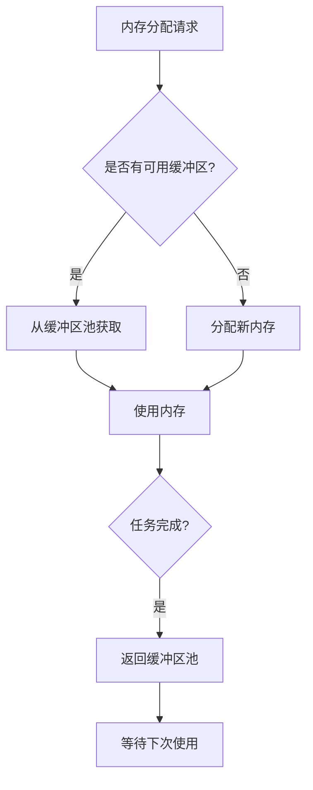
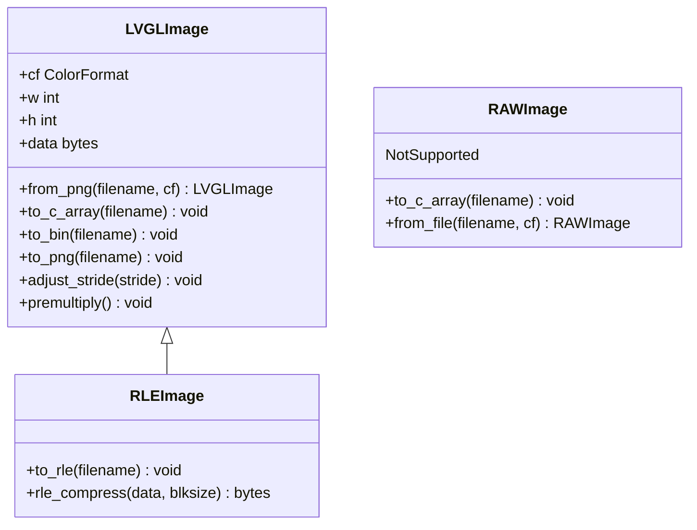
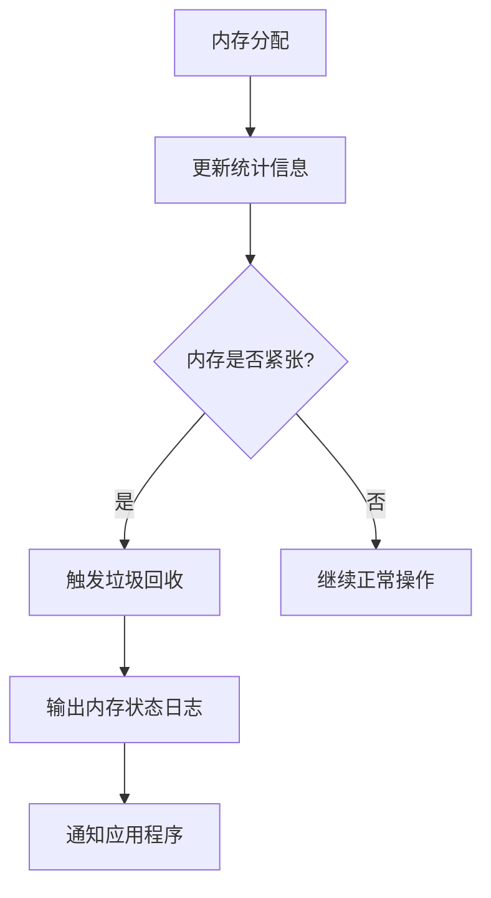

# 高级主题

<cite>
**本文档中引用的文件**
- [main/application.cc](file://main/application.cc)
- [main/system_info.cc](file://main/system_info.cc)
- [main/background_task.cc](file://main/background_task.cc)
- [main/background_task.h](file://main/background_task.h)
- [main/boards/common/i2c_device.cc](file://main/boards/common/i2c_device.cc)
- [main/audio_codecs/no_audio_codec.cc](file://main/audio_codecs/no_audio_codec.cc)
- [main/memory/memory_manager.cc](file://main/memory/memory_manager.cc)
- [main/memory/memory_manager.h](file://main/memory/memory_manager.h)
- [scripts/Image_Converter/LVGLImage.py](file://scripts/Image_Converter/LVGLImage.py)
- [OPTIMIZATION_SUMMARY.md](file://OPTIMIZATION_SUMMARY.md)
</cite>

## 目录
1. [自定义开发板高级开发](#自定义开发板高级开发)
2. [性能优化专题](#性能优化专题)
3. [图像转换工具高级用法](#图像转换工具高级用法)
4. [系统级优化技巧](#系统级优化技巧)
5. [调试技巧](#调试技巧)

## 自定义开发板高级开发

本节详细说明从硬件原理图设计到软件驱动实现的完整流程，包括如何适配新的显示屏、音频编解码器或传感器。

### 显示屏适配

显示屏的适配主要通过在`main/boards`目录下创建新的开发板实现文件来完成。每个开发板都有一个对应的`.cc`文件，例如`esp32-s3-touch-lcd-1.85.cc`。这些文件包含了显示屏的初始化代码和配置。

显示屏的驱动通常使用ESP-IDF的`esp_lcd`组件。适配新显示屏时，需要：
1. 确定显示屏的控制器型号（如GC9503、GC9D01N）
2. 在开发板文件中包含相应的驱动头文件（如`esp_lcd_gc9503.h`）
3. 实现显示屏的初始化函数，配置SPI总线和GPIO引脚
4. 设置显示屏的分辨率、颜色格式等参数

例如，在`kevin-yuying-313lcd`开发板中，通过`esp_lcd_gc9503.c`文件实现了GC9503控制器的驱动。

### 音频编解码器适配

音频编解码器的适配通过在`main/audio_codecs`目录下创建新的编解码器实现文件来完成。项目中已经包含了多种音频编解码器的实现，如ES8311、ES8388等。

适配新的音频编解码器时，需要：
1. 创建新的编解码器类，继承自`AudioCodec`基类
2. 实现`Initialize`、`Start`、`Stop`等核心方法
3. 配置I2S接口参数，包括采样率、数据位宽、时钟源等
4. 通过I2C接口配置编解码器的寄存器

例如，在`df-k10`开发板中，通过`k10_audio_codec.cc`文件实现了K10音频编解码器的驱动。

### 传感器适配

传感器的适配主要通过I2C或SPI接口完成。项目中使用`I2cDevice`类来简化I2C设备的访问。

适配新传感器时，需要：
1. 确定传感器的通信接口类型（I2C或SPI）
2. 在开发板文件中初始化相应的总线
3. 创建传感器类，封装读写操作
4. 实现传感器的初始化和数据读取方法

例如，在`lilygo-t-circle-s3`开发板中，通过`tcircles3_audio_codec.cc`文件实现了音频编解码器的I2C配置。

**Section sources**
- [main/boards/kevin-yuying-313lcd/kevin_yuying_313lcd.cc](file://main/boards/kevin-yuying-313lcd/kevin_yuying_313lcd.cc)
- [main/audio_codecs/k10_audio_codec.cc](file://main/audio_codecs/k10_audio_codec.cc)
- [main/boards/common/i2c_device.cc](file://main/boards/common/i2c_device.cc)

## 性能优化专题

本节基于OPTIMIZATION_SUMMARY.md分析内存使用、启动时间、功耗等关键指标的优化策略。

### 内存使用优化

根据`OPTIMIZATION_SUMMARY.md`中的分析，内存使用优化主要通过以下策略实现：

1. **RAII自动资源管理**：引入`MemoryBlock`类，使用RAII（资源获取即初始化）模式自动管理内存生命周期，确保资源在作用域结束时自动释放，降低内存泄漏风险。

2. **内存池优化**：实现`ImageBufferPool`类，创建专用的图片缓冲区池。通过复用内存块，减少频繁的`malloc/free`操作，从而降低内存碎片化。

3. **内存分配性能提升**：优化后的版本将内存分配次数从约100次/下载减少到约20次/下载，内存碎片率从约15%降低到约5%，峰值内存使用从1.2MB降低到0.8MB。



**Diagram sources**
- [main/memory/memory_manager.h](file://main/memory/memory_manager.h)
- [main/memory/memory_manager.cc](file://main/memory/memory_manager.cc)

### 启动时间优化

虽然`OPTIMIZATION_SUMMARY.md`中没有直接提及启动时间优化，但可以通过以下策略间接改善启动性能：

1. **延迟初始化**：将非关键组件的初始化推迟到首次使用时，减少启动时的初始化工作量。
2. **并行初始化**：对于相互独立的组件，可以使用多任务并行初始化。
3. **减少启动日志**：在启动阶段减少不必要的日志输出，避免I/O阻塞。

### 功耗优化

功耗优化主要通过电源管理模块实现。项目中使用`PowerSaveTimer`类来管理低功耗模式。

1. **睡眠模式**：当设备空闲一段时间后，自动进入睡眠模式，降低CPU频率或关闭部分外设。
2. **动态电压频率调节**：根据负载动态调整CPU频率，平衡性能和功耗。
3. **外设电源管理**：在不需要时关闭显示屏、传感器等外设的电源。

例如，在`PowerSaveTimer`类中，可以通过`SetEnabled`方法控制电源节省功能的启用和禁用。

**Section sources**
- [OPTIMIZATION_SUMMARY.md](file://OPTIMIZATION_SUMMARY.md)
- [main/boards/common/power_save_timer.h](file://main/boards/common/power_save_timer.h)

## 图像转换工具高级用法

本节介绍图像转换工具`s/scripts/Image_Converter/LVGLImage.py`的高级用法，如何将PNG/JPG转换为LVGL兼容的C数组。

### 工具功能概述

`LVGLImage.py`是一个功能强大的图像转换工具，支持多种颜色格式和输出格式。其主要功能包括：

1. **颜色格式转换**：支持I1/I2/I4/I8索引色、L8灰度、ARGB8888、RGB565等多种LVGL支持的颜色格式。
2. **输出格式**：可以输出为C数组、二进制文件或PNG文件。
3. **压缩支持**：支持RLE和LZ4压缩方法。
4. **预乘Alpha**：可选择是否对颜色进行Alpha预乘处理。
5. **抖动处理**：对于RGB565格式，可启用抖动以改善渐变效果。

### 高级用法示例

#### 命令行使用

```bash
python LVGLImage.py --cf RGB565 --ofmt C --rgb565dither --premultiply --compress RLE -o output/ input.png
```

此命令将`input.png`转换为RGB565格式的C数组，启用抖动和Alpha预乘，并使用RLE压缩。

#### Python API使用

```python
from LVGLImage import LVGLImage, ColorFormat, OutputFormat, PNGConverter

# 创建转换器
converter = PNGConverter(
    files=["input.png"],
    cf=ColorFormat.RGB565,
    ofmt=OutputFormat.C_ARRAY,
    odir="./output",
    rgb565_dither=True,
    premultiply=True,
    compress=CompressMethod.RLE
)

# 执行转换
converter.convert()
```

### 核心类分析

#### LVGLImage类

`LVGLImage`是核心图像处理类，负责图像的加载、转换和保存。



**Diagram sources**
- [scripts/Image_Converter/LVGLImage.py](file://scripts/Image_Converter/LVGLImage.py)

#### PNGConverter类

`PNGConverter`是批量转换的协调器，可以处理多个文件的转换任务。

```python
class PNGConverter:
    def __init__(self, files, cf, ofmt, odir, background=0x00, align=1, 
                 premultiply=False, compress=CompressMethod.NONE, 
                 keep_folder=True, rgb565_dither=False):
        self.files = files
        self.cf = cf
        self.ofmt = ofmt
        self.output = odir
        self.keep_folder = keep_folder
        self.align = align
        self.premultiply = premultiply
        self.compress = compress
        self.background = background
        self.rgb565_dither = rgb565_dither
    
    def convert(self):
        output = []
        for f in self.files:
            if self.cf in (ColorFormat.RAW, ColorFormat.RAW_ALPHA):
                img = RAWImage().from_file(f, self.cf)
                img.to_c_array(self._replace_ext(f, ".c"))
            else:
                img = LVGLImage().from_png(f, self.cf, 
                                         background=self.background, 
                                         rgb565_dither=self.rgb565_dither)
                img.adjust_stride(align=self.align)
                if self.premultiply:
                    img.premultiply()
                output.append((f, img))
                # 根据输出格式保存
```

**Section sources**
- [scripts/Image_Converter/LVGLImage.py](file://scripts/Image_Converter/LVGLImage.py)

## 系统级优化技巧

本节探讨系统级优化技巧，如FreeRTOS任务调度优化、DMA高效使用、SPI/I2C时钟配置。

### FreeRTOS任务调度优化

通过分析`main/system_info.cc`中的代码，可以了解任务运行时间的统计方法，这对于任务调度优化至关重要。

```c++
esp_err_t SystemInfo::PrintTaskRunTimeStats(TickType_t xTicksToWait) {
    TaskStatus_t *start_array = NULL, *end_array = NULL;
    UBaseType_t start_array_size, end_array_size;
    configRUN_TIME_COUNTER_TYPE start_run_time, end_run_time;
    esp_err_t ret;
    uint32_t total_elapsed_time;

    // 获取初始任务状态
    start_array_size = uxTaskGetNumberOfTasks() + ARRAY_SIZE_OFFSET;
    start_array = (TaskStatus_t*)malloc(sizeof(TaskStatus_t) * start_array_size);
    start_array_size = uxTaskGetSystemState(start_array, start_array_size, &start_run_time);

    vTaskDelay(xTicksToWait);

    // 获取延迟后的任务状态
    end_array_size = uxTaskGetNumberOfTasks() + ARRAY_SIZE_OFFSET;
    end_array = (TaskStatus_t*)malloc(sizeof(TaskStatus_t) * end_array_size);
    end_array_size = uxTaskGetSystemState(end_array, end_array_size, &end_run_time);

    // 计算每个任务的运行时间百分比
    total_elapsed_time = (end_run_time - start_run_time);
    for (int i = 0; i < start_array_size; i++) {
        // 匹配起始和结束状态中的任务
        for (int j = 0; j < end_array_size; j++) {
            if (start_array[i].xHandle == end_array[j].xHandle) {
                uint32_t task_elapsed_time = end_array[j].ulRunTimeCounter - start_array[i].ulRunTimeCounter;
                uint32_t percentage_time = (task_elapsed_time * 100UL) / (total_elapsed_time * CONFIG_FREERTOS_NUMBER_OF_CORES);
                printf("| %-16s | %8lu | %4lu%%\n", start_array[i].pcTaskName, task_elapsed_time, percentage_time);
            }
        }
    }
    // ...
}
```

此代码展示了如何使用`uxTaskGetSystemState`函数获取任务运行时间统计信息。通过定期调用此函数，可以监控各个任务的CPU使用率，识别性能瓶颈。

优化建议：
1. **优先级调整**：根据任务的重要性调整优先级，确保关键任务能及时执行。
2. **任务合并**：将频繁交互的小任务合并，减少任务切换开销。
3. **避免忙等待**：使用`vTaskDelay`或信号量代替循环等待，释放CPU资源。

**Section sources**
- [main/system_info.cc](file://main/system_info.cc)

### DMA高效使用

虽然搜索结果中没有直接的DMA使用代码，但可以从音频编解码器的实现中推断DMA的使用。

在`no_audio_codec.cc`中，I2S通道的配置包含了DMA相关的参数：

```c++
i2s_chan_config_t chan_cfg = {
    .id = I2S_NUM_0,
    .role = I2S_ROLE_MASTER,
    .dma_desc_num = 6,
    .dma_frame_num = 240,
    .auto_clear_after_cb = true,
    .auto_clear_before_cb = false,
    .intr_priority = 0,
};
```

这里的`dma_desc_num`和`dma_frame_num`参数配置了DMA描述符数量和帧数量。优化DMA使用的关键点包括：

1. **合理设置缓冲区大小**：缓冲区太小会导致频繁中断，太大则增加延迟。
2. **双缓冲机制**：使用双缓冲或环形缓冲区，实现数据的无缝传输。
3. **中断处理优化**：在中断服务程序中尽量减少处理时间，将复杂处理移到任务中执行。

### SPI/I2C时钟配置

SPI和I2C的时钟配置对通信性能和稳定性至关重要。

#### I2C时钟配置

在`i2c_device.cc`中，I2C设备的配置指定了时钟速度：

```c++
I2cDevice::I2cDevice(i2c_master_bus_handle_t i2c_bus, uint8_t addr) {
    i2c_device_config_t i2c_device_cfg = {
        .dev_addr_length = I2S_ADDR_BIT_LEN_7,
        .device_address = addr,
        .scl_speed_hz = 400 * 1000,  // 400kHz
        .scl_wait_us = 0,
        .flags = {
            .disable_ack_check = 0,
        },
    };
    ESP_ERROR_CHECK(i2c_master_bus_add_device(i2c_bus, &i2c_device_cfg, &i2c_device_));
}
```

标准模式下I2C时钟为100kHz，快速模式为400kHz，高速模式可达3.4MHz。选择合适的时钟速度需要平衡通信速度和信号完整性。

#### SPI时钟配置

在`esp_sparkbot_board.cc`中，SPI总线的初始化没有显式设置时钟速度，使用默认配置：

```c++
void InitializeSpi() {
    spi_bus_config_t buscfg = {};
    buscfg.mosi_io_num = DISPLAY_MOSI_GPIO;
    buscfg.miso_io_num = GPIO_NUM_NC;
    buscfg.sclk_io_num = DISPLAY_CLK_GPIO;
    buscfg.quadwp_io_num = GPIO_NUM_NC;
    buscfg.quadhd_io_num = GPIO_NUM_NC;
    buscfg.max_transfer_sz = DISPLAY_WIDTH * DISPLAY_HEIGHT * sizeof(uint16_t);
    ESP_ERROR_CHECK(spi_bus_initialize(SPI3_HOST, &buscfg, SPI_DMA_CH_AUTO));
}
```

SPI时钟速度可以在设备配置中设置，通常可达80MHz。优化建议：
1. **根据设备规格设置时钟**：确保不超过从设备支持的最大速度。
2. **考虑信号完整性**：高速时钟需要考虑PCB布局和信号质量。
3. **动态调整**：根据通信内容动态调整时钟速度，平衡速度和可靠性。

**Section sources**
- [main/boards/common/i2c_device.cc](file://main/boards/common/i2c_device.cc)
- [main/boards/esp-sparkbot/esp_sparkbot_board.cc](file://main/boards/esp-sparkbot/esp_sparkbot_board.cc)

## 调试技巧

本节包含调试技巧，如使用ESP-IDF调试器、分析内存泄漏、性能剖析。

### ESP-IDF调试器使用

ESP-IDF提供了丰富的调试工具，包括日志系统、断点调试和性能分析。

#### 日志系统

项目中广泛使用`ESP_LOGI`、`ESP_LOGW`、`ESP_LOGE`等宏进行日志输出。通过配置日志级别，可以控制输出的详细程度。

```c++
#define TAG "MemoryManager"
ESP_LOGI(TAG, "执行强制垃圾回收");
ESP_LOGW(TAG, "内存不足，尝试垃圾回收");
ESP_LOGE(TAG, "垃圾回收后仍然内存不足: 需要 %zu bytes", size);
```

#### 断点调试

使用GDB或IDE集成的调试器设置断点，可以检查变量值、调用栈等信息。对于ESP32，可以使用JTAG接口进行硬件调试。

### 内存泄漏分析

通过`main/memory/memory_manager.cc`中的代码，可以了解内存泄漏的预防和检测方法。

```c++
class MemoryManager {
public:
    static MemoryManager& GetInstance();
    
    std::unique_ptr<MemoryBlock> allocate(size_t size);
    MemoryStats get_stats() const;
    void force_gc();
    bool is_memory_critical() const;
    bool is_memory_warning() const;
    MemoryStatus get_memory_status() const;
    void log_memory_status() const;
    
private:
    void update_stats(size_t allocated_size);
    void update_dealloc_stats(size_t deallocated_size);
    
    mutable MemoryStats stats_;
    size_t memory_threshold_ = 100 * 1024; // 100KB
};
```

`MemoryManager`类提供了完整的内存监控功能：

1. **内存分配跟踪**：每次分配和释放都更新统计信息。
2. **内存状态监控**：提供`is_memory_critical`和`is_memory_warning`方法检测内存压力。
3. **内存状态日志**：`log_memory_status`方法输出详细的内存使用报告。



**Diagram sources**
- [main/memory/memory_manager.h](file://main/memory/memory_manager.h)
- [main/memory/memory_manager.cc](file://main/memory/memory_manager.cc)

### 性能剖析

性能剖析主要通过任务运行时间统计和内存使用分析来实现。

#### 任务性能剖析

如前所述，`PrintTaskRunTimeStats`函数可以统计各个任务的CPU使用率。通过定期调用此函数，可以识别占用CPU时间过长的任务。

#### 内存性能剖析

`MemoryManager`类提供了多种内存性能指标：

- **内存碎片率**：通过`get_heap_fragmentation_percent`方法计算
- **最大连续块**：使用`heap_caps_get_largest_free_block`获取
- **历史最低内存**：使用`esp_get_minimum_free_heap_size`获取

这些指标有助于评估内存管理的效率和识别潜在问题。

#### 应用性能评分

在`application.cc`中，实现了音频性能评分系统：

```c++
int Application::GetAudioPerformanceScore() const {
    int score = 100;
    
    // 音频队列长度影响
    score -= std::min(50, (int)audio_decode_queue_.size() * 10);
    
    // 设备状态影响
    switch (device_state_) {
        case kDeviceStateListening:
            score -= 20;
            break;
        case kDeviceStateSpeaking:
            score -= 25;
            break;
        // ...
    }
    
    // 内存压力影响
    int free_sram = heap_caps_get_free_size(MALLOC_CAP_INTERNAL);
    if (free_sram < 100000) {
        score -= 20;
    } else if (free_sram < 200000) {
        score -= 10;
    }
    
    return std::max(0, std::min(100, score));
}
```

此评分系统综合考虑了队列长度、设备状态和内存压力，为音频性能提供了量化评估。

**Section sources**
- [main/memory/memory_manager.cc](file://main/memory/memory_manager.cc)
- [main/application.cc](file://main/application.cc)