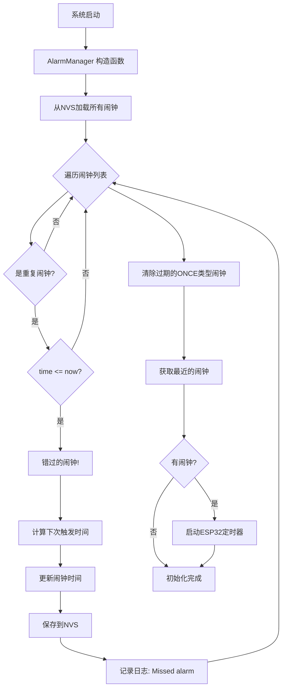
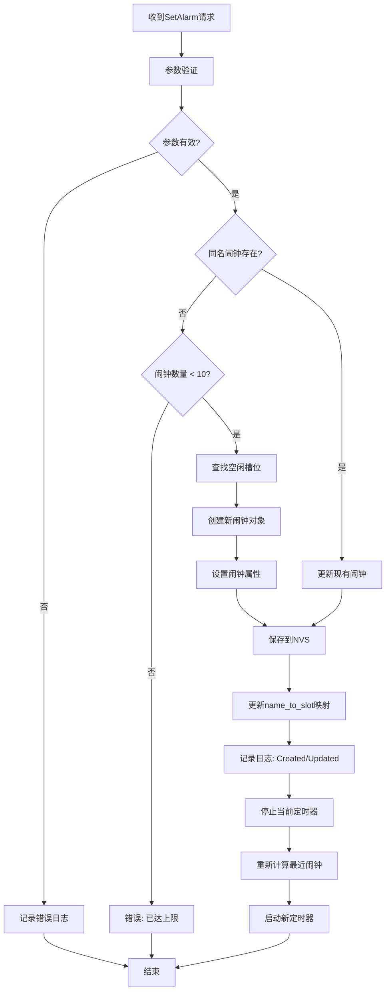
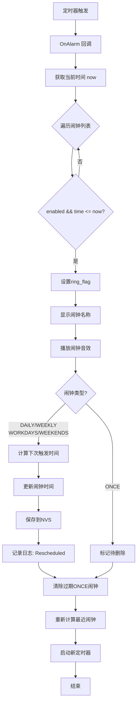
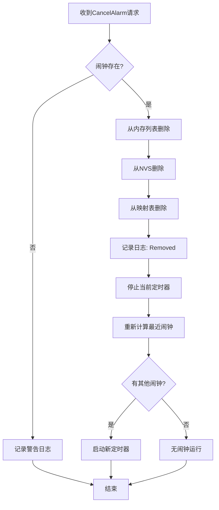
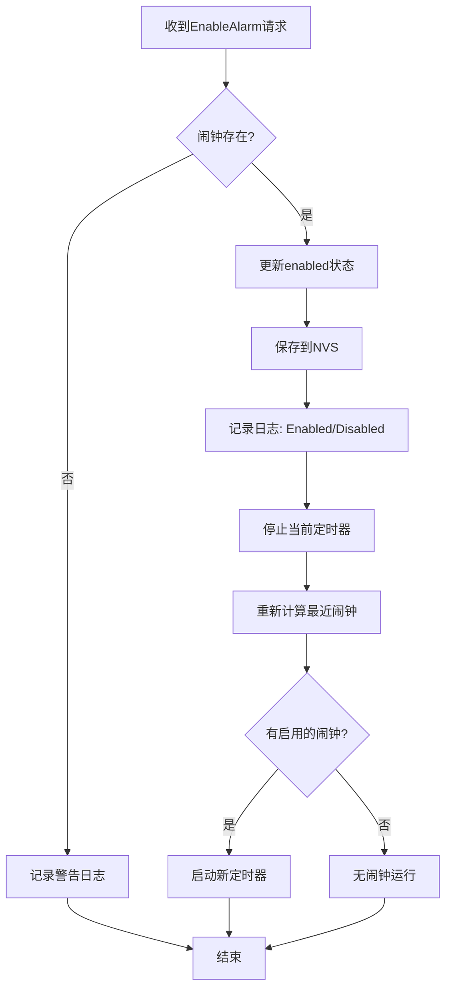
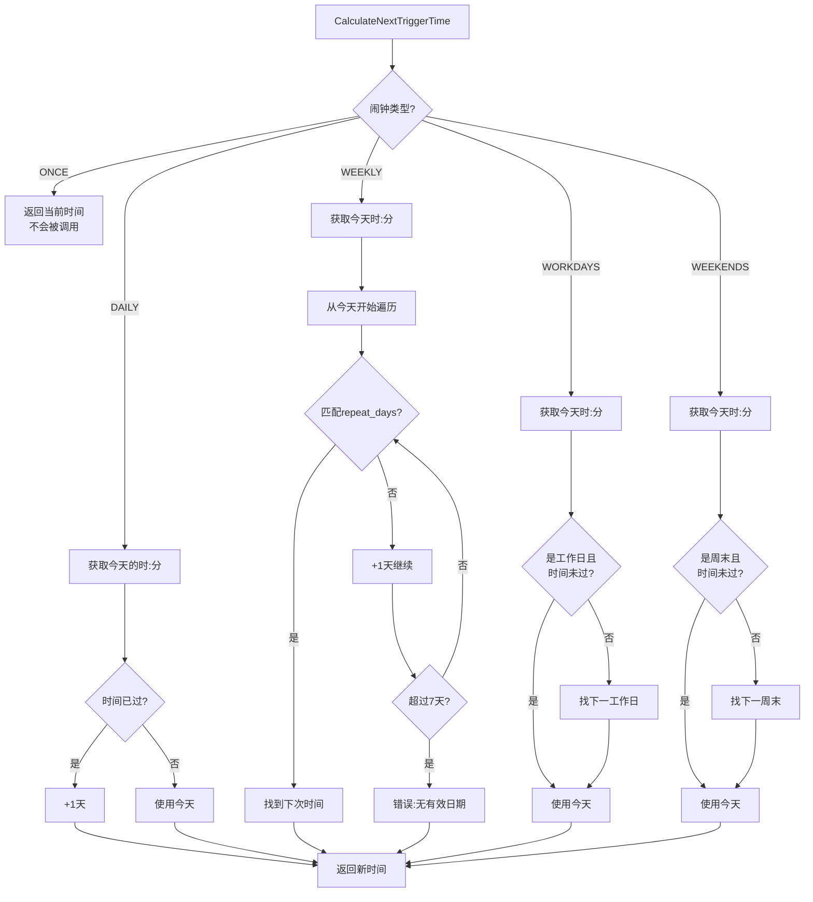
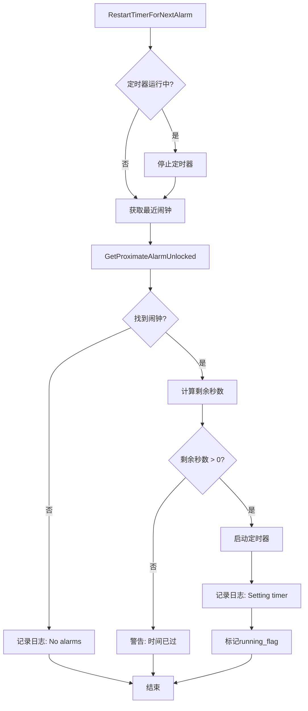
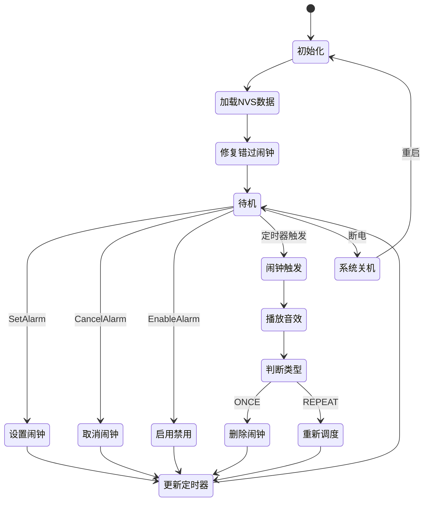
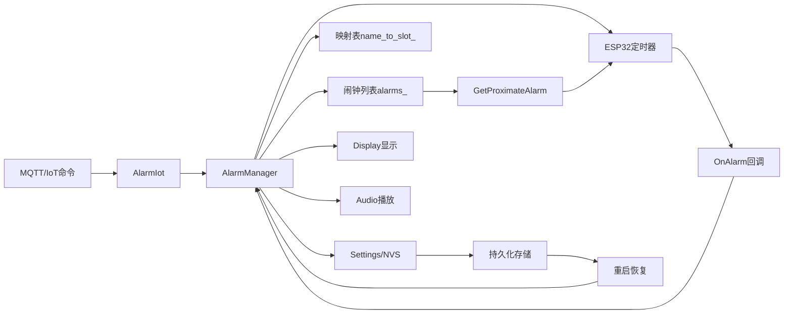

# 闹钟系统运行逻辑流程图

## 1. 系统初始化流程



## 2. 设置闹钟流程



## 3. 闹钟触发流程



## 4. 取消闹钟流程



## 5. 启用/禁用闹钟流程



## 6. 下次触发时间计算流程



## 7. 定时器管理流程



## 8. 完整状态机



## 9. 数据流图



## 10. 关键时间节点

```mermaid
gantt
    title 每日闹钟生命周期示例
    dateFormat HH:mm
    axisFormat %H:%M
    
    section 正常流程
    创建闹钟(08:00)      :done, a1, 07:00, 1h
    等待触发             :active, a2, 08:00, 0h
    触发&播放音效        :crit, a3, 08:00, 1m
    重新调度(明天08:00)  :done, a4, 08:01, 1m
    
    section 错过闹钟
    设备关机             :crit, b1, 07:00, 3h
    错过触发时间         :b2, 08:00, 0h
    10:00开机            :milestone, b3, 10:00, 0h
    检测并修复           :done, b4, 10:00, 1m
    调度到明天08:00      :done, b5, 10:01, 1m
```

## 关键概念说明

### 互斥锁保护
所有公开API都使用 `std::lock_guard<std::mutex>` 保护，确保线程安全。

### 递归锁避免
内部方法使用 `GetProximateAlarmUnlocked` 避免死锁问题。

### 持久化策略
- 每次修改闹钟立即保存到NVS
- 重启时自动加载并修复错过的闹钟

### 定时器精度
- 使用ESP32硬件定时器
- 理论精度：微秒级
- 实际精度：±100ms（考虑任务调度延迟）
