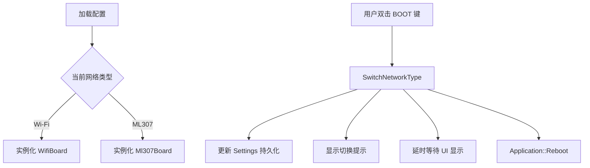
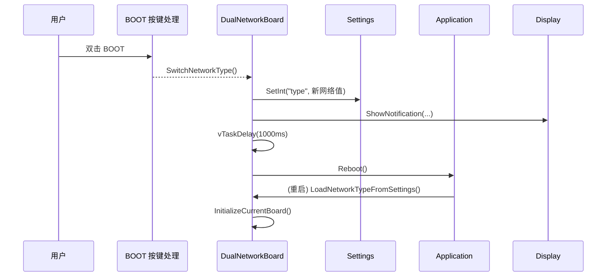

# XINGZHI Cube 双网络切换方案说明

## 1. 引言
本方案面向具备 4G 模块（ML307）与 Wi-Fi 模块的双模设备，提供在运行时通过按键交互完成网络模式切换的实现方式。本文档总结现有 `XINGZHI_CUBE_1.54TFT_ML307` 板卡的代码结构、逻辑流程与移植步骤，帮助其他项目团队快速复用或改造该功能。

## 2. 总体架构
### 2.1 核心结构
- **抽象父类**：`DualNetworkBoard` 负责封装双网络切换逻辑，提供统一的 `Board` 接口实现。
- **子板卡实现**：`WifiBoard` 与 `Ml307Board` 分别管理对应网络的初始化、连接与状态反馈。
- **交互入口**：`XINGZHI_CUBE_1.54TFT_ML307` 在按键回调中触发 `SwitchNetworkType()`，随后重启设备以应用新的网络模式。

### 2.2 流程概览


### 2.3 启动阶段执行顺序
`DualNetworkBoard` 在构造时即刻根据持久化配置选择目标网络实例。结合 `XINGZHI_CUBE_1.54TFT_ML307` 构造函数，可概括如下伪代码：

```cpp
// 伪代码：板卡启动阶段
auto board = new XINGZHI_CUBE_1_54TFT_ML307();
// DualNetworkBoard 内部逻辑
network_type_ = LoadNetworkTypeFromSettings(/* 默认ML307 */);
InitializeCurrentBoard(); // 按类型构造 WifiBoard 或 Ml307Board
board->InitializePowerManager();
board->InitializePowerSaveTimer();
board->InitializeSpi();
board->InitializeButtons();
board->InitializeSt7789Display();
```

设备上电或重启后，`Application::Start()` 会调用 `Board::StartNetwork()`，进而运行 `DualNetworkBoard::StartNetwork()`，在 UI 上展示「连接 Wi-Fi」或「检测模块」信息，并调用当前子板卡的 `StartNetwork()` 完成实际的联网流程。

## 3. 核心类与文件概览
- **`E:\work\78\xiaozhi-esp32\main\boards\common\dual_network_board.h`**：声明双网络抽象类与公共接口。
- **`E:\work\78\xiaozhi-esp32\main\boards\common\dual_network_board.cc`**：实现网络类型持久化、动态实例化及切换流程。
- **`E:\work\78\xiaozhi-esp32\main\boards\xingzhi-cube-1.54tft-ml307\xingzhi-cube-1.54tft-ml307.cc`**：板卡入口，实现按键绑定、显示管理等。

## 4. 网络类型持久化
`DualNetworkBoard` 使用 `Settings("network", true)` 保存当前网络类型，以便重启后恢复。

```cpp
// 文件：E:\work\78\xiaozhi-esp32\main\boards\common\dual_network_board.cc
NetworkType DualNetworkBoard::LoadNetworkTypeFromSettings(int32_t default_net_type) {
    Settings settings("network", true);
    int network_type = settings.GetInt("type", default_net_type);
    return network_type == 1 ? NetworkType::ML307 : NetworkType::WIFI;
}

void DualNetworkBoard::SaveNetworkTypeToSettings(NetworkType type) {
    Settings settings("network", true);
    int network_type = (type == NetworkType::ML307) ? 1 : 0;
    settings.SetInt("type", network_type);
}
```

- 默认值 `default_net_type = 1` 代表 4G（ML307）。
- `Settings` 键名为 `network/type`，类型为整数。
- 通过调用 `SaveNetworkTypeToSettings()`，切换后立即持久化，保证重启后生效。

## 5. 按键触发逻辑
`XINGZHI_CUBE_1.54TFT_ML307` 在构造阶段初始化按键并绑定事件，其中 BOOT 键双击触发网络切换。

```cpp
// 文件：E:\work\78\xiaozhi-esp32\main\boards\xingzhi-cube-1.54tft-ml307\xingzhi-cube-1.54tft-ml307.cc
void InitializeButtons() {
    boot_button_.OnDoubleClick([this]() {
        auto& app = Application::GetInstance();
        if (app.GetDeviceState() == kDeviceStateStarting || app.GetDeviceState() == kDeviceStateWifiConfiguring) {
            SwitchNetworkType();
        }
    });
}
```

触发条件说明：
- 需在设备启动过程或 Wi-Fi 配网阶段允许切换，避免运行中断网。
- `SwitchNetworkType()` 继承自 `DualNetworkBoard`，封装具体动作。
- 单击 BOOT 键在启动阶段还会根据当前网络类型执行 Wi-Fi 重置或聊天状态切换；因此双击手势仅在特定状态开放，以减少误触导致的重启。

### 5.1 设备状态判定
`Application::GetDeviceState()` 返回枚举值（如 `kDeviceStateStarting`、`kDeviceStateWifiConfiguring` 等）。切换网络前需保证：

```cpp
if (app.GetDeviceState() == kDeviceStateStarting ||
    app.GetDeviceState() == kDeviceStateWifiConfiguring) {
    SwitchNetworkType();
}
```

若处于 `kDeviceStateListening`、`kDeviceStateSpeaking` 等工作态，双击将被忽略，保证当前会话或联网任务不中断。

## 6. `SwitchNetworkType()` 执行流程
```cpp
// 文件：E:\work\78\xiaozhi-esp32\main\boards\common\dual_network_board.cc
void DualNetworkBoard::SwitchNetworkType() {
    auto display = GetDisplay();
    if (network_type_ == NetworkType::WIFI) {
        SaveNetworkTypeToSettings(NetworkType::ML307);
        display->ShowNotification(Lang::Strings::SWITCH_TO_4G_NETWORK);
    } else {
        SaveNetworkTypeToSettings(NetworkType::WIFI);
        display->ShowNotification(Lang::Strings::SWITCH_TO_WIFI_NETWORK);
    }
    vTaskDelay(pdMS_TO_TICKS(1000));
    auto& app = Application::GetInstance();
    app.Reboot();
}
```

详细步骤：
1. 判断当前网络类型。
2. 写入相反类型到 `Settings`。
3. 调用 `Display::ShowNotification()` 输出提示（分别为 “切换至 4G 网络” / “切换至 Wi-Fi 网络”）。
4. 延迟 1 秒，确保提示对用户可见。
5. 调用 `Application::Reboot()` 进行软重启，以初始化目标网络驱动。

### 6.1 切换时序示意


## 7. 子板卡实例化
`DualNetworkBoard` 根据当前网络类型创建对应的板卡实例。

```cpp
// 文件：E:\work\78\xiaozhi-esp32\main\boards\common\dual_network_board.cc
void DualNetworkBoard::InitializeCurrentBoard() {
    if (network_type_ == NetworkType::ML307) {
        ESP_LOGI(TAG, "Initialize ML307 board");
        current_board_ = std::make_unique<Ml307Board>(ml307_tx_pin_, ml307_rx_pin_, ml307_dtr_pin_);
    } else {
        ESP_LOGI(TAG, "Initialize WiFi board");
        current_board_ = std::make_unique<WifiBoard>();
    }
}
```

关键点：
- `current_board_` 始终指向当前激活板卡，外部通过 `GetCurrentBoard()` 访问。
- 子板卡需实现 `Board` 虚接口（如 `StartNetwork()`、`GetNetwork()`）。
- 构造函数传入的 GPIO 引脚用于 ML307 模块的串口通信。

### 7.1 Wi-Fi 子板卡运行细节
`WifiBoard` 负责管理 Wi-Fi 配置模式、联网流程及状态图标显示。

```cpp
// 文件：E:\work\78\xiaozhi-esp32\main\boards\common\wifi_board.cc
void WifiBoard::StartNetwork() {
    if (wifi_config_mode_) {
        EnterWifiConfigMode();
        return;
    }
    auto& ssid_manager = SsidManager::GetInstance();
    if (ssid_manager.GetSsidList().empty()) {
        wifi_config_mode_ = true;
        EnterWifiConfigMode();
        return;
    }
    auto& wifi_station = WifiStation::GetInstance();
    wifi_station.Start();
    if (!wifi_station.WaitForConnected(60 * 1000)) {
        wifi_station.Stop();
        wifi_config_mode_ = true;
        EnterWifiConfigMode();
        return;
    }
}
```

- `wifi_config_mode_` 标记是否强制开启 Wi-Fi 配网 AP，由 `Settings("wifi")` 的 `force_ap` 决定。
- 若60秒内无法成功连接，将退回配置模式并提示用户通过 AP 配网。
- `WifiBoard::ResetWifiConfiguration()` 通过设置 `force_ap` 并调用 `esp_restart()`，在下一次启动时直接进入配网。

### 7.2 ML307 子板卡运行细节
`Ml307Board` 利用 `AtModem` 抽象完成模块检测、注册与信号上报。

```cpp
// 文件：E:\work\78\xiaozhi-esp32\main\boards\common\ml307_board.cc
void Ml307Board::StartNetwork() {
    display->SetStatus(Lang::Strings::DETECTING_MODULE);
    while (true) {
        modem_ = AtModem::Detect(tx_pin_, rx_pin_, dtr_pin_, 921600);
        if (modem_ != nullptr) {
            break;
        }
        vTaskDelay(pdMS_TO_TICKS(1000));
    }
    modem_->OnNetworkStateChanged([this, &application](bool network_ready) {
        if (!network_ready) {
            application.Schedule([this, &application]() {
                application.SetDeviceState(kDeviceStateIdle);
            });
        }
    });
    display->SetStatus(Lang::Strings::REGISTERING_NETWORK);
    while (true) {
        auto result = modem_->WaitForNetworkReady();
        if (result == NetworkStatus::ErrorInsertPin) {
            application.Alert(...);
        } else if (result == NetworkStatus::ErrorRegistrationDenied) {
            application.Alert(...);
        } else {
            break;
        }
        vTaskDelay(pdMS_TO_TICKS(10000));
    }
}
```

- 通过循环侦测串口上的 ML307 模块，确保在热插拔情况下亦能重新初始化。
- 注册 `OnNetworkStateChanged` 回调，当蜂窝网络掉线时将设备状态切换为 Idle 以避免语音会话失败。
- 调用 `WaitForNetworkReady()` 时对 PIN 错误、注册拒绝等异常给予语音与界面提示。

## 8. 运行时状态与 UI 提示
- 提示语来自 `Lang::Strings`（多语言资源），需确保目标项目提供对应字串。
- `StartNetwork()` 根据网络类型设置不同状态文本：

```cpp
// 文件：E:\work\78\xiaozhi-esp32\main\boards\common\dual_network_board.cc
void DualNetworkBoard::StartNetwork() {
    auto display = Board::GetInstance().GetDisplay();
    if (network_type_ == NetworkType::WIFI) {
        display->SetStatus(Lang::Strings::CONNECTING);
    } else {
        display->SetStatus(Lang::Strings::DETECTING_MODULE);
    }
    current_board_->StartNetwork();
}
```

- 建议在移植时统一 UI 接口，以便替换提示逻辑。

### 8.1 字符串与声音资源依赖
- `Lang::Strings::SWITCH_TO_4G_NETWORK`、`Lang::Strings::SWITCH_TO_WIFI_NETWORK` 等字串需在 `assets/lang_config.h` 对应语言包中实现。
- `Lang::Sounds::OGG_WIFICONFIG` 等声音枚举在提示配网或异常时调用，移植时需检查音频资源是否齐备。
- 若目标平台 UI 系统不同，可在 `Display` 派生类中适配 `ShowNotification()` 与 `SetStatus()` 以满足氛围灯或屏幕提示需求。

## 9. 移植指南
执行以下步骤即可在新项目中复用此方案：

1. **硬件引脚整理**
   - 明确 4G 模块串口及控制脚，替换 `DualNetworkBoard` 构造参数。
2. **基类适配**
   - 项目需具备类似 `Board` 抽象，提供网络启动、显示、音频等接口。
3. **导入双网络逻辑**
   - 拷贝 `dual_network_board.*` 与相关资源，确保 `Settings`、`Application`、`Display` 等依赖可用。
4. **子板卡实现**
   - 根据项目已有 Wi-Fi/4G 驱动实现 `WifiBoard` 与 `Ml307Board`，或新建对应类。
5. **交互绑定**
   - 在具体板卡入口绑定按键事件，调用 `SwitchNetworkType()`。
6. **UI 提示与多语言**
   - 校对 `Lang::Strings` 中的字串，或在项目中添加等价提示。
7. **持久化接口校验**
   - 确认新项目的 `Settings` API 与本文示例一致，若不同需适配读写逻辑。

### 9.1 依赖组件清单
- **系统抽象**：`Board`、`Application`、`Display`、`PowerSaveTimer`、`Settings` 等需在目标工程中存在等价实现。
- **网络栈**：`WifiStation`、`SsidManager`、`WifiConfigurationAp`、`AtModem` 及其依赖的驱动库需要被正确移植。
- **外设驱动**：按键、背光、LCD（`SpiLcdDisplay`）、PWM、RTC GPIO 等模块必须能正常工作，以维持交互与省电策略。
- **RTOS 支撑**：依赖 FreeRTOS 的任务与延时接口（如 `vTaskDelay`），需要保证调度器配置与原工程兼容。
- **多语言与音频**：移植时应同步 `Lang::Strings`、`Lang::Sounds` 定义及对应资源文件。

## 10. 测试与验证建议
- **冷启动恢复**：切换后重启设备，确认加载的网络类型与预期一致。
- **日志监控**：关注 `TAG = "DualNetworkBoard"`、`TAG = "XINGZHI_CUBE_1_54TFT_ML307"` 相关打印，确认流程步骤。
- **网络重连**：在 Wi-Fi 与 4G 均可用的环境下切换，确保网络上线时间符合设计。
- **异常场景**：在无信号或模块掉线状况下切换，检查 UI 提示与容错能力。
- **长时间待机**：验证 `PowerSaveTimer` 在两种网络模式下的休眠/唤醒是否按预期触发。
- **配置恢复**：在 Wi-Fi 模式下执行 `ResetWifiConfiguration()`，确认重启后自动进入配置模式。

## 11. 附录
### 11.1 构造函数示例
```cpp
// 文件：E:\work\78\xiaozhi-esp32\main\boards\xingzhi-cube-1.54tft-ml307\xingzhi-cube-1.54tft-ml307.cc
XINGZHI_CUBE_1_54TFT_ML307() :
    DualNetworkBoard(ML307_TX_PIN, ML307_RX_PIN),
    boot_button_(BOOT_BUTTON_GPIO),
    volume_up_button_(VOLUME_UP_BUTTON_GPIO),
    volume_down_button_(VOLUME_DOWN_BUTTON_GPIO) {
    InitializePowerManager();
    InitializePowerSaveTimer();
    InitializeSpi();
    InitializeButtons();
    InitializeSt7789Display();
    GetBacklight()->RestoreBrightness();
}
```

### 11.2 网络状态获取
```cpp
// 文件：E:\work\78\xiaozhi-esp32\main\boards\common\dual_network_board.cc
NetworkInterface* DualNetworkBoard::GetNetwork() {
    return current_board_->GetNetwork();
}

const char* DualNetworkBoard::GetNetworkStateIcon() {
    return current_board_->GetNetworkStateIcon();
}
```

通过上述内容，开发者可在其他项目中快速实现或复用双网络切换功能，并根据自身需求调整硬件接口、UI 文案或交互方式。

## 12. 常见问题排查（FAQ）
- **切换后依旧停留在原网络？**
  - **检查** `Settings("network")` 中 `type` 值是否被正确写入。
  - **核对** 重启流程是否被外部代码拦截，确保 `Application::Reboot()` 会执行 `esp_restart()` 或等价操作。
- **Wi-Fi 配网页面未弹出？**
  - **确认** `force_ap` 标志写入成功，并且 `WifiConfigurationAp::Start()` 没有校验失败。
  - **检查** LCD 指示是否显示「进入 Wi-Fi 配置模式」，必要时打开串口日志查看 `WifiBoard` 打印。
- **ML307 模块检测不到？**
  - **确认** 串口引脚、波特率与 `AtModem::Detect()` 参数匹配。
  - **测量** DTR、供电和开机脚是否按硬件手册控制，必要时在 `Detect` 前后加入 GPIO 复位逻辑。
- **双击手势不生效？**
  - **检查** `boot_button_` 的双击间隔配置与实际使用是否匹配。
  - **验证** 当前 `DeviceState` 是否满足切换条件，例如不处于聊天或播放过程。
